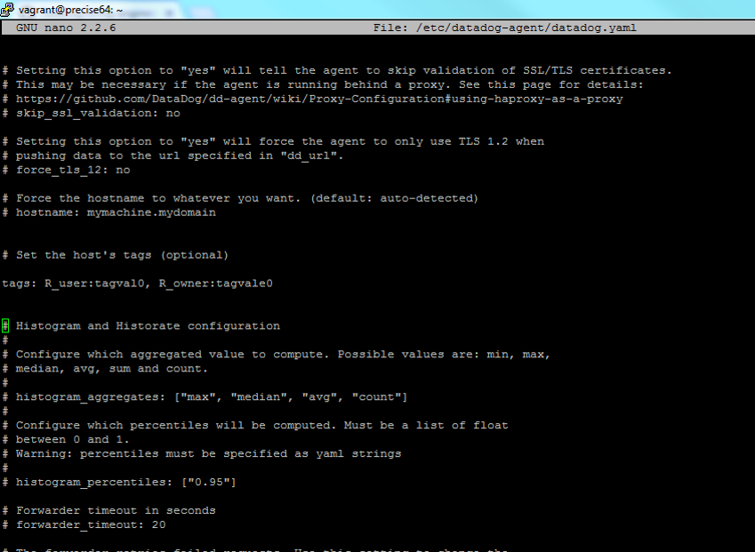
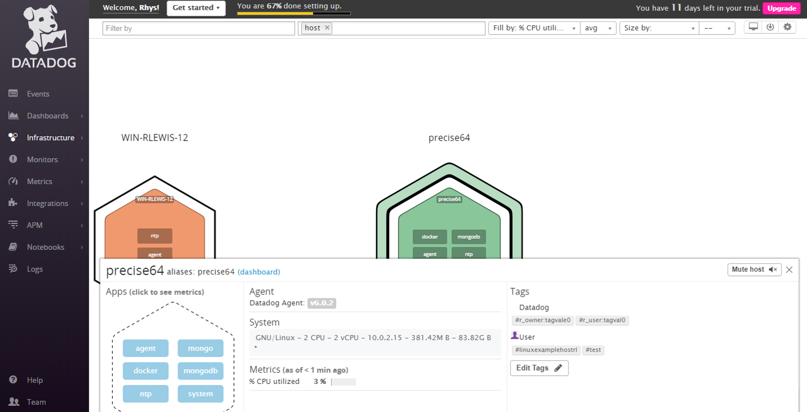
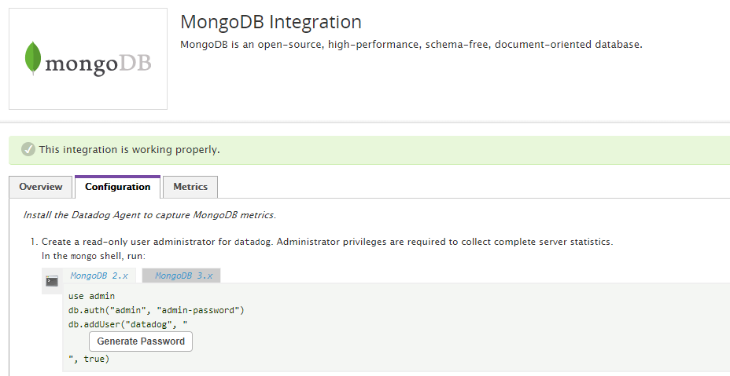
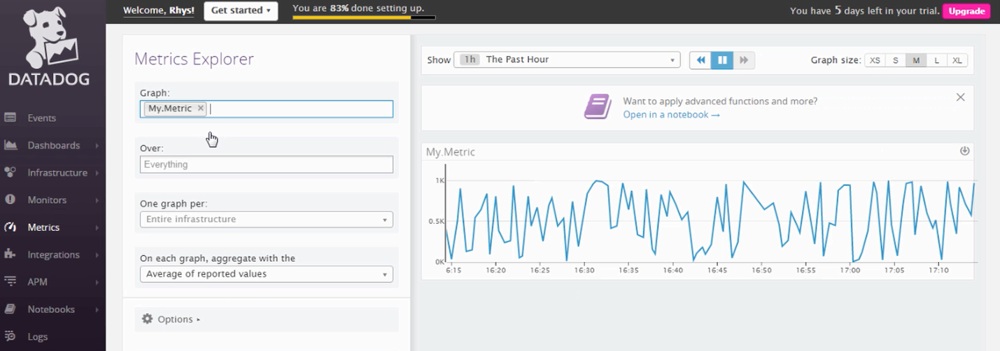
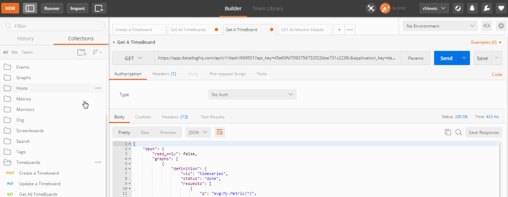
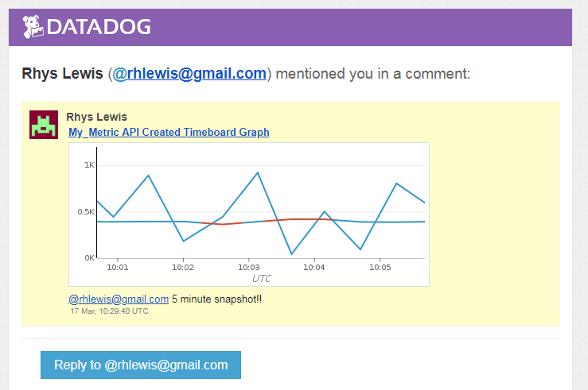
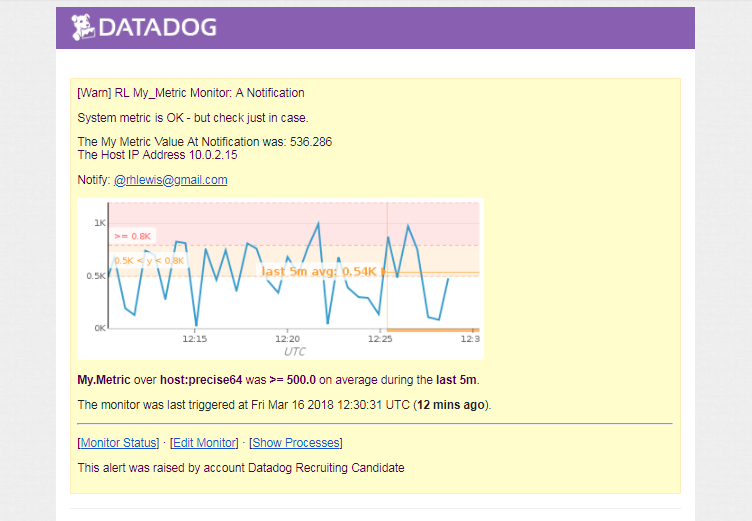
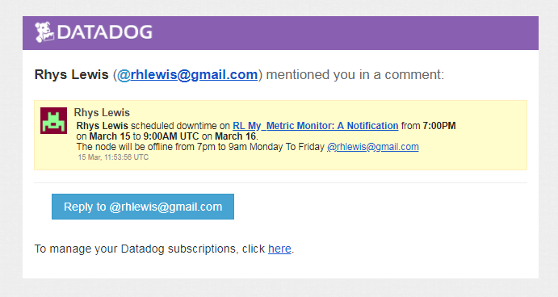
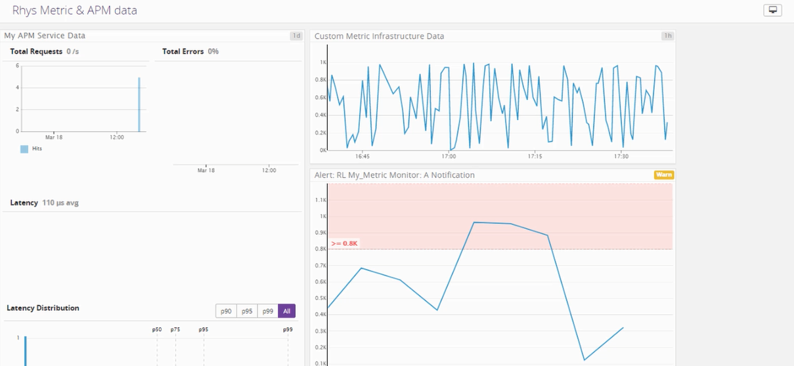

***************************************************************************************************************
  Rhys Lewis an Introduction:
***************************************************************************************************************
An experienced team member with a passion for technology, building relationships and adopting new concepts to better myself, my company and my customers experience. I’m motivated by working at the edge of technological innovation where I can influence and advise customers on strategic investments, driven to continually improve, to do something I haven’t done before, innovate wherever I see relevance to team growth and constantly focus on building customer champions. 

I love a challenge, not least the challenge of being a proud Welshman in a home with a French wife and fighting the continuous battle to convince our 5-year-old daughter which is the best country in the world to support on Rugby day...WALES obviously...Love to spend time in the mountains, preferably on a pair of skis and I enjoy actively taking part in other sports. ***Coughs*** Maybe more from a watching perspective these days.
 
www.linkedin.com/in/rhyshlewis

***************************************************************************************************************
  The Exercise Approach:	
***************************************************************************************************************

My approach was to create an introduction to Datadog with a how-to tutorial for customers who are embarking on their journey. 

You've probably read through a ton of these answers by now so I wanted to change it up a bit...Reading can get a little boring, right? If you agree with that last statement then please sit back relax, grab a little popcorn, click the following link, and enjoy my executive video overview of the task in support of the answers below.

Vimeo Video Link:https://vimeo.com/260755278

Password [rhys@datadog]

***************************************************************************************************************
  An Introduction To Datadog 
***************************************************************************************************************
Congratulations & welcome! You are about to embark on a journey that will help to bring sanity to IT management. With the Datadog capabilities you will have the ability to, collect, process, and visualize trillions of data points per day and to solve complex technical problems at scale, using the cloud and today’s best open source technologies. Datadog brings together data from servers, databases, tools, and services to present a unified view of the entire stack.

This simple, 'it just works', technology will get you up and running with full service visibility in no time...Speaking of time...Let’s get started!! 

***************************************************************************************************************
  Prerequisites - The Resources
***************************************************************************************************************
Before we get stuck in here are links to some great resources to help you on your way to becoming a data dog expert.

-- A great resource that you will return to time and again in the exercise
https://docs.datadoghq.com/agent/basic_agent_usage/ubuntu

Getting Started: https://docs.datadoghq.com/getting_started

Graphing in Datadog: https://docs.datadoghq.com/graphing

Monitoring in Datadog: https://docs.datadoghq.com/monitors/monitor_types

Writing an Agent check:https://docs.datadoghq.com/agent/agent_checks

Datadog API: https://docs.datadoghq.com/api/

***************************************************************************************************************
  Prerequisites - Setup the environment
***************************************************************************************************************
The approach detailed here is to spin up a fresh linux VM via Vagrant Ubuntu 12.04 VM, accessed via VirtualBox. 

Please review the getting started guide that located here https://www.vagrantup.com/intro/getting-started/

*******
IMPORTANT: Make sure your upgrade the ubuntu version to 14.04. The instructions can be found here....

[Upgrade Document](upgrade.txt)

*******

Install the agent: Login to your datadog console and access the agent for Ubuntu and run the one-step command in your console.
https://app.datadoghq.com/account/settings#agent/ubuntu

There is a great tool for interacting with your ubuntu server to perform install activities and upload your python files.

https://mobaxterm.mobatek.net here is a handy little demo video to get you going. https://mobaxterm.mobatek.net/demo.html

Now the fun can really begin! Let’s collect some metrics!

***************************************************************************************************************
  Collecting Metrics - Tags
***************************************************************************************************************
Firstly, we need to add tags in the Agent config file - Tags are a great way of adding dimensions to metrics, so they can be sliced, diced, aggregated, and compared on the front end.

Open up the datadog configuration file - located here../etc/datadog-agent/datadog.yaml 

(Did you bookmark that commands page i mentioned earlier??)

Uncomment the Tags section to create your new tags. There is a specific format for follow, further detail can be found here. 

https://docs.datadoghq.com/getting_started/tagging/

Here are a couple of screenshots that show the command console tag updates and the tags on the Host Map page in Datadog.

***************************************************************************************************************
  Collecting Metrics - Installing MongoDB
***************************************************************************************************************
The power of datadog comes from its 200+ integrations to provide visibility across all your systems, apps, and services. Lets see how easy it is to set up an integration to MongoDB.

Need to install MongoDB on your ubuntu system - No problem! Here is a quick guide.
https://www.howtoforge.com/tutorial/install-mongodb-on-ubuntu-14.04/ 

https://docs.mongodb.com/getting-started/shell/insert/ Here is a link for you to insert some test data into the database.

Here is a screenshot of what the integration should look like when connected successfully

***************************************************************************************************************
  Collecting Metrics - Custom Agent Check 
***************************************************************************************************************
Check 1,2...check...Next let’s check out the agent checks!

Agent Checks are a great way to collect metrics from custom applications or unique systems. However, if you are trying to collect metrics from a generally available application, public service or open source project, we recommend that you write an Integration https://docs.datadoghq.com/developers/integrations/

Let’s now look at how to create a custom agent check that submits a metric named my_metric with a randomised value between 0 and 1000. While we're at it we will set a minimum collection interval of 45 seconds.

DataDog Agent Checks are made up of 2 files, <project_name>.py and <project_name>.yaml. These files should be saved in /etc/datadog-agent/checks.d and /etc/datadog-agent/conf.d respectively. 

The first file we’ll create is /etc/datadog-agent/conf.d/my_metric.yaml. Agent config files have 2 sections: init_config and instances. The instances section defines one or more instances to check. Here is the config code to enter.

[YAML Code Link](my_metric.yaml)

Now we’ll create the actual agent file in /etc/datadog-agent/checks.d/my_metric.py. The file extension already tells you this is a Python module.

[Python Code Link](my_metric.py)

Here is a screenshot of the My_Metric Dashboard in action!!

Bonus Question: We added the interval into the YAML file

***************************************************************************************************************
  Visualising Data
***************************************************************************************************************
So far so good? Next lets look at creating visualistions through the API

We are now going to step through the process of creating a timeboard that contains..... 

 1. Your custom metric scoped over your host.
 2. Any metric from the Integration on your Database with the anomaly function applied.
 3. Your custom metric with the rollup function applied to sum up all the points for the past hour into one bucket

But wait - what are timeboards? - If you missed it - here is a link! https://docs.datadoghq.com/graphing/dashboards/timeboard/ 

As i mentioned we are going to look at the API so here’s how you get started! https://docs.datadoghq.com/api/?lang=python#create-a-timeboard
 
*******
Important! Note down your API and APP keys from the main console. Head to https://app.datadoghq.com/account/settings#api to get these.
*******

To get up you to speed here is a link to the timeboard .py code I created with the custom metric, an anomaly based metric for the MongoDB, with anomaly applied and SUM function.

[Timeboard Code Link](TimeboardAPI.py)
 
Remember that great tool i mentioned to upload the python files to the ubuntu server. https://mobaxterm.mobatek.net/  here is a handy little demo video to get you going. https://mobaxterm.mobatek.net/demo.html

Note the handy little up arrow in the console allowing you to upload files to the current folder. 
 
********
Troubleshooting: If for any reason you have an issue with running the python script - fear not we can use postman to upload the timeboard json...

Postman is a powerful HTTP client for testing web services. Postman makes it easy to test, develop and document APIs by allowing users to quickly put together both simple and complex HTTP requests. Open the application though chrome apps - here is an introduction https://www.getpostman.com/docs/v6/

Here is an amazing resource to speed up your understanding of how you can interact with the API through postman. https://help.datadoghq.com/hc/en-us/articles/115002182863-Using-Postman-With-Datadog-APIs

Next we need to Set the Timeboard's timeframe to the past 5 minutes. Simply open the timeboard in the GUI and click and drag over the 5 minute period.

Click the snapshot icon on the dashboard to take a snapshot of this graph and use the @ notation to send it to yourself.

Here is an image of what i received when doing this

**************
 BONUS - What is the anomaly graph displaying?
**************
The grey band represents the region where the metric is expected to be based on past behavior. The blue and red line is the actual observed value of the metric; the line is blue when within the expected range and red when it is outside of the expected range.
  
 
***************************************************************************************************************
  Monitoring Data - Lets get alerting!
***************************************************************************************************************
Since you’ve already caught your test metric going above 800 once, you don’t want to have to continually watch this dashboard to be alerted when it goes above 800 again. So let’s make life easier by creating a monitor.

Create a new Metric Monitor that watches the average of your custom metric (my_metric) and will alert if it’s above the following values over the past 5 minutes: This is an incredibly simple process and further information relating to setup can be found here. 

https://docs.datadoghq.com/monitors/ and here https://docs.datadoghq.com/monitors/monitor_types/

Set a monitor to the following settings....
Warning threshold of 500
Alerting threshold of 800

And also ensure that it will notify you if there is No Data for this query over the past 10m.

Please also configure the monitor’s message so that it will:
Send you an email whenever the monitor triggers.

Create different messages based on whether the monitor is in an Alert, Warning, or No Data state.

Include the metric value that caused the monitor to trigger and host ip when the Monitor triggers an Alert state.

Here is a screenshot of the email sent out after i configured mine. Check out the intro video video for a more detailed overview of the process.

Bonus Question: Since this monitor is going to alert pretty often, you don’t want to be alerted when you are out of the office. Set up two scheduled downtimes for this monitor:

One that silences it from 7pm to 9am daily on M-F, And one that silences it all day on Sat-Sun. Here is an image of the notification when you schedule the downtime.
 

 
****************************************************************************************************************
   Collecting APM Data: 
****************************************************************************************************************
Datadog APM provides deep insight into application’s performance - from automatically generated dashboards monitoring key metrics, such as request volume and latency, to detailed traces of individual requests - side by side with your logs and infrastructure monitoring. 

Lets now step through how we configure the capability. Here are the initial set up steps that need to be followed: https://docs.datadoghq.com/tracing/setup/
 
Here we are going to make a lot of use out of the mobaxterm app to open multiple sessions to run the flask app and send commands to it.

First head to the APM instructions in the Datadog GUI. Select python and install the python client: 
Next open the trace files http://pypi.datadoghq.com/trace/docs/#

https://docs.datadoghq.com/tracing/setup/python/
 
A great way to intialise the tracing on your environment is to create and run a process with the following format. This will get you up and running. 

*****
from ddtrace import tracer

with tracer.trace("web.request", service="my_service") as span:
  span.set_tag("my_tag", "my_value") 
  
***** 
 
Stepping out of character.....Regrettably i had a number of issues in trying to set up the APM part of this excersise. Please see below the flask app code i was attempting to use and the created screenboard with the combined APM and infrastructure data.
[Flask Code Link](dd_flask.py)
  
 Here is a link to the screenboard crated with APM and infrastructure data
 https://p.datadoghq.com/sb/2c2bb12bb-6071e5f03f9f159c521316ec02dc3362
 

  
**************
 BONUS - What is the difference between a Service and a Resource
**************
 A "Service" is the name of a set of processes that work together to provide a feature set. For instance, a simple web application may consist of two services: a single webapp service and a single database service, while a more complex environment may break it out into 6 services: 3 separate webapp, admin, and query services, along with a master-db, a replica-db, and a yelp-api external service.
 
 A particular query to a service. For a web application, some examples might be a canonical URL like /user/home or a handler function like web.user.home (often referred to as "routes" in MVC frameworks). For a SQL database, a resource would be the SQL of the query itself like select * from users where id = ?
 

****************************************************************************************************************
 Final Quesion
****************************************************************************************************************
Datadog has been used in a lot of creative ways in the past. We’ve written some blog posts about using Datadog to monitor the NYC Subway System, Pokemon Go, and even office restroom availability!  Is there anything creative you would use Datadog for?

I have a couple of thoughts here.....
The Racetrack - Build a scaletrics track and fix arduino sensors to the track and cars to feed back on track state, temperature, lap speed. Get playing and show the performance metrics on the screen. Great for customer events, worldwide competitions 

The WeWork Beer Pump  - Monitor the performance, consumption level & supply level of the local WeWork beer pump - Although i've just read this has been done before it still would be great!

Thanks for taking the time to read (or view) my response, I look forward to your feedback. 
