<br> **<h1> Datadog Challenge <h1>** 

<sub>

Author: Paul Ployvisut

Position Target: Solutions Engineer

</sub>
<br>

**<h1> The Environment <h1>**

<sub>

The challenge environment was created on ubuntu 16.04 in conjunction with Vagrant (Box bento/ubuntu-16.04) which uses Oracle’s VirtualBox as the hosted hypervisor.

<br>


**Note:** The machine used is a Windows 10 operating system with MinGW to emulate the Linux host environment. 


<br>


**1. Download and install [VirtualBox](https://www.virtualbox.org/).**

<br>

**2. Download and install [Vagrant](https://www.vagrantup.com/downloads.html) 64-bit.**

<br>

After installing Vagrant, follow the “[Get Started](https://www.vagrantup.com/intro/index.html)” tab on the website to follow instructions on how to install a box (OS images from Vagrant). You will be able to SSH to your new Linux environment at completion.

<br>

**3.	Configuring Vagrant for the project**

<br>

Navigate to your directory you wish to install your Vagrant box to via terminal and create a Vagrantfile (Configures a specified Vagrant VM).

<br>

```
vagrant init
```
<br>

Add a box from Vagrant, we are using bento/ubuntu-16.04 but there are many available here. 

<br>

```
$ vagrant box add bento/ubuntu-16.04
```
<br>

Select the provider you would like. For this project we have chosen to use VirtualBox.

<br>

*Expected output

<br>


<br>

Edit the Vagrantfile we created earlier with a text editor like Notepad++ and add the name of the box you added. This tells Vagrant to use the specified box as a base.

<br>


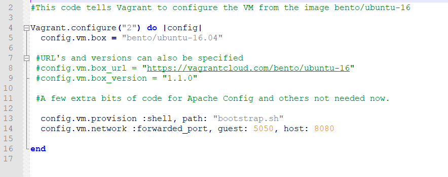


<br>

Boot your Vagrant environment up and connect to it via SSH.

```
$ vagrant up

$ vagrant ssh
```

We have now created our own environment with Vagrant using a version of Ubuntu as the operating system. Further configuration can be done but for now this will do but for more information see [here](https://www.vagrantup.com/intro/getting-started/index.html).


<br>
<br>

**4. Installing the Datadog agent.**

After creating an account on Datadog [here](https://www.datadoghq.com/), You can log into your dashboard that will be your monitoring hub. 

In the “Integrations” tab, select “Agent” which will give you a list of different Linux distributions and operating systems. Select the applicable version and follow the steps to install the agent.

<br>

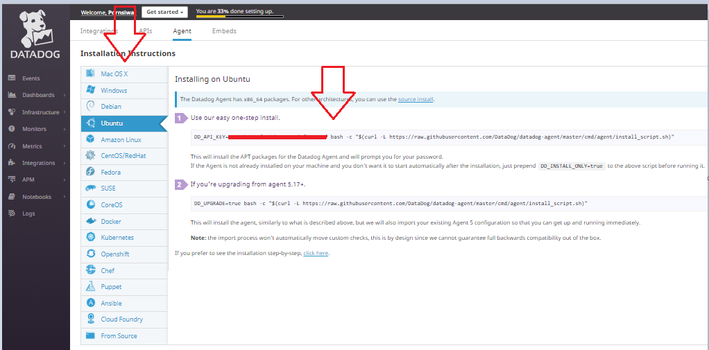

<br>

**Important! Keep your keys private!** 

<br>

<br>

**5.	Ubuntu Installation**

Connected to your Vagrant box via SSH and perform a fresh install of the Datadog Agent. There is also an option to perform a manual install [here](https://docs.datadoghq.com/agent/basic_agent_usage/ubuntu/?tab=agentv6#one-step-install).

**Note:** It is a good idea to run an update of your box before making changes.

<br>

```
apt-get update
```
<br>

Don’t forget to install CURL so we can transport data over the various types of TCI/IP protocols.

<br>

```
apt-get install curl
```
<br>

Fresh install syntax for the Agent:
<br>

```
DD_API_KEY=YOUR_API_KEY bash -c "$(curl -L https://raw.githubusercontent.com/DataDog/datadog-agent/master/cmd/agent/install_script.sh)"

```
<br>

When the following message will print in the terminal after some lines. The Agent has successfully been installed.

<br>

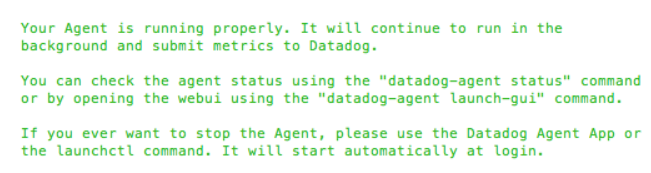

<br>

Check if the Datadog Agent is collecting and transmitting metrics.

<br>

```
sudo datadog-agent status
```

<br>

**Note:** This syntax will also give you a lot of useful information about the Agent e.g. where the configuration file is located. 

<br>

Check your Datadog dashboard to see if metrics are being received by Datadog. 

On the left-hand pane of the Datadog dashboard, select “Infrastructure” and select “Infrastructure List” from the sub menu. You will be able to see the status of all hosts connected. 

<br>

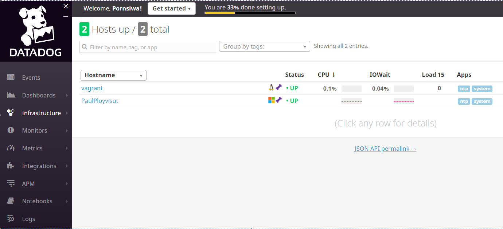

<br>

</sub>

**<h1>Collecting Metrics<h1>**

<br>

<sub>

**1.	Add tags in the Agent configuration file.**

<br>


Use preferred text editor to edit the “tags” section of the configuration file (datadog. yaml)

<br>

**Note:** Datadog recommended creating tags in a **key:value** format for better representations, read about it more [here](https://docs.datadoghq.com/tagging/assigning_tags/#further-reading).

<br>

```
sudo nano /etc/datadog-agent/datadog.yaml
```

<br>

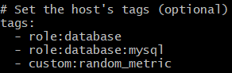

<br>

**Note:** There will be examples already present, we can just add onto these by uncommenting out the tags indicated without a #.

After changes have been made, save the file with **CTRL o** and exit with **CTRL x**.

Restart the Agent to initialise the changes.

<br>

```
sudo service datadog-agent restart
```

<br>

Check the Datadog browser via the host map to see if the Agent has transmitted the changes. Notice the *tags*.

<br>

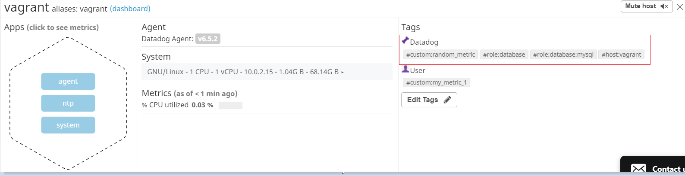

<br>

**2.	Install a database instance.**

While connected to your Vagrant instance via SSH, install a MySQL database.


**Note:** We will just need a basic installation for now but for more information please see [here](https://www.digitalocean.com/community/tutorials/how-to-install-mysql-on-ubuntu-18-04) for Ubuntu installation or the official MySQL [website](https://dev.mysql.com/doc/refman/5.7/en/adding-users.html).

<br>

```
sudo apt install mysql-server
```

<br>

Check that the SQL database is up.

<br>

```
sudo systemctl status mysql.service
```
<br>

*Expected output

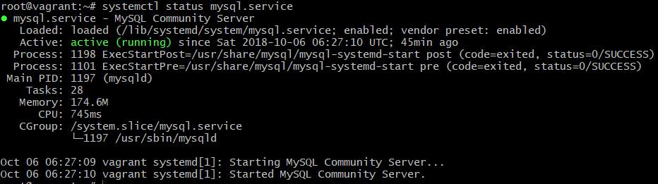

<br>

**3.	Install Datadog integration with MySQL**

Head back to the Datadog dashboard and navigate to the “Integrations” tab to find and install the MySQL integration.
Follow through the configuration tab to see all the steps.

**Optional:** Generate a complex password and use this for the later steps.

<br>

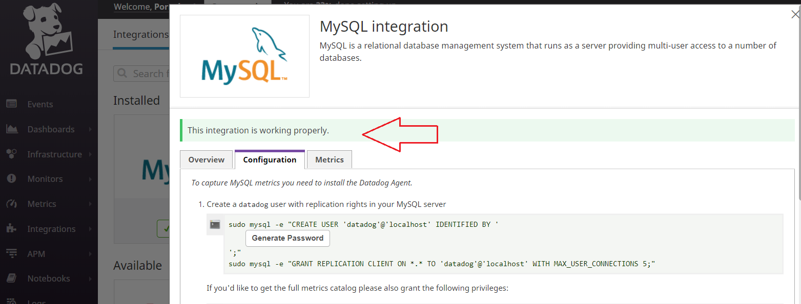

<br>

After configuration the **arrowed** area will let you know that the integration is working.

<br>


**4.	Configuring the integration.**

Create a Datadog user for the Agent on the SQL server.

<br>

```
mysql> CREATE USER 'datadog'@'localhost' IDENTIFIED BY '<UNIQUEPASSWORD>';
```
<br>

Check that the user has been created.

<br>

```
mysql> SHOW CREATE USER 'datadog'@'localhost'\G
```

<br>
*Expected output

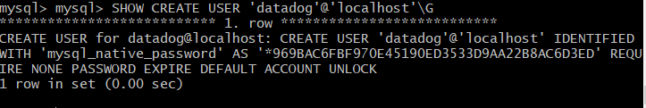

<br>

Grant the “datadog” user the following permissions.

<br>

```
mysql> GRANT REPLICATION CLIENT ON *.* TO 'datadog'@'localhost' WITH MAX_USER_CONNECTIONS 5;


mysql> GRANT PROCESS ON *.* TO 'datadog'@'localhost';
```

<br>

**Option:** Enable performance schema Quick Start, more information [here](https://dev.mysql.com/doc/refman/5.7/en/performance-schema-quick-start.html).

<br>


Back to the Agent directory, enable the Agent to collect metrics from the MySQL instance by editing the conf.yaml file located in:

etc/datadog-agent/conf.d/mysql.d/

**Note:** Edit the example file and uncomment the required settings and save as the master file of conf.yaml.

<br>

```
Sudo cd /etc/datadog-agent/conf.d/mysql.d/


Sudo /etc/datadog-agent/conf.d/mysql.d# nano conf.yaml.example

```

<br>

Edit that conf.yaml file.


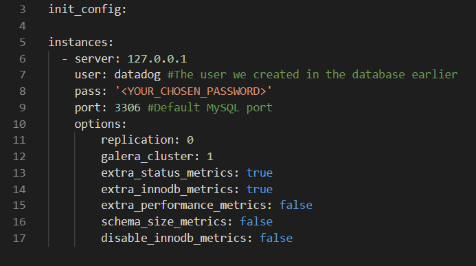

<br>

*Original

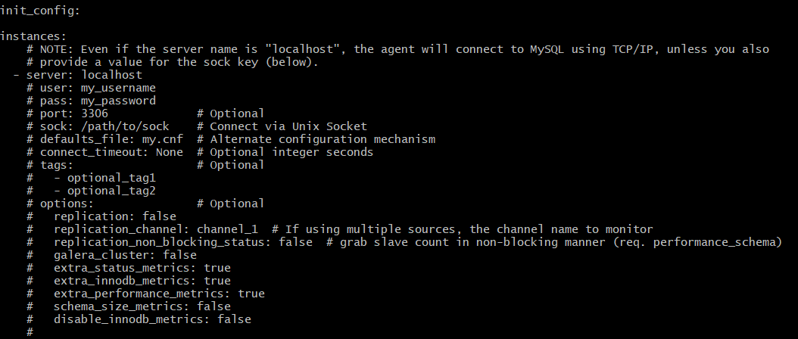


<br>

Save the file and remove the .example then restart the Agent service.

Check the Agent status to see if metrics are being sampled.

<br>

```
Sudo service datadog-agent restart

Sudo datadog-agent status
```
<br>

*Output 

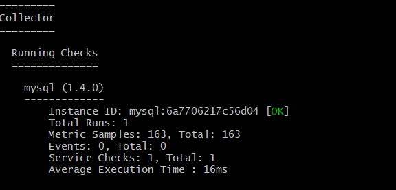

<br>

The Agent is now taking metrics from the MySQL instance.

<br>

**5.	Create a custom Agent check.**

<br>

Two files must be created for the custom Agent check:

•	The module file my_metric.py in the check.d directory.

•	The configuration for the module my_metric.yaml in the conf.d directory. 


**Optional:** A subfolder can be created in the conf.d directory to house the configuration file e.g. /conf.d/my_metric.d/my_metric.yaml.


**Note:** Both files must conform to the same name, for more information on creating custom Agent checks please see [here](https://docs.datadoghq.com/developers/agent_checks/?tab=agentv6#configuration).

<br>
<br>
<br>

**Create the configuration file (my_metric.yaml) and specify the collection interval to 45.** This is very similar to the conf.yaml file we configured earlier for MySQL.

After this is completed, place in the directory /conf.d/ or /conf.d/my_metric.d/.

<br>

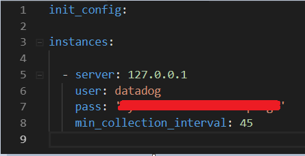

**Note:** Changed to the collection interval can be changed here so there is no need to keep changing the module code.

<br>

**Create a new python file in a text editor named my_metric.py add a metric that submits a random value between 1 and 1000.**

<br>

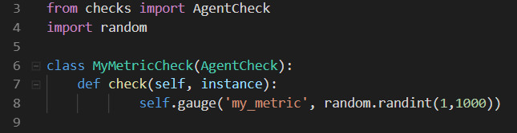

**Note**: I have added to import the random library so I can use the random int feature in Python.

<br>

Restart the Datadog Agent.