**<h1> Datadog Challenge <h1>** 


Author: Paul Ployvisut

Position Target: Solutions Engineer


<br>

**<h1> The Environment <h1>**


The challenge environment was created on ubuntu 16.04 in conjunction with Vagrant (Box bento/ubuntu-16.04) which uses Oracle’s VirtualBox as the hosted hypervisor.

<br>


**Note:** The machine used is a Windows 10 operating system with MinGW to emulate the Linux host environment. 


<br>


**1. Download and install [VirtualBox](https://www.virtualbox.org/).**

<br>

**2. Download and install [Vagrant](https://www.vagrantup.com/downloads.html) 64-bit.**

<br>

After installing Vagrant, follow the “[Get Started](https://www.vagrantup.com/intro/index.html)” tab on the website to follow instructions on how to install a box (OS images from Vagrant). You will be able to SSH to your new Linux environment at completion.

<br>

**3.	Configuring Vagrant for the project**

<br>

Navigate to your directory you wish to install your Vagrant box to via terminal and create a Vagrantfile (Configures a specified Vagrant VM).

<br>

```
vagrant init
```
<br>

Add a box from Vagrant, we are using bento/ubuntu-16.04 but there are many available here. 

<br>

```
$ vagrant box add bento/ubuntu-16.04
```
<br>

Select the provider you would like. For this project we have chosen to use VirtualBox.

<br>

*Expected output

<br>


<br>

Edit the Vagrantfile we created earlier with a text editor like Notepad++ and add the name of the box you added. This tells Vagrant to use the specified box as a base.

<br>


<br>

Boot your Vagrant environment up and connect to it via SSH.

```
$ vagrant up

$ vagrant ssh
```

We have now created our own environment with Vagrant using a version of Ubuntu as the operating system. Further configuration can be done but for now this will do but for more information see [here](https://www.vagrantup.com/intro/getting-started/index.html).


<br>
<br>

**4. Installing the Datadog agent.**

After creating an account on Datadog [here](https://www.datadoghq.com/), You can log into your dashboard that will be your monitoring hub. 

In the “Integrations” tab, select “Agent” which will give you a list of different Linux distributions and operating systems. Select the applicable version and follow the steps to install the agent.

<br>


<br>

**Important! Keep your keys private!** 

<br>

<br>

**5.	Ubuntu Installation**

Connected to your Vagrant box via SSH and perform a fresh install of the Datadog Agent. There is also an option to perform a manual install [here](https://docs.datadoghq.com/agent/basic_agent_usage/ubuntu/?tab=agentv6#one-step-install).

**Note:** It is a good idea to run an update of your box before making changes.

<br>

```
apt-get update
```
<br>

Don’t forget to install CURL so we can transport data over the various types of TCI/IP protocols.

<br>

```
apt-get install curl
```
<br>

Fresh install syntax for the Agent:
<br>

```
DD_API_KEY=YOUR_API_KEY bash -c "$(curl -L https://raw.githubusercontent.com/DataDog/datadog-agent/master/cmd/agent/install_script.sh)"

```
<br>

When the following message will print in the terminal after some lines. The Agent has successfully been installed.

<br>


<br>

Check if the Datadog Agent is collecting and transmitting metrics.

<br>

```
sudo datadog-agent status
```

<br>

**Note:** This syntax will also give you a lot of useful information about the Agent e.g. where the configuration file is located. 

<br>

Check your Datadog dashboard to see if metrics are being received by Datadog. 

On the left-hand pane of the Datadog dashboard, select “Infrastructure” and select “Infrastructure List” from the sub menu. You will be able to see the status of all hosts connected. 

<br>

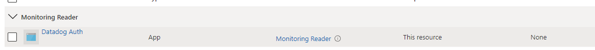

<br>


**<h1>Collecting Metrics<h1>**

<br>


**1.	Add tags in the Agent configuration file.**

<br>


Use preferred text editor to edit the “tags” section of the configuration file (datadog. yaml)

<br>

**Note:** Datadog recommended creating tags in a **key:value** format for better representations, read about it more [here](https://docs.datadoghq.com/tagging/assigning_tags/#further-reading).

<br>

```
sudo nano /etc/datadog-agent/datadog.yaml
```

<br>


<br>

**Note:** There will be examples already present, we can just add onto these by uncommenting out the tags indicated without a #.

After changes have been made, save the file with **CTRL o** and exit with **CTRL x**.

Restart the Agent to initialise the changes.

<br>

```
sudo service datadog-agent restart
```

<br>

Check the Datadog browser via the host map to see if the Agent has transmitted the changes. Notice the *tags*.

<br>


<br>

**2.	Install a database instance.**

While connected to your Vagrant instance via SSH, install a MySQL database.


**Note:** We will just need a basic installation for now but for more information please see [here](https://www.digitalocean.com/community/tutorials/how-to-install-mysql-on-ubuntu-18-04) for Ubuntu installation or the official MySQL [website](https://dev.mysql.com/doc/refman/5.7/en/adding-users.html).

<br>

```
sudo apt install mysql-server
```

<br>

Check that the SQL database is up.

<br>

```
sudo systemctl status mysql.service
```
<br>

*Expected output


<br>

**3.	Install Datadog integration with MySQL**

Head back to the Datadog dashboard and navigate to the “Integrations” tab to find and install the MySQL integration.
Follow through the configuration tab to see all the steps.

**Optional:** Generate a complex password and use this for the later steps.

<br>

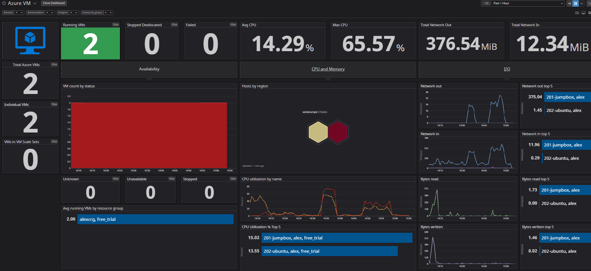

<br>

After configuration the **arrowed** area will let you know that the integration is working.

<br>


**4.	Configuring the integration.**

Create a Datadog user for the Agent on the SQL server.

<br>

```
mysql> CREATE USER 'datadog'@'localhost' IDENTIFIED BY '<UNIQUEPASSWORD>';
```
<br>

Check that the user has been created.

<br>

```
mysql> SHOW CREATE USER 'datadog'@'localhost'\G
```

<br>
*Expected output

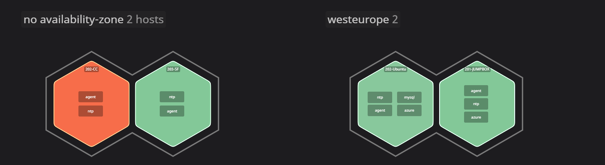

<br>

Grant the “datadog” user the following permissions.

<br>

```
mysql> GRANT REPLICATION CLIENT ON *.* TO 'datadog'@'localhost' WITH MAX_USER_CONNECTIONS 5;


mysql> GRANT PROCESS ON *.* TO 'datadog'@'localhost';
```

<br>

**Option:** Enable performance schema Quick Start, more information [here](https://dev.mysql.com/doc/refman/5.7/en/performance-schema-quick-start.html).

<br>
<br>

*Back to the Agent directory*, enable the Agent to collect metrics from the MySQL instance by editing the conf.yaml file located in:

etc/datadog-agent/conf.d/mysql.d/

**Note:** Edit the example file and uncomment the required settings and save as the master file of conf.yaml.

<br>

```
Sudo cd /etc/datadog-agent/conf.d/mysql.d/


Sudo /etc/datadog-agent/conf.d/mysql.d# nano conf.yaml.example

```

<br>

Edit that conf.yaml file.


<br>

*Original


<br>

Save the file and remove the .example then restart the Agent service.

Check the Agent status to see if metrics are being sampled.

<br>

```
Sudo service datadog-agent restart

Sudo datadog-agent status
```
<br>

*Output 


<br>

The Agent is now taking metrics from the MySQL instance.

<br>

**5.	Create a custom Agent check.**

<br>

Two files must be created for the custom Agent check:

<br>

•	The module file my_metric.py in the check.d directory.

•	The configuration for the module my_metric.yaml in the conf.d directory. 

<br>

**Optional:** A subfolder can be created in the conf.d directory to house the configuration file e.g. /conf.d/my_metric.d/my_metric.yaml.


**Note:** Both files must conform to the same name, for more information on creating custom Agent checks please see [here](https://docs.datadoghq.com/developers/agent_checks/?tab=agentv6#configuration).

<br>
<br>
<br>

**Create the configuration file (my_metric.yaml) and specify the collection interval to 45.** This is very similar to the conf.yaml file we configured earlier for MySQL.

After this is completed, place in the directory /conf.d/ or /conf.d/my_metric.d/.

<br>


**Note:** Changed to the collection interval can be changed here so there is no need to keep changing the module code.

<br>

**Create a new python file in a text editor named my_metric.py add a metric that submits a random value between 1 and 1000.**

<br>


**Note**: I have added to import the random library so I can use the random int feature in Python.

<br>

*Restart the Datadog Agent.*

<br>

**Check that the custom Agent is transmitting metrics on the Datadog Dashboard.**

In the infrastructure/host map tab, we can select the metric we created in the app section.


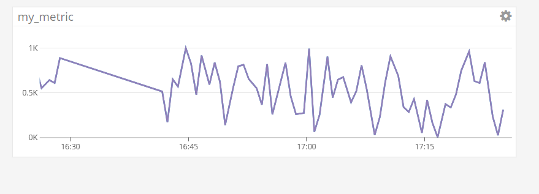

<br>

We can see the metrics are being received by Datadog between a range of 1 and 1000.


<br>

<br>

**<h1>Visualizing Data<h1>**

<br>

**1.	Create a script that will create a Timeboard for the Datadog dashboard.**

We can create a script using Python to create a Timeboard through Datadog’s API. A base script can be found [here](https://docs.datadoghq.com/api/?lang=python#create-a-screenboard).

<br>

[Timeboard Script](scripts/safe_my_timeboard.py)

**Note:** An application key must be created and used "to give full access to Datadog’s programmatic API”.

<br>

The script creates 3 graphs: my_metric scope, my_metric roll up scope and an anomaly monitoring the MySQL integration for SQL queries.
It also creates a monitor that prints a message when the threshold is reached Which can be used later in confunction with alerts. 

<br>


**2.	Use the API to create the Timeboard be executing your script through your Vagrant box.**

<br>

**Note:** Installation of Python modules may be required, please see the applicable information links.

[Python Integration](https://docs.datadoghq.com/integrations/python/)

[API with Python, Ruby, Curl](https://docs.datadoghq.com/api/?lang=python#overview)

[Python Modules](https://docs.python.org/3/installing/index.html)

<br>

*Expected output (In terminal)

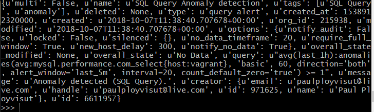
<br>


<br>

Check the Datadog dashboard to see what has been created. The Timeboard is in the “Dashboards” tab.


<br>

The new monitor will be in the “Monitors” tab.

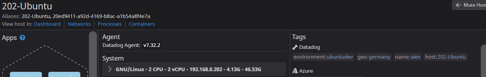

For more information on Timeboard’s please see [here](https://docs.datadoghq.com/graphing/dashboards/timeboard/).


<br>

**3.	Setting the Timeboard’s timeframe manually.**

<br>

Hover over the graph and grab (left click) the last 5 minutes of a graph and drag it across and release. This will freeze the last the time frame grabbed (5 minutes) for viewing.


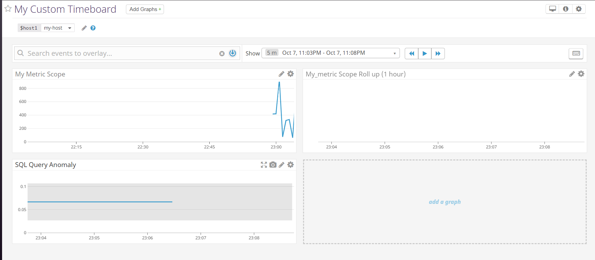

Press the play button to resume monitoring. 

<br>


**4.	Snapshot a graph and @ annotate a user.**

<br>

At the top right there is a “camera” icon which is used to annotate the graph along with a snap shot.


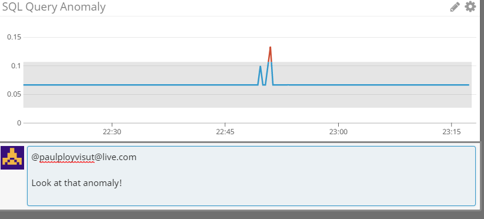

<br>

Doing this will notify the user on the event list with the message and snapshot of the graph.


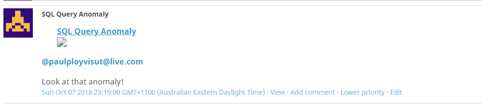

<br>
<br>

**5.	The Anomaly Graph.**

The graph shows the metric received by Datadog (Blue line) and the threshold (Grey area)  that is defined by analysing historical metric behaviour.

Data: SQL SELECT statements processed.


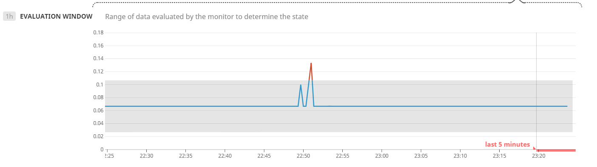

<br>
<br>

**<h1>Monitoring Data<h1>**

<br>

**1.	Creating a new monitor using the average of my_metric.**

<br>

At the Datadog Dashboard, on the “Monitors” tab, select “New Monitor” and follow the steps.

Choose threshold alert.

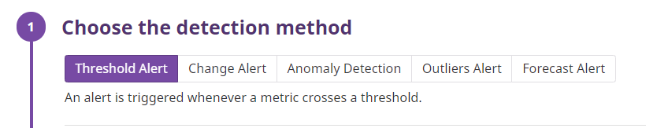

<br>

The metric we are using is my_metric from the Vagrant host, leave the rest default.

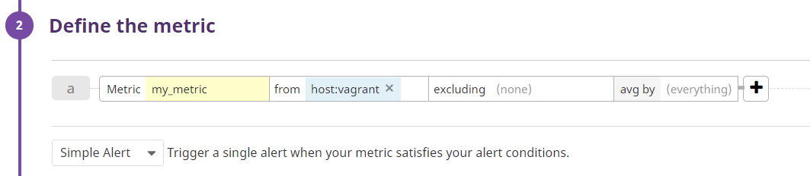

<br>

Warning threshold of 500, alerting threshold of 800 and ensure that it will notify recipient if there is No Data for this query over the past 10 minutes. Leave the rest default.

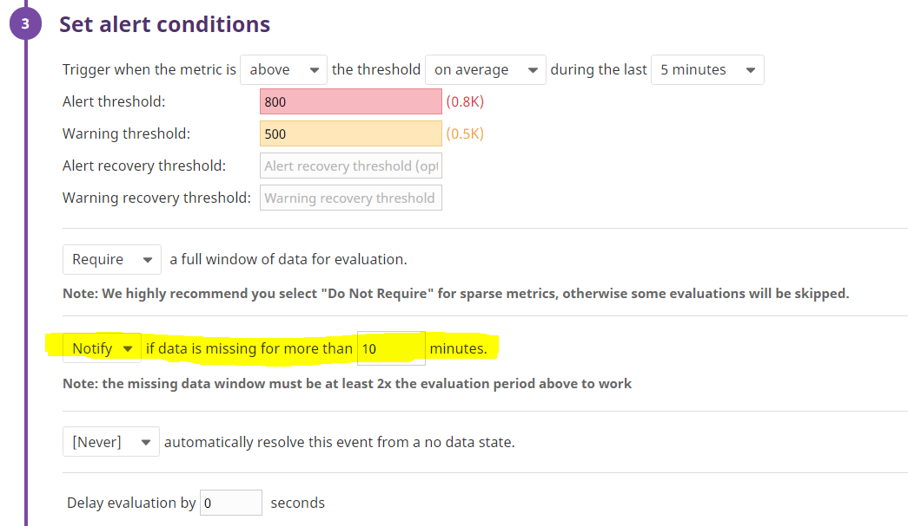

<br>


Configure the monitor’s message with these details:

<br>

•	Create different messages based on whether the monitor is in an Alert, Warning, or No Data state.

•	Include the metric value that caused the monitor to trigger and host ip when the Monitor triggers an Alert state.

•	When this monitor sends you an email notification, take a screenshot of the email that it sends you.

<br>

Use the triggers to specify alerts and variables, als add a recipient email to receive the emails.


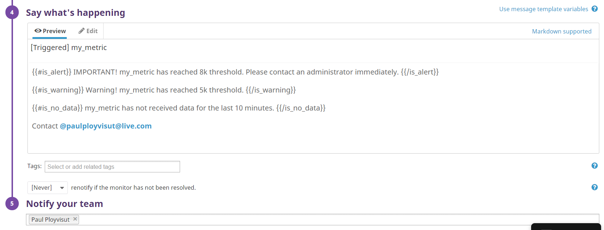


<br>

Email received:


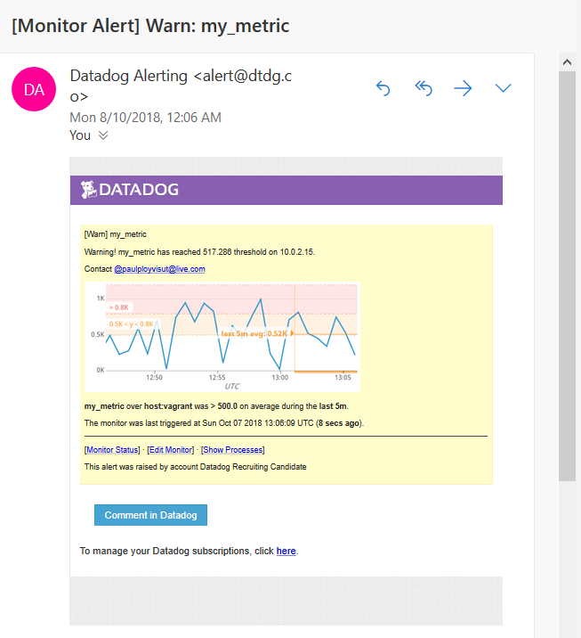

<br>

**2.	 Schedule down time for the following:**

<br>

•	One that silences it from 7pm to 9am daily on M-F

•	And one that silences it all day on Sat-Sun.

<br>

At the top of the Monitors menu, select the “Manage Downtime” tab at the top of the screen and select “Schedule Downtime”.


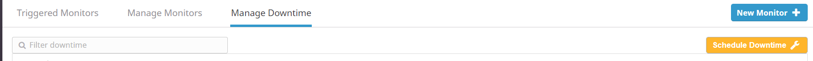


Populate fields with the target information.

<br>

*A downtime scheduled that silences it from 7pm to 9am daily on M-F

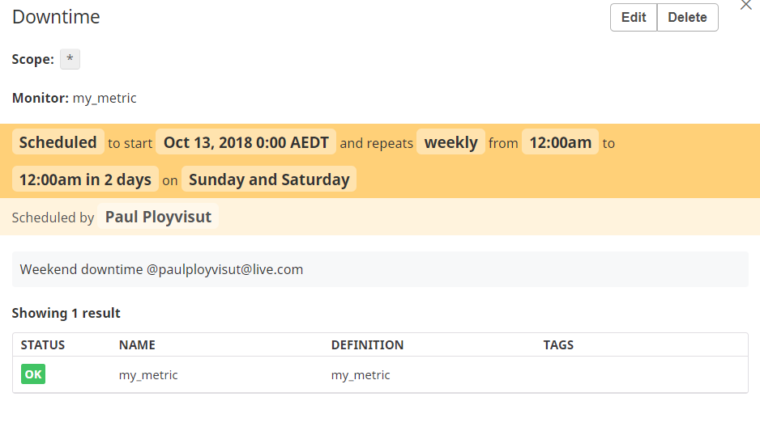

<br>

*A downtime schedulde that silences it all day on Sat-Sun.

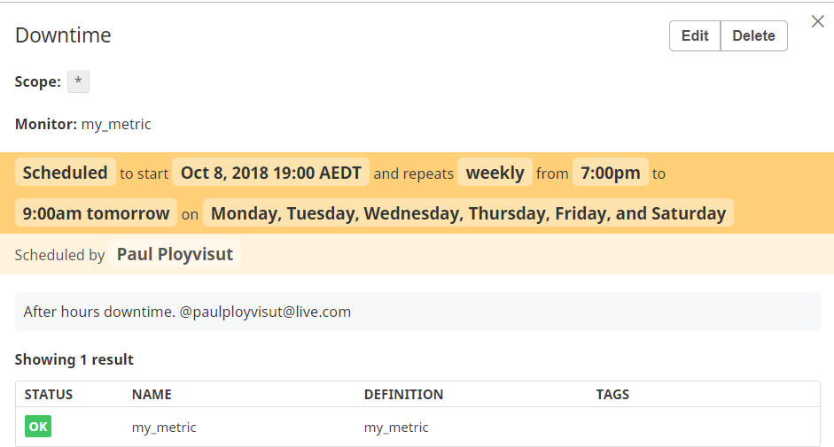

<br>

Return the Manage Downtime tab to see an overview.

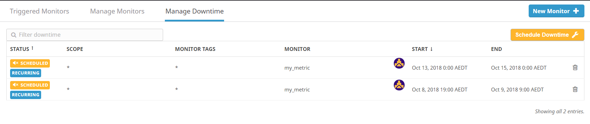

<br>
<br>

**<h1>Collecting APM Data<h1>**

<br>

**1.Enable APM (Application performance monitoring).**


We must first enable it on the Agent in the datadog.yaml file. For more information please see [here](https://docs.datadoghq.com/tracing/setup/).

The setting will be located towards the bottom of the datdog.yaml file and will be commented out by default (if you haven’t erased the comments).

Set enable to true and save the file, restart the Agent.

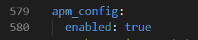


<br>

**3.	Install the Datadog tracing library (ddtrace).**

<br>

```
Sudo pip install ddtrace
```

<br>

4.	Install Flask (framework to work with ddtrace). 

<br>

```
Sudo pip install flask
```
<br>

Please see here for more information on [Flask](https://docs.datadoghq.com/tracing/setup/python/).

<br>

**5.	Create the Python file with the Datadog APM solution code.**

<br>

Take note of the port for the application at the bottom as this will need to be opened on the Vagrant box (Edit Vagrantfile for the box).

[Datadog’s APM Solution](scripts/app.py)

Vagrantfile: (Port forwarding to guest was added earlier)

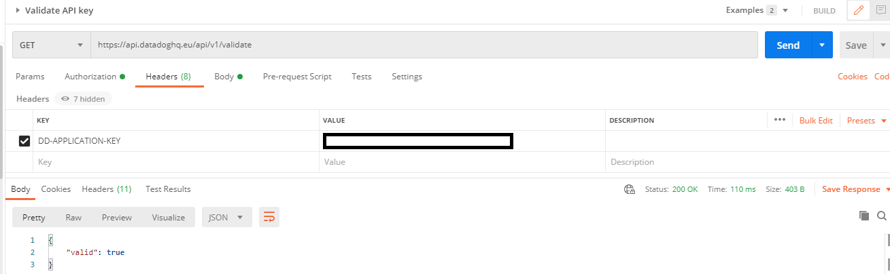

<br>

After changes have been made, reload the box from the terminal.

<br>

```
Vagrant reload
```
<br>
<br>

**6.	Connect back to the Vagrant box and execute the solution code in the terminal with ddtrace.**

<br>

```
Sudo ddtrace-run python app.py
```

<br>

*Expected output

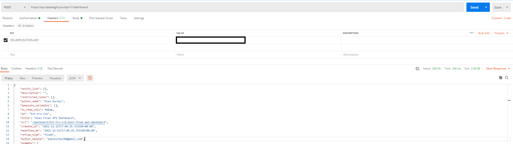

<br>

While connected, make a few API calls that are specified in the solution in a browser and our local host port e.g. http://localhost:8080/ 


<br>

Logs in your terminal.

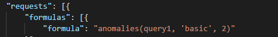

<br>

Check in the Datadog dashboard in the APM tab that it is receiving traces.

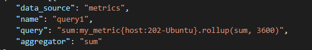

<br>
<br>

**7.	Add APM to our custom Timeboard with the infrastructure metrics.**

<br>

In the Datadog dashboard, navigate to the custom dashboard we created and add another Timeseries with the UI.

Drag and drop the Timeseries widget and fill in the details for the appropriate metric. 


<br>

Dashboard with the trace metrics.

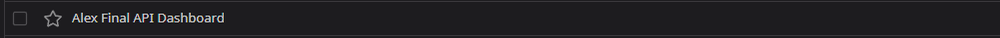

<br>


**8.	The difference between Services and resources?**

A service is a set of processes that work in conjunction with each other to perform a task/s.

A resource is a specific action used by the service.
In relation to monitoring metrics, we would monitor the MySQL service and tag the resources the service uses (queries etc.). 

For more details [here](https://docs.datadoghq.com/tracing/visualization/#services).

<br>
<br>
<br>

**<h1>What else can Datadog be used for?<h1>**

With life always making us too busy even for each other, a phone application could be developed for monitoring on the go. Not really a new idea but with this is mind, an integration could be created for home applications and or systems. Condition alerts could be set up with maybe a Datadog Agent hub that device could be connected to.

Maybe a bit too ambitious?


