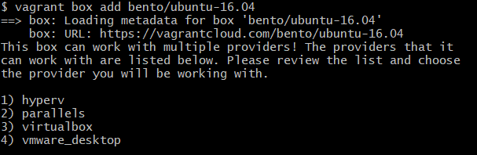

**<h1> The Environment <h1>**

The challenge environment was created on ubuntu 16.04 in conjunction with Vagrant (Box bento/ubuntu-16.04) which uses Oracle’s VirtualBox as the hosted hypervisor.


**Note:** The machine used is a Windows 10 operating system with MinGW to emulate the Linux host environment. 

**1. Download and install [VirtualBox](https://www.virtualbox.org/).**

**2. Download and install [Vagrant](https://www.vagrantup.com/downloads.html) 64-bit.**


After installing Vagrant, follow the “Get Started” tab on the website to follow instructions on how to install a box (OS images from Vagrant). You will be able to SSH to your new Linux environment at completion.

<br>

**3.	Configuring Vagrant for the project**

Navigate to your directory you wish to install your Vagrant box to via terminal and create a Vagrantfile (Configures a specified Vagrant VM).

<br>

```
vagrant init
```
<br>

Add a box from Vagrant, we are using bento/ubuntu-16.04 but there are many available here. 

<br>

```
$ vagrant box add bento/ubuntu-16.04
```
<br>
Select the provider you would like. For this project we have chosen to use VirtualBox.

<br>

*Expected output

<br>



<br>

Edit the Vagrantfile we created earlier with a text editor like Notepad++ and add the name of the box you added. This tells Vagrant to use the specified box as a base.

<br>


<br>

Boot your Vagrant environment up and connect to it via SSH.

```
$ vagrant up

$ vagrant ssh
```

We have now created our own environment with Vagrant using a version of Ubuntu as the operating system. Further configuration can be done but for now this will do but for more information see [here](https://www.vagrantup.com/intro/getting-started/index.html).


<br>
<br>

**4. Installing the Datadog agent on.**

After creating an account on Datadog [here](https://www.datadoghq.com/), You can log into your dashboard that will be your monitoring hub. 

In the “Integrations” tab, select “Agent” which will give you a list of different Linux distributions and operating systems. Select the applicable version and follow the steps to install the agent.
<br>


<br>

**5.	Ubuntu Installation**

Connected to your Vagrant box via SSH and perform a fresh install of the Datadog Agent. There is also an option to perform a manual install [here](https://docs.datadoghq.com/agent/basic_agent_usage/ubuntu/?tab=agentv6#one-step-install).

**Note:** It is a good idea to run an update of your box before making changes.


```
apt-get update
```

Don’t forget to install CURL so we can transport data over the various types of TCI/IP protocols.


```
apt-get install curl
```

Fresh install syntax for the Agent:

```
DD_API_KEY=YOUR_API_KEY bash -c "$(curl -L https://raw.githubusercontent.com/DataDog/datadog-agent/master/cmd/agent/install_script.sh)"

```