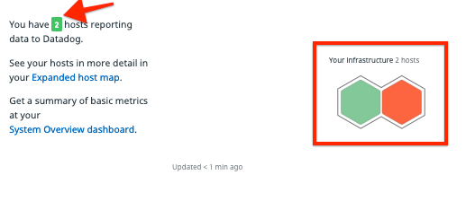
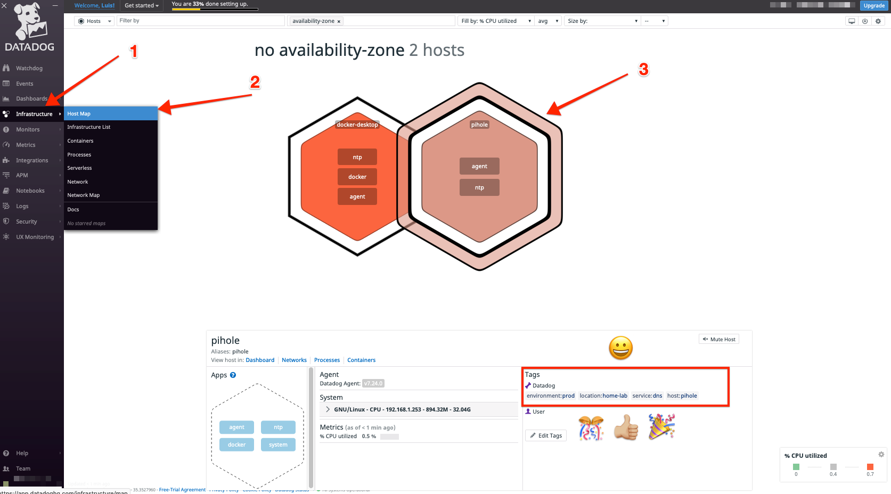
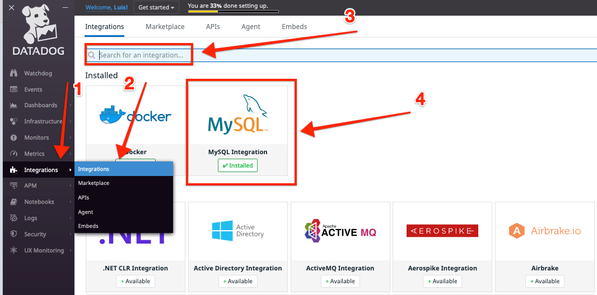
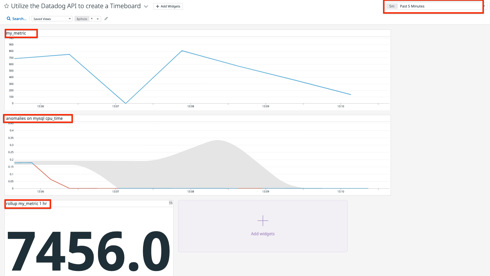
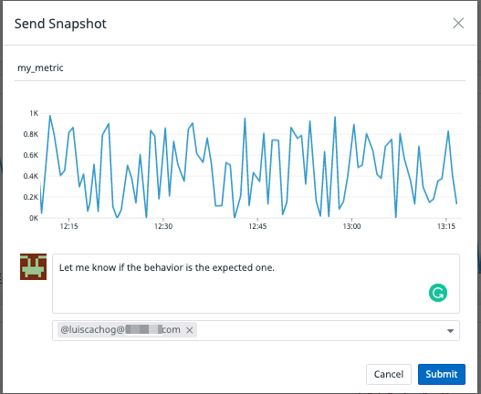
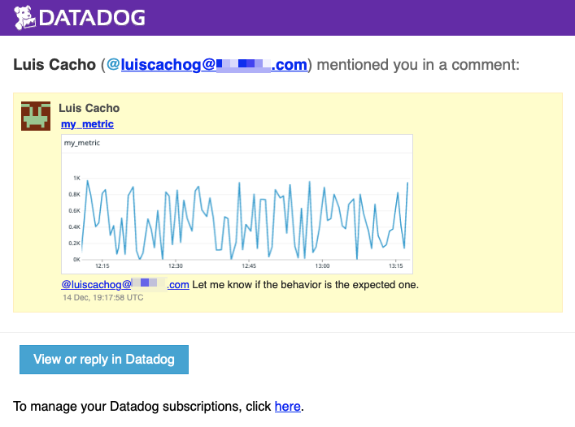
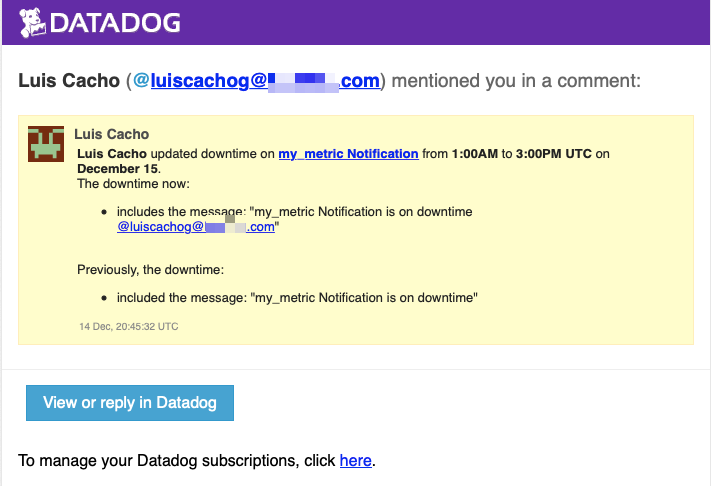
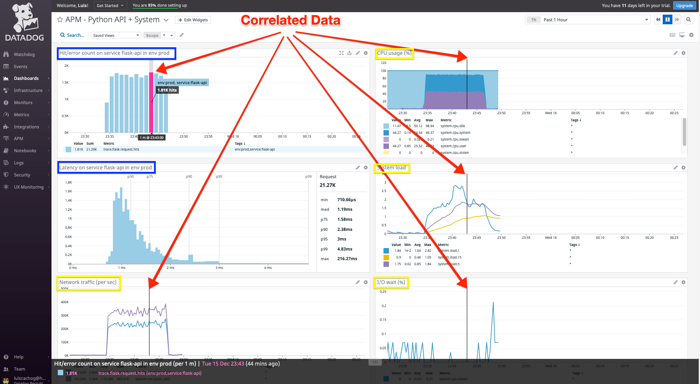

# Mis Respuestas

- [Mis Respuestas](#mis-respuestas)
  - [Mis Respuestas en Inglés](#mis-respuestas-en-inglés)
  - [Introducción](#introducción)
  - [Prerequisitos - Configuración del ambiente](#prerequisitos---configuración-del-ambiente)
    - [Crear una cuenta de Datadog](#crear-una-cuenta-de-datadog)
    - [Configuración del Host](#configuración-del-host)
  - [Collecting Metrics](#collecting-metrics)
    - [Tarea 1.1](#tarea-11)
    - [Tarea 1.2](#tarea-12)
    - [Tarea 1.3](#tarea-13)
    - [Tarea 1.4](#tarea-14)
    - [Tarea 1.5](#tarea-15)
  - [Visualizando Datos](#visualizando-datos)
    - [Tarea 2.1](#tarea-21)
      - [Tarea 2.2](#tarea-22)
      - [Tarea 2.3](#tarea-23)
  - [Monitoreando Datos](#monitoreando-datos)
    - [Tarea 3.1](#tarea-31)
    - [Tarea 3.2](#tarea-32)
  - [Colectando Datos APM](#colectando-datos-apm)
    - [Tarea 4.1](#tarea-41)
    - [Tarea 4.2](#tarea-42)
  - [Final Question](#final-question)

## [Mis Respuestas en Inglés](answers.md)

## Introducción

Hola equipo de Datadog!

Para comprender mejor el producto de Datadog, realizare una pequeña implementación con la cual los guiare a traves de las preguntas propuestas respondiendolas de la mejor manera posible.

## Prerequisitos - Configuración del ambiente

### Crear una cuenta de Datadog

Vamos a necesitar una cuenta de Datadog; para ello, necesitamos seguir los siguientes pasos:

1. Ve al link [https://www.datadoghq.com/](https://www.datadoghq.com/)
2. Justo en el centro del sitio, vamos a ver un bonito boton que dice "Free Trial" (Prueba Gratis) con el cual dandole click vamos a comenzar una prueba de 14 días como se muestra [aquí](static/images/dd_site_free_trial.png). Para mayor detalles acerca de la prueba, puedes visitar el link [https://www.datadoghq.com/legal/free-trial-agreement/#free-trial-orders](https://www.datadoghq.com/legal/free-trial-agreement/#free-trial-orders).

3. Vamos a llenar una simple forma para comenzar a usar la plataforma de Datadog platform, [aquí](static/images/dd_site_free_trial_form.png) un ejemplo de la forma a llenar.

4. Una vez que estes registrado, vas a encontrar todas las plataformas soportadas, servicios, lenguajes de programación que pueden ser integrados con Datadog; vamos a escoger nuestro stack en una página similar a [está](static/images/dd_site_stack.png)

5. El paso final esta sección es instalar el agente dependiendo de la integración que vayamos a implementar.

6. Estamos listos para comenzar a usar Datadog.

### Configuración del Host

Vamos a usar una VM local creada con vagrant.

Para crear la VM basada en Ubuntu 18.04 corremos los comandos:

```shell
  vagrant init hashicorp/bionic64
  vagrant up
  vagrant ssh
```

Esto nos creara una VM (Usando un Vagrantfile), levantara la instancia y nos conectaremos via ssh a la recién creada VM.

El unico paso para instalar el agente de Datadog es:

```shell
  DD_AGENT_MAJOR_VERSION=7 DD_API_KEY=<YOUR_API_KEY> DD_SITE="datadoghq.com" bash -c "$(curl -L https://s3.amazonaws.com/dd-agent/scripts/install_script.sh)"
```

**Nota: Solo por diversion y para tener más metricas que mostrar en los dashboards, instalé el agente también en un contendor usando docker en mi laptop.**

## Collecting Metrics

Una vez que el agente de Datadog esta instalado en Ubuntu y docker comenze a ver los hosts/agentes en el dashboard.



### Tarea 1.1
- **Add tags in the Agent config file and show us a screenshot of your host and its tags on the Host Map page in Datadog.**

Para esta tarea, vamos a necesitar localizar los archivos de configuración de los agentes.

- Para Ubuntu, la ruta del archivo de configuración es: `/etc/datadog-agent/datadog.yaml` y la sección que debemos editar es `tags`

  ```yaml
    tags:
      - environment:prod
      - location:home-lab
  ```

Una vez que terminamos de editar el archivo, vamos a reiniciar el agente de Datadog:

  ```shell
    sudo service datadog-agent restart
  ```

- Ya que se agregaron las tags (etiquetas) y que reiniciamos el agente, ya podemos ver en el dashboard las etiquetas asociadas al host. Para ver el detalle de las etiquetas puedes hacer click en: **Sidebar Menu -> Infrastructure -> Host Map -> YOUR HOST**



Para más información acerca de los archivos de configuración y etiquetas, aqui hay algunos enlaces de documentación:

- [https://docs.datadoghq.com/agent/guide/agent-configuration-files/](https://docs.datadoghq.com/agent/guide/agent-configuration-files/)
- [https://docs.datadoghq.com/getting_started/tagging/assigning_tags?tab=noncontainerizedenvironments#methods-for-assigning-tags](https://docs.datadoghq.com/getting_started/tagging/assigning_tags?tab=noncontainerizedenvironments#methods-for-assigning-tags)

### Tarea 1.2

**Install a database on your machine (MongoDB, MySQL, or PostgreSQL) and then install the respective Datadog integration for that database.**

Elegí usar MySQL por conveniencia ya que tengo experiencia previa. Para instrucciones de como descargar e instalar MySQL en Ubuntu visita [este link](https://www.digitalocean.com/community/tutorials/how-to-install-mysql-on-ubuntu-18-04)
Entonces, para instalar la integracion de MySQL, necesitamos ir a **Sidebar Menu -> Integrations -> Integrations**. Luego, buscamos por la integración que queremos agregar, para este caso MySQL.



Para más información al respecto de la integración de MySQL:

- [https://docs.datadoghq.com/integrations/mysql/](https://docs.datadoghq.com/integrations/mysql/)

### Tarea 1.3

**Create a custom Agent check that submits a metric named my_metric with a random value between 0 and 1000.**

Para esta tarea, seguí los pasos que estan en este [enlace](https://docs.datadoghq.com/developers/write_agent_check)

Los pasos que realize para configurar la métrica personalizada fueron:

- Crear un archivo de configuración para la Métrica Personalizada

  ```shell
    cd /etc/datadog-agent
    mkdir conf.d/my_metric.d/
    echo instances: [{}] > conf.d/my_metric.d/conf.yaml
  ```

- Crear un script de la Métrica Personalizada, para este caso, basado en el tutorial y como tengo algo de experiencia en python, el script final que se uso quedo en la ruta: `/etc/datadog-agent/checks.d/my_metric.py`

  ```python
  # the following try/except block will make the custom check compatible with any Agent version
  from random import randint
  try:
    # first, try to import the base class from new versions of the Agent...
    from datadog_checks.base import AgentCheck
  except ImportError:
    # ...if the above failed, the check is running in Agent version < 6.6.0
    from checks import AgentCheck

  # content of the special variable __version__ will be shown in the Agent status page
  __version__ = "1.0.0"

  class MyCustomCheck(AgentCheck):
    def check(self, instance):
        self.gauge('my_metric', randint(1,1000), tags=['check_name:my_metric','check_type:custom'])
  ```

**Nota:** Realize algunas pruebas/debugeo usando el comando `sudo -u dd-agent -- datadog-agent check my_metric`

### Tarea 1.4

**Change your check's collection interval so that it only submits the metric once every 45 seconds.**

Por defecto, el valor de la variable `collection interval` es `15`. Para cambiarlo a `45` seguí los siguientes pasos:

- Editar el archivo `/etc/datadog-agent/conf.d/my_metric.d/conf.yaml` con el contenido siguiente:

  ```yaml
  init_config:

  instances:
    - min_collection_interval: 45
  ```

- Reiniciar el agente de Datagos:

  ```shell
    sudo service datadog-agent restart
  ```

### Tarea 1.5

**Bonus Question Can you change the collection interval without modifying the Python check file you created?**

Si, podemos hacerlo en el archivo de configuración de la Métrica Personalizada, que para este ejemplo, esta en la ruta `/etc/datadog-agent/conf.d/my_metric.d/conf.yaml`

## Visualizando Datos

### Tarea 2.1

**Utilize the Datadog API to create a Timeboard that contains:**

- **Your custom metric scoped over your host.**
- **Any metric from the Integration on your Database with the anomaly function applied.**
- **Your custom metric with the rollup function applied to sum up all the points for the past hour into one bucket**

**Please be sure, when submitting your hiring challenge, to include the script that you've used to create this Timeboard.**

Para esta tarea, vamos a crear una `API Key` y una `Application Key`; para crearlas necesitamos ir a **Sidebar Menu -> Integrations -> APIs** y verificar que tengamos ambas; en caso de que no tengamos alguna, vamos a crear una como se muestra [aqui](static/images/dd_api.png)

Para correr mi script use ambas de la siguiente forma

```shell
  export DD_CLIENT_API_KEY=<API_KEY>
  export DD_CLIENT_APP_KEY=<APPLICATION_KEY>
```

Puedes encontrar mi script [aquí](code/timeboard.sh)

Publique la `API_KEY` y `APPLICATION_KEY` en my código como ejemplo de como usarlas en un ejemplo completo. Sin embargo, las revoque después ya que no es una buena practica desde el punto de vista de seguridad. El cambio lo realize, después de recibir una notificación de `GitGuardian` y del Soporte de Datadog.

#### Tarea 2.2

**Once this is created, access the Dashboard from your Dashboard List in the UI:**

- **Set the Timeboard's timeframe to the past 5 minutes**
- **Take a snapshot of this graph and use the @ notation to send it to yourself.**







#### Tarea 2.3

**Bonus Question: What is the Anomaly graph displaying?**

Como se describe en la [página](https://docs.datadoghq.com/monitors/monitor_types/anomaly/#overview) de `Anomaly detection (Detección de anomalías)`, la función de las anomalías es usar el pasado para **predecir** lo que esperamos en el futuro.
Para este ejemplo, la gráfica de anomalía esta mostrando dos valores el **expected value (valor esperado)** ( en color gris) y el **real value (valor real)** que es medido por el agente (en color azul o rojo)

## Monitoreando Datos

### Tarea 3.1

**Since you’ve already caught your test metric going above 800 once, you don’t want to have to continually watch this dashboard to be alerted when it goes above 800 again. So let’s make life easier by creating a monitor.**

**Create a new Metric Monitor that watches the average of your custom metric (my_metric) and will alert if it’s above the following values over the past 5 minutes:**

- **Warning threshold of 500**
- **Alerting threshold of 800**
- **And also ensure that it will notify you if there is No Data for this query over the past 10m.**

**Please configure the monitor’s message so that it will:**

- **Send you an email whenever the monitor triggers.**
- **Create different messages based on whether the monitor is in an Alert, Warning, or No Data state.**
- **Include the metric value that caused the monitor to trigger and host ip when the Monitor triggers an Alert state.**
- **When this monitor sends you an email notification, take a screenshot of the email that it sends you.**


### Tarea 3.2

**Bonus Question: Since this monitor is going to alert pretty often, you don’t want to be alerted when you are out of the office. Set up two scheduled downtimes for this monitor:**

- **One that silences it from 7pm to 9am daily on M-F,**
- **And one that silences it all day on Sat-Sun.**
- **Make sure that your email is notified when you schedule the downtime and take a screenshot of that notification.**



## Colectando Datos APM

### Tarea 4.1

**Given the following Flask app instrument this using Datadog’s APM solution:**

- **Provide a link and a screenshot of a Dashboard with both APM and Infrastructure Metrics.**
- **Please include your fully instrumented app in your submission, as well.**

Para este paso, vamos a instalar algunos prerequisitos en nuestra VM:

```shell
  pip install cython flask ddtrace
```

Luego vamos usar algunas `variables ENV (variables de ambiente)` como se menciona en la [documentación](https://docs.datadoghq.com/tracing/setup_overview/setup/python), el comando que yo corrí fue:

```shell
   DD_RUNTIME_METRICS_ENABLED=true DD_SERVICE="flask-api" DD_ENV="prod" DD_LOGS_INJECTION=true DD_TRACE_SAMPLE_RATE="1" DD_PROFILING_ENABLED=true ddtrace-run python my_app.py
```

Donde las etiquetas que vamos a necesitar para APM son:

```shell
  DD_SERVICE="flask-api"
  DD_ENV="prod"
```

Luego, para probar use algunos comandos de bash para generar peticions hacia nuestra API de Flask, donde estrese los tres endpoint disponibles.

```shell
  for i in {0..1000}; do curl localhost:5050/; curl localhost:5050/api/apm; curl localhost:5050/api/trace; done
```

El pantallazo final y el link hacia el dashboard creado son los siguientes:

- 
- [Link de Dashboard Publico](https://p.datadoghq.com/sb/aobt5tbtpdu3g4bd-8d9a24bf7d109cf70e6e80c07a023313)

La aplicación que instrumente es la misma que la del ejemplo, solo la ejecute con las variables de entorno que requiere APM. El codigo lo pueden encontrar [aquí](code/my_app.py)


### Tarea 4.2

**Bonus Question: What is the difference between a Service and a Resource?**

De acuerdo a la [documentación](https://docs.datadoghq.com/tracing/visualization/) `Service` es un endpoint, query o job. En nuestro caso, use el servicio llamado `flask-api`.
Y un `Resource` es un dominio particular de una aplicación cliente (Service). En nuestro ejemplo, los `resoruces` son `/, /api/apm, /api/trace`. Tambien, entendí que un `resource` es parte de un Service.

## Final Question

**Datadog has been used in a lot of creative ways in the past. We’ve written some blog posts about using Datadog to monitor the NYC Subway System, Pokemon Go, and even office restroom availability!**
**Is there anything creative you would use Datadog for?**

Puedo imaginarme usando Datadog para monitorar el precio de algún Cryptocurrency; podemos usar los algoritmos de Machine Learning para intentar predecir el precio :wink:. También imagino que podemos usar Datadog para monitorear la distribución y aplicación de las vacunas contra el CoVID-19, y solo por diversion/aprendizaje voy a comenzar a usar Datadog en mi Raspberry-Pi para tener mas detalles de mi uso de red/servicios locales/anuncios evitados/sitios más visitados/etc.

Gracias por la oportunidad!
