# Datadog Challenge Submission #
Submitted by **Jerry Lee** for the position of **Solutions Engineer**.

## Environment/Setup Steps ##

This challenge was completed on a virtual machine running Ubuntu 16.04. The environment was built/maintained using Vagrant with VirtualBox as a hypervisor. 
The Vagrant package/box that provided the Ubuntu 16.04 environment for this submission is: "bento/ubuntu-16.04".

Setting this up involves the following steps:

1. Download and install VirtualBox at https://www.virtualbox.org/
2. Download and install Vagrant at https://www.vagrantup.com/docs/installation/ 
3. Follow the initialization instructions for a Ubuntu 16.04 virtual machine at https://app.vagrantup.com/bento/boxes/ubuntu-16.04
4. SSH into the virtual machine and follow the instructions for installing the agent on Ubuntu provided on the Datadog "Get started" page. 
    * To get there, simply sign up for the Datadog service online, and click the "Get started" tab at the top of the UI. Select your appropriate platform.
    * Set up is very straightforward for a Ubuntu machine. Just copy the command provided on the page that already includes your API key, and run it on your SSH'd virtual machine. 
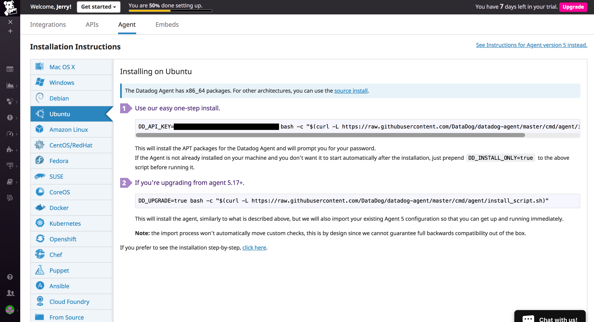

5. Your Datadog agent is now installed on your vagrant host.
Instructions on using the basic commands for using the agent, as well as configuring said agent using the "datadog.conf" file, can be found [here](http://dtdg.co/101-agent). The specifics will vary depending on your platform, so look for the appropriate selection on the aforementioned link.


## Collecting Metrics ##

#### Adding tags in the Agent config file ####
* Tagging is a method to scope aggregated data. One is strongly suggested to assign them to each host and integration to be monitored, 
and to assign informative tags that can effectively divide hosts by their functions/properties. Information regarding tags can be found on [here](http://dtdg.co/101-tags). Examples of tagging choices can include:
    * based on size of computing resource (size:small, size:medium, size: large)
    * based on computing roles (role:database, role:web, role:cache)
* **Note: The datadog agent must be restarted every time the configurations or integrations are changed for said agent.** 
 

To add host tags for the overall agent, edit the `datadog.yaml` file, which you can
discover the path of by referring [here](http://dtdg.co/101-agent). Again, the specifics will
vary depending on environment you have chosen to use, so select your appropriate platform. 

When adding tags through the `datadog.yaml` file, tags must be entered in the form:

```
tags: key_first_tag:value_1, key_second_tag:value_2, key_third_tag:value_3
```
My example tags were added as following:

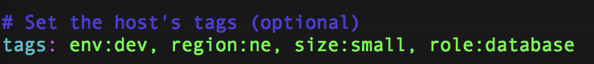

From the Host Map page, we can see the added tags:


#### Database Installation ####

For this submission, PostgreSQL was installed on our
Vagrant and Virtual Box environment. 

Instructions for setting this up can be found [here](https://www.digitalocean.com/community/tutorials/how-to-install-and-use-postgresql-on-ubuntu-16-04).
Since the Ubuntu default repo already contains Postgres packages, we can simply use the `apt` packaging system.

```
$ sudo apt-get update
$ sudo apt-get install postgresql postgresql-contrib
```

After installing PostgreSQL, go to the integrations page
on the Datadog web application, select  PostgreSQL, and
follow the instructions. 

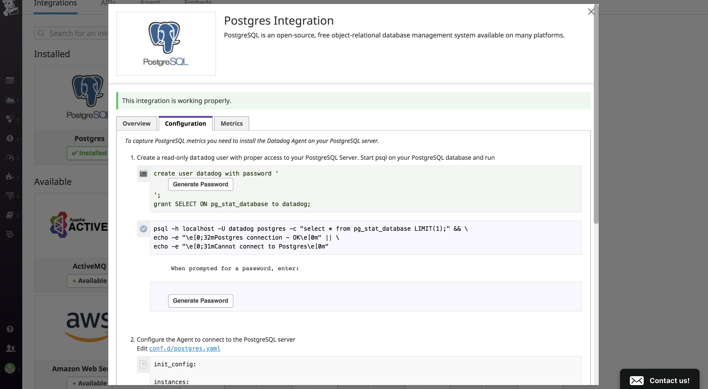
**Note on configuring the Agent to connect to the PostgreSQL server:**

During the setup step, you will be asked to connect the Agent to your DB at `conf.d/postgres.yaml`.
Integration configs are specified in the .yaml file found in the conf.d directory for the specific integration. In my case: 

```
/etc/datadog-agent/conf.d/postgres.d/postgres.yaml
```

You will have to make the `<integration>.yaml` file yourself. Use the agent information command to verify that you have sucessfully installed the integration.

```
$ sudo datadog-agent status
```
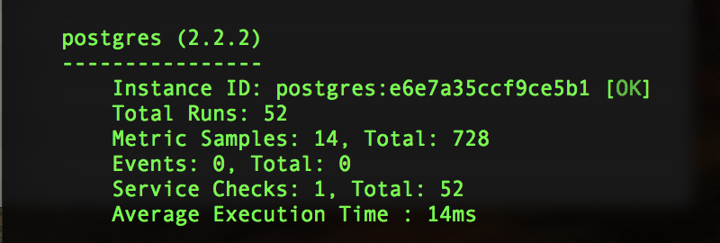

#### Custom Agent Checks ####

To create a custom agent check, create a `<checkname>.py` file in the `checks.d` directory and a corresponding 
`<checkname>.yaml` file in the `conf.d` directory.
For my submission, these files were as follows:

**mycheck.py**
```python
import random

from checks import AgentCheck

class MyCheck(AgentCheck):
    def check(self, instance):
        self.gauge('my_check', random.randint(0, 1000))

```

**mycheck.yaml**
```
init_config:

instances:
    [{}]

```

The resulting custom metric can now be seen from the metrics explorer tab.

**my_metric metric metrics chart**
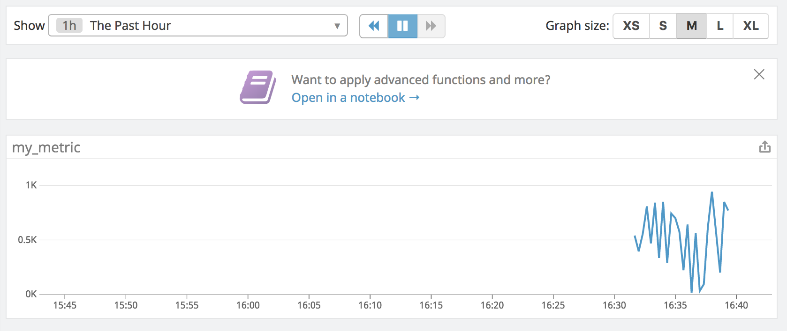


#### Changing Collection Intervals ####
To change the collection interval of this custom agent check globally, we configure the `mycheck.yaml` file with
the key `min_collection_interval` in the `init_config` section. (**Bonus**: this is also how we can change the collection
interval without modifying the `mycheck.py` file)


```
init_config:
    min_collection_interval: 45
instances:
    [{}]

```


Note that the `min_collection_interval` condition value is evaluated every time the collection loop runs, which tends to be 15-20 seconds. This means that we may collect the metrics as often as every 45 seconds, but not that we collect it every 45 seconds.

## Vizualizing Data ##

Visualizing data can be done either using the editor or
through a JSON file.

Below are three time series graphs that monitor different metrics and their respective JSON scripts:

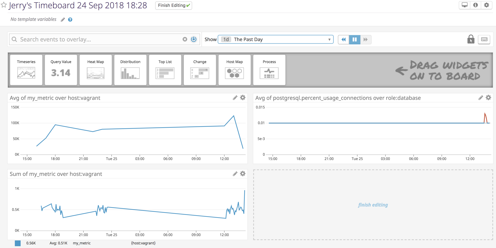


**Avg of my_metric over host:vagrant**
```json
{
  "requests": [
    {
      "q": "avg:my_metric{host:vagrant}.rollup(sum, 3600)",
      "type": "line",
      "style": {
        "palette": "dog_classic",
        "type": "solid",
        "width": "normal"
      },
      "conditional_formats": [],
      "aggregator": "avg"
    }
  ],
  "viz": "timeseries",
  "autoscale": true,
  "status": "done"
}
```


**Avg of postgresql.percent_usage_connections over role:database**
```json
{
  "requests": [
    {
      "q": "anomalies(avg:postgresql.percent_usage_connections{role:database}, 'basic', 2)",
      "type": "line",
      "style": {
        "palette": "dog_classic",
        "type": "solid",
        "width": "normal"
      },
      "conditional_formats": [],
      "aggregator": "avg"
    }
  ],
  "viz": "timeseries",
  "autoscale": true,
  "status": "done"
}
```

Note: the graph for the above JSON file applies an anomaly detection function.
Datadog provides three time-series algorithms with varying levels of robustness
that can be used to detect anomalies.

**What is the anomaly graph displaying?**

This graph shows the percentage of connections
used up for our PostgreSQL database. Since, over the period of 
working on this submission, the % usage has stayed
the same at 0.01%, the 0.013% usage that occurs towards the end of the graph is considered an "anomaly" (at this time, I just created another role on the PostgreSQL db and accessed it, which would be an "outlier" of usual behavior). For this graph, we applied the *basic* algorithm, which is a lagging rolling quantile computation. Anomalies are evaluated based on a range of expected values.

**Sum of my_metric over host:vagrant**
```json
{
  "requests": [
    {
      "q": "sum:my_metric{host:vagrant}",
      "type": "line",
      "style": {
        "palette": "dog_classic",
        "type": "solid",
        "width": "normal"
      },
      "conditional_formats": [],
      "aggregator": "avg"
    }
  ],
  "viz": "timeseries",
  "autoscale": true,
  "status": "done"
}
```

#### Dashboard List Steps ####
From the dashboard list, we can look at all dashboards we have created. To take a snapshot and use @ notation to
send it to a user, we can click the camera icon and
tag the desired user. 

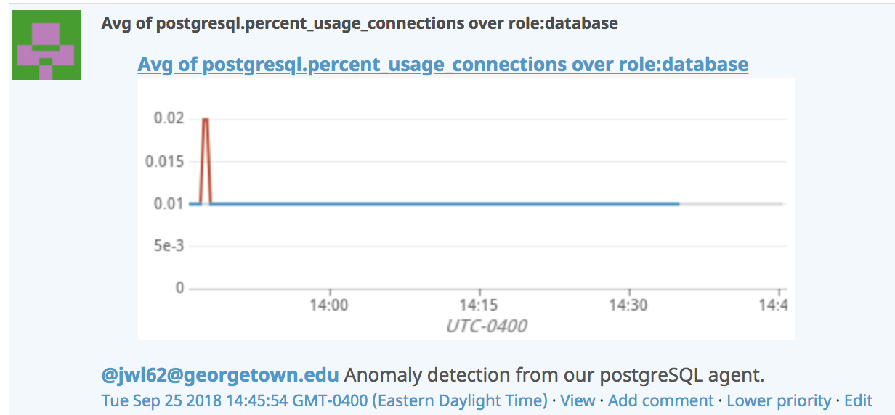

## Monitoring Data ##

A general walkthrough for creating monitors can be found [here](https://docs.datadoghq.com/monitors/#creating-a-monitor)

To begin, we use the Datadog UI and access the "New Monitor" tab from the "Monitor" selection on the sidebar. Here, we then select a new "Metric Monitor" and begin our basic initialization. 

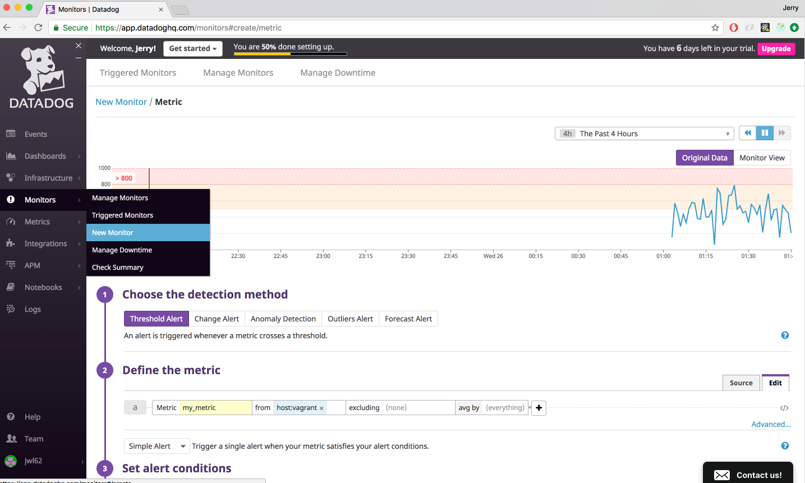

As seen above, we are monitoring the queried values for the custom metric, `my_metric`, created earlier. Since we are only reading this data from one host and averaging it by said 
host, we are simply monitoring the queried values.

Next, we set alert conditions on the UI based on the average of `my_metric` over the past 5 minutes. 
We receive a warning if this value is over 500, and an alert if it exceeds 800. Also, we are notified if there is no data received from the queries for `my_metric` over the past 10 minutes.

In the "Say what's happening" tab, we can then write the messages we wish to be displayed 
when threshold values are met or a no data state is reached. We can also use this area to add
notification recipients (this can also be done on the "Notify your Team" section that follows).

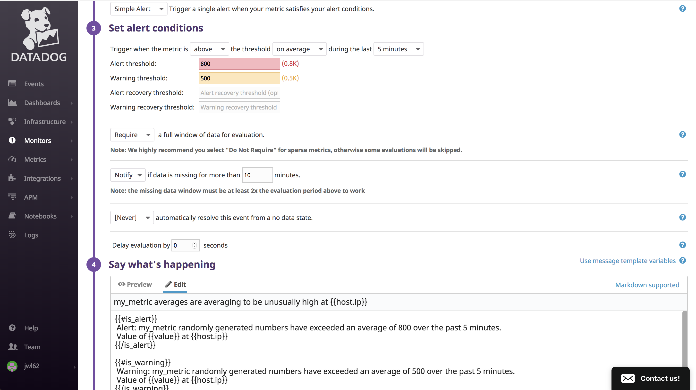


My monitor's resulting JSON file was as follows:

```json
{
	"name": "my_metric averages are averaging to be unusually high at {{host.ip}}",
	"type": "metric alert",
	"query": "avg(last_5m):avg:my_metric{host:vagrant} > 800",
	"message": "{{#is_alert}}\n Alert: my_metric randomly generated numbers have exceeded an average of 800 over the past 5 minutes.\n Value of {{value}} at {{host.ip}}\n{{/is_alert}} \n\n{{#is_warning}}\n Warning: my_metric randomly generated numbers have exceeded an average of 500 over the past 5 minutes.\n Value of {{value}} at {{host.ip}}\n{{/is_warning}} \n\n{{#is_no_data}}\n Notice: queries for my_metric have had no data over the past 10 minutes.\n{{/is_no_data}} \n\nNotify: @jwl62@georgetown.edu",
	"tags": [],
	"options": {
		"timeout_h": 0,
		"notify_no_data": true,
		"no_data_timeframe": 10,
		"notify_audit": false,
		"require_full_window": true,
		"new_host_delay": 300,
		"include_tags": false,
		"escalation_message": "",
		"locked": false,
		"renotify_interval": "0",
		"thresholds": {
			"critical": 800,
			"warning": 500
		}
	}
}
```

From our monitor, we now receive e-mail notifications when thresholds for `my_metric` are exceeded, a no data state is reached, or the metric falls within the thresholds again and are considered resolved.

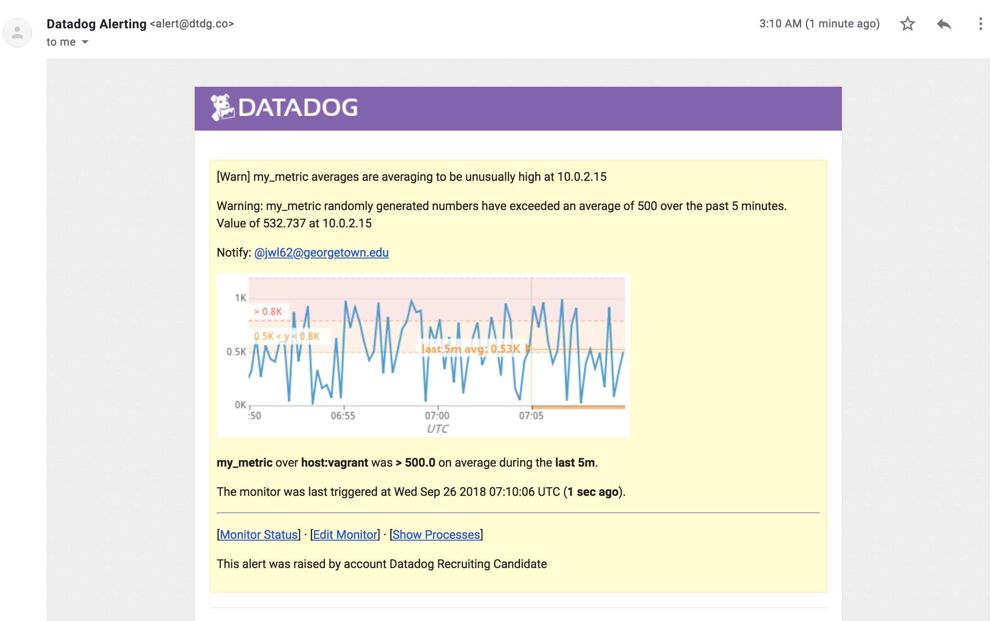

#### Bonus: scheduling downtime ####

You can schedule downtime periods for your monitors so that events are not triggered and you do not receive notifications at specific times (i.e. during the weekends, after business hours). 

This can be done from the "Manage Downtime" option on the
"Monitors" tab from the Datadog UI. Click "Schedule Downtime" to initialize the desired monitor downtime periods. Use the UI fields to configure the downtime period.

For this submission, we schedule two downtimes: one for 7pm to 9am EST daily, Monday through Friday, and one for all day on Saturday and Sunday. Note that even though we cannot start the downtime earlier than 4AM for the weekends, because the downtime still coincides with the weekday 7pm to 9am downtime, we effectively still silence the events all weekend.

**Downtime for 7pm - 9am, Mon - Fri**
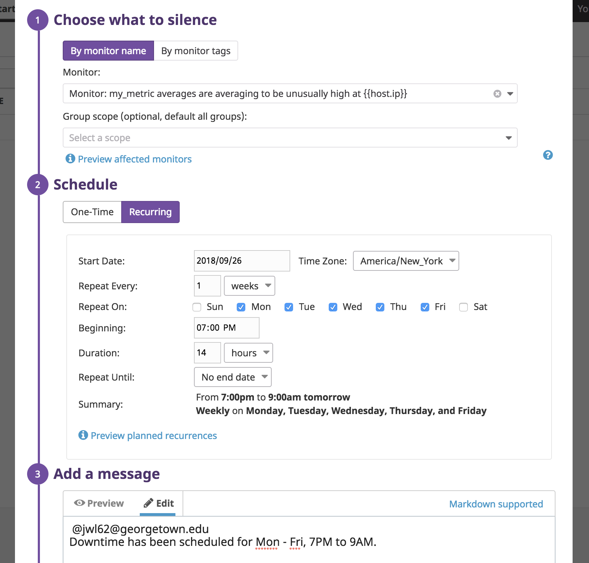
**Downtime for all day, Saturday and Sunday**
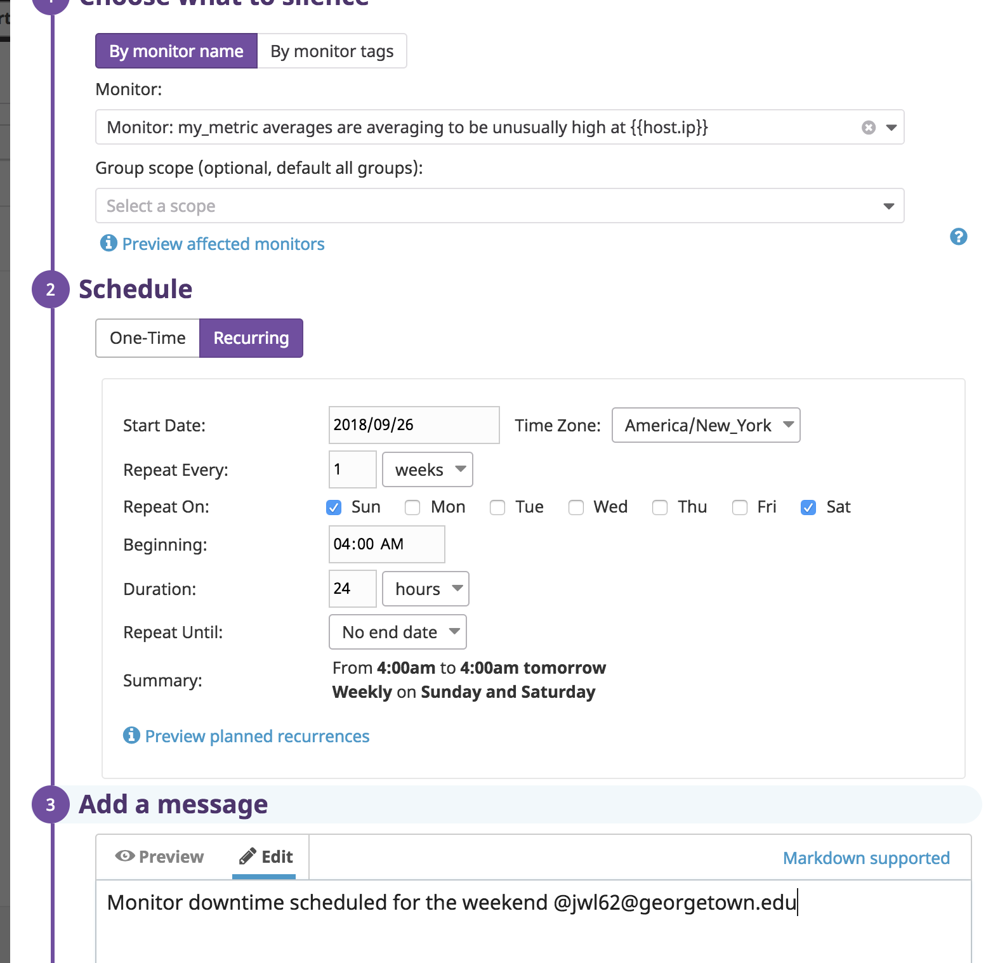

**Email notification for downtime (note that it is listed in UTC for convenience)**

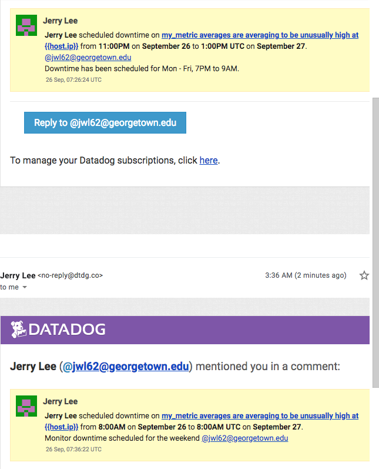

## Collecting APM Data ##

For this portion of my submission, I monitored the data from the Flask (Python web microframework) app provided in the challenge guidelines.
Instructions for general set up can be found on this [blog](https://www.datadoghq.com/blog/monitoring-flask-apps-with-datadog/) and this [documentation page](https://docs.datadoghq.com/tracing/setup/#agent-configuration).

The steps that I completed for this section were as follows: 
1. Install Datadog's Python tracing client library, `ddtrace`
    1. Install the `easy_install` command for python.
	```
	$ sudo apt-get install python-setuptools
	```
	2. Install `pip`
	```
	$ sudo easy_install pip
	```
	3. Download and install `ddtrace`
	```
	$ sudo pip install ddtrace
	```
2. Install Flask
```
$ sudo pip install flask
```
3. In directory `/home/vagrant`, I created `my_app.py` and copied over the Flask app provided on the challenge.
4. Instrument the Python application with `ddtrace-run`
```
$ ddtrace-run python my_app.py
```

**The source code of `my_app.py` is as follows:**
```python

from flask import Flask
import logging
import sys

# Middleware installation
from ddtrace import tracer
from ddtrace.contrib.flask import TraceMiddleware


# Have flask use stdout as the logger
main_logger = logging.getLogger()
main_logger.setLevel(logging.DEBUG)
c = logging.StreamHandler(sys.stdout)
formatter = logging.Formatter('%(asctime)s - %(name)s - %(levelname)s - %(message)s')
c.setFormatter(formatter)
main_logger.addHandler(c)

app = Flask(__name__)
traced_app = TraceMiddleware(app, tracer, service="my-flask-app", distributed_tracing=True)

@app.route('/')
def api_entry():
return 'Entrypoint to the Application'

@app.route('/api/apm')
def apm_endpoint():
return 'Getting APM Started'

@app.route('/api/trace')
def trace_endpoint():
return 'Posting Traces'

if __name__ == '__main__':
app.run(host='0.0.0.0', port='5050')

```
 5. use `curl` to access the various routes on the flask web application so the Datadog tracer has information to feed to the APM UI on the Datsadog site. 

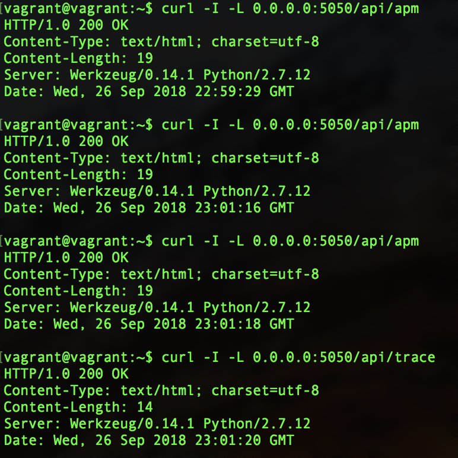

At this stage, we can now see information collected by the Datadog Tracer on our python application.
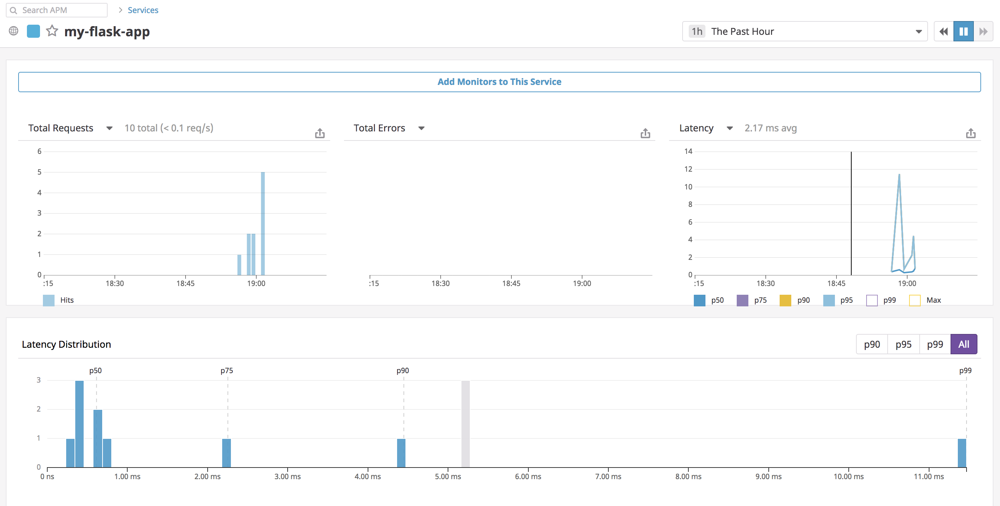

Datadog allows us to create dashboards that can inform us both on application and infrastructure performance. Below, we have a screenboard with
three graphs that show:
* A time series of the randomly generated `my_metric`
* A heat map of http requests for our Flask app 
* A time series of our CPU idle % on our vagrant host

**Screenboard with both APM and Infrastruture Metrics**

(Link to screenboard: https://p.datadoghq.com/sb/676b79f81-d97b5145512465ff42b24da44b478a9e)
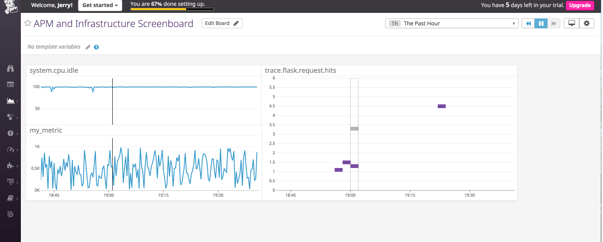

**What is the difference between a service and a resource?**

**Services** are a set of of processes working together to provide some domain of features/functionalities. For instance, for a simple web application, you may have a front end service that provides the user interaction functionalities, as well as a database service for data persistence.  **Resources** are queries to services, such as a database query to a SQL back end. 

## Final Question ##
Given the powerful capabilities of Datadog for real time monitoring of both infrastructure and application data, as well as its inclusion of over 200 integrations, Datadog has great potential to help any group that hopes to gain insight on the performance of large scale applications.

A couple of thoughts I have about using Datadog's service relate to an MMO called Runescape that I used to be quite fond of. This game has over a hundred servers, each of which will have varying ping, response time, and disconnect rates depending on the location of users trying to acces the world/server. Datadog's monitoring capabilities could be useful for providing information about which worlds are most suitable for players (i.e. based on location), as well as providing real time monitoring of server crashes (which happen often for the game). Moreover, Datadog's monitoring would likely be very useful for benchmarking
code performance as updates are rolled to the game (the game is cosntantly updated). 
Using Datadog's capabilities, one could monitor if new game features or areas have been implemented in a manner that doesn't degrade performance and thereby user experience.

