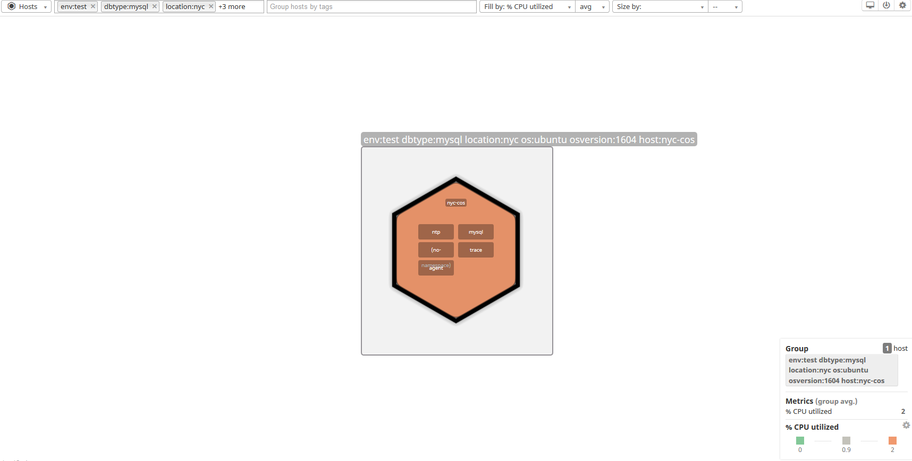
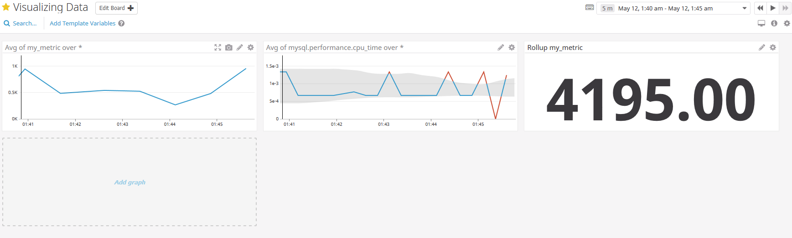
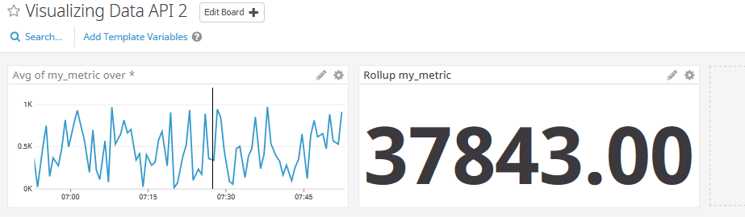
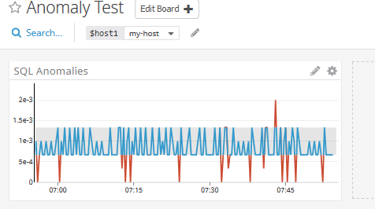
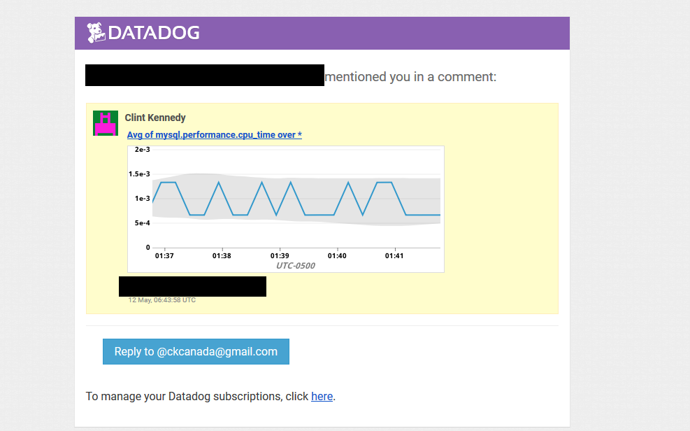
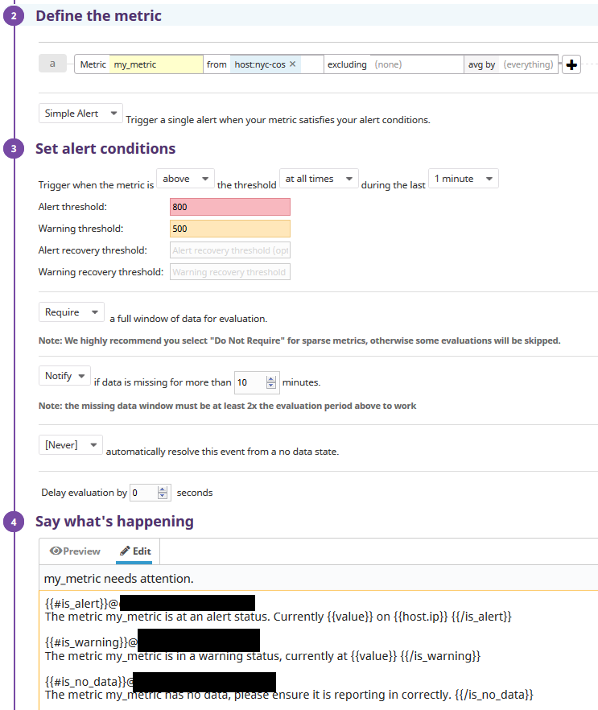
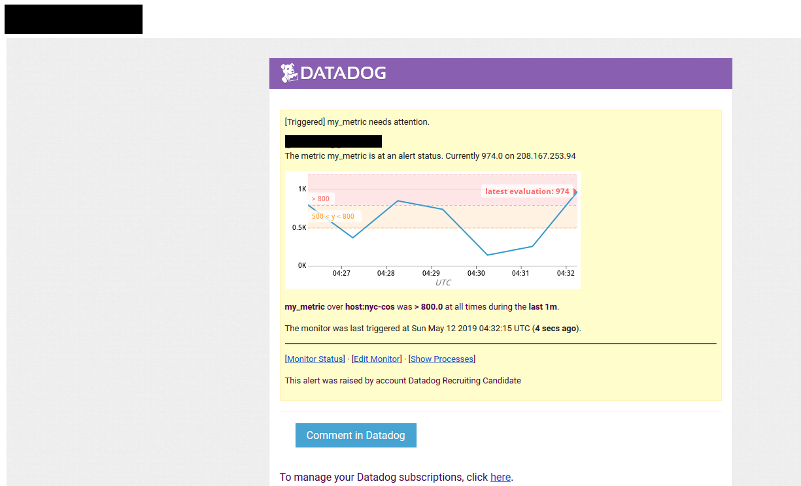
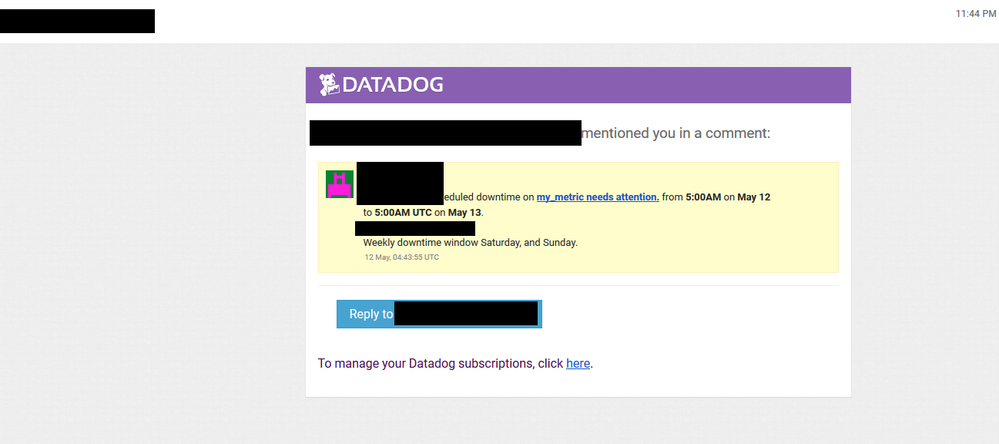
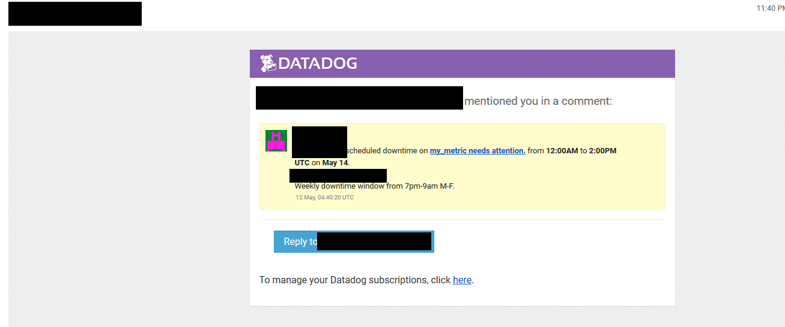
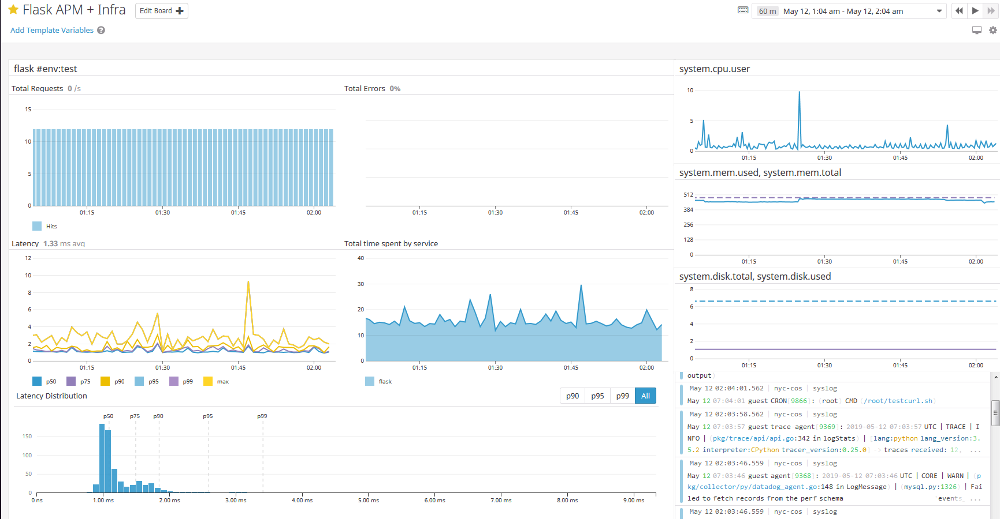

**[Collecting Metrics]**

I added tags, mysql, and a custom agent check for the random number
between 0 and 1000.

Modified Datadog.yaml

tags:

\- env:test

\- dbtype:mysql

\- os:ubuntu

\- osversion:1604

\- location:nyc

The different tags seen on the host map page.

I created the two files below to evaluate the custom check for
my\_metric, and create the configuration to run every 45 seconds.

**/etc/datadog-agent/checks.d/custom\_random.py**

\# the following try/except block will make the custom check compatible
with any Agent version

try:

\# first, try to import the base class from old versions of the
Agent\...

from checks import AgentCheck

except ImportError:

\# \...if the above failed, the check is running in Agent version 6 or
later

from datadog\_checks.checks import AgentCheck

import random

\# content of the special variable \_\_version\_\_ will be shown in the
Agent status page

\_\_version\_\_ = \"1.0.0\"

class HelloCheck(AgentCheck):

def check(self, instance):

self.gauge(\'my\_metric\', random.randint(1,1001),
tags=\[\'location:nyc\'\])

**/etc/datadog-agent/conf.d/custom\_random.yaml**

init\_config:

instances:

\- min\_collection\_interval: 45

**BONUS**: Yes, not quite changing - could submit the variable over the
API using CRON by parsing the variable manually, and posting to DD\'s
API directly. This could be valuable in a case where more data is needed
for a short duration.

**[Visualizing Data]**

I have not been able to get the anomaly function to work in bash. I took
identical JSON that was outputted from a GET, and can\'t find any
reference as to what scope\_expr represents. I was able to get it
working in python however.

{\"errors\": \[\"Invalid query in widget at position 1. Error: unable to
parse anomalies(avg:mysql.performance.cpu\_time{\*}, basic, 2): Rule
\'scope\_expr\' didn\'t match at \', 2)\' (line 1, column 51).\"\]}

A few of the links I've been using as reference:

https://docs.datadoghq.com/graphing/graphing\_json/widget\_json/

https://docs.datadoghq.com/api/?lang=bash\#create-a-dashboard

<https://docs.datadoghq.com/graphing/functions/algorithms/>

API created Dashboard:
<https://app.datadoghq.com/dashboard/h2u-3iu-eea/visualize-it?from_ts=1557640507709&to_ts=1557644107709&live=true&tile_size=m>

Manually created dashboard (as I couldn\'t get the API calls to work,
still used these for reference since the dashboards contain the query
needed for the API calls):
<https://app.datadoghq.com/dashboard/kfz-vxx-isv/visualizing-data?from_ts=1557643246938&to_ts=1557644146938&live=true&tile_size=m>

**Timeboard-2.sh (creates the roll\_up, and avg) -
https://app.datadoghq.com/dashboard/46q-ua7-udp/visualizing-data-api-2?from\_ts=1557920921417&to\_ts=1557924521417&live=true&tile\_size=m**

\#!/bin/bash

api\_key=xxx

app\_key=xxx

curl -X POST -H \"Content-type: application/json\" \\

-d \'

{

\"notify\_list\": \[\],

\"description\": \"\",

\"template\_variables\": \[\],

\"is\_read\_only\": false,

\"id\": \"kfz-vxx-isv\",

\"title\": \"Visualizing Data API 2\",

\"widgets\": \[

{

\"definition\": {

\"requests\": \[

{

\"q\": \"avg:my\_metric{\*}\",

\"style\": {

\"line\_width\": \"normal\",

\"palette\": \"dog\_classic\",

\"line\_type\": \"solid\"

},

\"display\_type\": \"line\"

}

\],

\"type\": \"timeseries\",

\"title\": \"Avg of my\_metric over \*\"

},

\"id\": 594120172197994

},

{

\"definition\": {

\"autoscale\": false,

\"requests\": \[

{

\"q\": \"sum:my\_metric{\*}.rollup(sum)\",

\"aggregator\": \"sum\"

}

\],

\"type\": \"query\_value\",

\"precision\": 2,

\"title\": \"Rollup my\_metric\"

},

\"id\": 147631327658473

}

\],

\"layout\_type\": \"ordered\"

}

\' \\

[https://api.datadoghq.com/api/v1/dashboard?api\_key=\${api\_key}&application\_key=\${app\_key}](https://api.datadoghq.com/api/v1/dashboard?api_key=$%7bapi_key%7d&application_key=$%7bapp_key%7d)

The dashboard created by the API call:

Here is the python call I used to create the anomaly:

**Anomaly.py**

from datadog import initialize, api

options = {

\'api\_key\': \'xxx\',

\'app\_key\': \'xxx\'

}

initialize(\*\*options)

title = \'Anomaly Test\'

widgets = \[{

\'definition\': {

\'type\': \'timeseries\',

\'requests\': \[

{\'q\': \'anomalies(avg:mysql.performance.cpu\_time{\*}, \"basic\",
2)\'}

\],

\'title\': \'SQL Anomalies\'

}

}\]

layout\_type = \'ordered\'

description = \'A dashboard with memory info.\'

is\_read\_only = True

notify\_list = \[\'user\@domain.com\'\]

template\_variables = \[{

\'name\': \'host1\',

\'prefix\': \'host\',

\'default\': \'my-host\'

}\]

api.Dashboard.create(title=title,

widgets=widgets,

layout\_type=layout\_type,

description=description,

is\_read\_only=is\_read\_only,

notify\_list=notify\_list,

template\_variables=template\_variables)

**BONUS:** Anomaly detection is looking for anomalies that are 2
deviations outside of the normal window, and showing them in red on the
dashboard, outside the gray area. These are outside normal, and great to
use as a way to get out of setting static thresholds.

Email showing dashboard being sent over:

Screenshot showing email of the anomaly dashboard.

**[Monitoring Data]**

I created an alert to trigger when the warning is over 500, and alerting
is at 800. It will also notify if no data exists in 10 minutes.

A screenshot of the alert part triggering:

**BONUS:** See below screenshots for the two notifications I received
after setting up the maintenance windows. (I set in CDT, looks like it
defaults to UTC in the email. DD visualization still shows CDT though.)

**[Collecting APM Data]**

I used the default flask application provided, and had to attempt a few
different routes to get dd-trace working. The command still wasn't
linking, and I was having a few problems with pip. I ended up locating
the file manually once pip installed it, and used this to launch the
flask server with DD which worked:

/root/.local/bin/ddtrace-run python3 web.py

**Web.py**

from flask import Flask

import logging

import sys

\# Have flask use stdout as the logger

main\_logger = logging.getLogger()

main\_logger.setLevel(logging.DEBUG)

c = logging.StreamHandler(sys.stdout)

formatter = logging.Formatter(\'%(asctime)s - %(name)s - %(levelname)s -
%(message)s\')

c.setFormatter(formatter)

main\_logger.addHandler(c)

app = Flask(\_\_name\_\_)

\@app.route(\'/\')

def api\_entry():

return \'Entrypoint to the Application\'

\@app.route(\'/api/apm\')

def apm\_endpoint():

return \'Getting APM Started\'

\@app.route(\'/api/trace\')

def trace\_endpoint():

return \'Posting Traces\'

if \_\_name\_\_ == \'\_\_main\_\_\':

app.run(host=\'0.0.0.0\', port=\'5050\')

The flask web server can be accessed at
<http://208.167.253.94:5050/api/apm>

I also created a script to run on cron that curls URL's to keep
consistent load going to the APM agent.

See this screenshot for a dashboard with APM, Infrastructure metrics,
AND syslog from the machine on a single dashboard.

**BONUS:** A service is an application, in a micro-service context this
could be a login process as part of the larger application. A resource
is then a function accessed under the service, such as a URI, or a class
/ method. In this case, /api/apm for example.

**[Final Question]**

**Is there anything creative you would use Datadog for?**

1.  I have used DD to show the status of Hashicorp vault by evaluating,
    and posting to DD over the API.

    vault status \| grep \'Sealed\' \| grep \'true\' \| wc -l

2\. I previously setup all of my cryptomining rigs to send in data that
was around speeds, hashrate, power usage, etc - passing the data to
logs, then ingesting in ELK, displaying in Grafana. This could be done
in DD.

3\. I used ELK / Grafana in the past to track Instagram user counts,
posts, to trend how specific users / campaigns were actively working,
and correlated to real world events. This could also be done in DD.

4\. Really - anything can be monitored here. Ingest as a custom script,
or as log data - then parse as needed. From an APM standpoint, data can
be pulled out in stream as facets. With more devices having SNMP access
these days, the data is limitless. You could even monitor a coffee pot
for the current water, temp, and status. Convert yes/no to 1/0, or
quantify any metric and apply. This can be done on a large scale by
leveraging tags / dynamic data, which I believe is powerful within DD.
IoT devices could post data, such as Raspberry Pi's / Arduino's -- this
then introduces the physical world data to be accessed as well.
