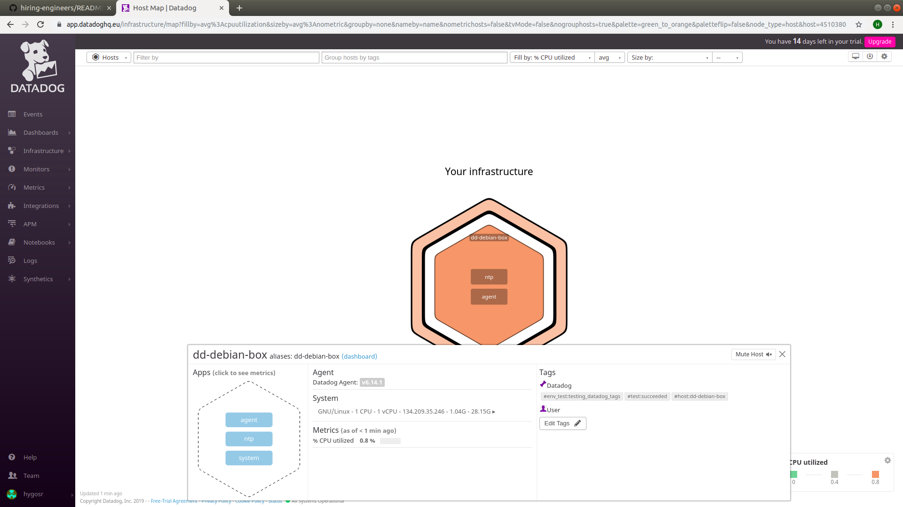

# Prerequisites - Setup the environment

My approach was to spin up a Debian10 Linux Server running on a Public Cloud Provider

The DataDog Agent installed with the following command:

```
$ DD_API_KEY=<MY_API_KEY> DD_SITE="datadoghq.eu" bash -c "$(curl -L https://raw.githubusercontent.com/DataDog/datadog-agent/master/cmd/agent/install_script.sh)"
```

# Collecting Metrics:

** Add tags in the Agent config file and show us a screenshot of your host and its tags on the Host Map page in Datadog. **

I added the following tags on the /etc/datadog-agent/datadog.yaml file:

```
tags:
   - env_test:testing_datadog_tags
   - test:succeeded
```




