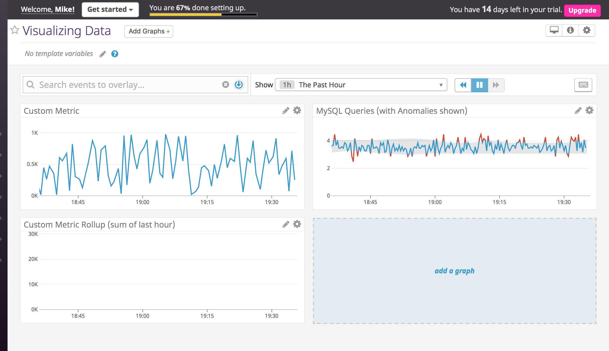
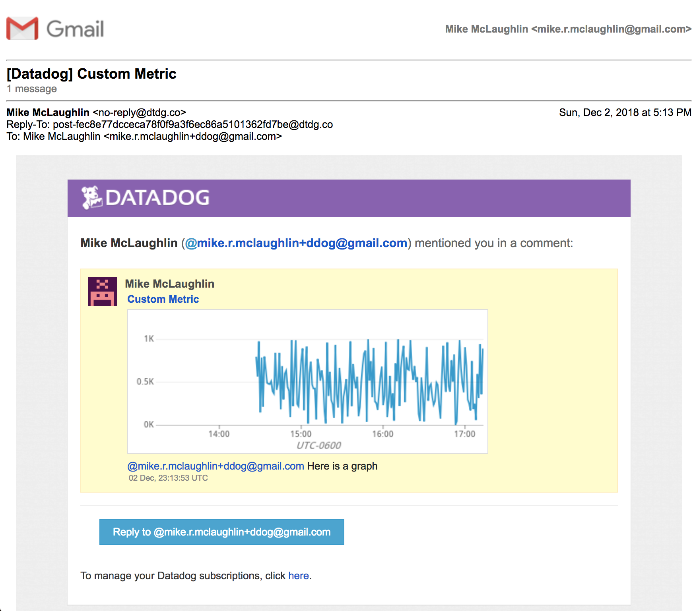
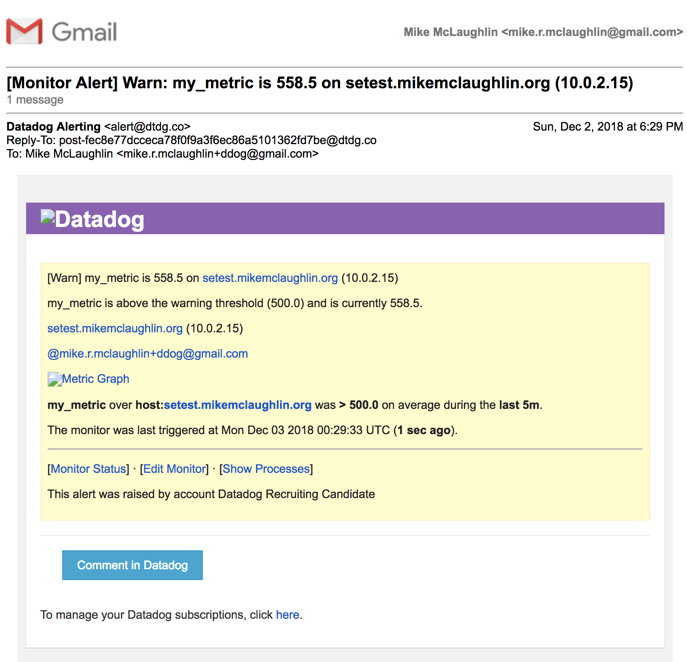
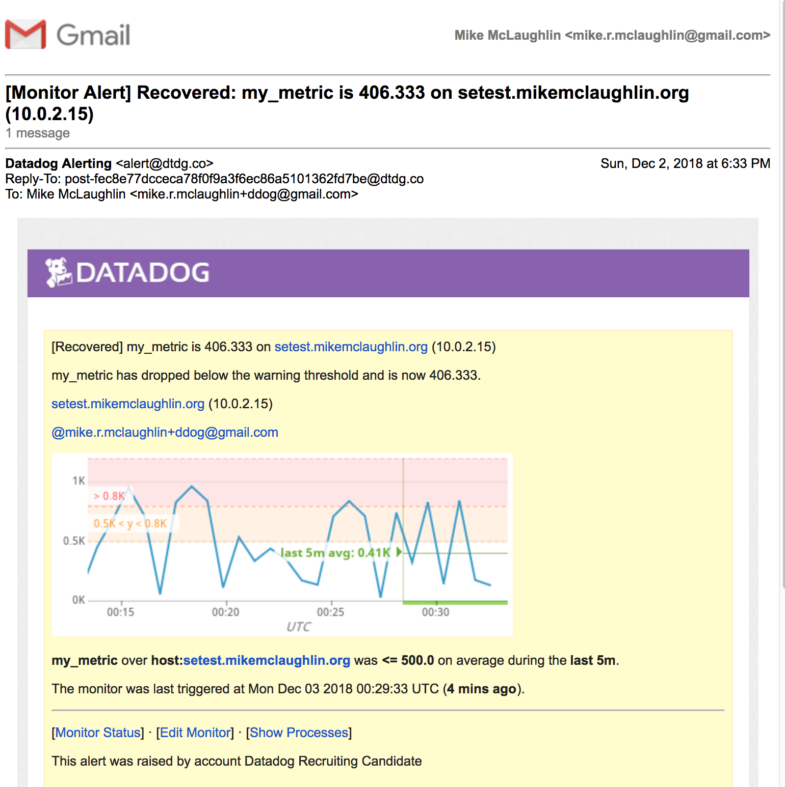
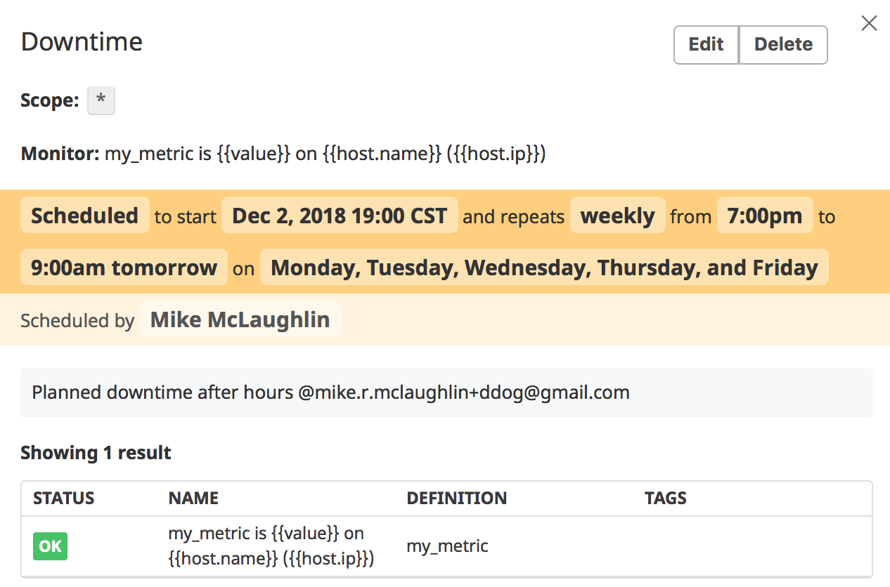
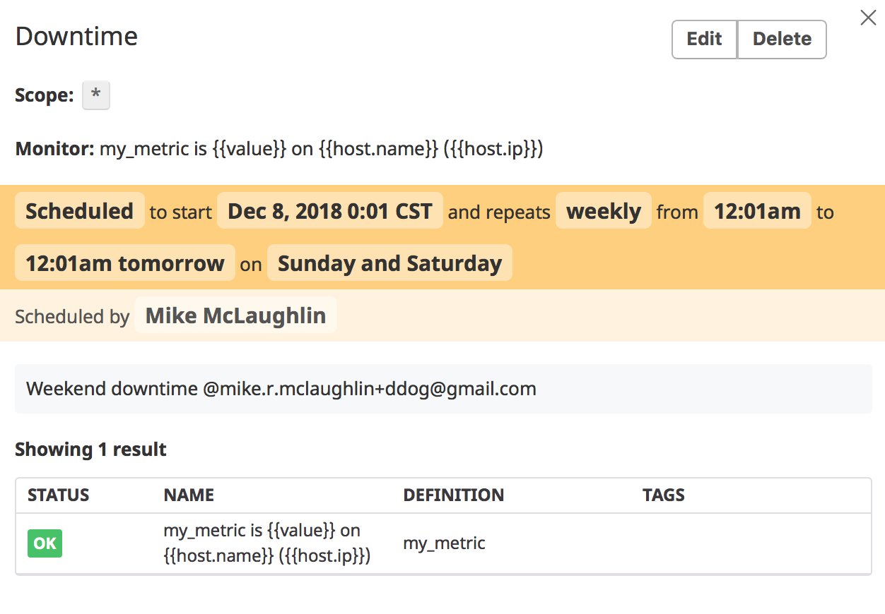
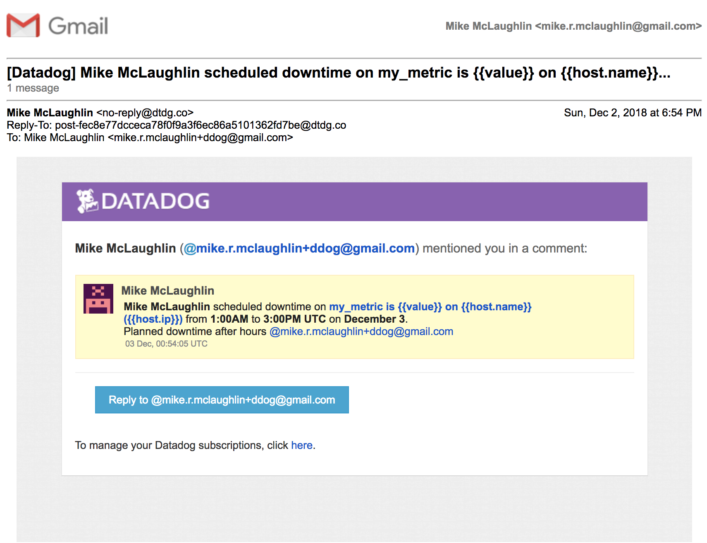
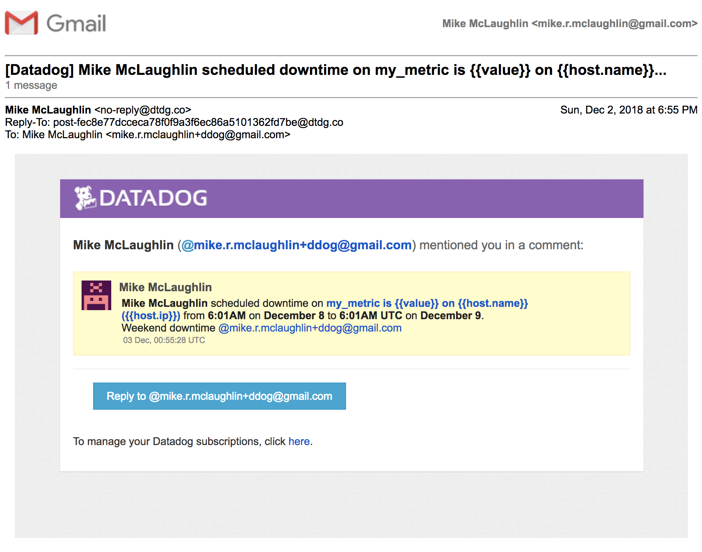
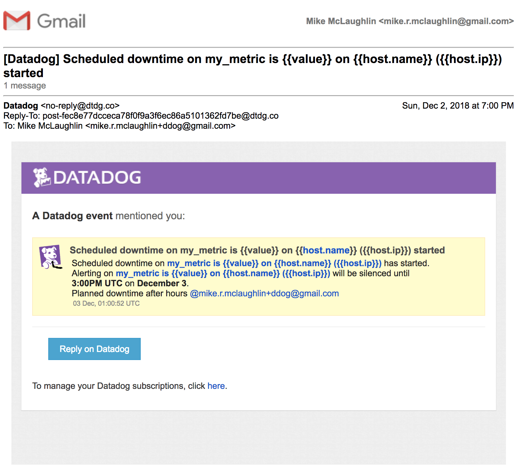

# Answers

- [Collecting Metrics](#collecting-metrics)
    - [datadog.yaml](#datadogyaml)
    - [Install MySQL - conf.d/mysql.d/conf.yaml](#confdmysqldconfyaml)
    - [Custom Agent check - checks.d/random_value.py](#checksdrandom_valuepy)
    - [Bonus Question - Collection Interval in configuration](#bonus-question)
- [Visualizing Data](#visualizing-data)
    - [Create a Timeboard using Datadog API - create_timeboard.py](#create_timeboardpy)
    - [Dashboard](#dashboard)
    - [Bonus Question - What is the anomaly graph displaying](#bonus-question-1)
- [Monitoring Data](#monitoring-data)
    - [Configuration of Monitor](#configuration-of-monitor)
    - [Warning and Recovery Messages](#warning-and-recovery-messages)
        - [Email Warning Message](#email-warning-message)
        - [Email Warning Recovery Message](#email-warning-recovery-message)
    - [Bonus Question](#bonus-question)
        - [Configuration of Downtimes](#configuration-of-downtimes)
        - [Downtime Scheduled Messages](#downtime-scheduled-messages)
- [Collecting APM Data](#collecting-apm-data)
    - [Flask app](#flask-app)
- [Final Question](#final-question)
    - [Is there anything creative you would use Datadog for?](#is-there-anything-creative-you-would-use-datadog-for)


## Collecting Metrics

> * Add tags in the Agent config file and show us a screenshot of your host and its tags on the Host Map page in Datadog.</li>
> * Install a database on your machine (MongoDB, MySQL, or PostgreSQL) and then install the respective Datadog integration for that database.
> * Create a custom Agent check that submits a metric named my_metric with a random value between 0 and 1000.
> * Change your check's collection interval so that it only submits the metric once every 45 seconds.
> * **Bonus Question** Can you change the collection interval without modifying the Python check file you created?

### datadog.yaml

``` yaml
api_key: <<api key here>>
hostname: setest.mikemclaughlin.org
tags:
   - setest
   - env:test
   - role:recruitment-test
```

### conf.d/mysql.d/conf.yaml
``` yaml
init_config:

instances:
  - server: localhost
    user: datadog
    pass: datadog
    tags:                  # Optional
       - database
       - test
    options:               # Optional
       replication: false
       galera_cluster: false
       extra_status_metrics: true
       extra_innodb_metrics: true
       extra_performance_metrics: true
       schema_size_metrics: true
       disable_innodb_metrics: false

## Log section (Available for Agent >=6.0)
logs:
    - type: file
      path: /var/log/mysql/error.log
      source: mysql
      sourcecategory: database
      service: myapplication
```
*Configuration file showing mysql plugin configured after installing `mysql-server` package.*

### checks.d/random_value.py
``` python
"""
AgentCheck generates a random value between 0 and 1000 for SE test.
Author:
  Mike McLaughlin
"""
import random # for generating a random number

# the following try/except block will make the custom check compatible with any Agent version
try:
    # first, try to import the base class from old versions of the Agent...
    from checks import AgentCheck
except ImportError:
    # ...if the above failed, the check is running in Agent version 6 or later
    from datadog_checks.checks import AgentCheck

__version__ = "1.0.0"

class RandomValueCheck(AgentCheck):
    """
    Datadog AgentCheck object for SE test.  This agent check submits a new metric
    named my_metric with a random value between 0 and 1000.
    """
    def check(self, instance):
        """
        check() submits a random value between 0 and 1000
        """
        self.gauge('my_metric', random.randint(0, 1001))
```
*Agent check script written to generate a random value between 0 and 1000 and send to Datadog as metric `my_metric`*

### conf.d/random_value.yaml

``` yaml
init_config:

instances:
    - min_collection_interval: 45
```
*Configuration file for the above custom check*

### Bonus Question

See `conf.d/random_value.yaml`

## Visualizing Data

> Utilize the Datadog API to create a Timeboard that contains:
> 
> * Your custom metric scoped over your host.
> * Any metric from the Integration on your Database with the anomaly function applied.
> * Your custom metric with the rollup function applied to sum up all the points for the past hour into one bucket
> 
> Please be sure, when submitting your hiring challenge, to include the script that you've used to create this Timeboard.
> 
> Once this is created, access the Dashboard from your Dashboard List in the UI:
> 
> * Set the Timeboard's timeframe to the past 5 minutes
> * Take a snapshot of this graph and use the @ notation to send it to yourself.
> * **Bonus Question**: What is the Anomaly graph displaying?
> 

### create_timeboard.py

``` python
"""
This script is part of the SE test for Datadog.  It creates a dashboard.
"""

from datadog import api, initialize

DDOG_API_KEY = '<<api key here>>'
DDOG_APP_KEY = '<<app key here>>'

def main():
    """
    Main interface to this function
    """

    initialize(DDOG_API_KEY, DDOG_APP_KEY)
    graphs = [
        {
            "definition": {
                "events": [],
                "requests": [
                    {"q": "my_metric{host:setest.mikemclaughlin.org}"}
                ],
                "viz": "timeseries"
            },
            "title": "Custom Metric"
        },
        {
            "definition": {
                "events": [],
                "requests": [
                    {"q": "anomalies(avg:mysql.performance.queries{*}, 'basic', 2)"}
                ],
                "viz": "timeseries"
            },
            "title": "MySQL Queries (with Anomalies shown)"
        },
        {
            "definition": {
                "events": [],
                "requests": [
                    {"q": "avg:my_metric{*}.rollup(sum, 3600)"}
                ],
                "viz": "timeseries"
            },
            "title": "Custom Metric Rollup (sum of last hour)"
        }
    ]
    api.Timeboard.create(title='Visualizing Data',
                         description='Question 2 Timeboard',
                         graphs=graphs,
                         template_variables=[],
                         read_only=False)

if __name__ == "__main__":
    main()

```
*This script creates the Timeboard showing 3 graphs (see below)*

[Timeboard generated](https://app.datadoghq.com/dash/1007361/visualizing-data?live=true&page=0&is_auto=false&from_ts=1543797236414&to_ts=1543800836414&tile_size=m):

*Dashboard showing 3 graphs: 1. Custom metric scoped to host, 2. Mysql queries metric with anomalies() function, 3. Custom metric with rollup() function applied*

### Snapshot of graph

I took a snapshot of the custom graph.  Email I received is here:


*Screen capture of email showing the snapshot sent*

### Bonus Question

It overlays a band showing expected values based on past data[1](https://docs.datadoghq.com/graphing/functions/algorithms/#anomalies).

## Monitoring Data

> Create a new Metric Monitor that watches the average of your custom metric (my_metric) and will alert if it’s above the following values over the past 5 minutes:
> 
> * Warning threshold of 500
> * Alerting threshold of 800
> * And also ensure that it will notify you if there is No Data for this query over the past 10m.
> 
> Please configure the monitor’s message so that it will:
> 
> * Send you an email whenever the monitor triggers.
> * Create different messages based on whether the monitor is in an Alert, Warning, or No Data state.
> * Include the metric value that caused the monitor to trigger and host ip when the Monitor triggers an Alert state.
> * When this monitor sends you an email notification, take a screenshot of the email that it sends you.
> 
> * **Bonus Question**: Since this monitor is going to alert pretty often, you don’t want to be alerted when you are out of the office. Set up two scheduled downtimes for this monitor:
> 
>   * One that silences it from 7pm to 9am daily on M-F,
>   * And one that silences it all day on Sat-Sun.
>   * Make sure that your email is notified when you schedule the downtime and take a screenshot of that notification.

### Configuration of Monitor

")
")
*Configuration of monitor*

### Warning and Recovery Messages

#### Email Warning Message


#### Email Warning Recovery Message


### Bonus Question

#### Configuration of Downtimes



*Configuration of downtimes*

#### Downtime Scheduled Messages


*Downtime scheduled email message for weekday M-F 7PM-9AM downtime*

*Downtime scheduled email message for weekend downtime*


*Email message showing downtime is starting*

## Collecting APM Data

> Given the Flask app instrument this using Datadog’s APM solution
> * **Bonus Question**: What is the difference between a Service and a Resource?

### Flask app

Run with:

``` shell
> ddtrace-run python app.py
```

### Dashboard

This is a dashboard with both infrastructure and APM metrics for the vagrant host.

[Link](https://app.datadoghq.com/dash/1007404/setestmikemclaughlinorg?live=true&page=0&is_auto=false&from_ts=1543796751610&to_ts=1543800351610&tile_size=m)
")
")
")
*Dashboard showing both infrastructure and APM metrics*

### Bonus Question

[Service](https://docs.datadoghq.com/tracing/visualization/#services) is a collection of processes that do the same job and a [resource](https://docs.datadoghq.com/tracing/visualization/#resources) is an action of a service.


## Final Question

### Is there anything creative you would use Datadog for?

I have an electronic door lock with several codes (pet sitter, house cleaning, etc.).  I'd like to know which codes are used and when.  The data is available from the lock as events so I would need a server that accepts the events and passes them on to Datadog.  We could send an alert when each of the codes is used to unlock and lock the door (sadly this is not a feature of the door lock at this time).
