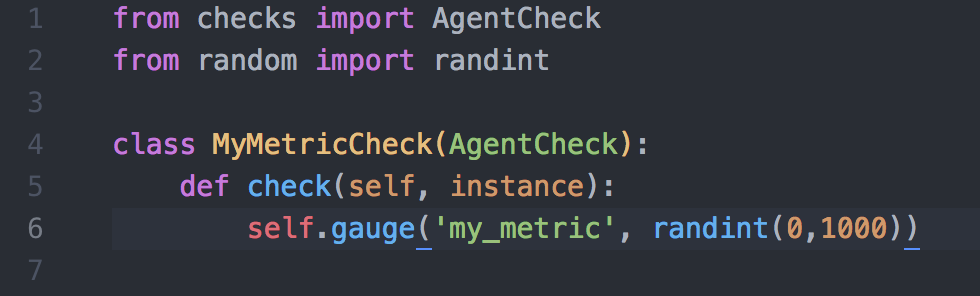

# Eric Kollegger Solutions Engineer Exercise

## Collecting Metrics

* Added unique tags and aliased my host name by opening the `datadog.yaml` config file located in `/opt/datadog-agent/etc/`:


* Then checked to confirm the changes had taken effect in the Host Map:


* Due to being previously installed on my machine and my familiarity with it, I decided on PostgreSQL as my database of choice. I followed the configuration steps found [here](https://app.datadoghq.com/account/settings#integrations/postgres)

I edited the `postgres.yaml` file found in `/opt/datadog-agent/etc/conf.d`:


Restarted the agent and ran `datadog-agent status` in terminal to confirm my integration was successful by finding this:


And on the Dashboard:


* Created custom check file `checkvalue.py` and it's corresponding config file `checkvalue.yaml` in `/opt/datadog-agent/etc/checks.d` and `/opt/datadog-agent/etc/conf.d`, respectively:



**Bonus Question:** Can you change the collection interval without modifying the Python check file you created?

**Answer:** Yes, the collection interval for a check can be changed in it's accompanying config file.

## Visualizing Data

* I followed this [guide](https://help.datadoghq.com/hc/en-us/articles/115002182863-Using-Postman-With-Datadog-APIs) to setup a DataDog environment in Postman. Then submitted the three requested graphs for my timeboard with the following:
```{
      "graphs" : [{
          "title": "Metric average over durandal.minimalghost",
          "definition": {
              "events": [],
              "requests": [
                  {"q": "avg:my_metric{host:durandal.minimalghost}"}
              ]
          },
          "viz": "timeseries"
      },
      {
          "title": "Postgres transactions committed",
          "definition": {
              "events": [],
              "requests": [
                  {"q": "anomalies(avg:postgresql.commits{*}, 'basic', 2)"}
              ]
          },
          "viz": "timeseries"
      },
      {
          "title": "One hour rollup visualization",
          "definition": {
              "events": [],
              "requests": [
                  {"q": "avg:my_metric{*}.rollup(sum, 3600)"}
              ]
          },
          "viz": "timeseries"
      }],
      "title" : "Eric's Custom Timeboard",
      "description" : "Solutions Engineer Task",
      "template_variables": [{
          "name": "host1",
          "prefix": "host",
          "default": "host:my-host"
      }],
      "read_only": "True"
    }
```

* I found my newly created timeboard by navigating to the dashboard list. This can be seen below scoped to 4 hours in order to see some manner of graphing in action for the rollup frame, which only has a single point of data when set to the default scope:


I then set it to the requested 5 minute scope by using the keyboard shortcut `alt + ]`:


* Next I took a snapshot of my metric average graph by clicking the camera icon that appears when you mouse over any individual frame and sent it to myself using the @ symbol:


This results in the targeted user receiving an email notification with the snapshot:


**Bonus Question:** What is the Anomaly graph displaying?

**Answer:** The grey area on the graph represents DataDog's assessment of the normalized thresholds for that metric based on previous data. Anything falling above or below this range is considered anomalous or abnormal behavior and is flagged in red.

## Monitoring Data

* To create a new monitor go to Monitors > New Monitor on the dashboard.

1. Choose the detection method: Leave the default `Threshold Alert`.
2. Define the metric: Select `my_metric` from the metric dropdown list and set from to `host:durandal.minimalghost`, the rest of the options can be left to default.
3. Set alert conditions: Set `Alert threshold` to 800 and `Warning threshold` to 500. Select `Notify` if data is missing from the dropdown. Everything else can be left as default.

The final product should look something like this:


My custom alert, warning and no data message snippet:
```{{#is_alert}}
my_metric at host ip {{host.ip}} has surpassed {{threshold}} and is currently at {{value}}!
{{/is_alert}}

{{#is_warning}}
my_metric has surpassed {{warn_threshold}} and is currently at {{value}}!
{{/is_warning}}

{{#is_no_data}}
my_metric has not received data for the past 10 minutes!
{{/is_no_data}}

@eric.kollegger@gmail.com
```

When the warning threshold condition was met I received this email:


**Bonus Question:** Since this monitor is going to alert pretty often, you don’t want to be alerted when you are out of the office. Set up two scheduled downtimes for this monitor:
  * One that silences it from 7pm to 9am daily on M-F
  * And one that silences it all day on Sat-Sun
  * Make sure that your email is notified when you schedule the downtime and take a screenshot of that notification

By navigating to Monitors > Manage Downtime and clicking the `Schedule Downtime` button, I was able to configure these two downtime requests.

* Weeknights downtime:


* Weekend downtime, note the beginning time is highlighted red and the summary time is displaying incorrectly because this was scheduled around 12:40PM on a Saturday:


* Email notification for weeknight downtime to be added Monday night:
