# Sales Engineer Test
Hello you lovely folk at Datadog. Below is a collection of my responses for the the technical exercise. 
I've kept the headings and most of the text for the original readme file so as to easily place the screenshots and code snippets. 

## Prerequisites - Setup the environment
Nothing really to do here. And further, various of the following screenshots will imply the environment. 
For completeness, however, I'll note that an Ubuntu 18.4 image was spun up on _vagrant_, inside a VirtualBox VM.

## Collecting Metrics
* Add tags in the Agent config file and show us a screenshot of your host and its tags on the Host Map page in Datadog.
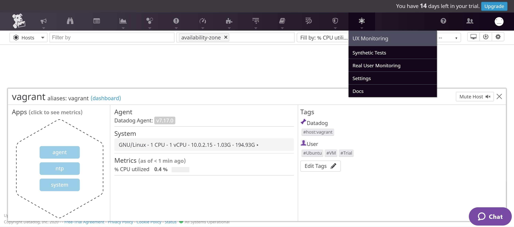

* Install a database on your machine (MongoDB, MySQL, or PostgreSQL) and then install the respective Datadog integration for that database.
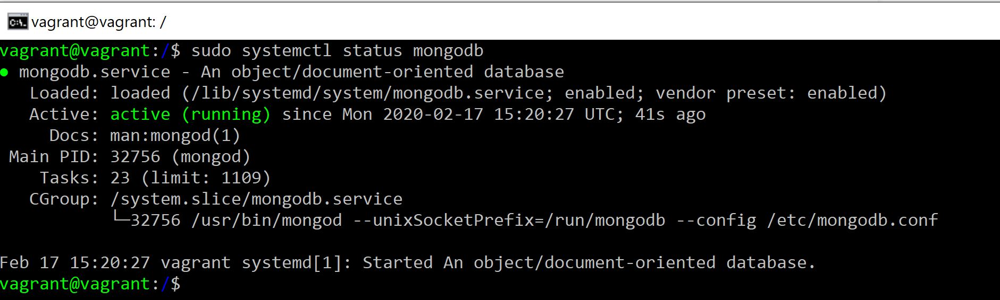

* Create a custom Agent check that submits a metric named my_metric with a random value between 0 and 1000.
Here is the relevant code for this. I did not include the YAML as there is little there of note. 
``` python
import random

# the following try/except block will make the custom check compatible with any Agent version
try:
    # first, try to import the base class from new versions of the Agent...
    from datadog_checks.base import AgentCheck
except ImportError:
    # ...if the above failed, the check is running in Agent version < 6.6.0
    from checks import AgentCheck

# content of the special variable __version__ will be shown in the Agent status page
__version__ = "0.0.1"

class TestChecks(AgentCheck):
    def check(self, instance):
        self.gauge('my_metric ',random.randint(1, 1000))

```

* Change your check's collection interval so that it only submits the metric once every 45 seconds.
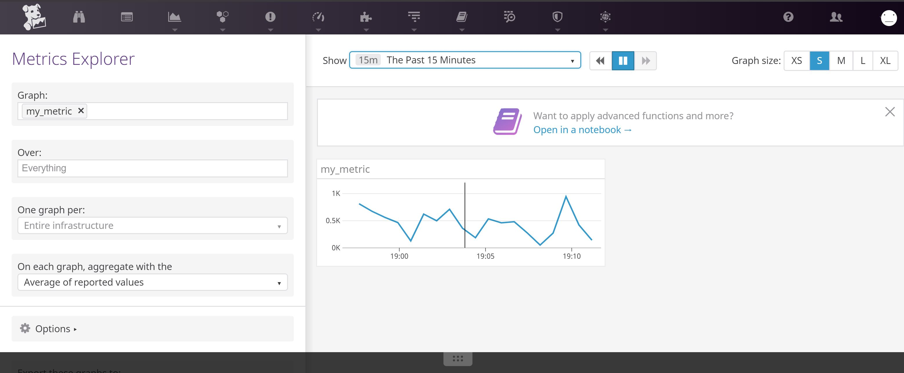

* **Bonus Question** Can you change the collection interval without modifying the Python check file you created?
yes, I'm sure you can. 

## Visualizing Data
Utilize the Datadog API to create a Timeboard that contains:
* Your custom metric scoped over your host.
* Any metric from the Integration on your Database with the anomaly function applied.
* Your custom metric with the rollup function applied to sum up all the points for the past hour into one bucket

Please be sure, when submitting your hiring challenge, to include the script that you've used to create this Timeboard.
**Here is the call for creating the metrics timeboard, via cURL calls:**
```curl
curl -X POST \
  https://api.datadoghq.eu/api/v1/dashboard \
  -H 'Accept: */*' \
  -H 'Accept-Encoding: gzip, deflate' \
  -H 'Cache-Control: no-cache' \
  -H 'Connection: keep-alive' \
  -H 'Content-Length: 873' \
  -H 'Content-Type: application/json' \
  -H 'Cookie: DD-PSHARD=0' \
  -H 'DD-API-KEY: 437d9105259c57d96777863ec874a66a' \
  -H 'DD-APPLICATION-KEY: e05e811f455fec453783c8f6e47fe97d914ce7bd' \
  -H 'Host: api.datadoghq.eu' \
  -H 'Postman-Token: 96d26c4b-106e-4973-a678-a36abc49a6fb,a5d52257-ff3c-4002-b8c9-76a005d028fe' \
  -H 'User-Agent: PostmanRuntime/7.20.1' \
  -H 'cache-control: no-cache' \
  -d '{
	"title": "My Metric Visualizer Shell",
	"widgets": [
		{
			"definition": {
				"type": "timeseries",
				"title": "The Metric Visualizer",
				"requests": [
					{
						"q": "sum:my_metric{host:vagrant}.rollup(sum, 60)"
					}
				]
			}
		},
		{
			"definition": {
				"type": "timeseries",
				"requests": [
					{
						"q": "avg:system.mem.free{host:vagrant}"
					}
				],
				"title": "Vagrant Memory Free"
			}
		}
	],
	"layout_type": "ordered",
	"description": "The required API-Created Timeline for the test",
	"is_read_only": true,
	"notify_list": [
		"datadog@barbon.ca"
	]
}'
```

Here is the cURL call for creating the anomaly monitor to watch the custom metric.	

```curl
  curl -X POST \
  https://api.datadoghq.eu/api/v1/monitor \
  -H 'Accept: */*' \
  -H 'Accept-Encoding: gzip, deflate' \
  -H 'Cache-Control: no-cache' \
  -H 'Connection: keep-alive' \
  -H 'Content-Length: 312' \
  -H 'Content-Type: application/json' \
  -H 'Cookie: DD-PSHARD=0' \
  -H 'DD-API-KEY: 437d9105259c57d96777863ec874a66a' \
  -H 'DD-APPLICATION-KEY: e05e811f455fec453783c8f6e47fe97d914ce7bd' \
  -H 'Host: api.datadoghq.eu' \
  -H 'Postman-Token: 3d2b8904-74fc-4af4-9ab0-28090fcf9512,fbd51cec-4103-4b40-a83e-22da5f45d1b8' \
  -H 'User-Agent: PostmanRuntime/7.20.1' \
  -H 'cache-control: no-cache' \
  -d '{
    "message": "Consider changing the randomness of this value if arbitrarily too low.",
    "name": "Low warning for my_metric",
    "options": {
        "no_data_timeframe": 20,
        "notify_no_data": false
    },
    "query": "avg(last_5m):sum:my_metric{host:vagrant} < 500",
    "type": "metric alert"
}'
```

********************

Once this is created, access the Dashboard from your Dashboard List in the UI:
* Set the Timeboard's timeframe to the past 5 minutes
* Take a snapshot of this graph and use the @ notation to send it to yourself.
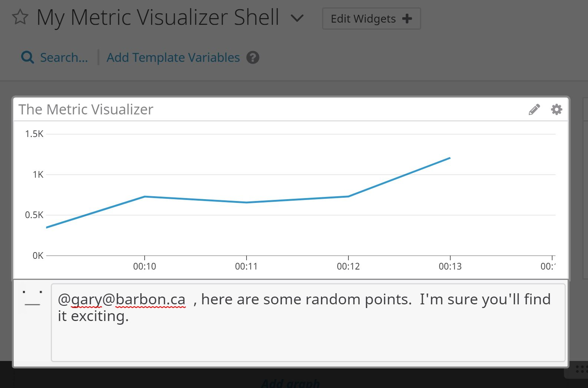
![metric-validation]:(./Metrics-Validation.JPG)

**Bonus Question:** What is the Anomaly graph displaying?
* What this Alert checks is to see if the sum of the 'my_metric' value is less than 500, when checked each five minutes. 
(and if it is, that we should alert about it). However, given it is based upon a pseudo-random number, this should not happen. If it did, we'd definitely want to check our number generator).

********************
## Monitoring Data
Since you’ve already caught your test metric going above 800 once, you don’t want to have to continually watch this dashboard to be alerted when it goes above 800 again. So let’s make life easier by creating a monitor.

Create a new Metric Monitor that watches the average of your custom metric (my_metric) and will alert if it’s above the following values over the past 5 minutes:
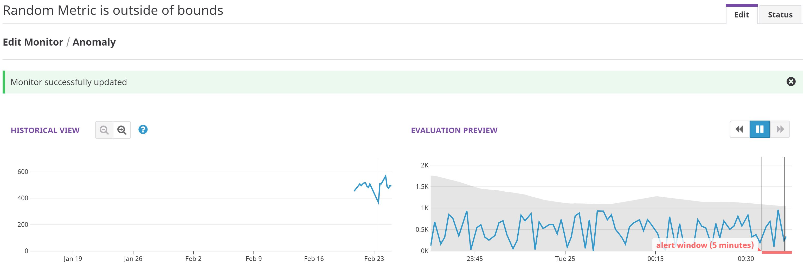

And also ensure that it will notify you if there is No Data for this query over the past 10m.
Please configure the monitor’s message so that it will:
* Send you an email whenever the monitor triggers.
* Create different messages based on whether the monitor is in an Alert, Warning, or No Data state.
* Include the metric value that caused the monitor to trigger and host ip when the Monitor triggers an Alert state.

When this monitor sends you an email notification, take a screenshot of the email that it sends you.

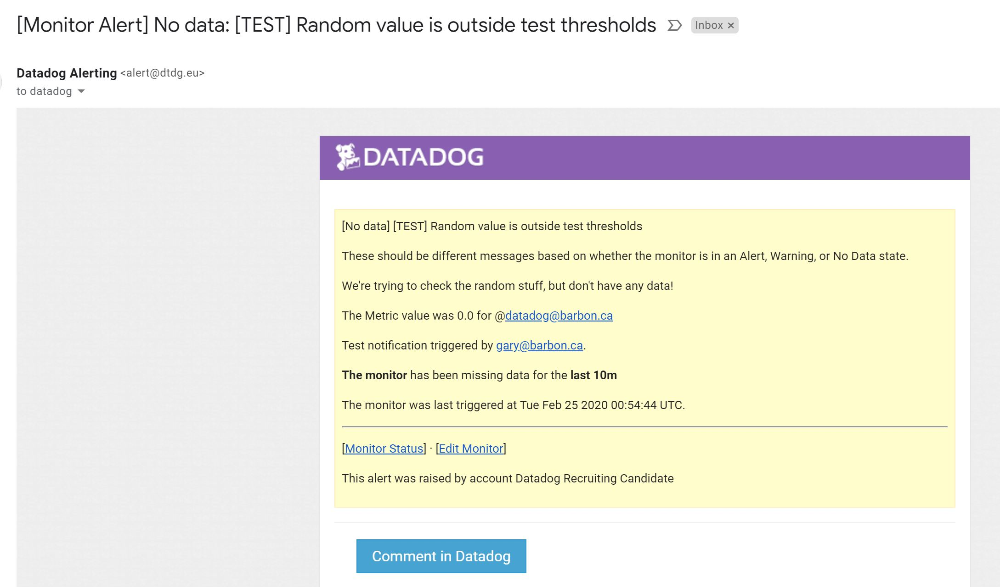
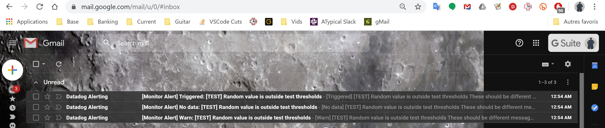
![monitor warning]./Monitoring-Email-warning.JPG

**Bonus Question:** Since this monitor is going to alert pretty often, you don’t want to be alerted when you are out of the office. Set up two scheduled downtimes for this monitor:
* One that silences it from 7pm to 9am daily on M-F,
* And one that silences it all day on Sat-Sun.
* Make sure that your email is notified when you schedule the downtime and take a screenshot of that notification.
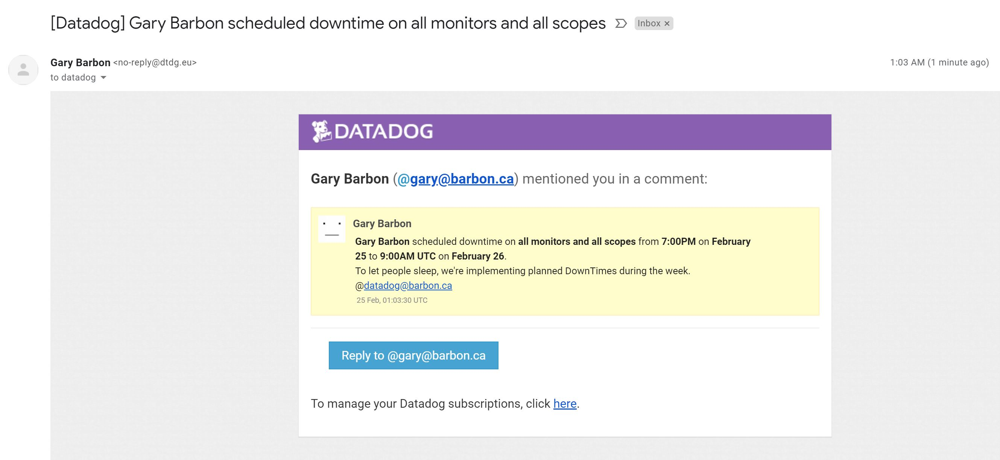
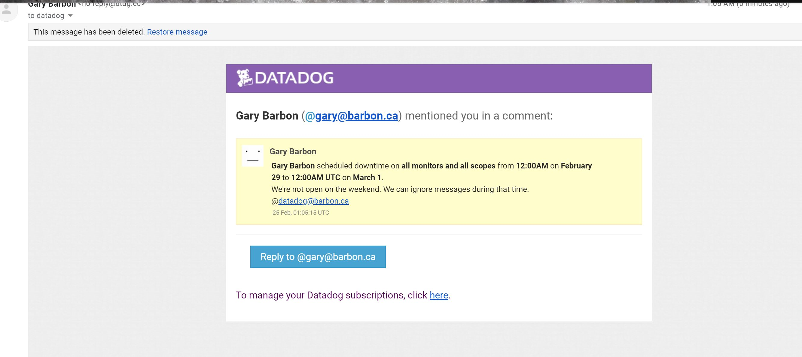


## APM Data
Given the following Flask app (or any Python/Ruby/Go app of your choice) instrument this using Datadog’s APM solution:
``` python
FLASK CODE
```

* Bonus Question: What is the difference between a Service and a Resource?

Provide a link and a screenshot of a Dashboard with both APM and Infrastructure Metrics.
* Fully instrumented app for this submission can be found at https://github.com/Barbog/hiring-engineers/blob/master/apm_flask.py
* the python flask file used can be found at https://github.com/Barbog/hiring-engineers/blob/master/apm_flask.py
APM dashboard 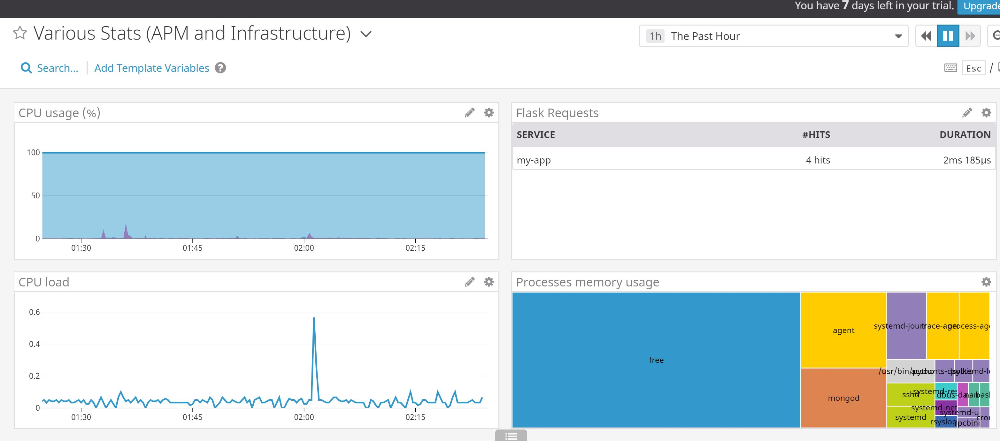

A listing of logged APM endpoints: 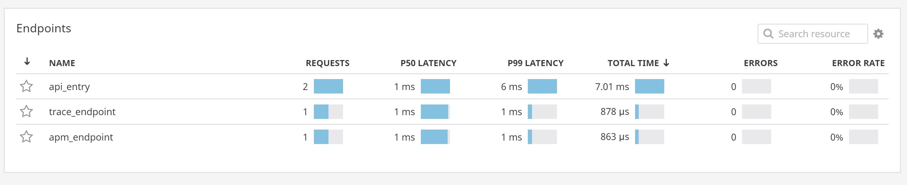

### Final Question:
_Datadog has been used in a lot of creative ways in the past. We’ve written some blog posts about using Datadog to monitor the NYC Subway System, Pokemon Go, and even office restroom availability!_

_Is there anything creative you would use Datadog for?_

* The main area which would most interest me for use with Datadog's capabilities would be in the monitoring of use actions in games, such as individual button presses and heatmaps. 

 
