Collecting Metrics:

Add tags in the Agent config file and show us a screenshot of your host and its tags on the Host Map page in Datadog.
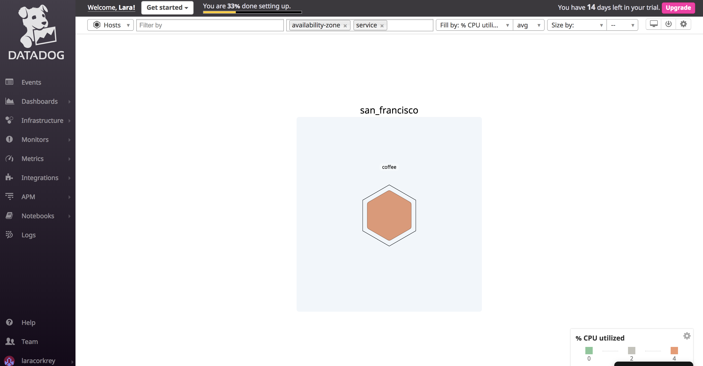

Install a database on your machine (MongoDB, MySQL, or PostgreSQL) and then install the respective Datadog integration for that database.
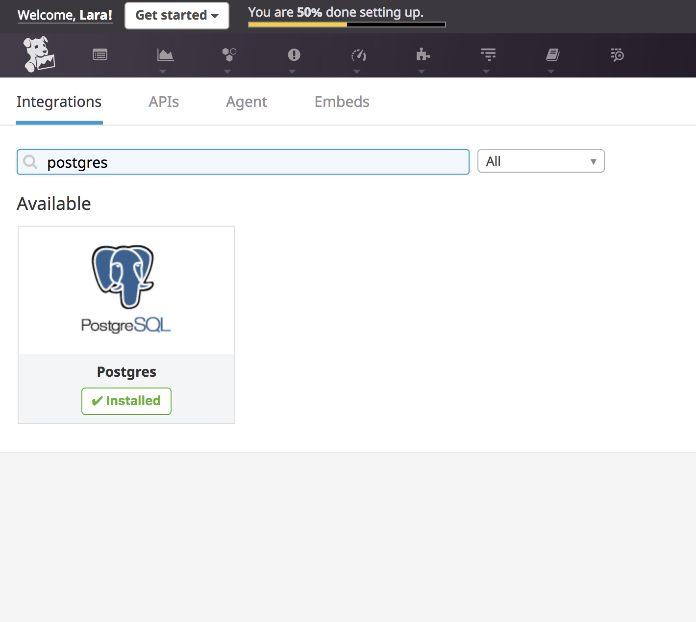
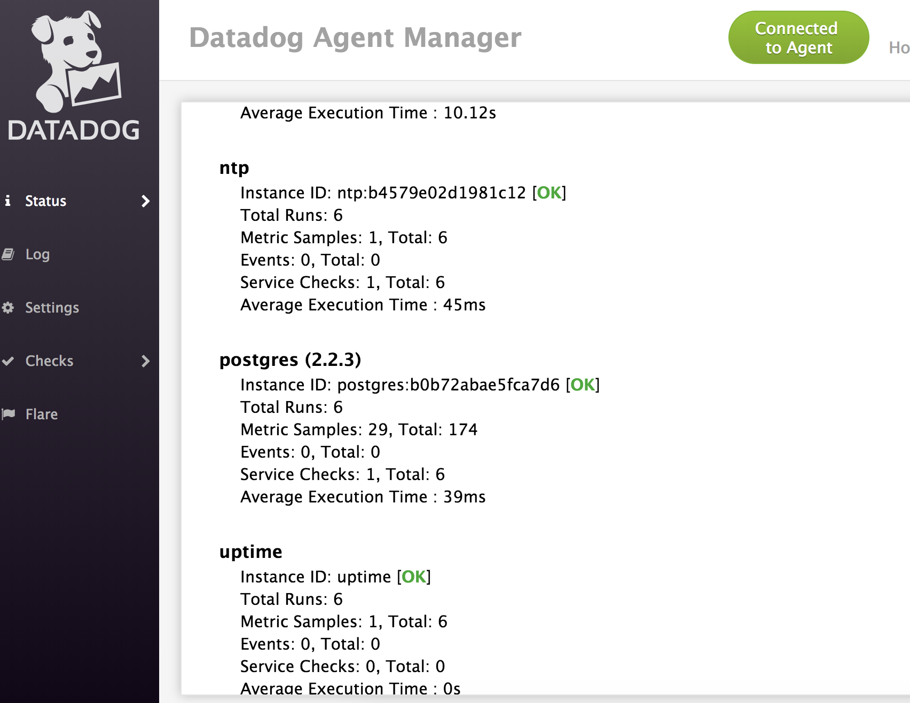
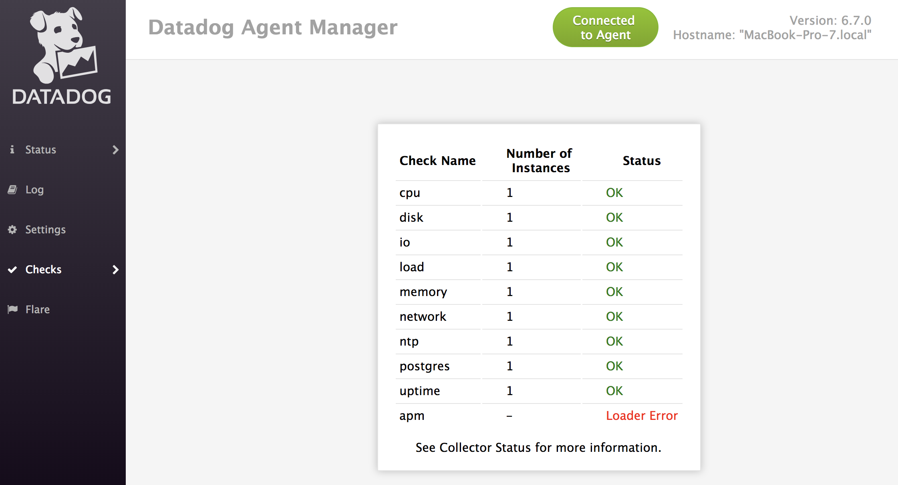

Create a custom Agent check that submits a metric named my_metric with a random value between 0 and 1000.
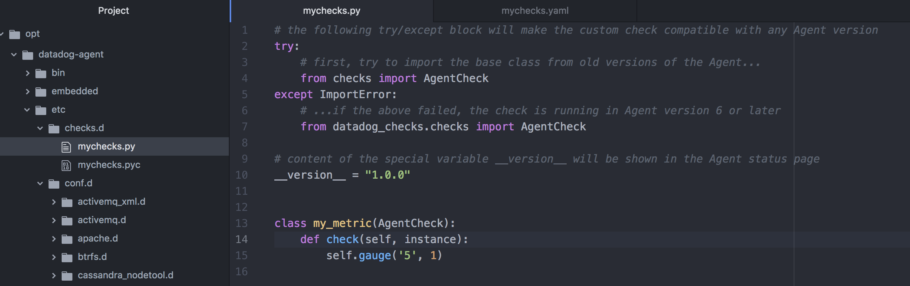
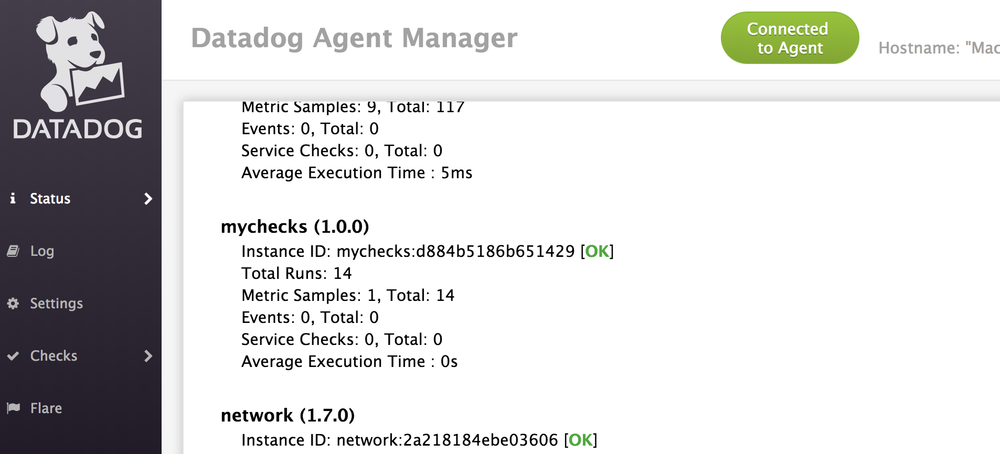
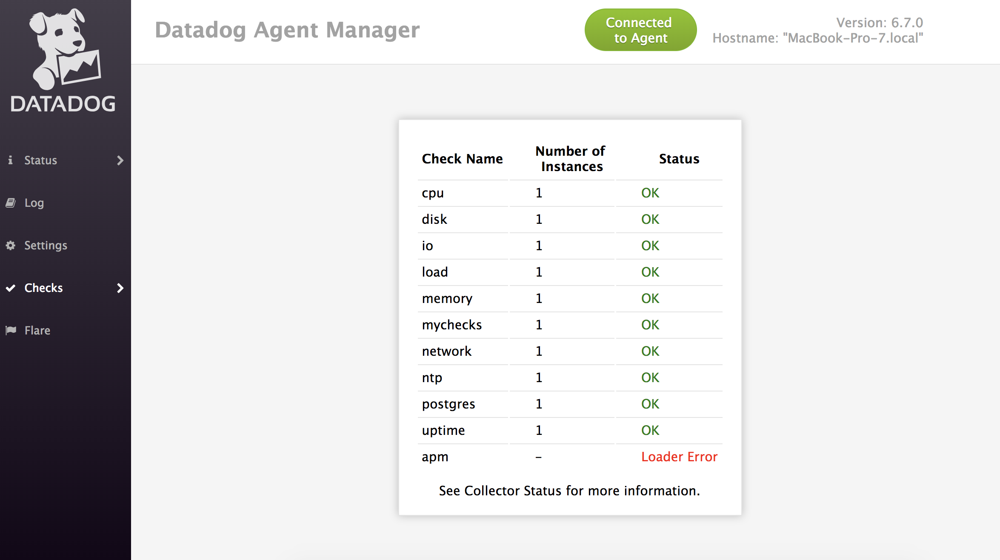

Change your check's collection interval so that it only submits the metric once every 45 seconds.
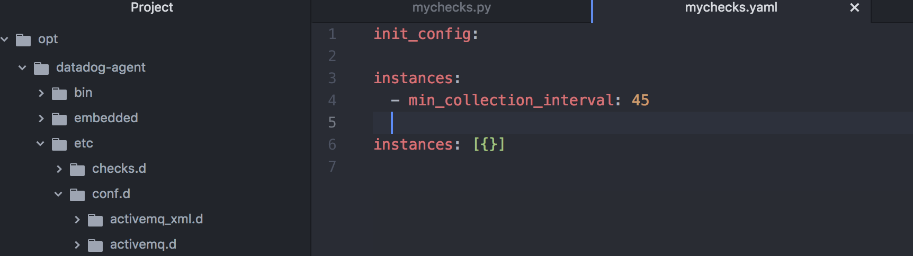

Bonus Question:
Can you change the collection interval without modifying the Python check file you created?

Yes, I updated the yaml file, not the Python file. Please see above.

Visualizing Data:
Utilize the Datadog API to create a Timeboard that contains:

Your custom metric scoped over your host.
Any metric from the Integration on your Database with the anomaly function applied.
Your custom metric with the rollup function applied to sum up all the points for the past hour into one bucket
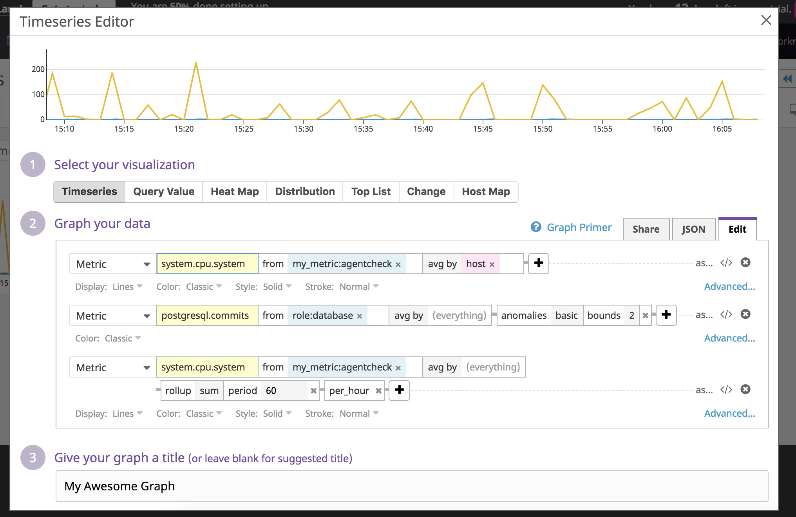

Please be sure, when submitting your hiring challenge, to include the script that you've used to create this Timeboard.
Sorry, I ran out of time to create this properly. :( Happy to go back over it with more time.

Once this is created, access the Dashboard from your Dashboard List in the UI:

Set the Timeboard's timeframe to the past 5 minutes
Take a snapshot of this graph and use the @ notation to send it to yourself.
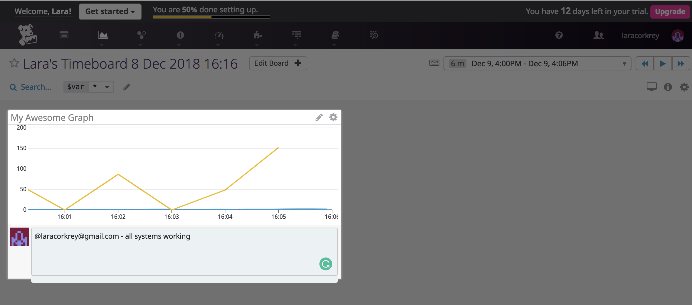
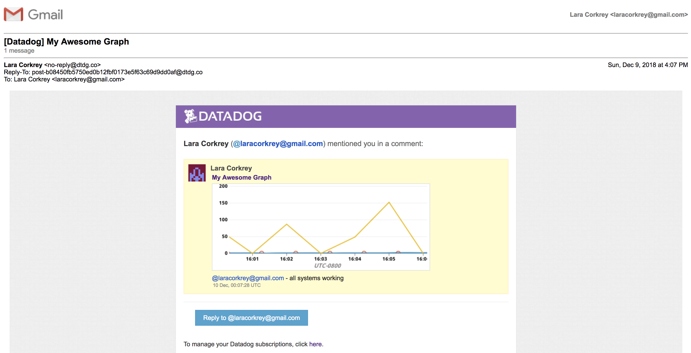

Bonus Question: What is the Anomaly graph displaying?

Anomalies are events that occur outside of a normal/historically expected trend. The anomaly graph displays detections that occur outside of the historically expected trend. When an event doesn't match a prediction, it is an anomaly and will be displayed on the anomaly graph.

Monitoring Data:

Since you’ve already caught your test metric going above 800 once, you don’t want to have to continually watch this dashboard to be alerted when it goes above 800 again. So let’s make life easier by creating a monitor.

Create a new Metric Monitor that watches the average of your custom metric (my_metric) and will alert if it’s above the following values over the past 5 minutes:

Warning threshold of 500
Alerting threshold of 800
And also ensure that it will notify you if there is No Data for this query over the past 10m.
Please configure the monitor’s message so that it will:

Send you an email whenever the monitor triggers.

Create different messages based on whether the monitor is in an Alert, Warning, or No Data state.

Include the metric value that caused the monitor to trigger and host ip when the Monitor triggers an Alert state.

When this monitor sends you an email notification, take a screenshot of the email that it sends you.
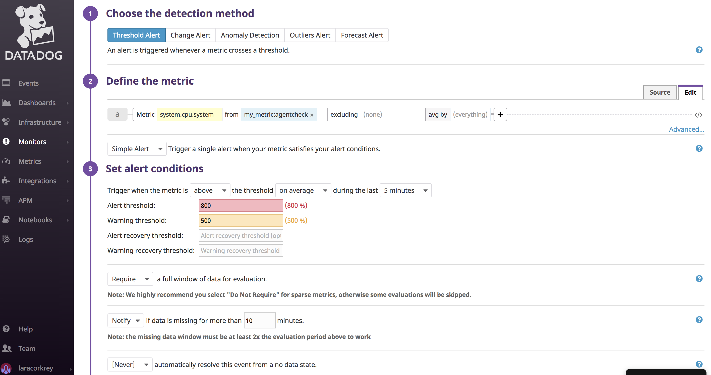
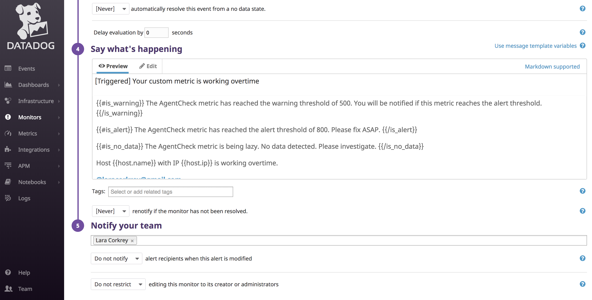

Bonus Question: Since this monitor is going to alert pretty often, you don’t want to be alerted when you are out of the office. Set up two scheduled downtimes for this monitor:

One that silences it from 7pm to 9am daily on M-F,
And one that silences it all day on Sat-Sun.
Make sure that your email is notified when you schedule the downtime and take a screenshot of that notification.
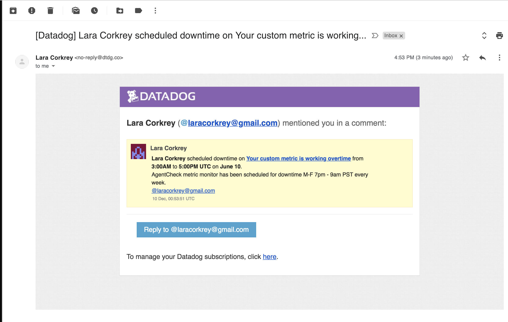
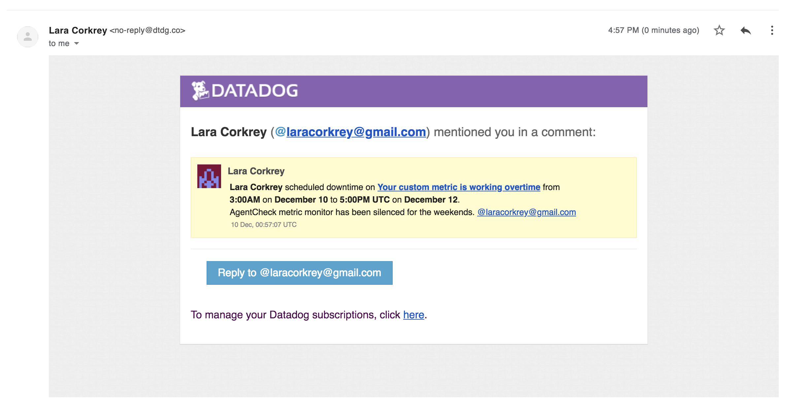

Collecting APM Data:
Given the following Flask app (or any Python/Ruby/Go app of your choice) instrument this using Datadog’s APM solution:

Sorry, but I ran out of time to work on this. :( Happy to complete with more time.

Bonus Question: What is the difference between a Service and a Resource?

Services are a set of processes that work together to provide a feature set. Examples of simple featured sets might be a webapp service or a database service. Services are defined by the user when they create their app using Datadog. Services help to quickly distinguish between different processes run by the app.

Resources are a query to a service. For a web app, examples might be a handler or a canonical URL.

Final Question:

Datadog has been used in a lot of creative ways in the past. We’ve written some blog posts about using Datadog to monitor the NYC Subway System, Pokemon Go, and even office restroom availability!

Is there anything creative you would use Datadog for?

Yes! Food trucks are popular lunch time destinations in the San Francisco Financial District. However, it is the nature of most food trucks to be mobile. This leaves workers of the FiDi uncertain of where to find their favorite food truck on a given day. A Datadog dashboard would be a brilliant solution to monitor a truck's location.

In order to gather the necessary data, truck owner's would need to give permission to have their GPS location tracked and uploaded to Google Maps. The Google Maps API could be utilized to gather this information and parsed into a Datadog dashboard. That dashboard would lead hungry workers to their favorite food trucks on any day they choose. Bon appetit!
