# Prerequisites - Setup the environment

Topology for this exercise is a follows:

`ac_submission/docker-compose.yaml`


```
Docker Host - Ubuntu 18.04 - Google Cloud
       |
       +------ Docker Bridge Network ---
       |
       + Container : Datadog agent
       |           : Port 8126:8216
       |
       + Container : Postgres
       |           : Port 5432:5432
       |
       + Container : Node Application API 
       |           : Port 8080:8080
       |
       +----------------------------------

```
***
# Collecting Metrics:


* Add tags in the Agent config file and show us a screenshot of your host and its tags on the Host Map page in Datadog. *

`     - DD_TAGS="key1:value1 dddockeragent:1 cloud:gcp"`

Tags: cloud:gcp, dddockeragent:1

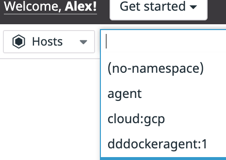 

Tags: key1:value1
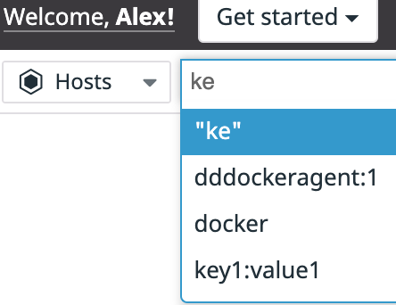

***


* Install a database on your machine (MongoDB, MySQL, or PostgreSQL) and then install the respective Datadog integration for that database.

Integration is taken care of by the `Dockerfile` (which copies the `postgres.yaml` file to the dd-agent container) build file and `docker-compose`.  There is a one time requirement on new builds to grant access to the integration user as follows:

`create user datadog with password '<PASSWORD>';
grant pg_monitor to datadog;`

Since Postgres uses a docker persistent storage via volume mappings, this is not requried later on.

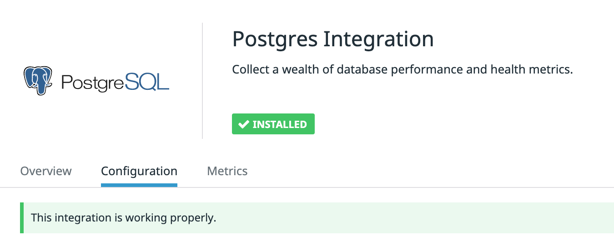
***

* Create a custom Agent check that submits a metric named my_metric with a random value between 0 and 1000.

Source is located at:
`ac_submission/src/custom_check/custom_check.py`

This custom check and the associated file configuration file is already placed in the persistent container storage for the agent container.

Persistent storage to container mapping:
```
     - ./datadog/conf.d:/etc/datadog-agent/conf.d
     - ./datadog/checks.d:/etc/datadog-agent/checks.d
```

***

* Change your check's collection interval so that it only submits the metric once every 45 seconds.

`custom_check.yaml`

```
  - min_collection_interval: 45
  ```

* Bonus Question Can you change the collection interval without modifying the Python check file you created?

Collection interval can be changed in the custom check configuration file (`custom_check.yaml`)

[Writing Custom Checks](https://docs.datadoghq.com/developers/write_agent_check/?tab=agentv6v7)

***

# Visualizing Data:

[Public URL for Timeboard](https://p.datadoghq.com/sb/b5i1azpdjmjlcxsr-bf51d3031ac48140107152e70fd25fa4)

Here is a screenshot of the Timeboard with the following:

* Your custom metric scoped over your host.
* Any metric from the Integration on your Database with the anomaly function applied.
* Your custom metric with the rollup function applied to sum up all the points for the past hour into one bucket


This timeboard was created using `curl`

Script for creating this dashboard  `ac_submission/src/dash-create-api.sh` 

[Reference document for contructing the API call](https://docs.datadoghq.com/api/v1/dashboards/)

The body JSON was built from using the dashboard UI. I unfortunately was not formatting and defining my JSON correctly using the documentation.

Here is a screenshot of the email from the @mention
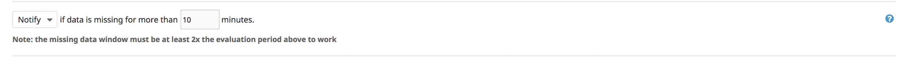

* **Bonus Question:** What is the Anomaly graph displaying?

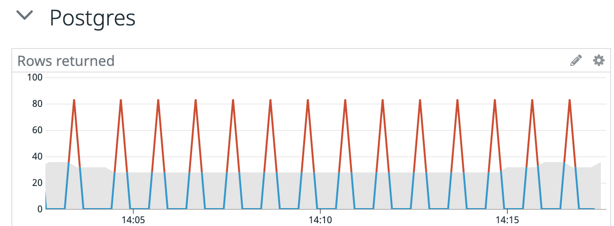

In this case we used a basic anonaly detection against the metric `postgresql.rows_returned`.  The function looks at the data to determine what is an acceptable range in the values collected.  This acceptable range is shown as the gray band.  As the monitor collects data outside of the range, we see this as an `anomaly` and call it out as red peacks in the graph.

Other algorithms can be used depending on your dataset.  
[Anomaly Function](https://docs.datadoghq.com/monitors/monitor_types/anomaly/)  

***

# Monitoring Data

Configure a monitor:
* Warning threshold of 500
* Alerting threshold of 800
* And also ensure that it will notify you if there is No Data for this query over the past 10m


* Please configure the monitor’s message so that it will:

    * Send you an email whenever the monitor triggers.

    * Create different messages based on whether the monitor is in an Alert, Warning, or No Data state.

    * Include the metric value that caused the monitor to trigger and host ip when the Monitor triggers an Alert state.

    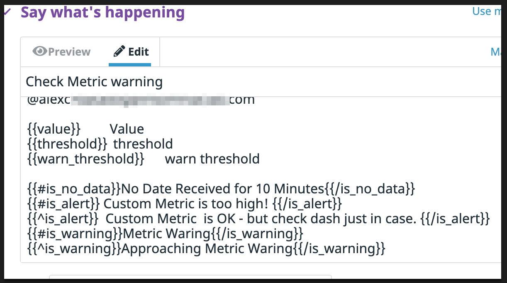

    *  When this monitor sends you an email notification, take a screenshot of the email that it sends you.

    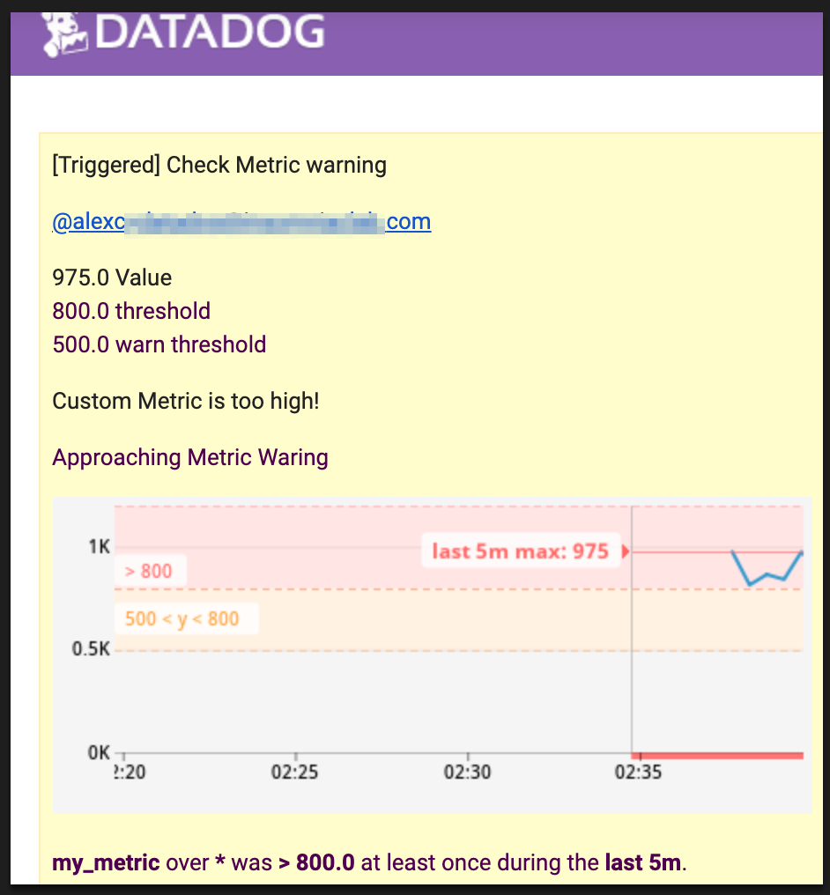


* **Bonus Question:** Since this monitor is going to alert pretty often, you don’t want to be alerted when you are out of the office. Set up two scheduled downtimes for this monitor:

    * One that silences it from 7pm to 9am daily on M-F,
    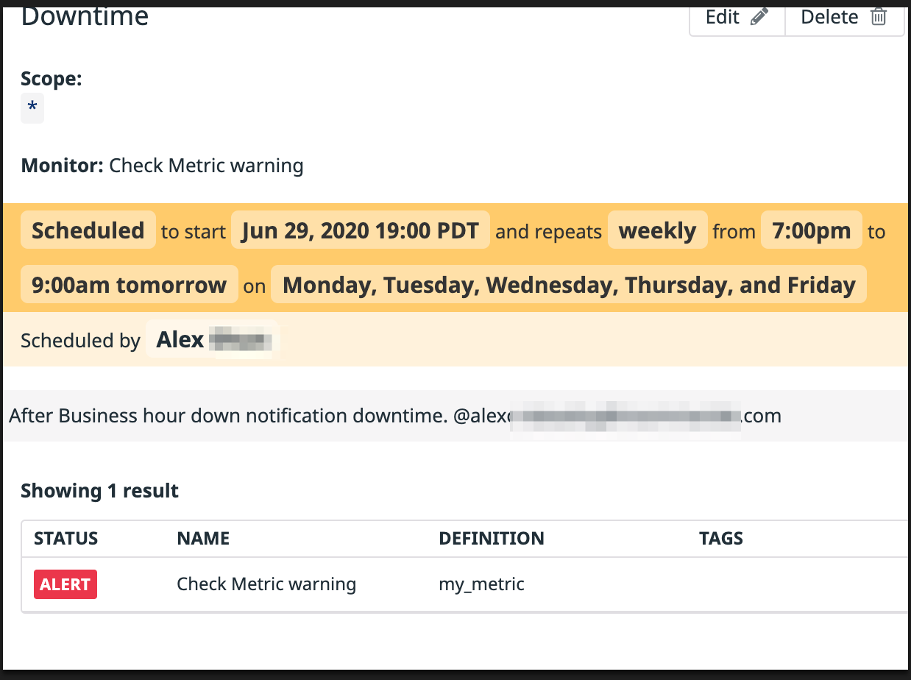

    * And one that silences it all day on Sat-Sun.
    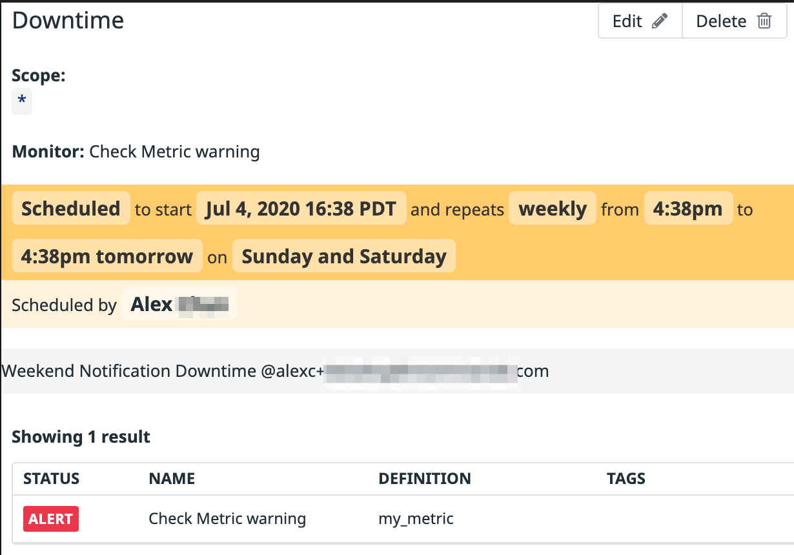

    *  Make sure that your email is notified when you schedule the downtime and take a screenshot of that notification.
    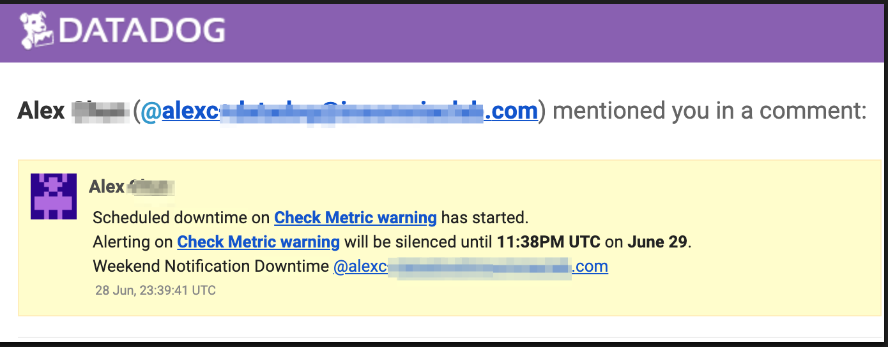


# Collecting APM Data:


`ac_submission/src/dd-api-apm`

Contains the source code for the application used with Datadog APM monitoring. The application is a Node app similar to the sample Python Flask app in this exercise.  I added an endpoint `/users` to simulate an API call that queries the Postgres database.

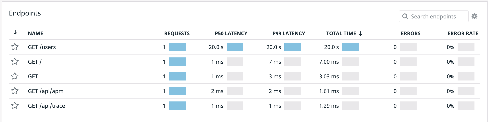

`/users` This endpoint has been instrumented to 

* Memory fill 
* Block the event loop
* Simulate a long running query

When the endpoint is called.

* **Bonus Question:** What is the difference between a Service and a Resource?

A service as it relates this app, is the node app itself. The service groups the endpoint/resources together and offers the end points as resources. 

For example, `/users` returns a list of users and does so by running a database query.


* Provide a link and a screenshot of a Dashboard with both APM and Infrastructure Metrics.

[Public URL for Dashboard with Infrastructure, APM metrics, and Container Status](https://p.datadoghq.com/sb/b5i1azpdjmjlcxsr-a27c19b1ec3afb19b5a6d2af21ec379a)


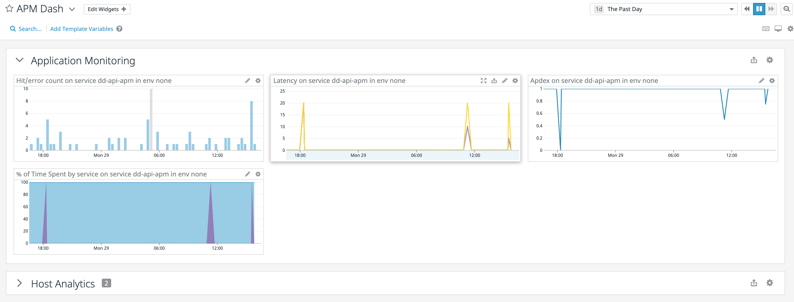
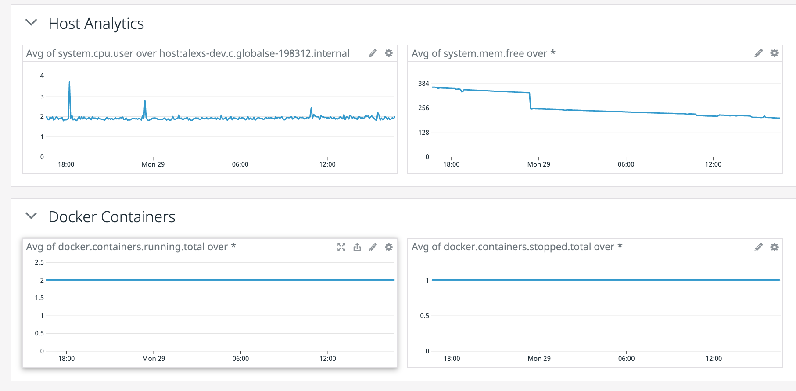

* Please include your fully instrumented app in your submission, as well.

Instrumented app is located in this directory:

`ac_submission/src/dd-api-apm`


***
# Final Question:

My creative use of Datadog would be localized contact tracing.

Data/Metric sources will be from my Home Automation MQTT events.
These events provide events such as:
* Doorbell events (if not from feeds listed below)
* Door sensors
* State of me at home and leaving home.

I can create a webscraper or IFTTT for deliveries from contact services such as:
* Doordash
* UPS
* Amazon

Shoud there ever be a need, I can review time frames for events to drill down into an contacts I may have had.

