<!-- Your answers to the questions go here. -->

# Datadog Solutions Engineer Answers

## Introduction

Hey everybody (Hi Dr. Nick). Thanks for taking the time to go through my PR, please feel free to reach out if there's any information I can provide or any questions you may have.  I appreciate the opportunity to learn more about the Datadog team and thanks again for taking time out of your day to review my work.


### Prerequisites - Setup the environment

- 1a Vagrant + VirtualBox Setup: After installing Vagrant I spun up an Ubuntu 16 Linux VM [here](https://app.vagrantup.com/ubuntu/boxes/xenial64)  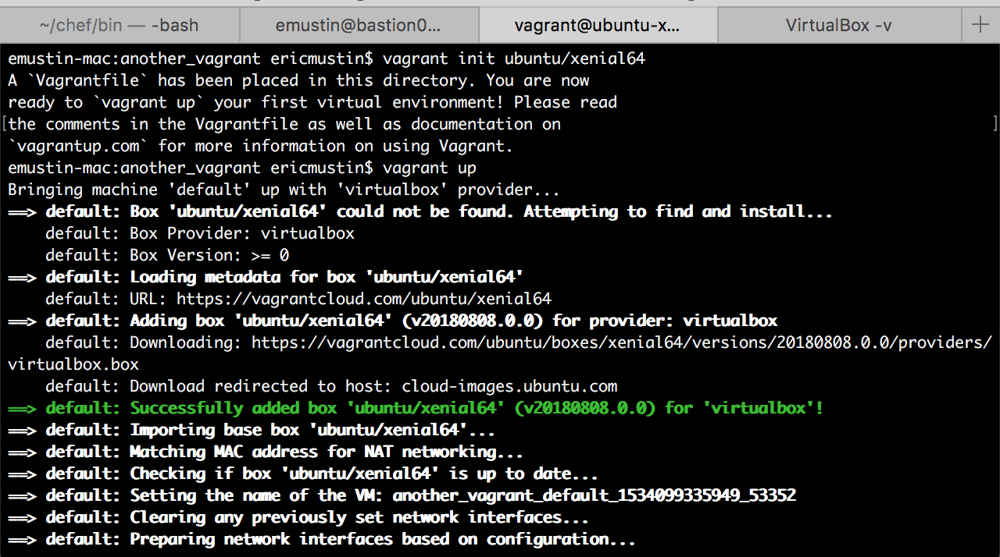

- 1b I ssh'd into VM `vagrant ssh` and confirmed `v. 16.04` 

- 1c I signed up for Datadog and installed the Datadog Agent  successfully  ` DD_API_KEY=YOUR_API_KEY bash -c "$(curl -L https://raw.githubusercontent.com/DataDog/datadog-agent/master/cmd/agent/install_script.sh)"` 

- 1d I navigated to the [eventstream](https://app.datadoghq.com/event/stream) `https://app.datadoghq.com/event/stream` and confirmed Agent reporting from my local machine 


### Collecting Metrics

- 2a 2b Added two tags in the Agent config file `datadog.yaml` `example` and a key/value pair `env:prod` 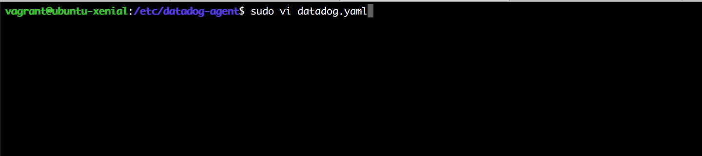 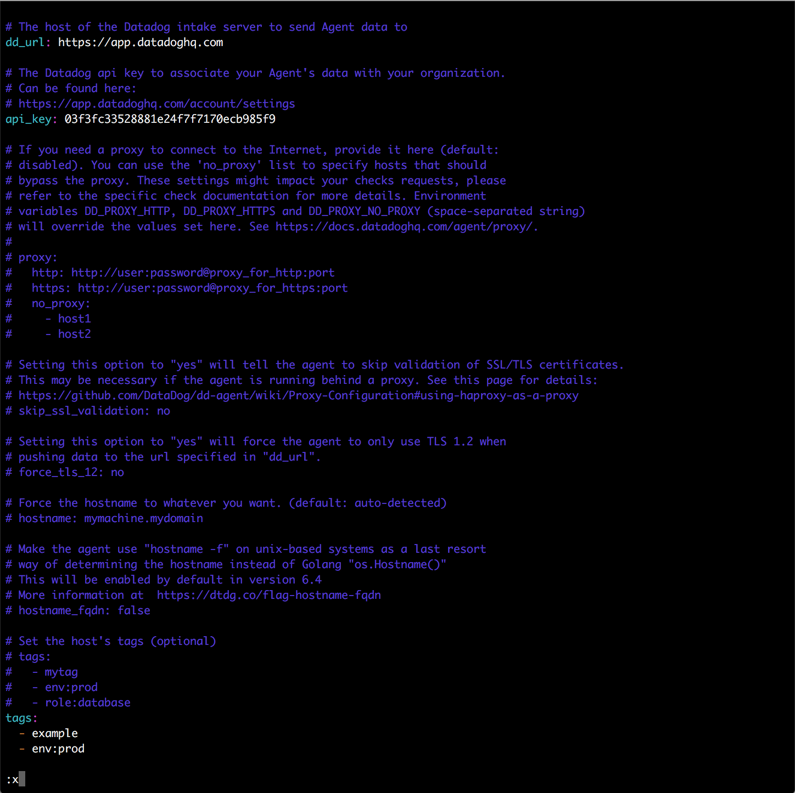

- 2c 2d restarted agent `sudo service datadog-agent restart` and confirmed via that tags added to agent yaml config file were accounted for on Host Map page 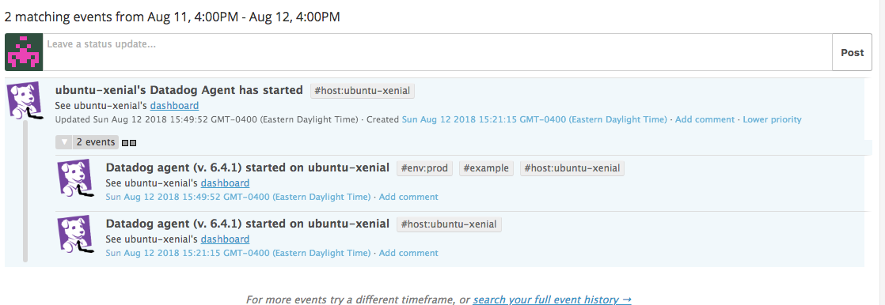 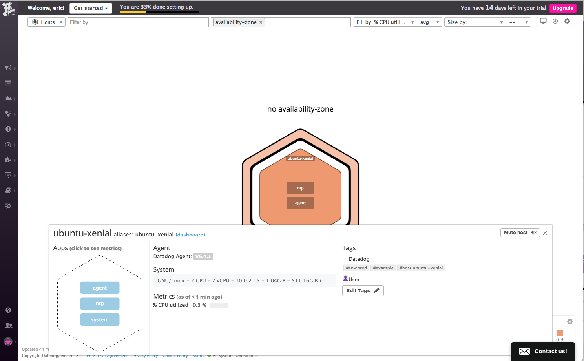

- 2e 2f 2h 2i 2j 2k 2l I installed PostresSQL on my VM
  ```
    sudo apt-get update
    sudo apt-get install postgresql postgresql-contrib
  ```
  and then after confirming installation 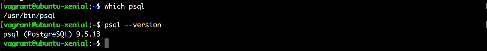 I started postgres and followed [Datadog PostgreSQL integration and configuation instructions](https://app.datadoghq.com/account/settings#integrations/postgres) 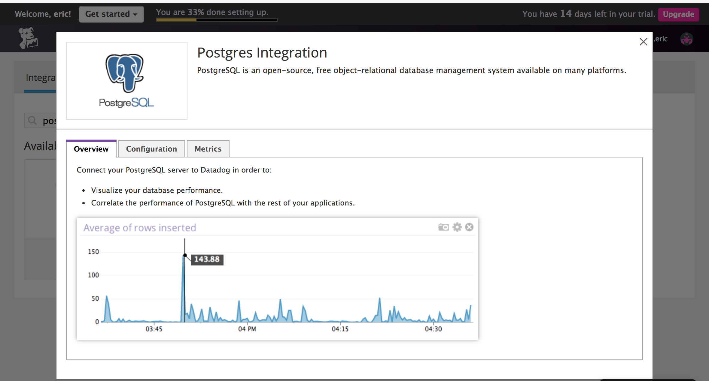 and 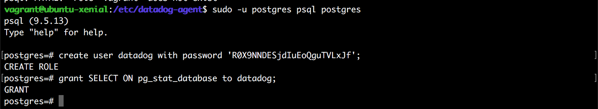 and confirmed connection 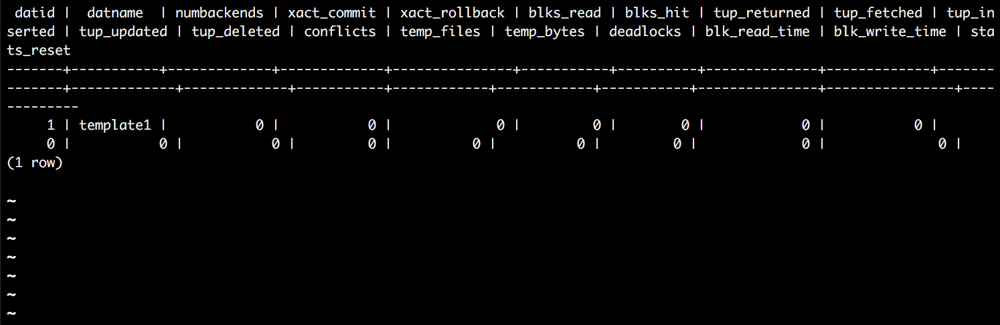 and configured agent to connect to PostgreSQL server 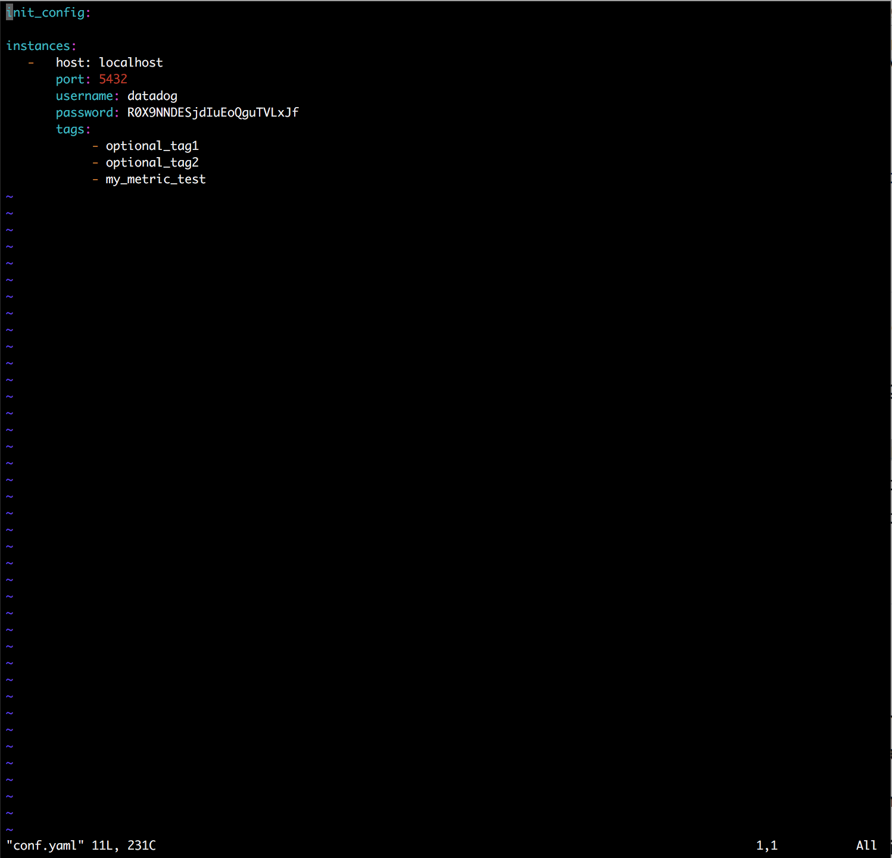 and restarted the Agent 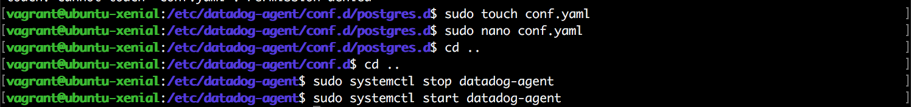 , checked the status `sudo datadog-agent status` 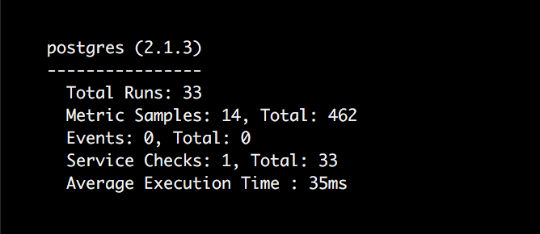 via CLI and the [relevant Dashboard](https://app.datadoghq.com/dash/integration/17/postgres---metrics) 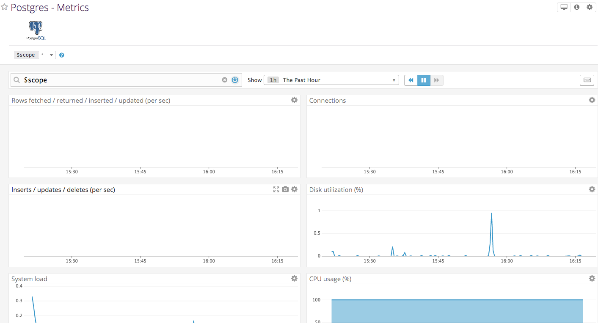

- 2m 2n 2o 2p I created a custom agent check named `my_metric` by adding both a .py file to the `checks.d` directory and also a `my_metric.d` subdirectory in the `conf.d` directory as well as a yaml config file `my_metric.yaml` . 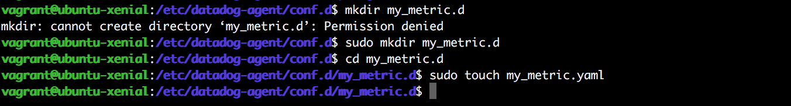 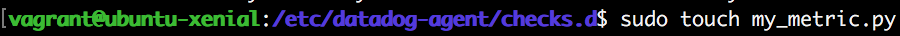 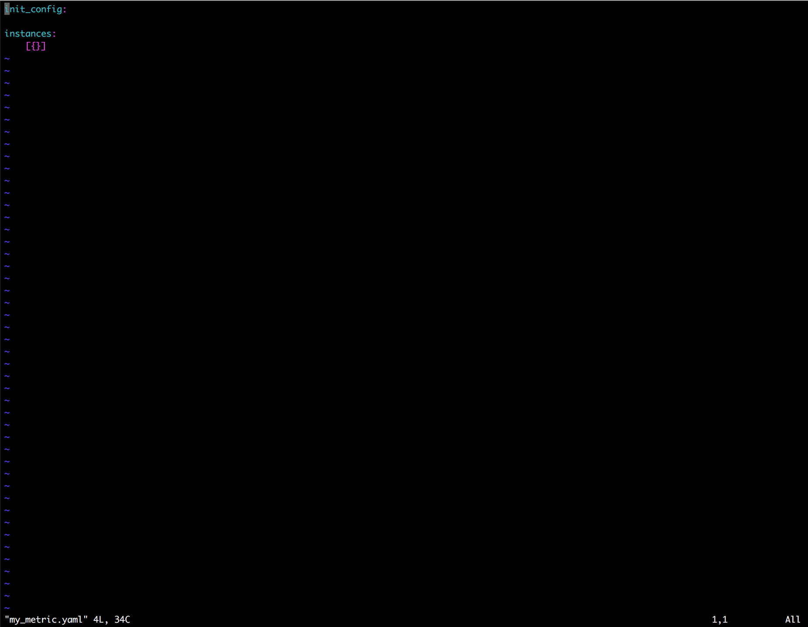 The custom Agent check logs a random value btwn 0 and 1000 .

- 2q 2r 2s 2t Bonus: After confirming that my_metric custom agent check was being logged in the metrics dashboard !(2q)(./2q.png) I was able to change the the collection interval from the default 20seconds to 45 seconds by updating the yaml config file `min_collection_interval` key then restarting the agent and confirming the change in interval via the Dashboard 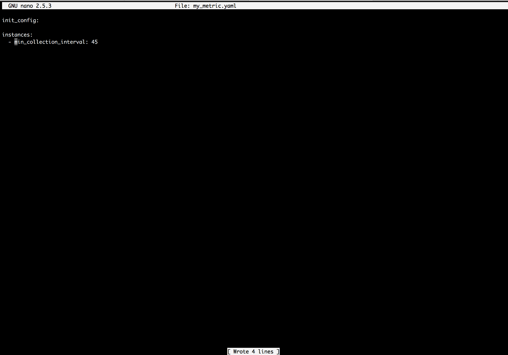 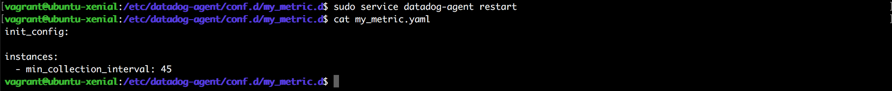 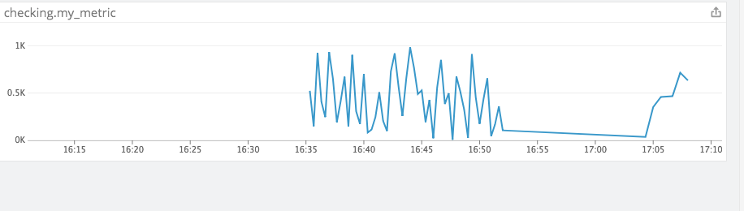 . I think this counts as changing the interval without changing the .py file. If I wanted to change it via the .py file via I suppose I could `time import` and invoke `time.sleep(_SOME_AMOUNT_OF_SECONDS)` or something hacky along those lines


### Visualizing Data

- 3a I chose to use the Datadog ruby library DogApi as docoumented in the [developer section of the docs](https://docs.datadoghq.com/developers/libraries/). Please note this requires rvm(ruby version manager), ruby, and rubygems to be installed on the VM (documentation for this can be found [here](https://gorails.com/setup/ubuntu/16.04) ). after installing dependancies I installed dogapi with `gem install dogapi` as can be seen  here 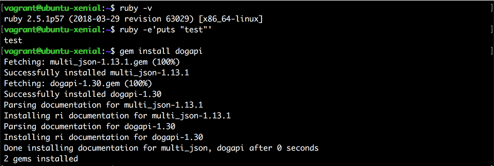.

- 3b 3c then following the documentation for creating a timeboard as noted [here](https://docs.datadoghq.com/api/?lang=ruby#create-a-timeboard) `https://docs.datadoghq.com/api/?lang=ruby#create-a-timeboard` I first created a new app key via the Datadog UI and replaced the example graph with 3 graphs, which were as requested

```
  Your custom metric scoped over your host.
  Any metric from the Integration on your Database with the anomaly function applied.
  Your custom metric with the rollup function applied to sum up all the points for the past hour into one bucket
```

Script can be seen here and in `example_script.rb` The timeboard can be seen here
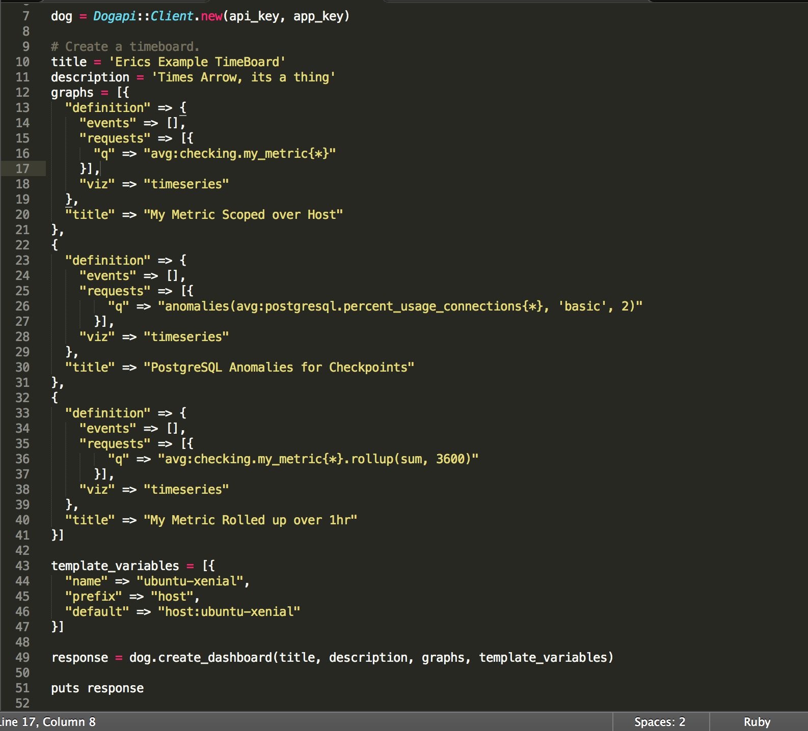
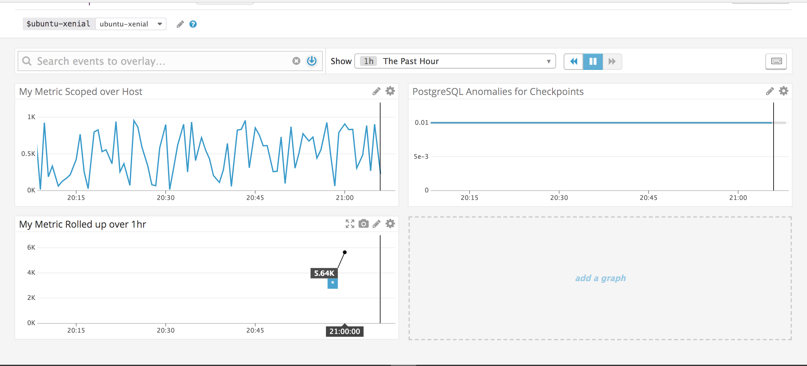

For the anomalies function and the rollup function I followed the documentation as referenced the the [misc graph section](https://docs.datadoghq.com/graphing/miscellaneous/functions/) `https://docs.datadoghq.com/graphing/miscellaneous/functions/` I chose the postgreSQL percent usage connections as that would be a relatively constant timeseries (there is only 1 connection) and so the range of 2 std deviations as specified in the arguments of the anomalies function would be easy to see.  For the Rollup of my_metric into 1 bucket over a 1hr period, since the rollup period is in seconds I passed in sum to indicate that I wanted a total of all the events, and 3600 as a parameter since there are 3600 seconds in an hour.

- 3d I selected the Timeboard from the Dashboard list and although the minimum default range options is only the past hour, in order to do 5 minutes I found that the query paramets of the URL from_ts and to_ts could be editted, so I selected a from_ts that was `to_ts - 30000` and reloaded the page in order to get a 5 minute timeframe as seen here 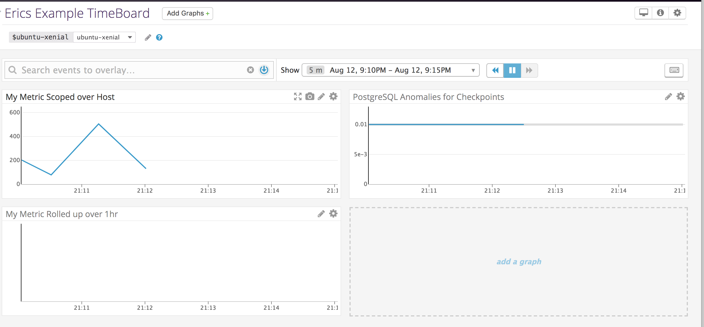.

- 3e 3f In order to take a snapshot of the graph I selected the camera icon from the Dashboard UI and in the annotation section input `@ericmustin` in order to send the snapshot to my user, and i checked my inbox to confirm reciept, both actions can be seen here
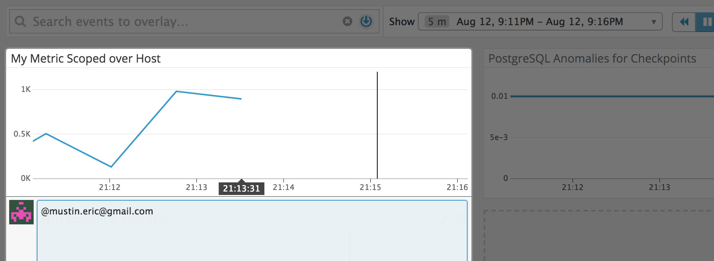
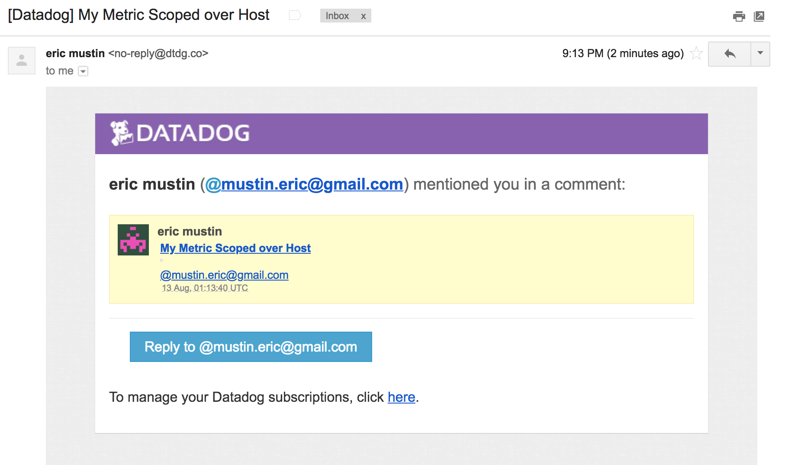

- Bonus: The Anomaly Graph is basically displaying a range of expected values that the metric is expected to fall within in the future a certain percentage of the time, given it's previous values.  The range it's expected to fall within is tighter or wider depending on the Param you pass in of number of standard deviations, I chose 2 standard deviations for statistical significance. Though I'm not a stats wiz the range is basically saying `95% of the time the number should fall within this range`. So, the 1 out of 20 times it is above or below that range, it probably indicative of an anamoly or underlying change in data, and is worth alerting a user on.

### Monitoring Data

- 4a 4b 4c in The Datadog UI I navigated to the [Monitor Page](https://app.datadoghq.com/monitors#/create) and selected a create new monitor, then followed the instructions to create an alert with a threshold > 800 and a warning above 500 over the previous 5 minute period, as well as a No Data alert if there's zero recorded instances of the metric over a 10 minute period.  Using Markdown and the Datadog templating language I constructed an email that has different messaging for alert, warn, and no data, and logs the my_metric value and host ip in the case of an alert.  This successfully sent me a warning alert right away as it didn't take long to go above 500, screenshots of the inputting of values into the new monitor and the email i got from this monitor can be seen here
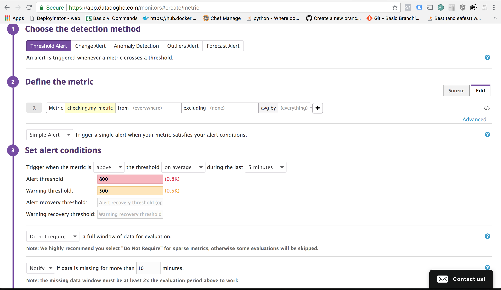
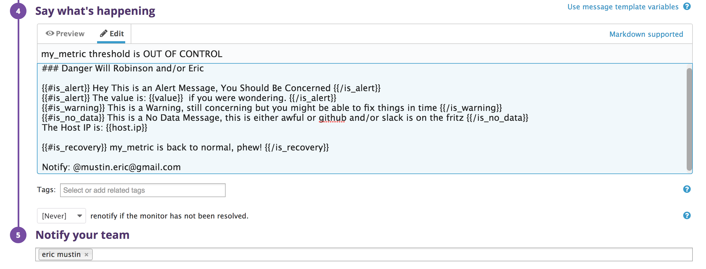
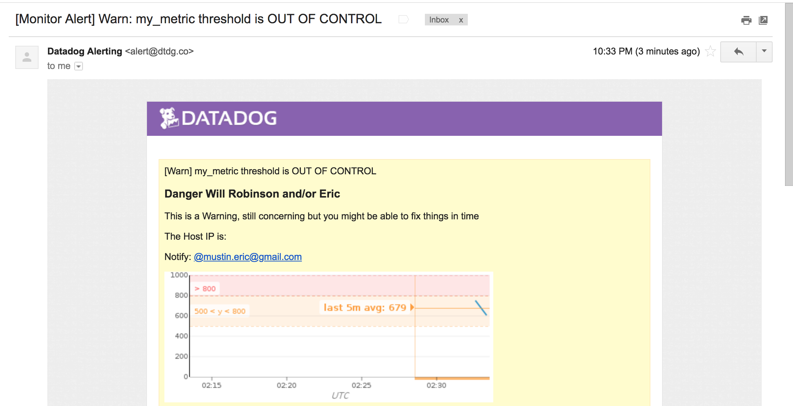

- Bonus: since we don't want this to alert constantly during normal business hours and on the weekend off hours, I set up two recurring scheduled downtimes via the `Manage Downtime` menu option. I selected recurring downtimes for the weekend and weekdays during Eastern Time 7:00am - 9:00pm, the emails note UTC times which, when adjusted, line up with our EST preferences.  Downtime creation forms and the emails rec'd as a result can be seen below
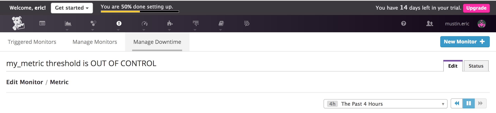
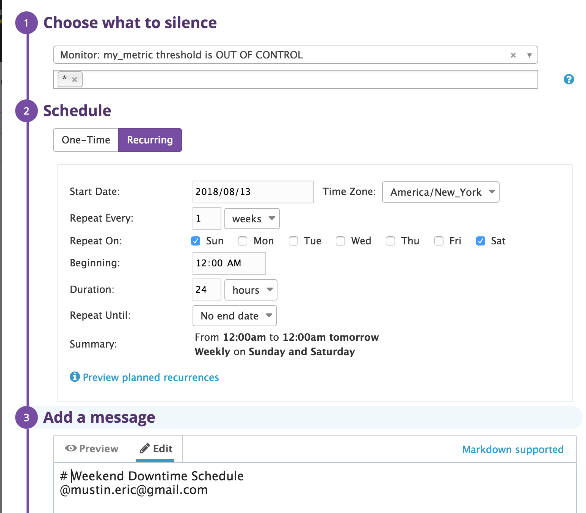
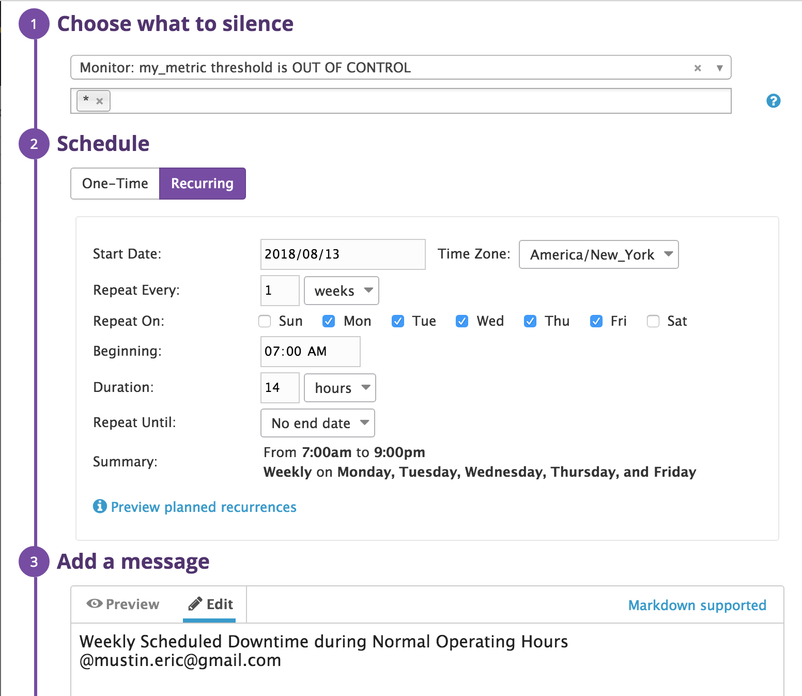
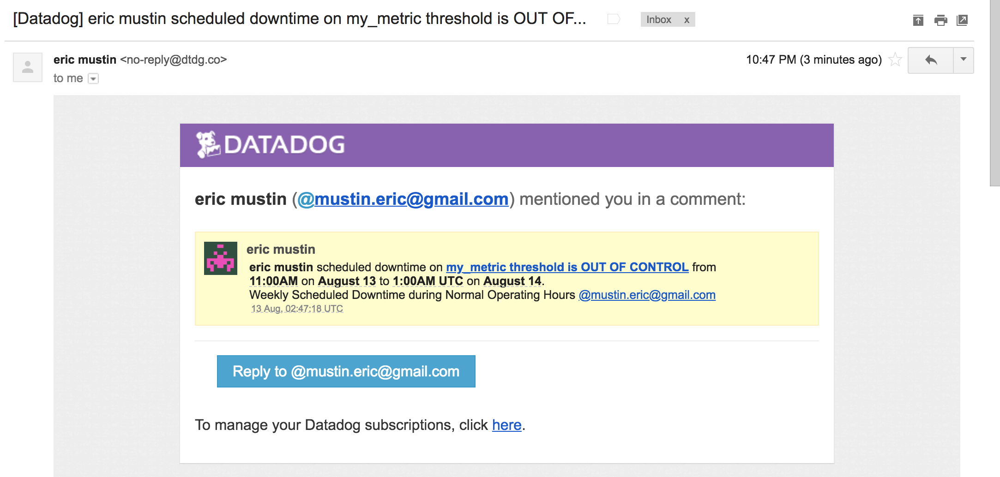
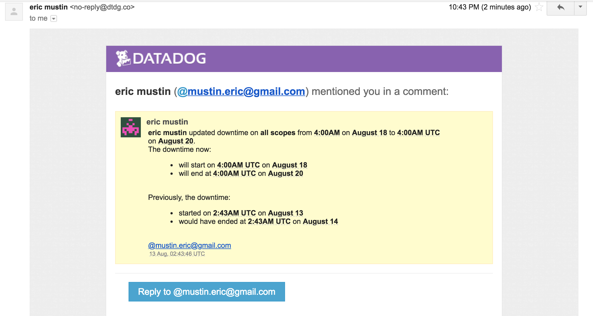

