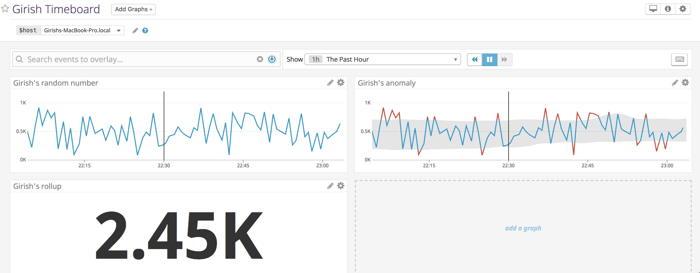
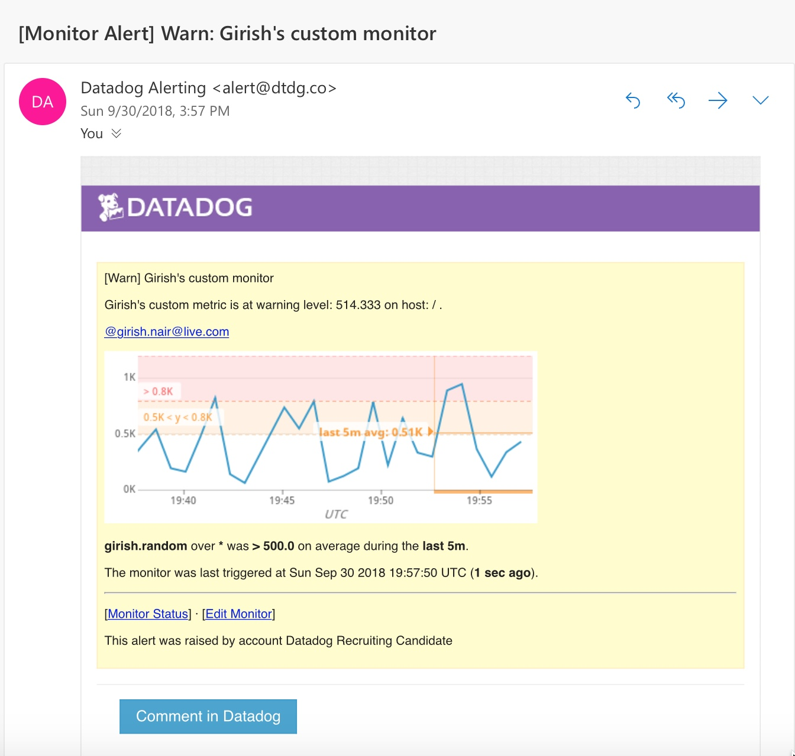
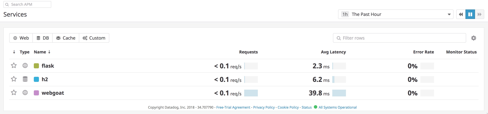
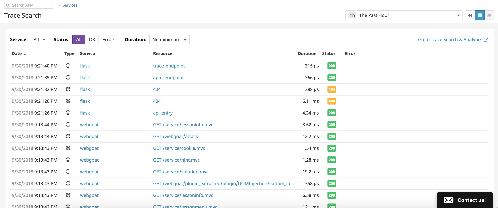

## Collecting Metrics


### Exercise 1 

I use the following [Datadog config](./opt/datadog-agent/etc/datadog.yaml) file for my Macbook Pro agent. **I also experimented with Ubuntu Linux and Windows agents.** 

Here is a view of my Macbook Pro with tags.


The integration with AWS was a breeze. Here is a view of one of my EC2 instances.


### Exercise 2

The Datadog MongoDB agent is setup to monitor MongoDB running on my Macbook.


### Exercise 3

I added a custom metric "girish.random" to display a random number between 0 and 1000.

 The customer metric files are [random_num.py](./opt/datadog-agent/etc/checks.d/random_num.py) and [random_num.yaml](./opt/datadog-agent/etc/conf.d/random_num.yaml). The `min_collection_interval` has been set to `45 seconds`.

Here is a view of my custom metric dashboard. 


### Exercise 4

I was intrigued by the Process view and wanted to see it in action. I could not get it to work on my Macbook. I therefore tried it on Ubuntu and found out that I was missing a valid instance configuration. I finally got it working with the following [process config](./opt/datadog-agent/etc/conf.d/process.yaml). I came to the realization that  Mac agent is hard to troubleshoot as the log output is not very good. 

Here is a view of my custom metric dashboard. 


---

## Visualizing Data


### Exercise 5

The Datadog API is simple and elegant. I was able to quickly create a  to create a custom metric Timeboard as shown below.




### Exercise 6
TODO: Any metric from the Integration on your Database with the anomaly function applied.


### Exercise 7
TODO: Your custom metric with the rollup function applied to sum up all the points for the past hour into one bucket 


**BONUS: The anomaly graphs displays the expected range of data so that it is easy to identify outliers**


---

## Monitoring Data

I created a custom monitor that triggers alert/warning messages based on the following threshold.


It sends custom messages as defined below.


**TODO: The variables `{{host.name}}` or `{{host.ip}}` doesn't work.**

Here is a sample email message that I received.




I added two downtimes:

 - prevent notification after hours - daily from 7 pm to 9 am


 - another for weekend 


**NOTE: I didn't get a chance to test that these downtimes work correctly.**


---

## APM

**Problem: The trace agent (port 8126) wouldn't start on Mac, so I had to use Ubuntu Linux**


### Python Agent

I used the provided sample  to instrument with Python Agent. The steps to setup the agent:

```
pip install Flask
pip install ddtrace
ddtrace-run python flask_app.py
```

### Java Agent

I instrumented a Tomcat container with Datadog Java agent. The steps to setup the agent:

```
export JAVA_OPTS="-javaagent:datadog/dd-java-agent-0.16.0.jar" 
```

The resulting APM data were as follows:

####APM Services


####APM Traces



**Bonus: The Services are various layers of the applications that provide a function. The Resources are assets like files, images, endpoints, etc.**


---

## Final Question/Answer

I read the blogs on using Datadog to monitor NYC Subway System and Pokemon Go. Another practical use could be to monitor home water usage to identify excessive water usage due to leaky faucets, toilets, sprinkler system, etc. If you have ever experienced one, you could end up with a hefty bill.


