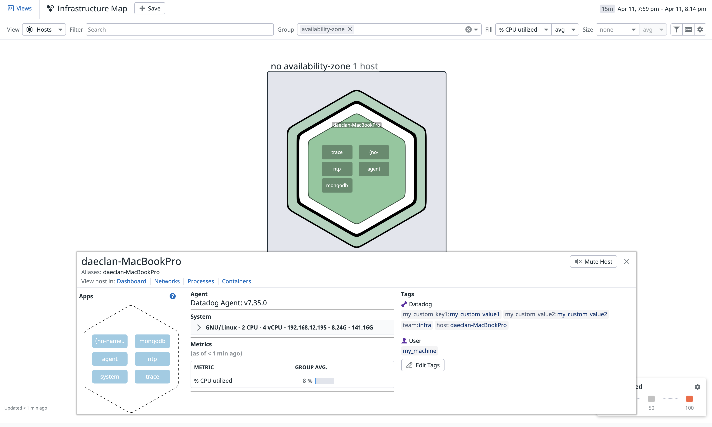

Your answers to the questions go here.

#

I. Setup of Environment
	
For the environment I simply used the ubuntu 20.04 partition on my macbook pro.

#
II. Collecting Metrics 
	
1. Adding tags to the host
	
	The following images show the tags from the UI and command line perspective
	
	
	
	
	
1. Installing database
		
	The database I decided to go with is MongoDB. Below are some screenshots of mongoDB in the dashboard.
		
	
		
3. Custom agent that submits a metric named my_metric.py. 
		
	For this I created a simple python file named my_metric.py and saved it in the /etc/datadog-agent/checks.d directory. See the "/Code" folder for complete code.
		
4. Change your checks interval to every 45 seconds
		
	For this I had to create a my_metric.d directory in the datadog conf.d directory. Here, I created a file configuration file called my_metric.yaml which would send report the metric at minimum every 45 seconds. Below is a screenshot of the code in the my_metric.yaml file. 
		
	
		
5. Bonus Question: Changing the interval
	
#

III. Visualizing Data

1. Utilize datadog API to create timeboard:
		
	To create the timeboard I used the "api" and "initialize" modules. I entered the API and APP keys to connect it to the UI. You can find the source code I used in Code/api_datadog.py. Below you can see the timeboard that I created with the API.
		
	
		
2. Snapshot of board
		
	Below you will find a link and snapshot of the datadog dashboard that I created
		
	link: [Dashboard link](https://app.datadoghq.com/dashboard/ck3-52m-ysj/datadog-mymetric-timeboard?from_ts=1649734822765&to_ts=1649738422765&live=true)
		
	
	
3. Bonus Question:
	
	The anomaly graph is showing to maximum values in the data or the "anomalies" within the data
	
#	
IV. Monitoring Data

1. Creating a Metric Monitor that watches the average of your custom metric with Warning and Alert thresholds of 500 and 800.
	Creating the monitor is pretty straight forward, you simply go the "monitors" section of the UI and use create an Alert for "my_metric". Below you will find screenshots of the monitor that I created. 
		
	
	
	
				
		
		
		
2. Configure Monitor email:
	The email configuration can be seen in the "Screenshot of monitor overview" image. A sample email is listed below.
		
	
		
#	
V. Collecting APM
	
1. Flask APM solution
	
	For this exercise I used the middleware solution. Please see Code/apm_collection_datadog.py. 
	
2. Provide link and screenshot
		
	Below is the link to the APM as well as the screenshot of the infrastructure and Flask trace. 
		
	link: [Dashboard link](https://app.datadoghq.com/dashboard/8ej-22t-9rb/daeclans-dashboard-fri-apr-8-90357-pm?from_ts=1649707137922&to_ts=1649710737922&live=true)
		
	

#
VI. Final Question: 
1. Is there anything creative that I would use datadog for?

	Given datadogs grand capabilities to trace any software, I can think of hundreds of uses. A great use for datadog would be in manufacturing. The evolution into industry 4.0 requires massive integration of all parts of a factory. Since essentially every piece of equipment on a factory floor is linked to software that contains data individually, I could see massive potential in implementing datadog. Essentially what you would see is that datadog could monitor the entire manufacturing process for every good/process. On top of that datadog would be able to provide statistics on where the manufacturing process is bottlenecking. I would not be surprised if datadog was already servicing companies such as Tesla or Sony. 

	
		
