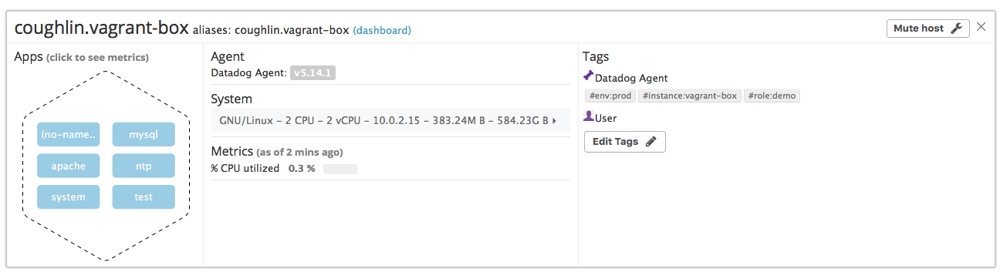
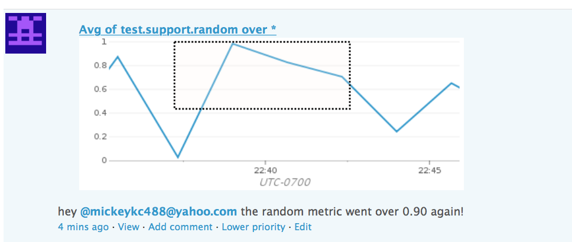

## Answers

### Level 1 - Collecting your Data

* Sign up for Datadog (use "Datadog Recruiting Candidate" in the "Company" field), get the Agent reporting metrics from your local machine.
  * Done
* Bonus question: In your own words, what is the Agent?
  * The Datadog agent is an extremely low overhead single process that runs at the host level. It can collect a wide range of metrics about the health of the host, application performance, and health of any of the hundreds of integrations (Apache, MySQL, etc). It has a 15-second granularity for most metric but some metrics can be configured down to 1-second granularity. All traffic is sent (outbound only) over https to Datadog's highly secure SaaS backend.
* Add tags in the Agent config file and show us a screenshot of your host and its tags on the Host Map page in Datadog.
  * 
* Install a database on your machine (MongoDB, MySQL, or PostgreSQL) and then install the respective Datadog integration for that database.
  * The MySQL metrics can be seen here: [OOTB MySQL DB Dashboard](https://app.datadoghq.com/dash/integration/custom%3Amysql?live=true&page=0&is_auto=false&from_ts=1498715373838&to_ts=1498718973838&tile_size=m)
  * I also tested out the apache integration [Apache Dashboard](https://app.datadoghq.com/screen/integration/apache)
* Write a custom Agent check that samples a random value. Call this new metric: `test.support.random`
  * I made a example dashboard to show the custom metric (and other things): [Example Dashboard](https://p.datadoghq.com/sb/d5cc72308-a138052e21)

Here here is my snippet for my custom metric:

```python
from datadog import statsd
import time
import random
while True:
    statsd.gauge('test.support.random', random.random())
    time.sleep(100)
```

### Level 2 - Visualizing your Data

* Since your database integration is reporting now, clone your database integration dashboard and add additional database metrics to it as well as your `test.support.random` metric from the custom Agent check.
  * [Coughlin MySql Example](https://app.datadoghq.com/dash/313411/coughlin-mysql-example?live=true&page=0&is_auto=false&from_ts=1498748446133&to_ts=1498752046133&tile_size=m&tpl_var_scope=env%3Aprod&fullscreen=false)
* Bonus question: What is the difference between a timeboard and a screenboard?
  * Screenboards are flexible mixed widget and mixed timeframe dashboards. They are great for building a single pane of glass for your entire infrastructure.
    * [Example Screenboard](https://app.datadoghq.com/screen/199043/example-dashboard)
  * Timeboards are great for war room monitors. They consist of time-synchronized metrics and events graphs. They are very useful for troubling-shooting and correlating across different metrics and application tiers.
    * [Example Timeboard](https://app.datadoghq.com/dash/313411/coughlin-mysql-example?live=true&page=0&is_auto=false&from_ts=1498748556370&to_ts=1498752156370&tile_size=m)
* Take a snapshot of your `test.support.random` graph and draw a box around a section that shows it going above 0.90. Make sure this snapshot is sent to your email by using the @notification
  * 

### Level 3 - Alerting on your Data

Since you've already caught your test metric going above 0.90 once, you don't want to have to continually watch this dashboard to be alerted when it goes above 0.90 again.  So let's make life easier by creating a monitor.  
* Set up a monitor on this metric that alerts you when it goes above 0.90 at least once during the last 5 minutes
  * [Random Metric Monitor](https://app.datadoghq.com/monitors#2303675?group=all&live=1h)
* Bonus points:  Make it a multi-alert by host so that you won't have to recreate it if your infrastructure scales up.
  * [Random Metric Multi-Alert Monitor](https://app.datadoghq.com/monitors#2303691/edit)
* Give it a descriptive monitor name and message (it might be worth it to include the link to your previously created dashboard in the message).  Make sure that the monitor will notify you via email.
  * Done
* This monitor should alert you within 15 minutes. So when it does, take a screenshot of the email that it sends you.
  * 
* Bonus: Since this monitor is going to alert pretty often, you don't want to be alerted when you are out of the office. Set up a scheduled downtime for this monitor that silences it from 7pm to 9am daily. Make sure that your email is notified when you schedule the downtime and take a screenshot of that notification.
  * [Scheduled Downtime Link](https://app.datadoghq.com/monitors#downtime?id=234185877)
  * In the interest of saving time I changed the start time of the downtime monitor to [right now](https://youtu.be/rMV-fenGP1g?t=85). That way I could get the downtime email notification without having to wait until 7pm tonight. Screenshot of email below:
  
