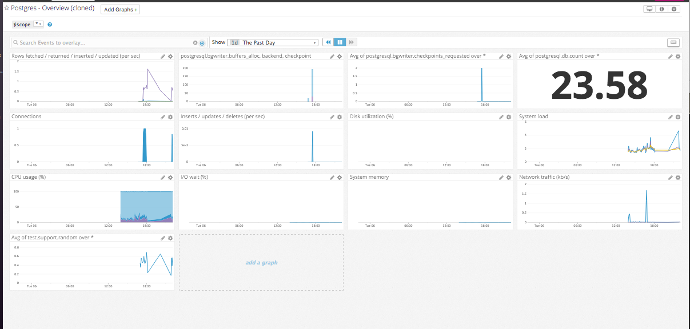

# Level 1

* The Agent is a piece of software that the user installs onto a host that transmits system metrics and application data to Datadog. The Agent is made up of the collector, which collects system metrics; dogstatsd, which allows the user to send custom application data; and the forwarder, which sends all of the data to Datadog over HTTPS.

### Host Map With Tags

### test.support.random Agent Check
    from checks import AgentCheck
    import random
    class RandomCheck(AgentCheck):
        def check(self, instance):
        self.gauge('test.support.random', random.random())

# Level 2

### Cloned Postgres Dashboard w/ Additional Metrics

* Timeboards: all graphs are scoped to the same time, appear in a grid, and graphs can be shared individually
* Screenboards: more customizable layout, widgets can have different time frames, can be shared as an entire read-only entity

### test.support.random Graph Snapshot

