# Quick Datadog agent Setup with Docker

## Table of contents
1. Basic Prerequisites Checks
2. Collecting Metrics, using integration and custom created check
3. Visualizing Data, creating dashboards using the API and Manually
4. Monitoring Data
5. Collecting APM Data (Application Performance Management)
42. Answer to the Ultimate Question of Life, the Universe, and Everything


### Prerequisites
Have [Postman API](https://www.postman.com/) client installed


We will be using Docker, so before moving forward, we need to make sure we have docker up and running on our environment.
If this is your first time with docker, [check their website and follow the installation instructions](https://docs.docker.com/get-docker/), it's super simple.


Now that you have docker, we need to setup your Data Dog account. If you already have it, you can skip this step.
- Go to [Datadog Website](https://www.datadoghq.com/) and click on the Get Started link on the top right, and fill in your information.
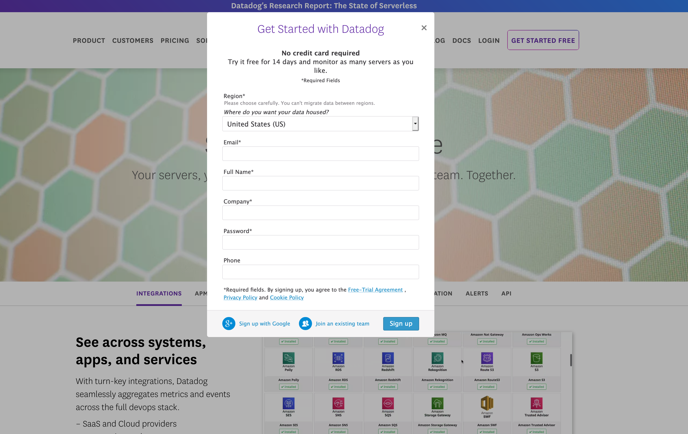

- On the next step, you can select the softwares you currently use in your company (AKA your Tech Stack). 
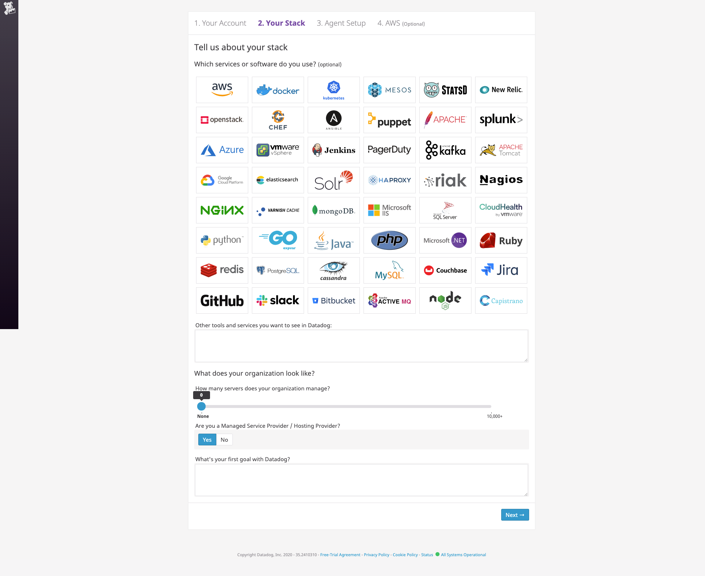

- Now is the time to choose how we want to setup our agent. For this tutorial, we will use the Docker Agent approach.
Select Docker on the left menu, and you will see a screen just like shown bellow.
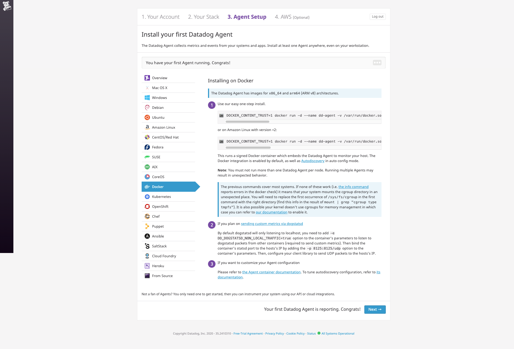

At this stage, you should have access to the docker command pre-filled with your KEY, something like this:
```shell script
DOCKER_CONTENT_TRUST=1 docker run -d --name dd-agent -v /var/run/docker.sock:/var/run/docker.sock:ro -v /proc/:/host/proc/:ro -v /sys/fs/cgroup/:/host/sys/fs/cgroup:ro -e DD_API_KEY=<YOUR-KEY-GOES-HERE> -e DD_SITE="datadoghq.eu" datadog/agent:7
```
Further reading on the [documentation regarding APM](https://docs.datadoghq.com/agent/docker/apm/?tab=python), at this stage we will require to add more parameters at the end of the above docker command.
Those 2 parameters will enable the integration with the APM metrics and port forwarding for tracing, that we will explain on the following steps.
```shell script
-e DD_APM_ENABLED=true -p 8126:8126/tcp
```
So, at the end your command should look like this. Paste it on your terminal, and wait for the download and initialization. 
```shell script
DOCKER_CONTENT_TRUST=1 docker run -d --name dd-agent -v /var/run/docker.sock:/var/run/docker.sock:ro -v /proc/:/host/proc/:ro -v /sys/fs/cgroup/:/host/sys/fs/cgroup:ro -e DD_API_KEY=<YOUR-KEY-GOES-HERE> -e DD_SITE="datadoghq.eu" datadog/agent:7 -e DD_APM_ENABLED=true -p 8126:8126/tcp
```

- That should take a few seconds, depending on your internet connection. After the process ends, you will see on the terminal the container id. To double check if the container is there correctly, run the following command, and you should see the `dd-agent` (Datadog Agent) container running:
```shell script
docker ps
``` 
This should be enough to Datadog Website to detect the agent, and allow you to finish the setup.
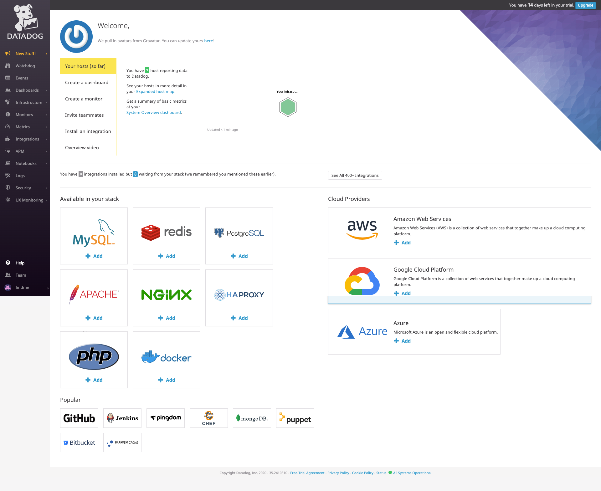


- For the next steps, we will also need a Database to read metrics from, and since we are using docker, it couldn't be easier. By just running the following 2 commands, you will have a database ready to be used. [You can check more information on the MariaDB website if needed.](https://mariadb.com/kb/en/installing-and-using-mariadb-via-docker/)
```shell script
docker pull mariadb/server:10.3

docker run --name datadogdbtest -p 33061:3306 -e MYSQL_ROOT_PASSWORD=root -d mariadb/server:10.3
```
The first command will pull the MariaDB container image, and the second will run the server inside the container, with `datadogdbtest` as the DB name and `root` as the password. We are also opening the default port `3306` and forwarding as `33061` so we can access from inside the `dd-agent` container.


The basic setup is done. Now we can start configuring the Datadog Agent on the next steps.


## Collecting Metrics
In this part of the tutorial, we will learn about the integration with external services that we can monitor, and also how to create a custom check, and how we can use tags to filter those metrics while monitoring.


### Tags
Before we start collecting metrics, let's [add some Tags](https://docs.datadoghq.com/tagging/) to our infrastructure so we can differentiate metrics from hosts. 

To do that, we will need to access the `dd-agent` container via ssh, using the following command:
```shell script
docker exec -it dd-agent /bin/bash
```
PS: This command will be used throughout the tutorial, so keep it handy.

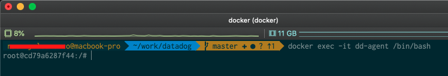

This is what you should see after running the command, a terminal inside the docker container, where the Datadog Agent is running.

Now we are ready to add the tags, and to do that, we need to navigate to the `datadog-agent` folder, and [edit the main configuration file](https://docs.datadoghq.com/agent/guide/agent-configuration-files/?tab=agentv6v7).

You can use any editor you want, for this tutorial I'l be using VIM.
```shell script
vim /etc/datadog-agent/datadog.yaml
```
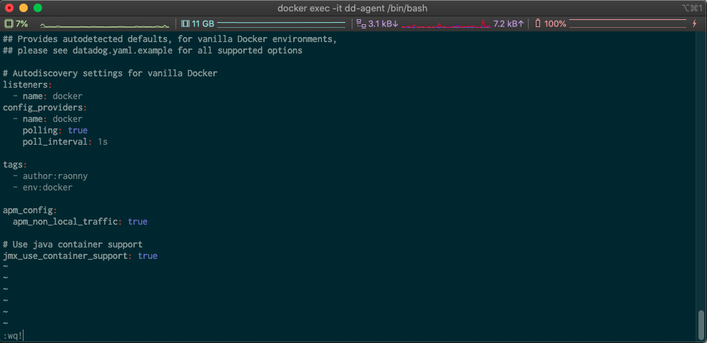

Add the tags using the correct YML indention:
```yaml
tags:
  - author:raonny
  - env:docker
```
[You can learn more about tagging here.](https://docs.datadoghq.com/tagging/)

You can also double check if the tags were saved correctly using the following:
```shell script
cat /etc/datadog-agent/datadog.yaml | grep tags -C 5
```

After adding the tags, you need to restart the agent, to make sure the tags are applied. To do that, just do this:
```shell script
service datadog-agent restart
```

Or, you can choose to restart the docker container. You can do that by:
```shell script
#exit the ssh connection
exit

#restart the container
docker restart dd-agent

#ssh to restarted container again
docker exec -it dd-agent /bin/bash
```

After restarting the agent, yon can navigate to [Infrastructure -> Hostmap](https://app.datadoghq.eu/infrastructure/map) and check the tags applied to your host.
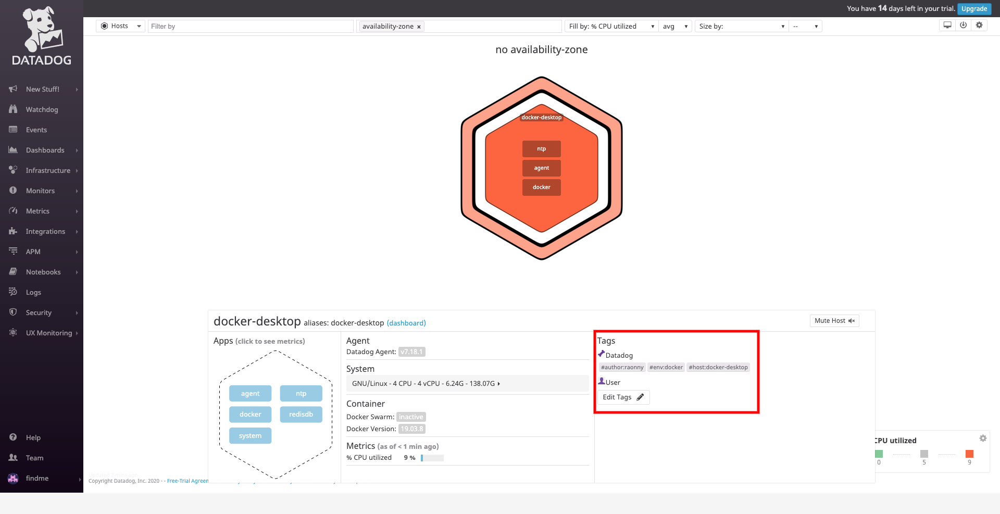


### Database Integration
We have the MariaDB database running on a container, but to be able to read the metrics, we need to enable the Datadog Integration.
You can do that on yor New Stuff! home page, you navigating to [Integrations](https://app.datadoghq.eu/account/settings) and selecting the MySQL interface integration
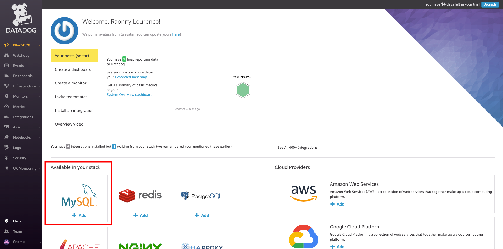
PS: MariaDB is a fork of MySQL.

By clicking the `+ Add` button, you will receive a set of instructions to enable the MySQL integration ([you can also check them here](https://docs.datadoghq.com/integrations/mysql/)). For this tutorial, I'll skip the user/credentials creation as we are using a test Database, so you can follow the instructions bellow:

To enable the MySQL integration on the agent, and to do that we first need to navigate to the `mysql.d` folder.
```shell script
cd /etc/datadog-agent/conf.d/mysql.d/
``` 

Inside this folder, there's a file called `conf.yaml.example` that we need to copy in order to use as a template.
```shell script
cp conf.yaml.example conf.yaml
```

Now we can edit the newly created config file and edit the needed parameters. We can use VIM again for that:
```shell script
vim conf.yaml
```
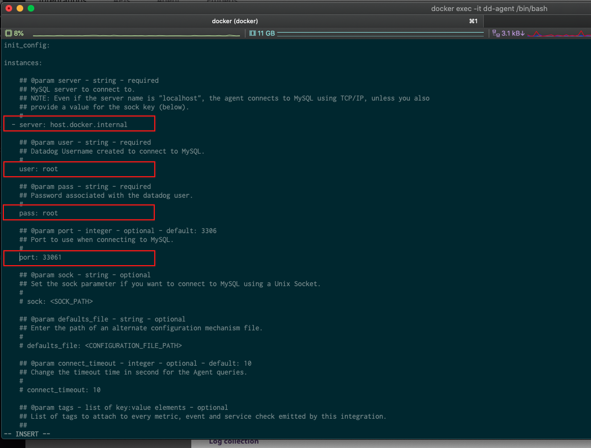

Use the configs as follows:
```yaml
# this is the internal route for docker containers
server: host host.docker.internal

# using root credentials for this test server only.
user: root
password: root

# port that we forwarded from the MariaDB container
port: 33061
```

After doing this step, save the file and restart the agent one more time. After a few moments, we can check the integration on the Datadog Website to see that it is working. You can also see on the [Infrastructure Host Map](https://app.datadoghq.eu/infrastructure/map)
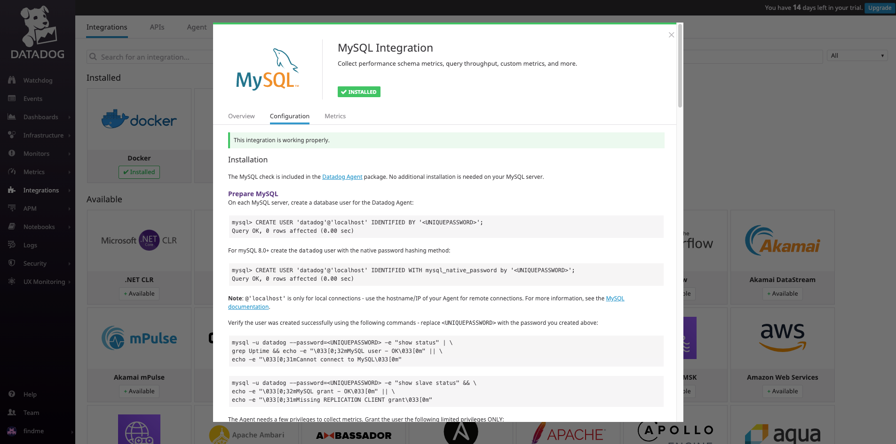


### Custom Agent

Now, we will see how easily we can [create a custom agent check](https://docs.datadoghq.com/developers/write_agent_check/?tab=agentv6v7), that we can monitor in the future. 
Custom checks are well suited to collect metrics from custom applications or unique systems.

In order to create a new metric check, that we will call `my_metric`, first we need to create a `yaml` that will enable the check.
```shell script
echo "instances: [{}]" > "/etc/datadog-agent/conf.d/my_metric.yaml"
```
This will create a file called `my_metric.yaml` with `instances: [{}]` as its contents, as required by the documentation.

The next step is create the metric itself. 
The names of the configuration and check files must match, so in this case, our check file will be called `my_metric.py`, and it must be created inside the `checks.d` folder. 
```shell script
vim /etc/datadog-agent/checks.d/my_metric.py
```

You can paste the following code snippet inside the `my_metric.py` file:
```python
try:
    from datadog_checks.base import AgentCheck
except ImportError:
    from checks import AgentCheck

from random import randint
__version__ = "1.0.0"
class MyMetric(AgentCheck):
    def check(self, instance):
        self.gauge('my_metric', randint(0, 1000), tags=['env:docker'])

```
This file will generate a random number from 0 to 1000, and assign the value to a metric called `my_metric`

Restart the agent one more time, and then navigate to the [Metrics -> Explorer](https://app.datadoghq.eu/metric/explorer) on the Datadog Website so we can validate the new metric was created correctly:
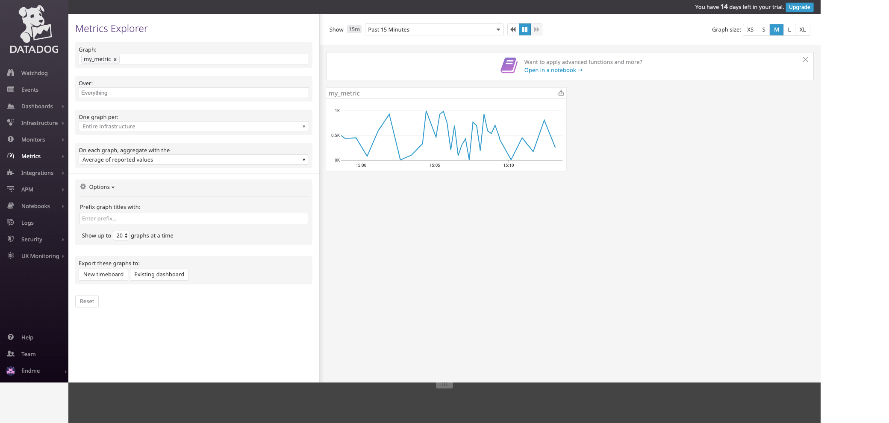

Or you can simply run the following command to achieve the same result:
```shell script
datadog-agent check my_metric
```

We can also [change the check collection interval](https://docs.datadoghq.com/developers/write_agent_check/?tab=agentv6v7#collection-interval), to be parsed every 45 seconds by updating the `my_metric.yaml` as follows:
```yaml
init_config:

instances:
  - min_collection_interval: 45
```


Having this 2 metrics added (MySQL and Custom) we are ready to start visualizing the data by creating dashboards.

## Visualizing Data

To create our first Dashboard, we will leverage the [Datadog API](https://docs.datadoghq.com/getting_started/api/
) to do that.

Bur first, we need to enable the API integrations on the Datadog Website, by navigating to [Integrations -> APIs](https://app.datadoghq.eu/account/settings#api).
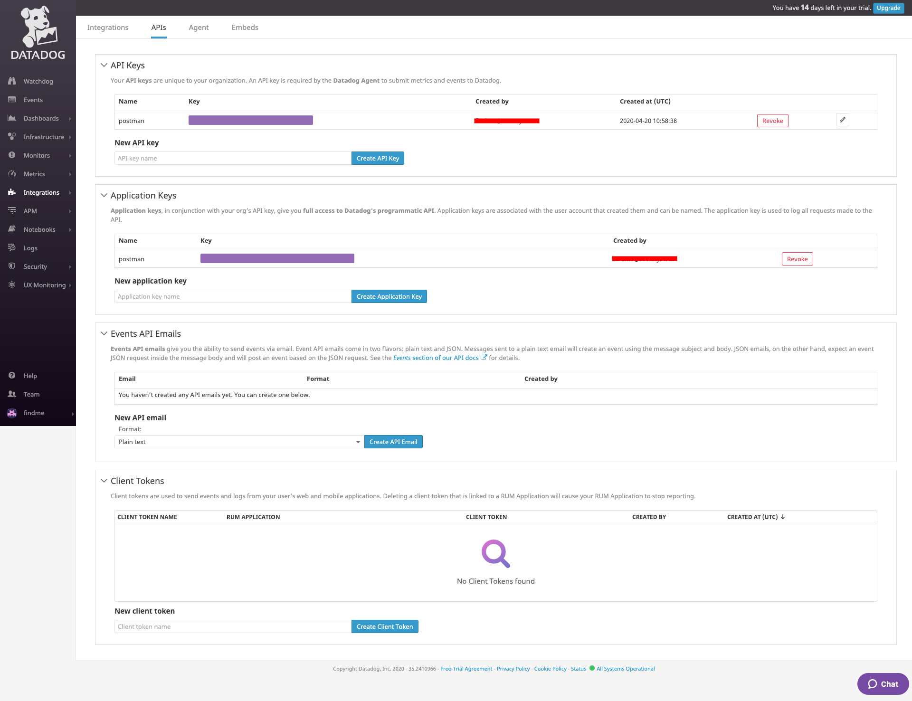

You should have already an `API Key` created, or you can choose to create a new one, the same applies to the `Application Keys`.

You can now follow the [instructions on the Datadog Documentation on how to setup your Postman Environment](https://docs.datadoghq.com/getting_started/api/#postman-environment-setup).

Having that done, we can verify if the credentials and the environment setup are correct, by triggering the Authentication Check endpoint:
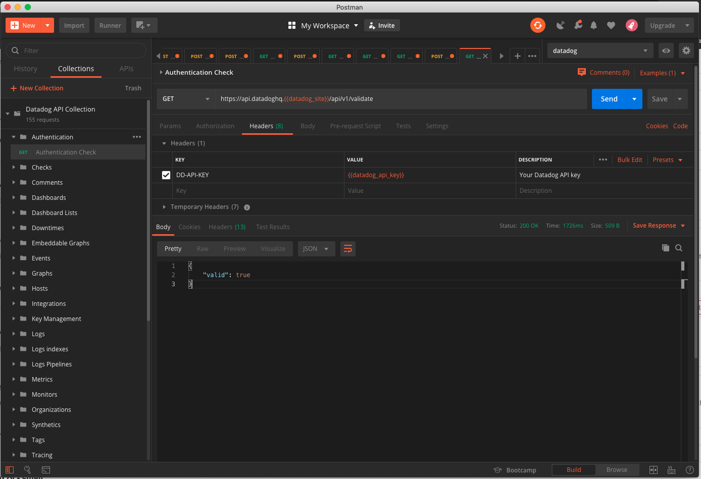


Now we are ready to create our new Timeboard with the metrics we created on the previous steps.

To create a new dashboard, we will need to use the [Create Dashboard Endpoint](https://docs.datadoghq.com/api/?lang=bash#create-a-dashboard)
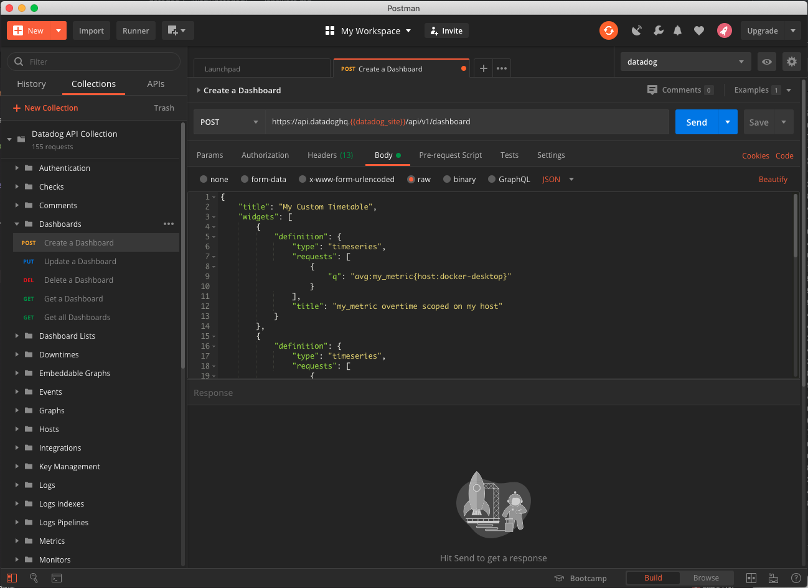


In this custom Timeboard, we wills use the following parameters to monitor:

- The custom metric `my_metric` scoped over the host.
- Any metric from the Integration on your Database with the `anomaly` function applied. (In this case, `mysql.net.max_connections`)
- The custom metric `my_metric` with the rollup function applied to sum up all the points for the past hour into one bucket

We can achieve that with the following request body:
```json
{
    "title": "My Custom Timetable",
    "widgets": [
        {
            "definition": {
                "type": "timeseries",
                "requests": [
			        {
			            "q": "avg:my_metric{host:docker-desktop}"
			        }
                ],
                "title": "my_metric overtime scoped on my host"
            }
        },
        {
            "definition": {
                "type": "timeseries",
                "requests": [
			        {
			            "q": "anomalies(avg:mysql.net.max_connections{*}, 'basic', 2)"
			        }
                ],
                "title": "Anomalies on max_connections"
            }
        },
        {
            "definition": {
                "type": "timeseries",
                "requests": [
			        {
			            "q": "avg:my_metric{*}.rollup(sum, 3600)"
			        }
                ],
                "title": "Rollup Metric"
            }
        }
    ],
    "layout_type": "ordered",
    "description": "My Custom Timetable",
    "is_read_only": true,
    "notify_list": [
        "findme@raonny.com"
    ],
    "template_variables": [
        {
            "name": "host",
            "prefix": "host",
            "default": "docker-desktop"
        }
    ]
}
```

Now, we can access the new Dashboard just created on the Datadog Website, navigating to [Dashboards -> Dashboard List](https://app.datadoghq.eu/dashboard) 

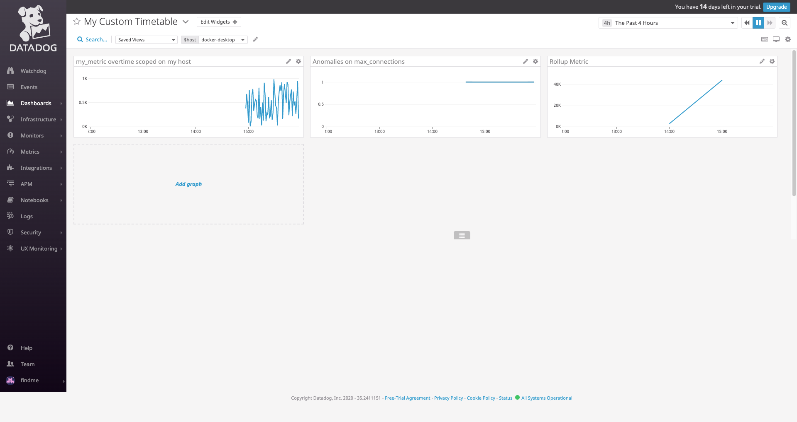
[Link to this dashboard](https://app.datadoghq.eu/dashboard/f5c-9xf-gfz/my-custom-timetable)

You can learn how to further customize your dashboards by checking the [Timeboard](https://docs.datadoghq.com/dashboards/timeboards/) and [Widget](https://docs.datadoghq.com/dashboards/widgets/) documentations.

On the Dashboard, we can leverage this information to take actions based on them, and also alert co-works and start discussions based on the data. Using the UI, you can easily annotate the graphs, mention people and filter the timefrime.

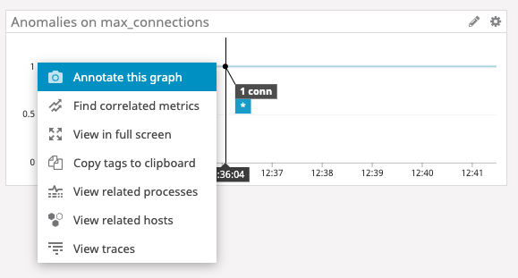

Actions on the graph.

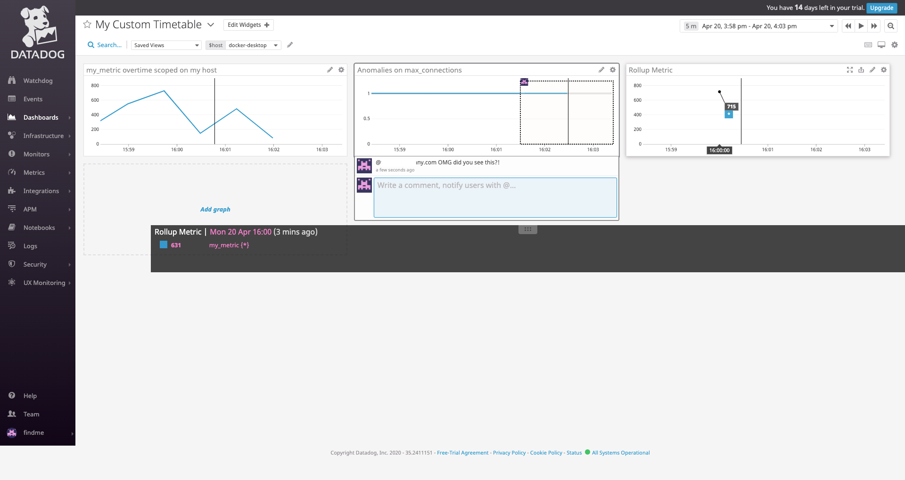

Thread to discuss the information


We can leverage of [multiple functions](https://docs.datadoghq.com/dashboards/functions/) to further process the information in relevant ways, one of them we used was the [`Annomaly` algorithm](https://docs.datadoghq.com/dashboards/functions/algorithms/), which is a feature that identifies when a metric is behaving differently than it has in the past, taking into account trends, seasonal day-of-week, and time-of-day patterns.


Now we can easily see all the relevant information by creating dashboards (you can also create them manually via the Datadog Website Dashboards -> New Dashboard), but how can make our life easier by being notified when something is not right?


## Monitoring Data
In this section, we will learn how we can [create monitors](https://docs.datadoghq.com/monitors/notifications/?tab=is_alert) to send alerts and warnings based on the information we are gathering.

Let's start by creating a new Metric Monitor on the Datadog Website by navigating to [Monitors -> New Monitor](https://app.datadoghq.eu/monitors#/create)
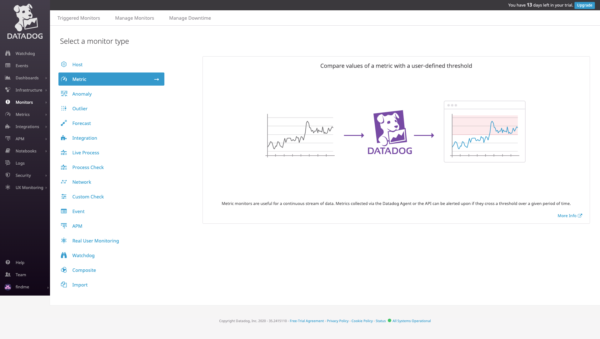

On the following step, we can do as follows:
- Ont the Detection Method, select Threshold Alert
- Select our custom metric `my_metric` on the Metric Definition
- Choose **Multi Alert** so we can filter the alerts by host
- Set the alert condition to be: Trigger when the metric is above the threshold on average  during the last 5 minutes for any host
- Warning threshold of 500
- Alerting threshold of 800
- And also ensure that it will notify you if there is No Data for this query over the past 10m.

We can also configure the message field to have only the relevant information to the type of alert. We can achieve that by using the conditional and the information tags, as follows:
```yaml
Attention!
Host {{host.name}} is behaving abnormally.

{{#is_alert}} 
My Metric is too high! Currently {{value}}
Server {{host.name}} {{host.ip}} 
{{/is_alert}}
 
{{#is_warning}} 
My Metric is increasing more than it should!
{{/is_warning}}
 
{{#is_no_data}} 
My Metric is gone!
{{/is_no_data}}
 
# this is the notification tag of the team member
@xxxx@r----y.com
```

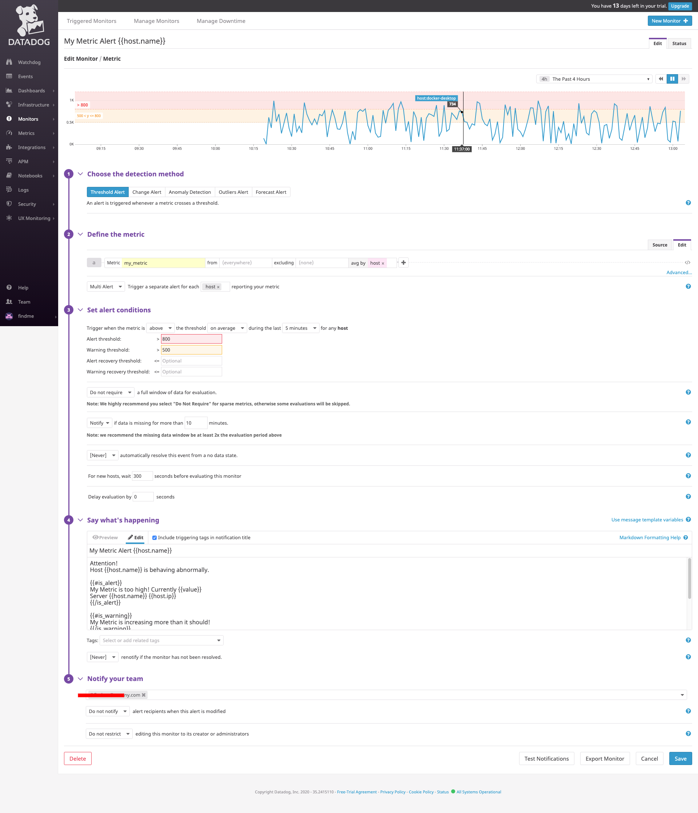


The notification emails are sent as follows:
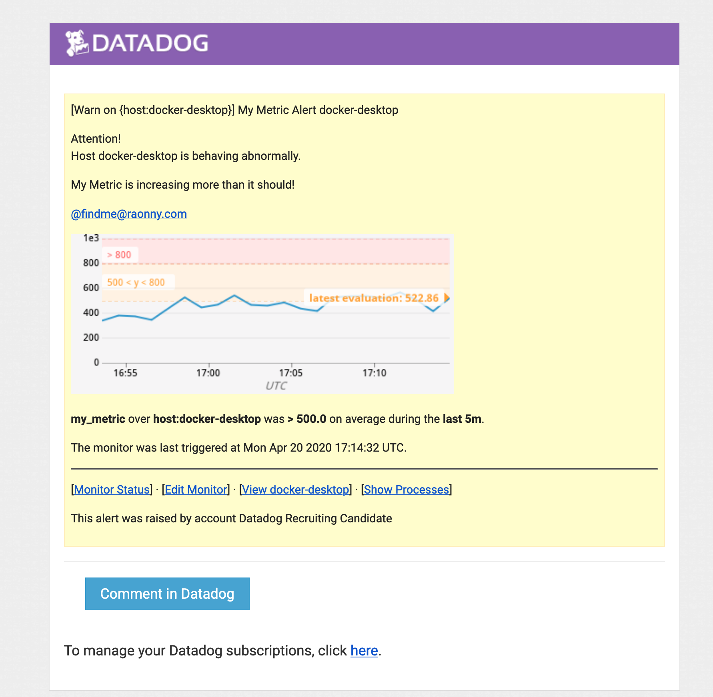

[Metric Link](https://app.datadoghq.eu/monitors#134072/edit)

We can also create Downtimes, so we don't get notifications during the evening or weekends for example, and we can achieve that using the [Monitors -> Manage Downtime](https://app.datadoghq.eu/monitors#downtime) menu.
In this example, we will create one rule for the evenings from 7pm to 9am during weekdays, and another one for the weekends, by clicking on the `Schedule Downtime` button, and feeling the form as follows:

- Weekday:
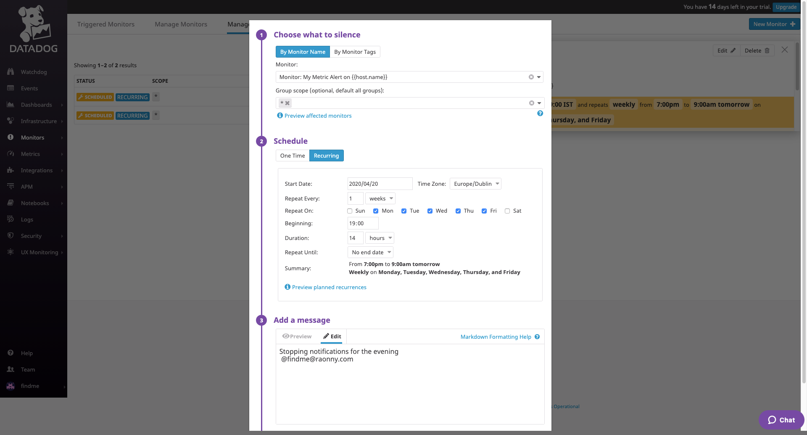


- Weekend:
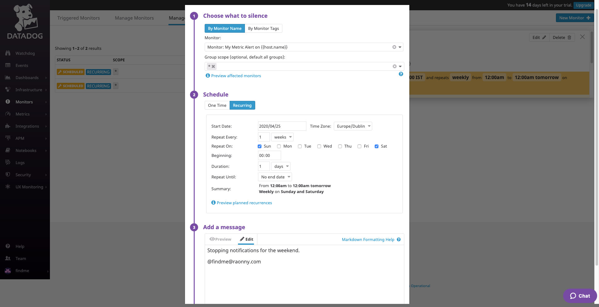


Note that we have a Message field at the bottom, so we can send emails notifying when the downtime is about to occur, as follows:
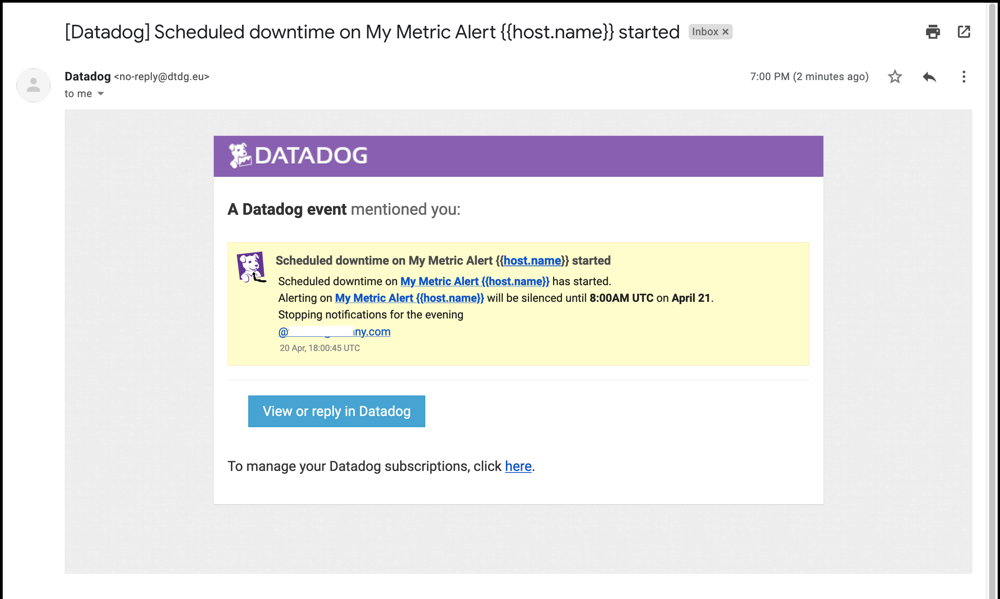


Cool, now we know how to create alerts based on anomalies and also how to disable alerts for a certain period of time.

## Collecting APM Data:
Another powerful Datadog feature is to be able to collect, search, and analyze traces across fully distributed architectures.

[Datadog Application Performance Monitoring](https://docs.datadoghq.com/tracing/) (APM or tracing) provides you with deep insight into your application’s performance - from automatically generated dashboards for monitoring key metrics, like request volume and latency, to detailed traces of individual requests - side by side with your logs and infrastructure monitoring. When a request is made to an application, Datadog can see the traces across a distributed system, and we can show you systematic data about precisely what is happening to this request.

To [enable the APM functionality](https://app.datadoghq.eu/apm/docs?architecture=host-based&language=python), go to the docker ssh terminal, and check if the following directive is enable on the datadog.yaml config file:
```shell script
vim /etc/datadog-agent/datadog.yaml

```
```yaml
apm_config:
    apm_non_local_traffic: true
```
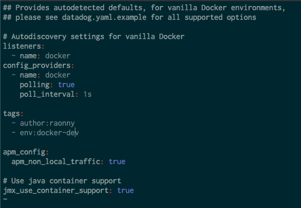


We can setup a simple Flask app to test Datadog’s APM solution. We can run it multiple ways, but for this example I'll run it inside the same `dd-agent` container.
We can achieve this by simply opening a new terminal console, and accessing the container via SSH, as we know: 
```shell script
docker exec -it dd-agent /bin/bash
```

We can use PIP to install the needed dependencies by running:
```shell script
pip install flask
pip install ddtrace
```

We can use the following sample app, by creating a file and running it using ddtrace-run like so:

```shell script
vim /bin/app.py
```

Paste the sample app:
```python
from flask import Flask
import logging
import sys

# Have flask use stdout as the logger
main_logger = logging.getLogger()
main_logger.setLevel(logging.DEBUG)
c = logging.StreamHandler(sys.stdout)
formatter = logging.Formatter('%(asctime)s - %(name)s - %(levelname)s - %(message)s')
c.setFormatter(formatter)
main_logger.addHandler(c)

app = Flask(__name__)

@app.route('/')
def api_entry():
    return 'Entrypoint to the Application'

@app.route('/api/apm')
def apm_endpoint():
    return 'Getting APM Started'

@app.route('/api/trace')
def trace_endpoint():
    return 'Posting Traces'

if __name__ == '__main__':
    app.run(host='0.0.0.0', port='5050')
```

And you can run the app by simply running:
```shell script
ddtrace-run python /bin/app.py
```
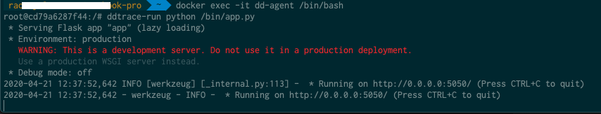

_Note: Using both ddtrace-run and manually inserting the Middleware has been known to cause issues. Please only use one or the other._ 


So, after doing this, we have the app running in one terminal console, and we can go back to the previous console already ssh logged on the container. Or you can open a different one right now if you missed this last step:
```shell script
docker exec -it dd-agent /bin/bash
```

To trigger multiple calls, we can simply run a small shell script that will curl the endpoints 100 times with a sleep in between the runs:
```shell script
for ((i=1;i<=100;i++)); do   curl "localhost:5050/api/apm"; curl "localhost:5050/api/trace"; sleep 1; done
```


Now, if we go back to teh Datadog Website, we will see that the APM sub-menu Services is now enabled:
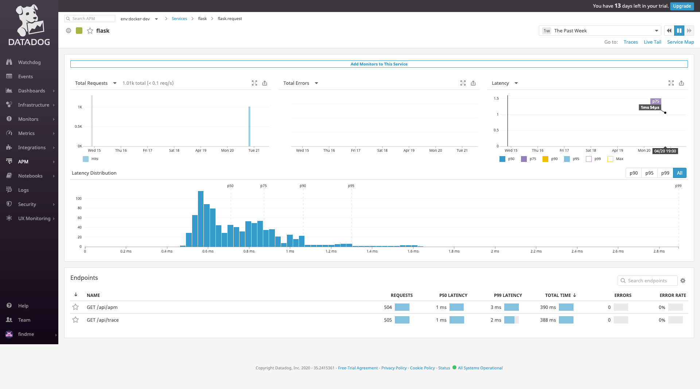


And with that information, we can create dashboards mixing APM, Infra, Custom and all available metrics in a single place:
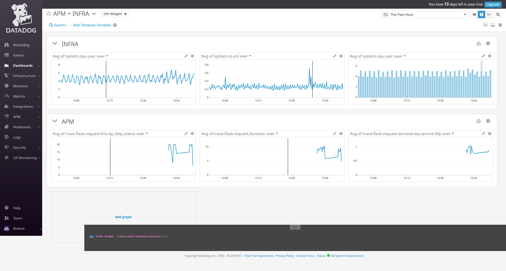

[dashboard link](https://app.datadoghq.eu/dashboard/us3-fmf-5ds/apm--infra?from_ts=1587469829269&to_ts=1587473429269&live=true)

If you are wondering whats difference between Service, Resource, or any other therms, you can use [APM Glossary](https://docs.datadoghq.com/tracing/visualization/) to learn more, and you will learn that:
- Services are the building blocks of modern microservice architectures - broadly a service groups together endpoints, queries, or jobs for the purposes of scaling instances.
- Resources represent a particular domain of a customer application - they are typically an instrumented web endpoint, database query, or background job.


## 42

TODO
