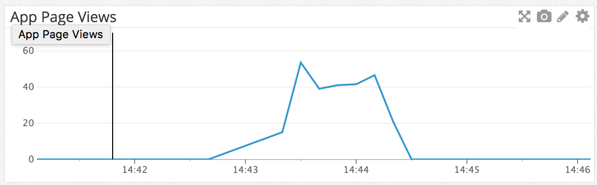
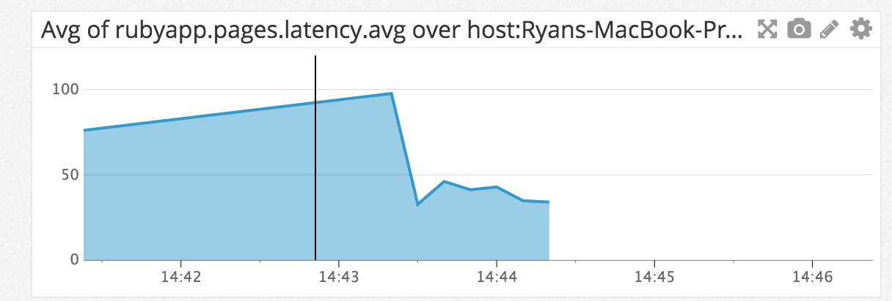
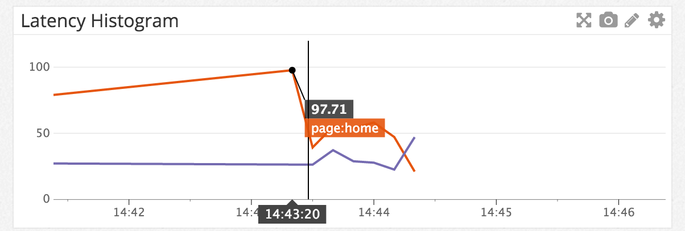
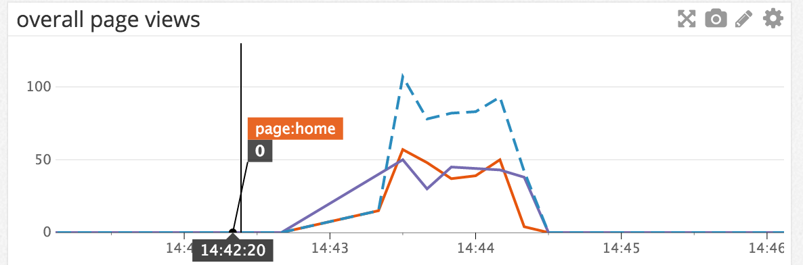
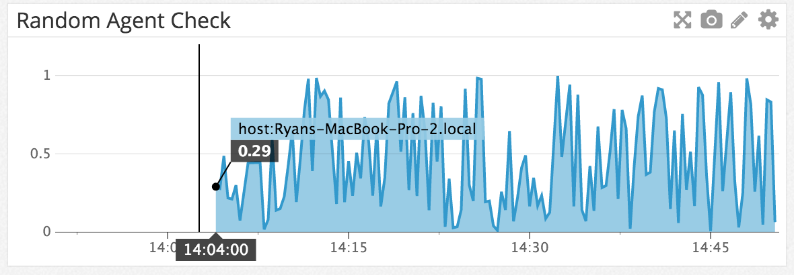
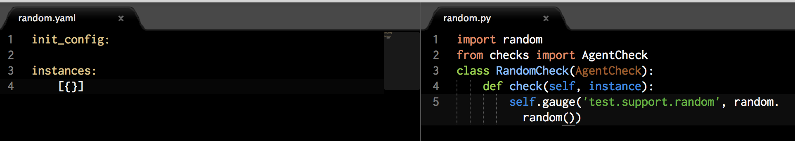
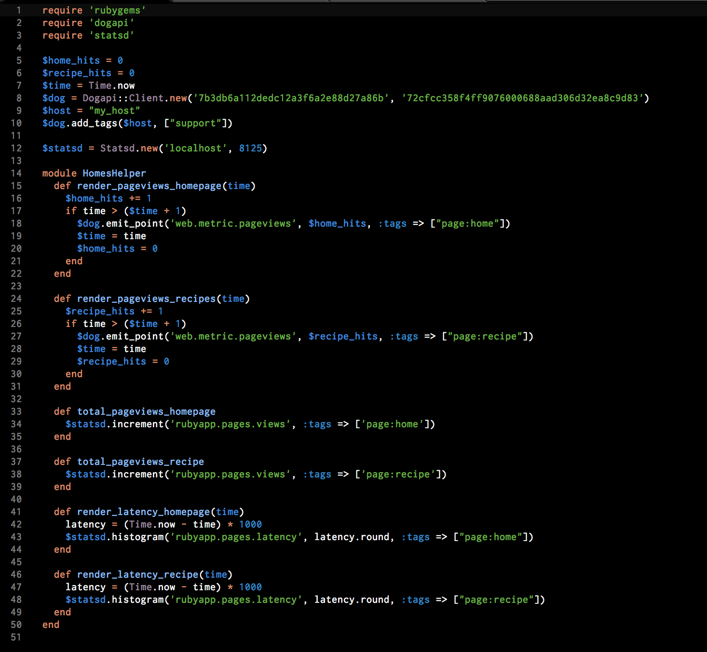

<h3>Ryan Immesberger</h3>

<i>created answers.html to embed iframes</i>

<h5>LEVEL 1:</h5>

1) What is the agent?

A) The agent is a piece of software that runs on your host. It collects events and metrics, then sends them to Datadog where the data can be put to use.

<h5>LEVEL 2:</h5>
  
 1) While running a load test (see References) for a few minutes, visualize page views per second. Send us the link to this graph! 

  
  <!-- <iframe src="https://app.datadoghq.com/graph/embed?token=61f3b8f14f3c99b7c46c99309bef9d77a05b70371eb57288bbf0ff7a0fc6e637&height=300&width=600&legend=true" width="600" height="300" frameborder="0"></iframe> -->

2) Create a histogram to see the latency; also give us the link to the graph.

  
  <iframe src="https://app.datadoghq.com/graph/embed?token=a13976f6cf615c0951ff777992e08f7dd8c99e9a5bce18cd1e6c4f55375892b9&height=300&width=600&legend=true" width="600" height="300" frameborder="0"></iframe>

<h5>LEVEL 3:</h5>

1) tag your metrics per page
    visualize the latency by page on a graph (using stacked areas, with one color per page)

<iframe src="https://app.datadoghq.com/graph/embed?token=c0b10d6de27c22139813bf7a36288a07de30186b8943406afd6c4c3a1a1dd157&height=300&width=600&legend=true" width="600" height="300" frameborder="0"></iframe>

<h5>LEVEL 4:</h5>
  
1)  count the overall number of page views using dogstatsd counters.
      count the number of page views, split by page (hint: use tags)
      visualize the results on a graph

  
  <iframe src="https://app.datadoghq.com/graph/embed?token=9352a988ff7d6cd52faf2b689ecde2b3f42bfb601958a244eb4bf397a4b83ee8&height=300&width=600&legend=true" width="600" height="300" frameborder="0"></iframe>

  
2) Bonus question: do you know why the graphs are very spiky?

  
A) The metric sample size defaults to a 10 second interval. While running a load test the page views get grouped into 10 second intervals varying on local latency. Also running 2 load tests simultaneously on the same machine cause counter-fluxuations due splitting priority between the two. IE: one metric peaks while the other valleys.

<h5>LEVEL 5:</h5>

1) Write an agent check that samples a random value. Call this new metric: test.support.random
   Visualize this new metric on Datadog, send us the link.

  
  <iframe src="https://app.datadoghq.com/graph/embed?token=672efd6d1100a48f98054c6157666dce728050dad24de232bd62309d4a7b6a1f&height=300&width=600&legend=true" width="600" height="300" frameborder="0"></iframe>

<h5>CODE:<h5>

Random Agent Check:

Ruby Integration Code:

