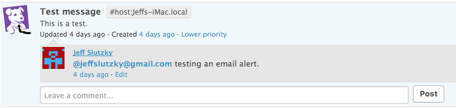
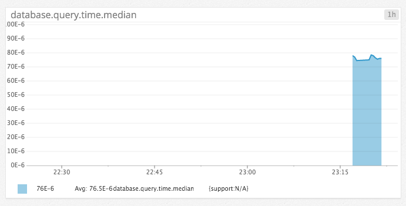

# Level 1

* Sign up for Datadog (use "Datadog Recruiting Candidate" in the "Company" field), get the agent reporting metrics from your local machine.

* Bonus question: what is the agent?

The agent is the software that runs on the user's computer, monitors the metrics, and sends them to Datadog. It consists of the Collector, Dogstatsd, and the Forwarder.

* Submit an event via the API.

Code: see <a href="level1.rb">level1.rb</a>.

* Get an event to appear in your email inbox (the email address you signed up for the account with)

I tried to do this as follows, but no success yet:

# Level 2

* Take a simple web app (in any of our supported languages) that you've already built and instrument your code with dogstatsd. This will create metrics.

My app is a Rails app, so I first added the appropriate gem to my Gemfile:

    gem 'dogstatsd-ruby'

Next I added code to my sessions controller, so it would run whenever the home page is hit:

    class SessionsController < ApplicationController

      def new
        require 'statsd'
        statsd = Statsd.new
        statsd.increment('web.page_views')
      end

* While running a load test (see References) for a few minutes, visualize page views per second. Send us the link to this graph!

I ran a load test on my app locally with the following command:

    ab -n 10000 -c 10 http://127.0.0.1:3000/

Here is the resulting graph: https://p.datadoghq.com/sb/1a534df4e-6235422a4d

* Create a histogram to see the latency; also give us the link to the graph

I changed my session controller's "new" method to the following adding a "before" action to create a time starting point:

    class SessionsController < ApplicationController
      before_action :get_time

      def new
        require 'statsd'
        statsd = Statsd.new
        duration = Time.now - @start_time
        statsd.histogram('database.query.time', duration)
      end

And I added the following private method:

    private
      def get_time
        @start_time = Time.now
      end

I ran this test in Terminal:

    ab -n 3000 -c 10 http://127.0.0.1:3000/

Here is the resulting graph:

* Bonus points for putting together more creative dashboards.
[FORTHCOMING]

# Level 3

* Using the same web app from level 2:

* tag your metrics with support (one tag for all metrics)

I adjusted my "new" method in the sessions controller by assigning a tag:

    def new
      require 'statsd'
      statsd = Statsd.new
      duration = Time.now - @start_time
      statsd.histogram('database.query.time', duration, :tags => ['support'])
    end

Then I set the metrics on the graph via the following JSON:

    {    
      "viz": "timeseries",
      "requests": [
        {
          "q": "avg:database.query.time.median{* } by {support}",
          "aggregator": "avg",
          "conditional_formats": [],
          "type": "area"
        }
      ]
    }

Here is the resulting graph:

* tag your metrics per page (e.g. metrics generated on / can be tagged with page:home, /page1 with page:page1)

* visualize the latency by page on a graph (using stacked areas, with one color per page)
