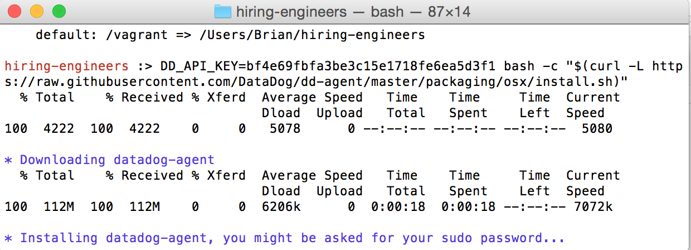

#The Challenge

I began by installing the latest versions of vagrant and virtual box to run Datadog's software on a virtua machine to avoid running into any OS or dependency issues. This would be my first time utilizing a virtual machine, so I spent some time researching them, as well as inspecting the Virtual Box application on my hard drive.

After I finshed installing the virtual machine, I navigated over to the Datadog website and began filling out the "Getting Started" fields. I was subsequently redirected to the stack page and found all of the software usually included in one of my stacks besides JavaScript. My chosen stack was Ruby, PostgreSQL, Slack, and Git.

Finally, I moved on to the agent setup where a simple terminal command was used to install the agent on my local machine.

