# Answers from Virgilio Sanz

## Intro
I am using a website I am its sysadmin. It's a production site with real
traffic. It is based on a Wordpress installed on an VPS Ubuntu machine: nginx,
mysql, php-fpm and cloudflare as the CDN. It servers and averge of two and a
half million request per day for arround thirty thousand users.

I have found Datadog very easy and stright forward to install and set up. I can
see what huge potential it has after understading custom metrics, dashboards,...

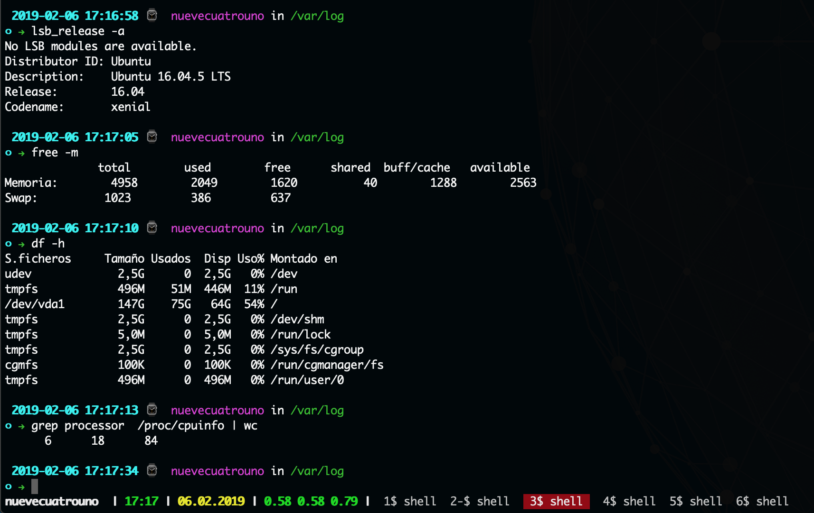{ width=50% }

## Installing the agent
It has been stright forward following the instructions when I register at
datadog:

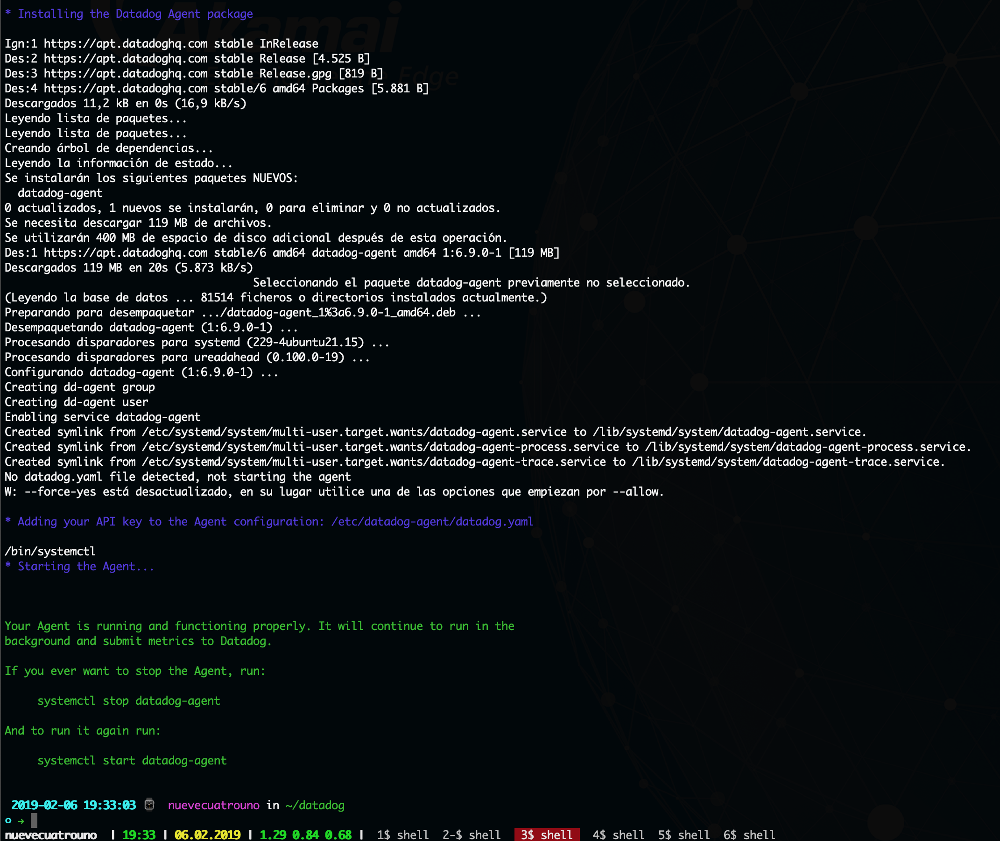

The agent is up and running with no issues:

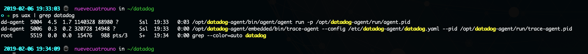

## Setting up datadog

So, I tag the host....

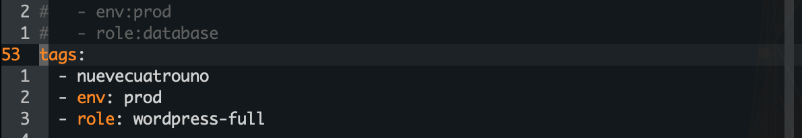

Setting up MySQL:

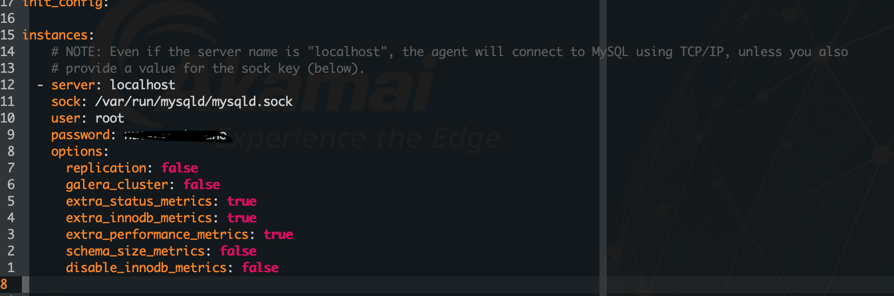

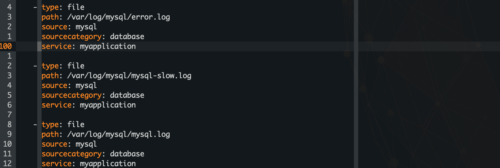

Even it's not required I have configured nginx, php-fpm and cloudflare. So, I
have a complete vew on my syustem.

Here the resulted default dashboards...

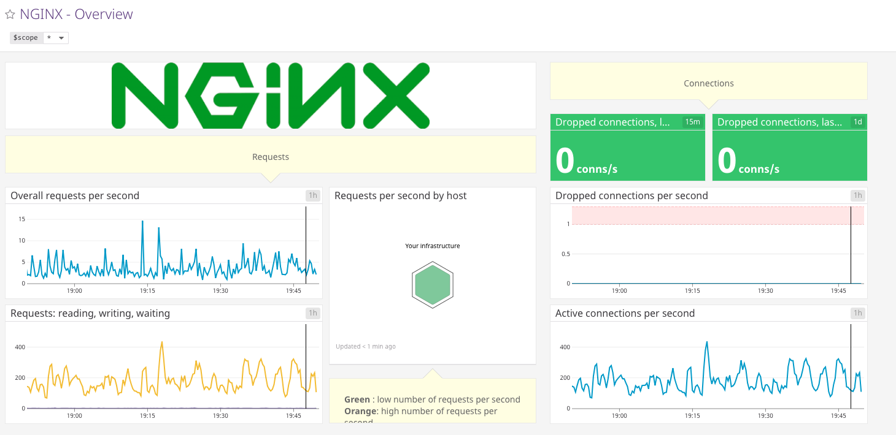

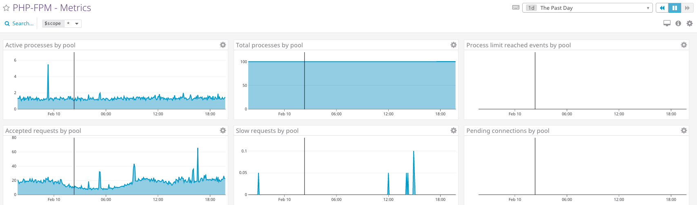

## Collecting Metrics:

### Add tags in the Agent config file and show us a screenshot of your host and its tags on the Host Map page in Datadog.
See below at Setup Section

### Install a database on your machine (MongoDB, MySQL, or PostgreSQL) and then install the respective Datadog integration for that database.
See below at Setup Section

### Create a custom Agent check that submits a metric named my_metric with a random value between 0 and 1000.
Following the instructions at
https://docs.datadoghq.com/developers/write_agent_check/?tab=agentv6 I have
creted the source code and copy to correct locations:

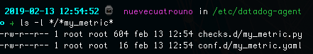

### Change your check's collection interval so that it only submits the metric once every 45 seconds.
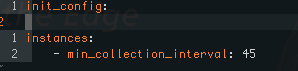

### Bonus Question Can you change the collection interval without modifying the Python check file you created?
I changed in the yaml file, that is the configuration for the agent in the
python file.

The final result of my_metric:
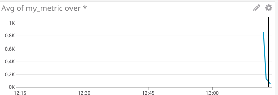

## Visualizing Data:
### Utilize the Datadog API to create a Timeboard:
I install the datadog python library first:

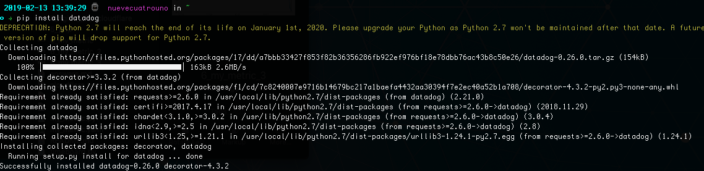

Code to create the timeboard at: [timeboard_python_file](timeboard.py)

### Once this is created, access the Dashboard from your Dashboard List in the UI:
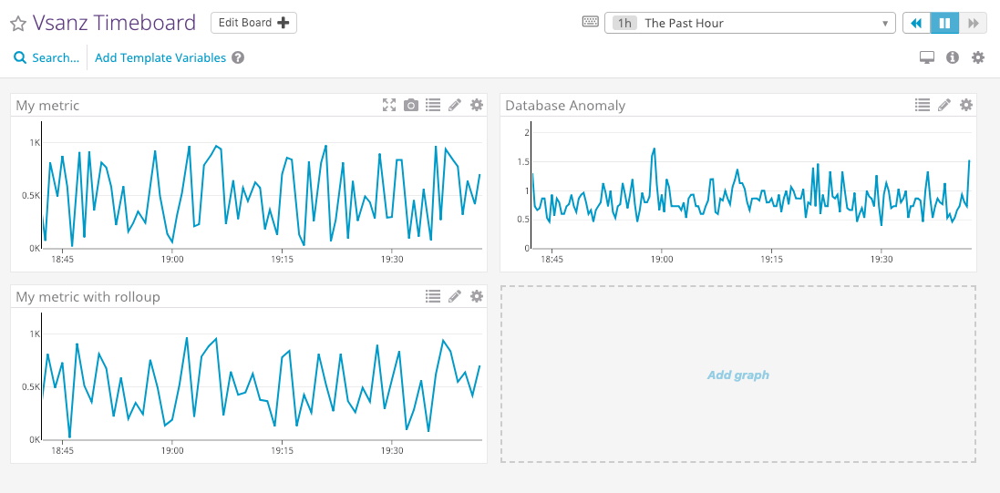 "Dashboard created by API")

### Create a new Metric Monitor that watches the average of your custom metric (my_metric) and will alert if it’s above the following values over the past 5 minutes:
### Bonus Question: Since this monitor is going to alert pretty often, you don’t want to be alerted when you are out of the office. Set up two scheduled downtimes for this monitor:

I cound't find the way of doing it. I was following the steps at: https://docs.datadoghq.com/graphing/dashboards/shared_graph/

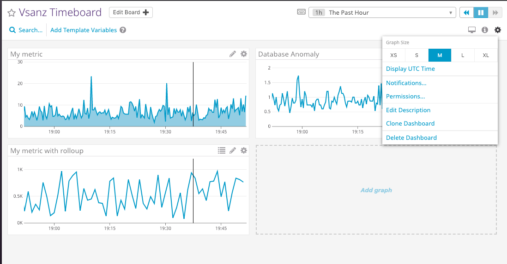

## Monitoring Data

On creating the monitor.

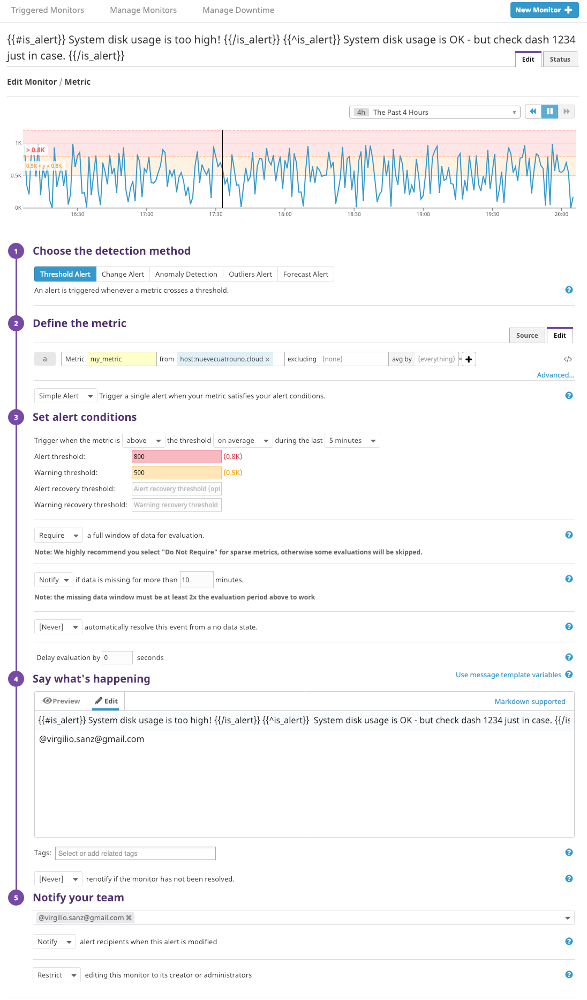

### Bonus Question: Since this monitor is going to alert pretty often, you don’t want to be alerted when you are out of the office. Set up two scheduled downtimes for this monitor:

One that silences it from 7pm to 9am daily on M-F,
And one that silences it all day on Sat-Sun.
Make sure that your email is notified when you schedule the downtime and take a screenshot of that notification.

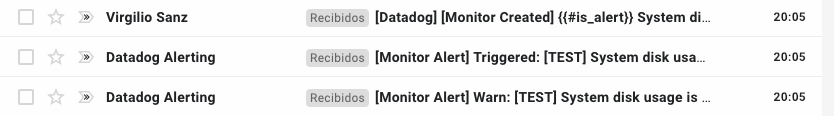
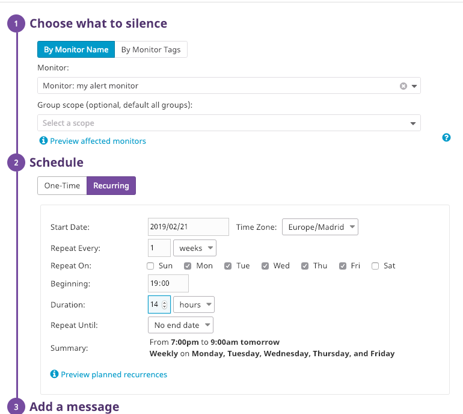
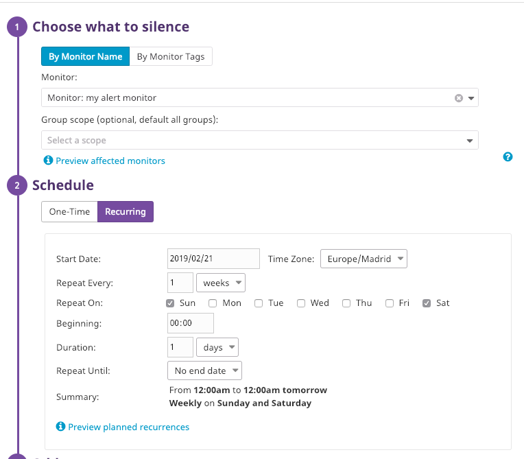
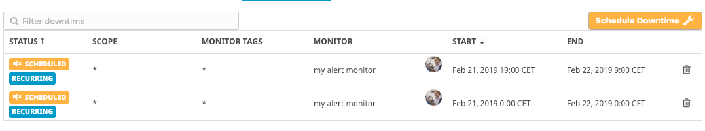

## Collecting APM Data:
Because I am using a real website I am not creating the flask web sample.

by the way a service is a group of procceses that do the same job. A resource is
an action of a service

I integrate the whole system, as you can see here:
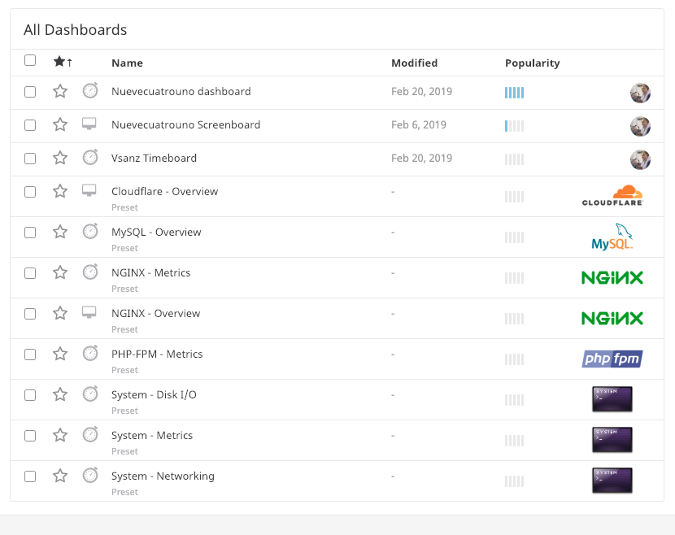

## Final Question
### Is there anything creative you would use Datadog for?

I came up with an idea of monitoring HLS (and probably other HTTP streaming
proptocols as DASH). The idea is integrating the CDN logging system and look at
the "time-taken" value. A HLS chunk has 10 seconds of video, so if the
tame-taken value is bigger the user is having a bad experience. It would be
great if the system can show reports per ASN and per country. I know that mapping
an IP to the ASN it belongs is not an easy task. I know it, because I had to
develop it for an Akamai customer interestd in knowing traffic per ASN. I manage
developing a C library, I haven't realsed yet, but it is capable of doing 9
million queries on my macbook air on the more than six hunderd thousand ASNs.

Finally, I am working with Datadog to integrate Akamai stats on a common
customer in Spain. :-)

