## Environment Setup

For the purpose of this exercise, I am using an AWS EC2 (machine is Ubuntu 18.04.4 LTS)
Server is installed with latest packages


I have signed up for Datadog with email jgdesanti@yahoo.com, copied my API key and installed the latest agent


Agent is installed


Now lets check the Datadog UI to verify that the agent is reporting correctly and data is being collected


First step is complete


## Collecting Metrics
* Add tags in the Agent config file and show us a screenshot of your host and its tags on the Host Map page in Datadog.


I am adding tags to the agent configuration file and restarting the agent

` sudo vi /etc/datadog-agent/datadog.yaml`
` sudo service datadog-agent restart`


Then checking in the UI that my new tags are displayed


* Install a database on your machine (MongoDB, MySQL, or PostgreSQL) and then install the respective Datadog integration for that database.

I am installing MongoDB 4.2.6 on my machine


Check the Mongo logs


Configure the MongoDB integration in /etc/datadog-agent/conf.d/mongo.d


Check Datadog Log File
`cat /var/log/datadog/agent.log`


Finally Check that integration is working properly and MongoDB is detected


* Create a custom Agent check that submits a metric named my_metric with a random value between 0 and 1000.

Create a new yaml file in /etc/datadog-agent/conf.d for my_metric config :
`init_config:

instances:
  [{}]
`
create my_metric.py
```python
import random

from checks import AgentCheck
class HelloCheck(AgentCheck):
  def check(self, instance):
    self.gauge('my_metric', random.randint(0,1000))
```
restart agent

`sudo systemctl restart datadog-agent`

Now lets check if the new metric is being received in the metrics explorer
https://app.datadoghq.com/metric/explorer


* Change your check's collection interval so that it only submits the metric once every 45 seconds.

By default, metric interval is 15 sec, to change this i am editing the check configuration file
`sudo vi my_metric.yaml`

`init_config:

instances:
  - min_collection_interval: 45`
restart the agent
` sudo systemctl restart datadog-agent`

Check the logs for updated time interval

`2020-05-17 21:14:32 UTC | CORE | INFO | (pkg/collector/scheduler/scheduler.go:83 in Enter) | Scheduling check my_metric with an interval of 45s`


* **Bonus Question** Can you change the collection interval without modifying the Python check file you created?
My understanding is that only modifying the config yaml file is needed, not the python check file, variable min_collection_interval and the value is seconds


## Visualizing Data:
Utilize the Datadog API to create a Timeboard that contains:

First lets create and API and Application key with name API


Now, I created a curl script to check my credentials

` ./dd_api_validate.sh`
{"valid":true}ubuntu@ip-172-31-31-136:~$

`curl "https://api.datadoghq.com/api/v1/validate" \
    -H "DD-API-KEY: xxx" \
    -H "DD-APPLICATION-KEY: xxx"`
    
  As suggested in the referecnes I am using this link https://docs.datadoghq.com/api/
  And building my queries with Postman
  
  
  
Timeboards :

* Your custom metric scoped over your host.
* Any metric from the Integration on your Database with the anomaly function applied.
Using this as a reference : https://docs.datadoghq.com/dashboards/functions/algorithms/#anomalies
* Your custom metric with the rollup function applied to sum up all the points for the past hour into one bucket


Code :
```
curl --location --request POST 'https://api.datadoghq.com/api/v1/dashboard' \
--header 'Content-Type: application/json' \
--header 'DD-API-KEY: xxx' \
--header 'DD-APPLICATION-KEY: xxx' \
--header 'Content-Type: text/plain' \
--header 'Cookie: DD-PSHARD=198' \
--data-raw '{
    "title": "JG Dashboard",
    "widgets": [
        {
            "definition": {
                "type": "timeseries",
                "requests": [
                    {
                        "q": "my_metric{*}"
                    }
                ],
                "title": "Custom Metric"
            }
        },
        {
            "definition": {
                "type": "timeseries",
                "requests": [
                    {
                        "q": "anomalies(mongodb.stats.objects{*}, '\''basic'\'', 2)"
                    }
                ],
                "title": "Mongo objects anomalies"
            }
        },
         {
            "definition": {
                "type": "timeseries",
                "requests": [
                    {
                        "q": "avg:my_metric{*}.rollup(sum, 3600)"
                    }
                ],
                "title": "Custom metric rollup"
            }
        }
    ],
    "layout_type": "ordered",
    "description": "My dashboard",
    "is_read_only": true,
    "notify_list": [
        "jgdesanti@yahoo.com"
    ],
    "template_variables": [
        {
            "name": "host",
            "prefix": "host",
            "default": "i-0447418a43d6de5db"
        }
    ],
    "template_variable_presets": [
        {
            "name": "Saved views for hostname 2",
            "template_variables": [
                {
                    "name": "host",
                    "value": "<HOSTNAME_2>"
                }
            ]
        }
    ]
}'
```

Sending the API POST
  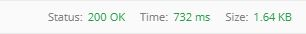


Once this is created, access the Dashboard from your Dashboard List in the UI:

  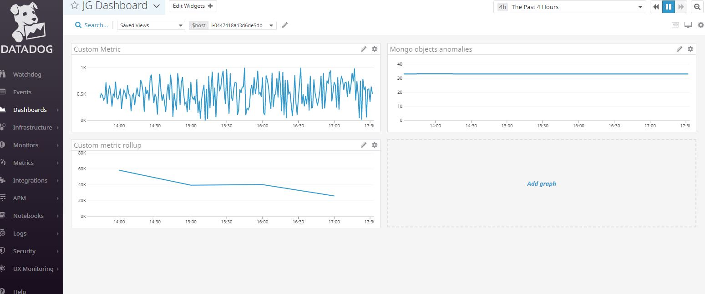


* Set the Timeboard's timeframe to the past 5 minutes
* Take a snapshot of this graph and use the @ notation to send it to yourself.

  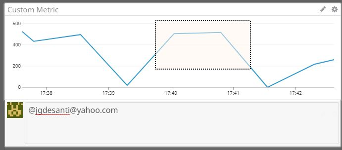


* **Bonus Question**: What is the Anomaly graph displaying?

The anomaly graph is displaying activites out of the ordinary for metrics it is applied to. On my dashboard the Mongo metric is pretty flat therefore not triggered, once applied to the custom metric (generated randomly) we can see the anomalies getting highlited.

See screenshot below :
  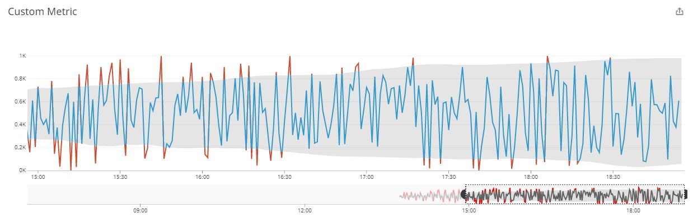


## Monitoring Data

Since you’ve already caught your test metric going above 800 once, you don’t want to have to continually watch this dashboard to be alerted when it goes above 800 again. So let’s make life easier by creating a monitor.

Create a new Metric Monitor that watches the average of your custom metric (my_metric) and will alert if it’s above the following values over the past 5 minutes:

* Warning threshold of 500
* Alerting threshold of 800
* And also ensure that it will notify you if there is No Data for this query over the past 10m.

For that step I am using the Monitor feature
https://app.datadoghq.com/monitors/manage

Creating "My Metric Alert"

with the following settings
1. Threshold alert
2. monitor "my_metric"
3. alert condition of >=800 and warning threshold of >=500
4. following action :
```{{#is_alert}} My metric is in alert mode (avg >=800) {{/is_alert}}

{{#is_warning}} My metric is in warning mode (avg >=500) {{/is_warning}}

{{#is_no_data}} My metric is not sending data {{/is_no_data}} 

metric value is : {{value}} from host {{host.ip}}

 @jgdesanti@yahoo.com
 ```
 5.email to jgdesanti@yahoo.com
 
  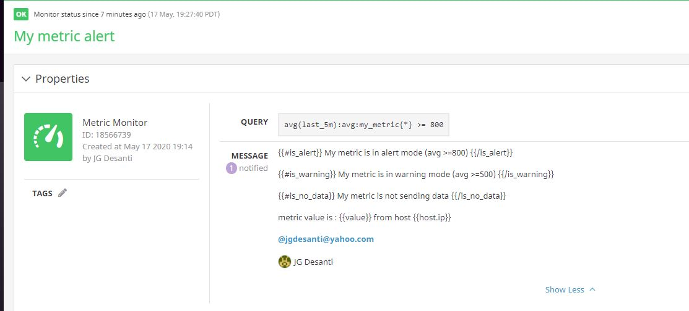
 
 
 see screenshots below for email notification
 
   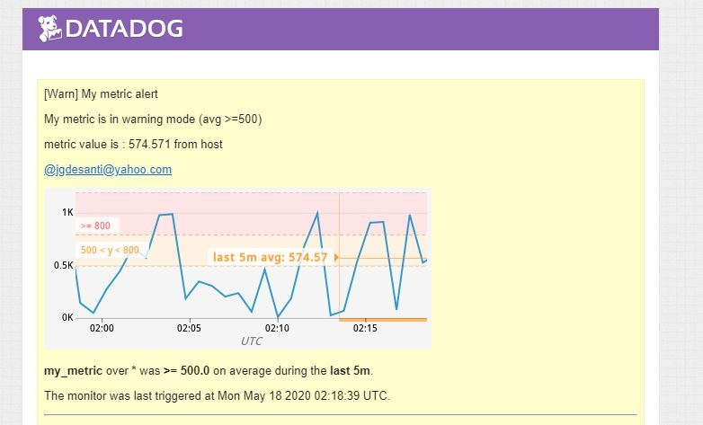

 
 
 * **Bonus Question**: Since this monitor is going to alert pretty often, you don’t want to be alerted when you are out of the office. Set up two scheduled downtimes for this monitor:

  * One that silences it from 7pm to 9am daily on M-F,
  * And one that silences it all day on Sat-Sun.
  * Make sure that your email is notified when you schedule the downtime and take a screenshot of that notification.
  
  For this we are using the https://app.datadoghq.com/monitors#/downtime section
  
  see screenshot for weeknight silence
     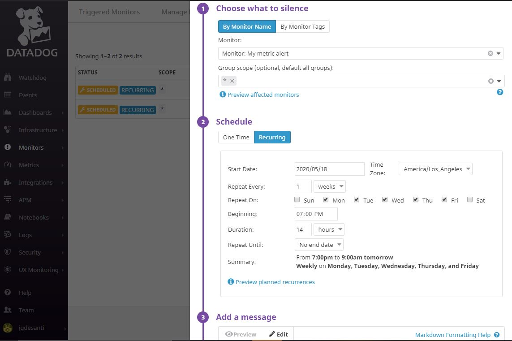
  
  see screenshot for weekend silence
   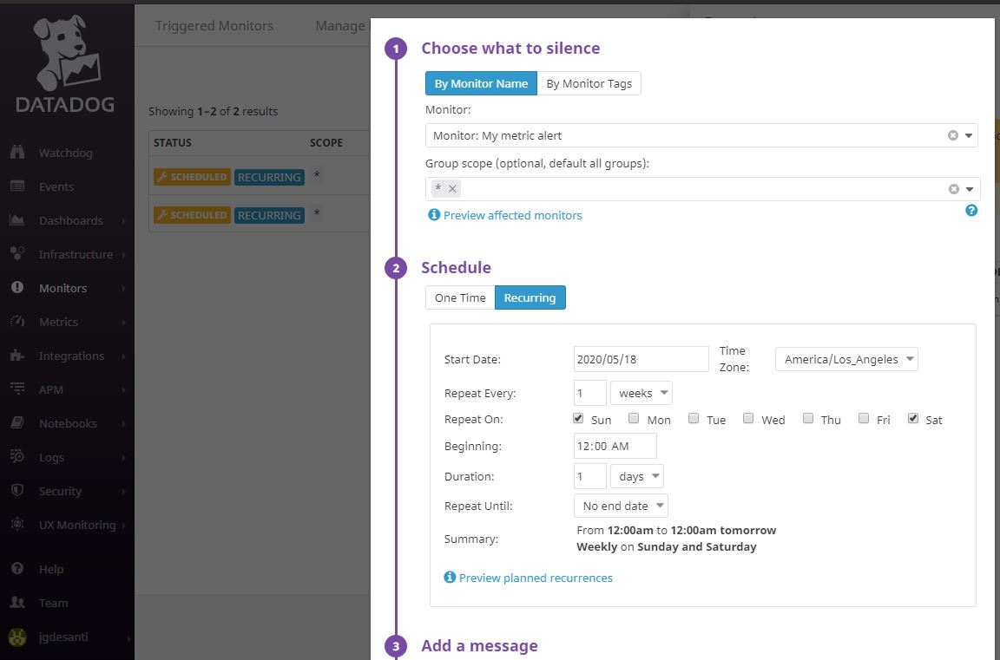
   
   
   ## Collecting APM Data:
  
  Given the following Flask app (or any Python/Ruby/Go app of your choice) instrument this using Datadog’s APM solution:

For this step I am running the flask app within my EC2 machine and had to resolve some dependencies issues before installing the ddtrace pacckage (used the following for reference : https://www.datadoghq.com/blog/monitoring-flask-apps-with-datadog

the following fixed dependencies :


```
sudo apt-get install python3 python-dev python3-dev \
     build-essential libssl-dev libffi-dev \
     libxml2-dev libxslt1-dev zlib1g-dev \
     python-pip
```
```
pip install ddtrace
pip install cython
pip install wheel
```

Once all installed i am running the Flask app with :

```(venv) ubuntu@ip-172-31-31-136:~/my_flask_app$ DATADOG_ENV=flask_test ddtrace-run flask run --port 8000 --host=0.0.0.0
```

see screenshosts below :

 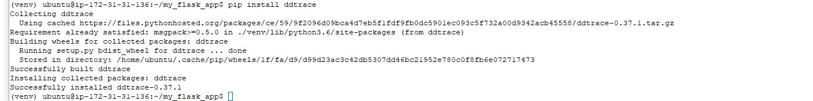
  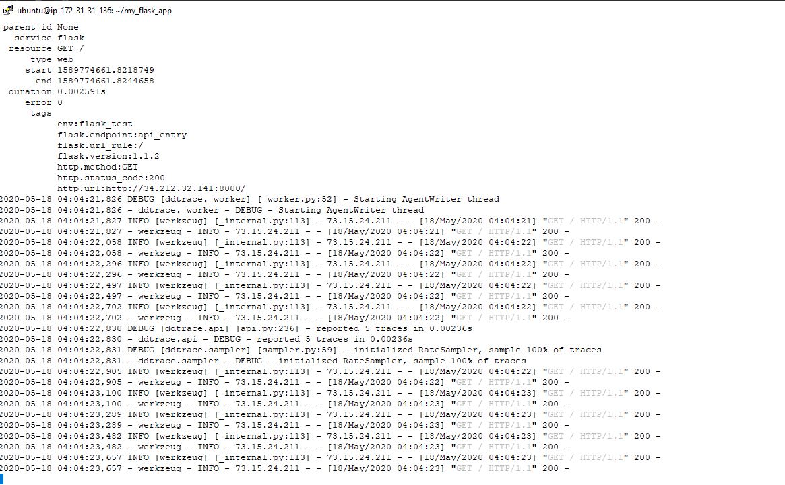

* **Bonus Question**: What is the difference between a Service and a Resource?

a service contains multiple resources, each resource can be an individual endpoints or queries for that service.


Provide a link and a screenshot of a Dashboard with both APM and Infrastructure Metrics.

Dashboard : 

  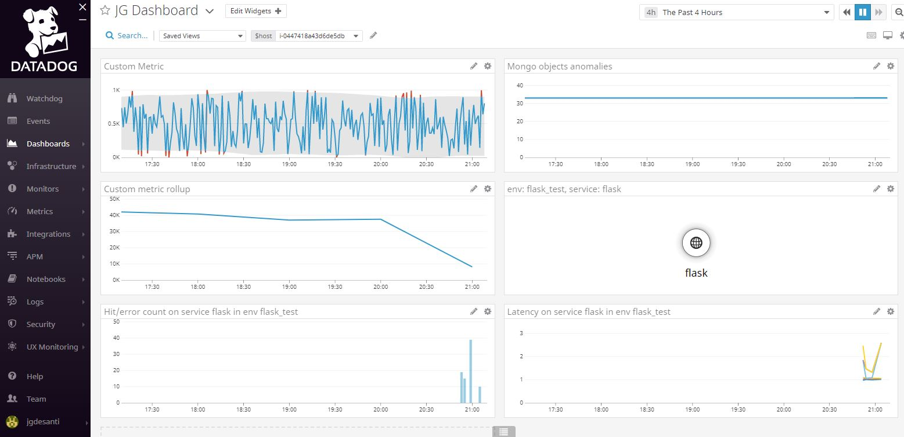

Link : https://p.datadoghq.com/sb/bgawohmddftjb2m9-85b284b7e9ccfea5f6c390ddaf43bca1

## Final Question:

Datadog has been used in a lot of creative ways in the past. We’ve written some blog posts about using Datadog to monitor the NYC Subway System, Pokemon Go, and even office restroom availability!

Is there anything creative you would use Datadog for?

Unofrtunately right now i can only think about a Covid tracker dashboard, tracking cases, individual tracing, contamination risks and exposures.

