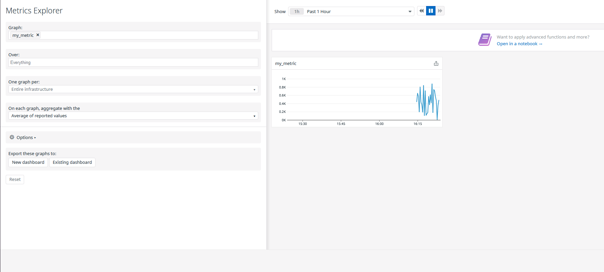
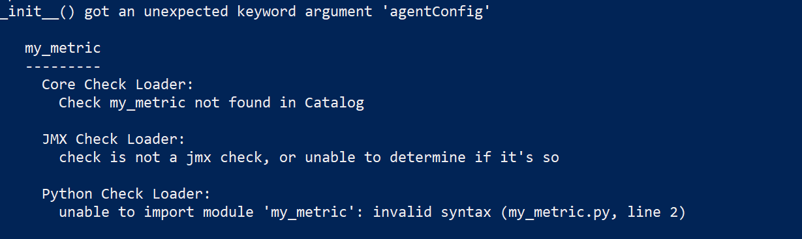
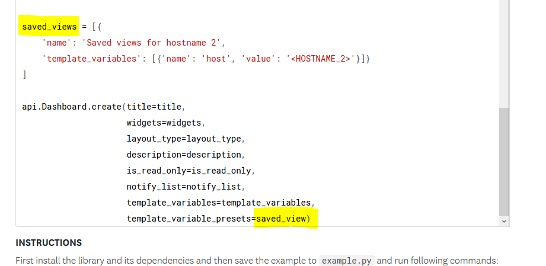

## Prerequisites - Setup the environment
My name is Alan Donoghue and this is my submission for the hiring engineers task for the role of Sales engineer in Datadog for the Dublin office.

Before we start, as this submission is written in Markdown, I thought I'd share a helpful tip sheet I use whenever I need a little helping hand. The link is [here](https://github.com/adam-p/markdown-here/wiki/Markdown-Cheatsheet).

Most of my development experience has been using linux and MacOS, I'm an avid fan of Docker and have extensive experience making use of it but for this submission, I decided it was best to not use it as a fresh install of Linux as it is more mutable and easier to troubleshoot problems along the way.

I have never used Vagrant but I'm finding it to be a very nice tool that makes with working with Virtualbox a much more simlistic and a pleasant experience.


The commands I used to setup a box are the following:
```
 vagrant box add bento/ubuntu-20.04
```

This commands searches through vagrant's defualt repository and downloads the generic Ubuntu 20.04 and its it to the local virtual machine hyperviser. In my case, I used virtualBOx as it was already installed but you can choose from a number of different providers including Vmware, parallels and hyperv.

Once downloading was completed, I run the box using:
```
vagrant init

vagrant up
```

Vagrant init sets up a project and places an initial Vagrantfile in the directory that you are currently. It is the configuration file for the project. You might use this file for hypervisor specific settings, port forwading etc. To get more informtion on the file, click [here](https://www.vagrantup.com/docs/vagrantfile)

I had an initial error as I had not updated the Vagrant file to match the box that I had download, in the vagrant file, I replaced `"base"` with `"bento/ubuntu-20.04"` in this line

```
config.vm.box = "bento/ubuntu-20.04"
```

Once the virtual machine had been setup, I connected the agent to my new VM by following the easy steps here: [Setting up a Datadog Agent - Ubuntu ]https://app.datadoghq.eu/account/settings#agent/ubuntu)

```
DD_AGENT_MAJOR_VERSION=7 DD_API_KEY=MY_API_KEY bash -c "$(curl -L https://raw.githubusercontent.com/DataDog/datadog-agent/master/cmd/agent/install_script.sh)"
```


## Collecting Metrics


* Add tags in the Agent config file and show us a screenshot of your host and its tags on the Host Map page in Datadog.

In the datadog-agent status, I could see that the location of the datadog agent config file is:

```
/etc/datadog-agent/
```

In the datadog.yaml, I added the following to it:
```
tags:
    - user:alan
    - city:dublin
    - cake:is-a-lie
```

Below is a screenshot of the tags in the agent config file:


and in the host map section in the Datadog platform: 


* Install a database on your machine (MongoDB, MySQL, or PostgreSQL) and then install the respective Datadog integration for that database.


I haven't used mongoDB since college so I was curious to see what has changed so I decided to pick it for this submission.


For Ubuntu, mongoDb is still not up to date in ubuntu's package manager so you must manually add its public key to the package manager and add mongoDB to the package managers sources list. All commands I used can be  retrieved [here](https://docs.mongodb.com/manual/tutorial/install-mongodb-on-ubuntu/)

Finally, once mongo is installed, I start the service with the following command:

```
sudo service mongod start
```

I checked to see if everything was all good by looking at the status of the service with this line:

```
sudo service mongod status
```

With mongoDb running, I then proceeded to add the datadog intergation so from the terminal, I accessed the mongo service with the following command: 

```
mongo --port 27017
```

Normally, I would security added to the DB but for demo purposes, its not enabled.

In the mongo terminal, I added the a dotadog red only user to the DB:
```
use admin
db.createUser({
  "user": "datadog",
  "pwd": "<UNIQUEPASSWORD>",
  "roles": [
    { role: "read", db: "admin" },
    { role: "clusterMonitor", db: "admin" },
    { role: "read", db: "local" }
  ]
})
```

To set the datadog agent to collect metrics, In the agent config directory, I copied the example conf.
```
sudo cp conf.d/mongo.d/conf.yaml.example conf.d/mongo.dconf.yaml
```

I updated the host to point to the local mongo instance and added the datadog username and password

then verified it was up and running by checking the datadog-agent status command again


Im not 100% sure if this is supposed to check a custom agent for mongo but I googled custom agent checks in Datadog and I decided to follow these tutorials here:  [Agent Checks](https://docs.datadoghq.com/developers/agent_checks/) and [Write Checks](https://docs.datadoghq.com/developers/write_agent_check/?tab=agentv6v7)


As mentioned in the tutorial, there is no real time information being passed but a sequence called instances containing at least one mapping need. 


```
sudo nano /etc/datadog-agent/conf.d/my_metric.yaml
```
I inserted the following into the yaml file, saved and closed:
```
instances: [{}] 
````

Following the same procedure, I added  the following code into the python file in `checks.d/my_metric.py` from the root of the datadog agent.

I followed the hello example to the letter expect renaming everything to my_metric where appropriate and added random funtion instead of returning 1.

#### Python Code
```
from random import randint

try:
    # first, try to import the base class from new versions of the Agent...
    from datadog_checks.base import AgentCheck
except ImportError:
    # ...if the above failed, the check is running in Agent version < 6.6.0
    from checks import AgentCheck
# content of the special variable __version__ will be shown in the Agent status page
__version__ = "1.0.0"
class MyMetricCheck(AgentCheck):
    def check(self, instance):
        self.gauge('my_metric', randint(0, 1000), tags=['user:alan'])
```

Again, I restarted the agent and was able to see the update on the metrics explorer:




I actually had a problem at first as the metrics had not been recieved in my datadog portal so I checked the logs for datadog locally with this command:

```
tail -f -n 200 /var/log/datadog/agent.log
```
which grabs the last 200 logs for them file and any logs any further logs that come in realtime.

The error showed up in the logs and it was an easy fix.



* Change your check's collection interval so that it only submits the metric once every 45 seconds.

In the Collection interval section of the [Custom agent Check](https://docs.datadoghq.com/developers/write_agent_check/?tab=agentv6v7#collection-interval), it gives you the code to change the collection interval. 

I inserted code given in under the instances section of the  my_metric yaml file. All I changed was the min collection interval to 45.
```
sudo nano /etc/datadog-agent/conf.d/my_metric.yaml
```

```
init_config:
instances:
   -  min_collection_interval: 45
```

I'm not 100% sure if this correct as there is a note in the documentation that states: "Note: If the min_collection_interval is set to 30, it does not mean that the metric is collected every 30 seconds, but rather that it could be collected as often as every 30 seconds. The collector will try to run the check every 30 seconds but the check might need to wait in line, depending on how many integrations are enabled on the same Agent." but I couldn't find any more suitable alternatives.

I also found that if in the metrics dashboard under metric summery, you can set the interval here as well but I suspect the same principal applies to the accuracy of the interval.


## Visualizing Data:
** NOTE: Timeboards are deprecated, in the place Dashboards are used **


To interface with the datadog, I chose python as it was already installed on the machine. I just needed to add pip3 python's package manager and then install the datadog SDK for python which is just wrapper to the datadog to make it easier for development. I did this with the following commands:

```
sudo apt install -y python3-pip
&&
sudo pip3 install datadog
```

Normally, I would use virtualenv to isolate any packages for any python development but as this is a disposable virtual machine, I thought that it wasn't required.

I went on to Datadog's API reference and the example code for creating dashboards [here](https://docs.datadoghq.com/api/latest/dashboards/)

When I first ran the example, I spotted an immediate mistake in the documentation where the dictionary was named `saved_views` but the variable `saved_view` is what is actually passed in. I have highlighed the mistake in the screenshot below.

 

I fixed the mistake and then ran the code with the following lines: 

```
export DD_SITE="datadoghq.eu"
python datadog-sub.py
```
 There was no errors but no dashboard was created in the platform so I wrapped the dashbaord create call in a try catch statement and retrieved the response which was a forbidden error, after double checking that my keys were correct and after a few different attempts, I suspected it might be the fact that maybe the environment variable for setting the url to datadog eu site wasn't working as intended. 

 This lead me to go to github page for [Datadogs python API](https://github.com/DataDog/datadogpy/search?q=DD_SITE) and I searched for the variable to no avail.

 Finally, I searched for the initialise method and found that you could pass the API endpoint into it as shown [here](https://github.com/DataDog/datadogpy/blob/master/datadog/__init__.py#L65).

 This fixed the issue and I was able to create my first dashboard. Below is the code I used for the first dashboard:

 ```
from datadog import initialize, api
import sys

if __name__ == "__main__":
    print(f"Arguments count: {len(sys.argv)}")
    for i, arg in enumerate(sys.argv):
        print(f"Argument {i:>6}: {arg}")

# Added a couple of lines here to add the api keys as arguements to pass in
options = {
    'api_key': sys.argv[1],
    'app_key': sys.argv[2],
    'api_host': 'https://datadoghq.eu'
}

initialize(**options)

title = 'Visualising data'
widgets = [{
    'definition': {
        'type': 'timeseries',
        'requests': [
            {'q': 'avg:my_metric{*}'}
        ],
        'title': 'Averages for my metric'
    }
}]
layout_type = 'ordered'
description = 'Datadog recruiting.'
is_read_only = True
notify_list = ['alandonoghue9@gmail.com']
template_variables = [{
    'name': 'host1',
    'prefix': 'host',
    'default': 'my-host'
}]

saved_views = [{
    'name': 'Saved views for alan.submission',
    'template_variables': [{'name': 'host', 'value': 'alan.submission'}]}
]


try:
        # Create a new dashboard
        api_response =  api.Dashboard.create(title=title,
                                             widgets=widgets,
                                             layout_type=layout_type,
                                             description=description,
                                             is_read_only=is_read_only,
                                             notify_list=notify_list,
                                             template_variables=template_variables,
                                             template_variable_presets=saved_views)
        print(api_response)
except ApiException as e:
        print("Exception when calling DashboardsApi->create_dashboard: %s\n" % e)

```


For anomoly detection and rollop, I needed to use the Datadog docs again for answers and I found them with the two links below:

[Anomoly Detection](https://docs.datadoghq.com/monitors/monitor_types/anomaly/)

[Rollup](https://docs.datadoghq.com/dashboards/functions/rollup/)


For Anomoly detection, I used average memory for Mongo which I took the idea from the ready made dashboard in the platform. Using the documents above, I found it simple enough to add all the widgets resulting in this dashboard.


The final code I used to create the dashboard is below:
```
from datadog import initialize, api
import sys

if __name__ == '__main__':
    print(f'Arguments count: {len(sys.argv)}')
    for i, arg in enumerate(sys.argv):
        print(f'Argument {i:>6}: {arg}')

# Added a couple of lines here to add the api keys as arguements to pass in
options = {
    'api_key': sys.argv[1],
    'app_key': sys.argv[2],
    'api_host': 'https://datadoghq.eu'
}

initialize(**options)

title = 'Visualising data'
widgets = [{
    'definition': {
        'type': 'timeseries',
        'requests': [
            {'q': 'avg:my_metric{*}'}
        ],
        'title': 'Average for my metric'
        }
    }, {
    'definition': {
        'type': 'timeseries',
        'requests': [
                {'q': 'anomalies(avg:mongodb.mem.resident{*,*}.fill(zero), "basic", 2)'}
        ],
        'title': 'Average of MongoDB memory with Anomalies'
        }
    }, {
    'definition': {
        'type': 'timeseries',
        'requests': [
           {'q': 'avg:my_metric{*}.rollup(sum, 3600)'}
        ],
        'title': 'Average of my metric with Rollup'
            }
    }]
layout_type = 'ordered'
description = 'Datadog recruiting.'
is_read_only = True
notify_list = ['alandonoghue9@gmail.com']
template_variables = [{
    'name': 'host1',
    'prefix': 'host',
    'default': 'my-host'
}]
saved_views = [{
    'name': 'Saved views for alan.submission',
    'template_variables': [{'name': 'host', 'value': 'alan.submission'}]}
]


try:
        # Create a new dashboard
        api_response =  api.Dashboard.create(title=title,
                                             widgets=widgets,
                                             layout_type=layout_type,
                                             description=description,
                                             is_read_only=is_read_only,
                                             notify_list=notify_list,
                                             template_variables=template_variables,
                                             template_variable_presets=saved_views)

```

I created a shared link for the dashboard [here](https://p.datadoghq.eu/sb/mes6phfmcve7qjny-fa1da49e444d6cbec0ad0c61ddfdb97e)

* Set the Timeboard's timeframe to the past 5 minutes
Here is dashboard set to 5 minutes, the rollup function doesn't display anything as it requires at least a couple of  hours of information to show anything meaningful.


* Take a snapshot of this graph and use the @ notation to send it to yourself.


**Bonus Question**: What is the Anomaly graph displaying?

For the anomoly graph, I chose the basic anomoly detection which uses a simple algorithm based on rolling quantile computation to determine what defines the non anomoly area, this is displayed as the gray section of the graph, any red on the line is where an anomoly was detected. From obervation, it can be seen that the grey area is indeed working on a rolling average rather than any initial condition. 

## Monitoring Data

Setting up a moniter is extremly intuitive and I had everything setup in no time at all. Here is my monitor for the first question: 


Here are warn and no data montoring in action:


and 


My only problem is that the alert has a blank for the host IP and the value of metric. I have not been able to solve this but I suspect that i'm making a small error that a pair of fresh eyes would spot very easily.


For downtime, I setup the two monitors below: 


and 


From the emails, I got theses two screenshots: 


and 


## Collecting APM Data

For tracing, I started following this tutorial [here](https://www.datadoghq.com/blog/monitoring-flask-apps-with-datadog/)


I installed both dd-trace and flask:
```
sudo pip3 install dd-trace flask
```

I copy, pasted the flask app code into the datadog-flask.py


Using the tutorial, I ran the code the following line:

```
FLASK_APP=datadog-flask.py DATADOG_ENV=flask_test ddtrace-run flask run --port=4999
```
This runs the flask app on --port 4999 which overrides the port set in the file. ddtrace is actually taking `flask run --port 4999` as an argument as it sets up its monitoring around the flaks app.


The code ran, but I couldn't find any trace on the datadog platform. When following the platform get started help config, I noticed that variables seemed to have changed for the environment so iIupdated them as shown below and then ran the flask app again.

```
FLASK_APP=datadog-flask.py DD_SERVICE=FLASK_TEST DD_ENV=flask_test ddtrace-run flask run --port=4999
```

Still nothing, I was expecting some indication that the flask server had come online in the datadog platform but I decided maybe an endpoint needed to be called so I opened another terminal and ran a curl commaned to the endpoints below: 

```
curl http://127.0.0.1:4999
curl http://127.0.0.1:4999/api/trace
curl http://127.0.0.1:4999/api/apm
```

and that did it, I started to see requests coming in as shown below:


From there, I saw that the flask test service appeared in the dashboard: 


And here is the requests dashboard with the different time aggreations shown for latency, endoints and error rates:


And below is the trace with infrastructure metrics. As you can see, the tags shown below match the tags that were added to datadog agent previously:


 
And finally some metrics gathered from the trace:


* **Bonus Question**: What is the difference between a Service and a Resource?


From the glossery linked [here](https://docs.datadoghq.com/tracing/visualization/), I got these two definitions for a service and resource: 

Services are the building blocks of modern microservice architectures - broadly a service groups together endpoints, queries, or jobs for the purposes of building your application.

Resources represent a particular domain of a customer application - they are typically an instrumented web endpoint, database query, or background job.

The differnce between them is that a resource would be as stated above an action in a service like an endpoint or database query.

example:
 - Service: Flask Application
 - Resoure /api/trace API endpoint


## Final Question:
I think something that could be useful to setup with Datadog is to track freezer performanace for Pfiser and moderna vaccines. 

Retrieving health metrics from the fridges to monitor if there was any downtime could be vital to the vaccine rollout, I saw in california a fridge broke with the vaccines inside. there was a mad scramble to administer the vaccines in time before they expired. Keeping track of this would be be very simplistic with Datadog's monitors.

To acheive, IoT monitoring equipment would be required. Atleast temperature and energy monitors with possibly some door monitors for opening and closing monitoring(Check if a close door alert is recieved within a certain timeframe of the open etc) would be required.

In my opinion, this is very likey scenerio and I believe you would need to hire a sales engineer with IoT experience to get this over the line ;).