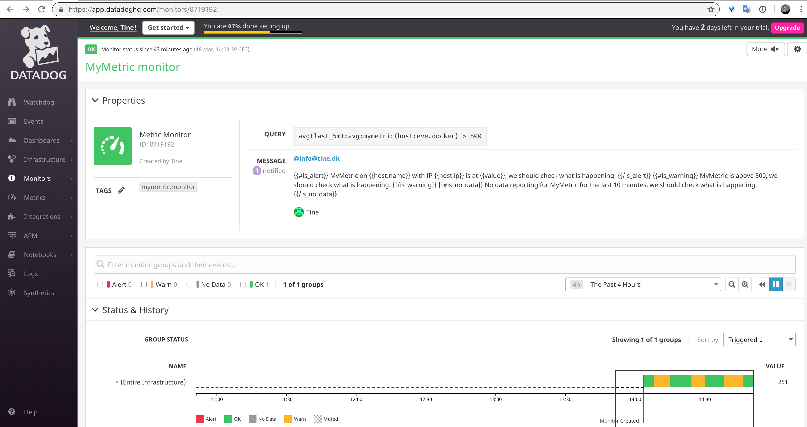
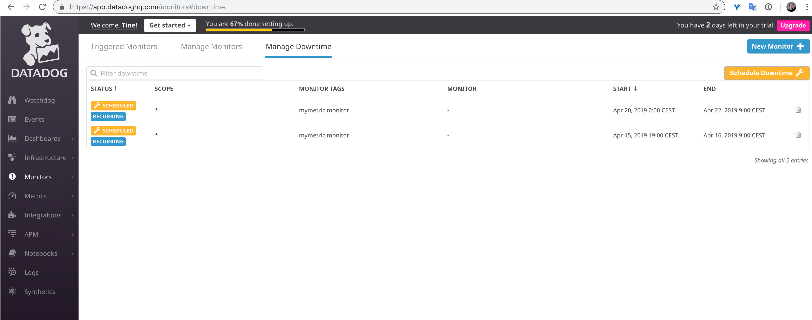

# How to run

1. Check out the git repo on a machine which has Docker installed.
2. Cd to the root of the repo
3. Run `docker-compose up`
	* This will set up all needed containers locally.
4. Edit the [saexcercise.sh](./saexcercise.sh) to use your own API/APP keys - or just use mine.
5. Run the bash script: `./saexcercise.sh`
	* This will create the below Dashboard & widgets, Monitor and Monitor Downtime in Datadog UI.

# Notes for the test

## The right test?

I think perhaps I got sent the wrong tech excercise link? After completing the test I realized there is both a "Solution Engineer" and a "Solution Architect" branch. I was sent this link: [https://github.com/DataDog/hiring-engineers/tree/solutions-engineer](https://github.com/DataDog/hiring-engineers/tree/solutions-engineer).

The Solution Architect branch looks simpler, so I am guessing it's fine in either case.

## Suggestions

I found one or two things which seemed outdated or could have saved me time. Suggestions for updates are committed to README.md in this pull request.

## Feature request

It would be neat if the API allowed for:

- Deleting the UI elements (Monitor, Downtime, Dashboard) through API by generic names or tags, rather than id. This would allow for repeated testing of API calls with less clicking.

- Allow creating repeat Downtime with a past start date, so it can be scripted easily. It is probably possible to script calculation of POSIX time for "7pm next weekday, in local timezone", but it seems unnecessary.

# Prerequisites - Setup the environment

Initially spun up a Vagrant Ubuntu image, but realized I had no need for the additional layer.
Also tried out the OSX agent, which works fine. 

Ended up deciding on Docker for Mac, as the cleanest solution for setting up the needed infrastructure. The advantage is the entire setup is self contained. It can be committed to repo and be spun up anywhere Docker is installed.

Datadog Agent container configured in [docker-compose.yml](./docker-compose.yml) file:

```yaml
  datadog:
    image: datadog/agent:latest
    environment:
      - DD_API_KEY=8923495892e42d2b7919f8764641d254
      - DD_APM_ENABLED=1
    volumes:
      - "/var/run/docker.sock:/var/run/docker.sock:ro"
      - "/proc/:/host/proc/:ro"
      - "/sys/fs/cgroup/:/host/sys/fs/cgroup:ro"
    ports:
      - "5002:5002"
```

Local agent web UI which was available with the OSX agent, does not show up on the mapped port 5002 as expected. This feature is perhaps not included in the Docker agent.
Leaving for now, as it is not needed.

# Collecting Metrics

## Add tags to Agent config file

Agent config file copied from datadog container to host filesystem and then mounted in [docker-compose.yml](./docker-compose.yml) file:

```yaml
    volumes:
      - "./datadog-config/datadog.yaml:/etc/datadog-agent/datadog.yaml"
```

Changes to this file are now persistent, as it exists on the host filesystem.

Added tags to the [agent config yaml](./datadog-config/datadog.yaml) file:

```yaml
hostname: eve.docker

tags:
  - env:dockerosx
  - icecream:chocolate
```

Also set a new hostname, for better overview and because it's pretty.

Additionally, changing hostname creates a new host in Datadog monitoring. As I had initially installed v5.x of the datadog agent, changing hostname let's me get rid of any 5.x metrics which have been reported and eliminate risk of any backwards compatibility issues.

### Result

[Screenshot](./screenshots/Hostmap tags.png): Hostmap tags

</a>

## Install a DB + datadog integration

Added DB service to [docker-compose.yml](./docker-compose.yml) file:

```yaml
services:
  db:
    image: mysql
    command: --default-authentication-plugin=mysql_native_password
    restart: always
    environment:
      MYSQL_ROOT_PASSWORD: example
      MYSQL_DATABASE: exampledb
    volumes:
      - "./docker-entrypoint-initdb.d:/docker-entrypoint-initdb.d"
      - "mysql-data:/var/lib/mysql"

volumes:
  mysql-data:
```

Docker MySQL image used: [https://hub.docker.com/_/mysql](https://hub.docker.com/_/mysql)

Datadog MySQL integration needs a datadog DB user created with specific grants: [https://app.datadoghq.com/account/settings#integrations/mysql](https://app.datadoghq.com/account/settings#integrations/mysql). 

Created [datadog-init.sql](./docker-entrypoint-initdb.d/datadog-init.sql) file, containing the needed queries:

```sql
CREATE USER 'datadog' IDENTIFIED BY 'WIokxj0ir2+UVFOQR35qDbER';
GRANT REPLICATION CLIENT ON *.* TO 'datadog'; #WITH MAX_USER_CONNECTIONS 5;
GRANT PROCESS ON *.* TO 'datadog';
GRANT SELECT ON performance_schema.* TO 'datadog';
```

`MAX_USER_CONNECTIONS` is commented out, as the setting is not needed in this setup and MySQL doesn't like it. The replication grant query is likely not needed at all, unless DB replication is actually set up. 

The [datadog-init.sql](./docker-entrypoint-initdb.d/datadog-init.sql) file is only read on first container start, [when the DB is initialized](https://hub.docker.com/_/mysql#initializing-a-fresh-instance). To keep mysql creds persistent across container restarts, `/var/lib/mysql` is mounted to `mysql-data` volume on host in the [docker-compose](./docker-compose.yml) file.

This ensures DB data needed for Datadog agent integration is persistent across container stop/start/up, destroyed on `docker-compose down` and recreated on initial `docker-compose up`.

### Datadog agent config

Agent DB user credentials configured in `/etc/datadog-agent/conf.d/mysql.d/conf.yaml` by copying the file from datadog container to host file system, editing it and mapping it to host file system [docker-compose.yml](./docker-compose.yml) datadog container section:

```yaml
    volumes:
      - "./datadog-config/conf.d/mysql.d/conf.yaml:/etc/datadog-agent/conf.d/mysql.d/conf.yaml"
```

Datadog DB user credentials added here: [conf.yaml](./datadog-config/conf.d/mysql.d/conf.yaml)

### Result

[Screenshot](./screenshots/DB container.png): Checking DB container show up under `Infrastructure -> containers` in Datadog web UI:

</a>

[Screenshot](./screenshots/DB integration.png): MySQL shows up under integrations:

</a>

## Custom Agent check - MyMetric

Modified [hello.py example here](https://docs.datadoghq.com/developers/write_agent_check/?tab=agentv6) to generate a random value between 0 and 1000.

[mymetric.py](./datadog-config/checks.d/mymetric.py) contents:

```python
import random
# the following try/except block will make the custom check compatible with any Agent version
try:
    # first, try to import the base class from old versions of the Agent...
    from checks import AgentCheck
except ImportError:
    # ...if the above failed, the check is running in Agent version 6 or later
    from datadog_checks.checks import AgentCheck

# content of the special variable __version__ will be shown in the Agent status page
__version__ = "1.0.0"


class MymetricCheck(AgentCheck):
    def check(self, instance):
        self.gauge('mymetric', random.randint(0, 1000))
```

Modified [example here](https://docs.datadoghq.com/developers/write_agent_check/?tab=agentv6#collection-interval) to 45 seconds. Result [mymetric.yaml](./datadog-config/conf.d/mymetric.yaml):

```yaml
init_config:

instances:
  - min_collection_interval: 45
```

Mapped the datadog container yaml and py files (above) to host file system in [docker-compose.yml](./docker-compose.yml):

```yaml
    volumes:
      - "./datadog-config/checks.d/mymetric.py:/etc/datadog-agent/checks.d/mymetric.py"
      - "./datadog-config/conf.d/mymetric.yaml:/etc/datadog-agent/conf.d/mymetric.yaml"
```

### Result

[Screenshot](./screenshots/MyMetric.png): MyMetric shows up in Datadog UI `Metrics->Metrics Explorer`:

</a>

## Change your check collection interval to 45 sec

See above.

## Bonus: Can collection interval be changed outside Python check file?

Yes. This goes in [mymetric.yaml](./datadog-config/conf.d/mymetric.yaml) (`/etc/datadog-agent/conf.d/mymetric.yaml`).

# Visualizing Data

> Utilize the Datadog API to create a Timeboard that contains:

## Your custom metric scoped over your host.

Chose curl for the API calls.

Created [saexcercise.sh](./saexcercise.sh) bash script:

```shell
#!/bin/bash

api_key=8923495892e42d2b7919f8764641d254
app_key=f75db8c09aaa5bc351c9d1d983c98fda24d98d43

curl  -X POST -H "Content-type: application/json" \
-d @./json/sadashboard.json \
"https://api.datadoghq.com/api/v1/dashboard?api_key=${api_key}&application_key=${app_key}"
```

JSON part lives in separate import files, as it's neater. [sadashboard.json](./json/sadashboard.json):

```json
{
  "title" : "SA Excercise",
  "widgets" : [
    {"definition": {
      "type": "timeseries",
      "requests": [
        {"q": "avg:mymetric{host:eve.docker}"}
      ],
      "title": "eve.docker - mymetric"
    }}
  ],
  "layout_type": "ordered",
  "description" : "SA Excercise Dash.",
  "is_read_only": true,
  "notify_list": ["mail@tine.dk"]
}
```

### Result

[Screenshot](./screenshots/Dashboard MyMetric.png): MyMetric graph shows up in Datadog UI `Dasboards->SA Excercise`:

</a>

## Any metric from the Integration on your Database with the anomaly function applied.

Added 2 widgets. The DB container does nothing, so we can't actually see the fancy anomaly graph feature. I took the liberty of adding a mymetric widget with the anomaly function applied as well.

The additional widget definitions in the [sadashboard.json](./json/sadashboard.json) file:

```json
    {"definition": {
      "type": "timeseries",
      "requests": [
        {"q": "anomalies(avg:mysql.performance.slow_queries{*}, 'basic', 2)"}
      ],
      "title": "Anomaly graph for MySQL slow queries"    
    }},
    {"definition": {
      "type": "timeseries",
      "requests": [
        {"q": "anomalies(avg:mymetric{host:eve.docker}, 'basic', 2)"}
      ],
      "title": "Anomaly graph for mymetric - so we can see the graph"    
    }}
```

### Result

[Screenshot](./screenshots/Dashboard anomaly graphs.png): MySQL and MyMetric anomaly graph shows up in Datadog UI under `Dasboards->SA Excercise`:

</a>

## Your custom metric with the rollup function applied to sum up all the points for the past hour into one bucket

```shell
#!/bin/bash

api_key=8923495892e42d2b7919f8764641d254
app_key=f75db8c09aaa5bc351c9d1d983c98fda24d98d43

curl  -X POST -H "Content-type: application/json" \
-d @./json/sadashboard.json \
"https://api.datadoghq.com/api/v1/dashboard?api_key=${api_key}&application_key=${app_key}"
```

JSON widget definition for metric rollup widget, in [sadashboard.json](./json/sadashboard.json):

```json
   {"definition": {
      "type": "timeseries",
      "requests": [
        {"q": "avg:mymetric{*}.rollup(sum, 3600)"}
      ],
      "title": "Sum rollup of mymetric values recorded in the last hour"    
    }}
```

### Result

[Screenshot](./screenshots/Dashboard Rollup.png): Rollup graph shows up in Datadog UI `Dasboards->SA Excercise`:

</a>

## Set the Timeboard's timeframe to the past 5 minutes

### Result

[Screenshot](./screenshots/Dashboard 5min.png): Screenshot of `Dasboards->SA Excercise`, 5min timeframe:

</a>

## Take a snapshot of this graph and use the @ notation to send it to yourself.

Assuming "this graph" == the last one (rollup).

### Result

[Screenshot](./screenshots/Email sum rollup.png): Screenshot of snapshot email sent from `Dasboards->SA Excercise`, 5min timeframe:

</a>

## Bonus Question: What is the Anomaly graph displaying?

The anomaly graph is displaying the normal graph, with a grey "anomaly" overlay. Anomalies can be calculated with 3 different algorithms which adapt to repeated or emerging patterns (trends) to a varying degree. How it adapts and what is considered an anomaly, depends on which algorithm is used (basic, agile, robust) and the tolerance margin (deviation number).

This is super useful, for instance:

* In order to have an alert for high traffic/cpu/etc in order to detect potential oncoming need for resources in time. Or detect an attack. But not be alerted on daily / weekly peak hour traffic. 
* Know when site is down, but not be alerted simply because it is nighttime and there happens to be no traffic whatsoever.

The anomaly function will adapt to known/expected patterns if set up correctly, but highlight anything beyond this. 

**In short:** It allows you to monitor variable metrics and be alerted at the right times.

# Monitoring Data

## Create Metric Monitor

### Requirements

Create a new Metric Monitor that watches the average of your custom metric (my_metric) and will alert if it’s above the following values over the past 5 minutes:

* Warning threshold of 500
* Alerting threshold of 800
* And also ensure that it will notify you if there is No Data for this query over the past 10m.

Please configure the monitor’s message so that it will:

* Send you an email whenever the monitor triggers.
* Create different messages based on whether the monitor is in an Alert, Warning, or No Data state.
* Include the metric value that caused the monitor to trigger and host ip when the Monitor triggers an Alert state.
* When this monitor sends you an email notification, take a screenshot of the email that it sends you.

### Solution

Added monitor API call to [saexcercise.sh](./saexcercise.sh) bash script:

```shell
curl -X POST -H "Content-type: application/json" \
-d @./json/samonitor.json \
"https://api.datadoghq.com/api/v1/monitor?api_key=${api_key}&application_key=${app_key}"
```

Monitor definition in [samonitor.json](./json/samonitor.json) file, imported in curl call above:

```json
{
	"name": "MyMetric monitor",
	"type": "metric alert",
	"query": "avg(last_5m):avg:mymetric{host:eve.docker} > 800",
	"message": " @info@tine.dk\n\n{{#is_alert}} MyMetric on {{host.name}} with IP {{host.ip}} is at {{value}}, we should check what is happening. {{/is_alert}}\n{{#is_warning}} MyMetric is above 500, we should check what is happening. {{/is_warning}}\n{{#is_no_data}} No data reporting for MyMetric for the last 10 minutes, we should check what is happening. {{/is_no_data}}",
	"tags": [
		"mymetric.monitor"
	],
	"options": {
		"notify_audit": false,
		"locked": false,
		"timeout_h": 0,
		"new_host_delay": 300,
		"require_full_window": false,
		"notify_no_data": true,
		"renotify_interval": "0",
		"escalation_message": "",
		"no_data_timeframe": 10,
		"include_tags": true,
		"thresholds": {
			"critical": 800,
			"warning": 500
		}
	}
}
```

### Result

[Screenshot](./screenshots/MyMetric_monitor.png): MyMetric Monitor shows up in Datadog UI `Monitors->MyMetric monitor`:

</a>

#### Emails

**Warning**
[Screenshot](./screenshots/Monitor Warning email.png): MyMetric Monitor Warning email variant:

</a>

**Alert**
[Screenshot](./screenshots/Monitor Alert email.png): MyMetric Monitor "Alert" email variant:

(NB: Note that host IP and trigger value are only included on Alert emails, as pr requirements)

</a>


**No Data**
[Screenshot](./screenshots/Monitor No Data email.png): MyMetric Monitor "No Data" email variant:

</a>

(NB: Wrong value of 5min mentioned here, as `no_data_timeframe` was incorrectly set at this time. Has since been fixed.)


## Bonus Question: Monitor Downtime config

### Requirements

Set up two scheduled downtimes for this monitor:

* One that silences it from 7pm to 9am daily on M-F,
* And one that silences it all day on Sat-Sun.
* Make sure that your email is notified when you schedule the downtime and take a screenshot of that notification.

### Downtime 7pm to 9am daily on M-F

Added downtime API call to [saexcercise.sh](./saexcercise.sh) bash script:

```shell
curl -X POST -H "Content-type: application/json" \
-d @./json/sadowntime.json \
"https://api.datadoghq.com/api/v1/downtime?api_key=${api_key}&application_key=${app_key}"
```

Downtime definition in [sadowntime.json](./json/sadowntime.json) file, imported in curl call above:

```json
{
  "scope": "*",
  "monitor_tags": ["mymetric.monitor"],
  "message": "@info@info@tine.dk MyMetric Monitor notifications going offline. Scheduled silence weekdays 7pm to 9am Copenhagen timezone (dst / summertime).",
  "timezone": "CET",
  "start": 1555347600,
  "end": 1555398000,
  "recurrence": {
    "type": "weeks",
    "period": 1,
    "week_days": ["Mon", "Tue", "Wed", "Thu", "Fri"]     
  }
}
```

As start dates for recurring Downtime unfortunately cannot be set to start in the past, a far(ish) future start date of April 15th has been set. This ensures the script will be able to run, for the next few weeks.

It is surely possible to calculate a "next weekday 7pm in Copenhagen DST timezone" start date, but I chose to not spend time on it as it has little purpose.

I am also not sure whether datadog can figure out DST on it's own. If not, the monitor will be off by 1 hour in winter time.


### Downtime Sat-Sun

Doesn't look like these can be bundled (Adding more Downtime's in 1 API call). Added yet-another downtime API call to [saexcercise.sh](./saexcercise.sh) bash script:

```shell
curl -X POST -H "Content-type: application/json" \
-d @./json/sadowntimeweekend.json \
"https://api.datadoghq.com/api/v1/downtime?api_key=${api_key}&application_key=${app_key}"
```

Weekend Downtime definition in [sadowntimeweekend.json](./json/sadowntimeweekend.json) file, imported in curl call above:

```json
{
  "scope": "*",
  "monitor_tags": ["mymetric.monitor"],
  "message": "@info@info@tine.dk MyMetric Monitor notifications going offline. Scheduled silence all day Sat-Mon 9am Copenhagen timezone (dst / summertime).",
  "timezone": "CET",
  "start": 1555711200,
  "end": 1555916400,
  "recurrence": {
    "type": "weeks",
    "period": 1,
    "week_days": ["Sat"]     
  }
}
```

Set to start on April 20th, due to start date issue. The weekend downtime silences from Saturday 12am to Monday 9am, as the weekday monitor doesn't account for 12am-9am Monday.

It could technically be set to start Saturday 9am as the weekday monitor silences Friday 7pm - Saturday 9am, which means there is some overlap.

### Result

[Screenshot](./screenshots/Downtime.png): Downtime for weekdays and weekend shows up in Datadog UI `Monitors->Manage Downtime`:

</a>

#### Email

None, due to start date issue and the far future start date workaround.

# Collecting APM Data


Adding Flask container definition under `services:` in [docker-compose.yml](./docker-compose.yml):

```yaml
  flask:
    build: flask
    volumes:
      - "./flask/app.py:/app.py"
    ports:
      - "5050:5050"
    environment:
      - DATADOG_TRACE_AGENT_HOSTNAME=datadog
```

Environment variable and exposed port to enable communication with host and datadog container.

Flask image [Dockerfile](./flask/Dockerfile):

```dockerfile
FROM python:3

RUN pip install flask
RUN pip install ddtrace

COPY app.py /app.py
EXPOSE 5050
CMD ddtrace-run python /app.py
```

This builds a Docker image which:

* Pulls in python:3 image
* installs flask and ddtrace
* Copies app.py into the container
* Exposes port 5050
* Runs the python app with ddtrace-run to collect metrics which can be sent to datadog

Contents of [app.py](./flask/app.py): is the flask app supplied with the excercise:

```python
from flask import Flask
import logging
import sys

# Have flask use stdout as the logger
main_logger = logging.getLogger()
main_logger.setLevel(logging.DEBUG)
c = logging.StreamHandler(sys.stdout)
formatter = logging.Formatter('%(asctime)s - %(name)s - %(levelname)s - %(message)s')
c.setFormatter(formatter)
main_logger.addHandler(c)

app = Flask(__name__)

@app.route('/')
def api_entry():
    return 'Entrypoint to the Application'

@app.route('/api/apm')
def apm_endpoint():
    return 'Getting APM Started'

@app.route('/api/trace')
def trace_endpoint():
    return 'Posting Traces'

if __name__ == '__main__':
    app.run(host='0.0.0.0', port='5050')
```

### Result

[Screenshot](./screenshots/Flask app.png): Flask app container showing up under `Infrastructure->Containers`:

</a>

Note that these urls will need to be visited in order to generate data, which will show up in datadog APM:

* [http://localhost:5050/](http://localhost:5050/)
* [http://localhost:5050/api/apm](http://localhost:5050/api/apm)
* [http://localhost:5050/api/trace](http://localhost:5050/api/trace)

### Notes

Looking at this now, I am wondering whether I was actually supposed to finish the app functionality. As in, actually starting the APM, posting traces etc on the various urls.

If so, I have misunderstood the task.

However, the app runs and is reporting to datadog.

## Bonus Question: What is the difference between a Service and a Resource?

In datadog terminology, a service is an app. It can consist of various parts, like cache server, DB, application server, which together form an app.

A resource is a function call or similar activity which registers a process trace within the service in the APM.

# Final question

> Is there anything creative you would use Datadog for?

I have to admit I am unusually low on creative thinking at this point.

* Monitor whenever my roommate adds new media on our shared drive and send me the file title so I can check if I want to watch it.

* Submit the total from my spending account daily, add anomaly function to alert me if my spending pattern is unusually high or low.

* Have a Movie theater submit percent of available tickets sold, pr viewing lounge at the time when every movie starts. This should show which times of day are more popular.
Then add anomaly function. This should give them some idea of when a movie showing in that lounge is unusually profit generating and not, regardless of time of day.


