<h1>Answers for Datadog Exercise</h1>

I have decided to go with the Vagrant VM

- Installed the Ubuntu VM
- Installed Python
- Installed MySQL
- Installed Datadog Agent

<h1>Collecting Metrics:</h1>
Add tags in the Agent config file and show us a screenshot of your host and its tags on the Host Map page in Datadog.
Added the following in datadog.yaml:

    api_key: 1e4bc1602c9a7eeac37718d0b4fcd482

    tags:
      - my_server
      - env:exercise
      - role:testserver

The tags were reflected in the host map:

<h2>Install a database on your machine (MongoDB, MySQL, or PostgreSQL) and then install the respective Datadog integration for that database.</h2>

Installation following the description.

Created conf.yaml in /etc/datadog/conf.d/mysql (see file conf.yaml):

    init_config:

    instances:
      - server: localhost
        user: datadog
        pass: jalla2000
        tags:
            - optional_tag1
            - optional_tag2
        options:
          replication: 0
          galera_cluster: 1

After agent restart checking the result (datadog agent check mysql):

    =========
    Collector
    =========
      Running Checks
      ==============
        mysql (1.4.0)
        -------------
            Instance ID: mysql:bc77a72a65c1a127 [OK]
            Total Runs: 1
            Metric Samples: 60, Total: 60
            Events: 0, Total: 0
            Service Checks: 1, Total: 1
            Average Execution Time : 15ms

Full output in mysql_check_output.txt

<h1>Create a custom Agent check that submits a metric named my_metric with a random value between 0 and 1000.</h1>

Created my_metric.yaml (see file my_metric.yaml)

    init_config:

    instances:
      - min_collection_interval: 45

Created my_metric.py in checks.d (see file my_metric.py)

    import random

    # the following try/except block will make the custom check compatible with any Agent version
    try:
        # first, try to import the base class from old versions of the Agent...
        from checks import AgentCheck
    except ImportError:
        # ...if the above failed, the check is running in Agent version 6 or later
        from datadog_checks.checks import AgentCheck

    # content of the special variable __version__ will be shown in the Agent status page
    __version__ = "1.0.0"

    class HelloCheck(AgentCheck):
        def check(self, instance):
            self.gauge('my_metric', random.randint(0,1000))

Check after restart (datadog agent check my_metric):

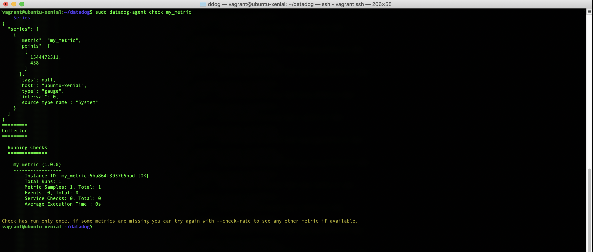

<h2>Change your check's collection interval so that it only submits the metric once every 45 seconds.</h2>

Added in my_metric.yaml:

    - min_collection_interval: 45

<h2>Bonus Question Can you change the collection interval without modifying the Python check file you created?</h2>

See above

First Dashboard:
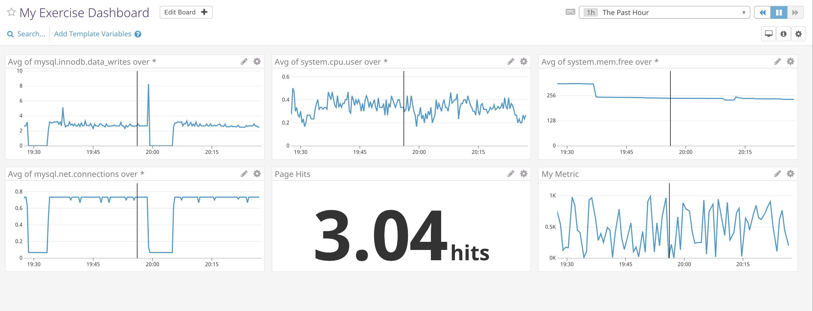

<h1>Visualizing Data</h1>
<h2>Utilize the Datadog API to create a Timeboard that contains:

Your custom metric scoped over your host.
Any metric from the Integration on your Database with the anomaly function applied.
Your custom metric with the rollup function applied to sum up all the points for the past hour into one bucket
Please be sure, when submitting your hiring challenge, to include the script that you've used to create this Timeboard.</h2>

Timeboard created with Python script (create_timeboard.py):

    from datadog import initialize, api

    options = {
        'api_key': '1e4bc1602c9a7eeac37718d0b4fcd482',
        'app_key': '02e9c8a50a650907e979279ba2dd227deef90094'
    }

    initialize(\*\*options)

    title = "My Timeboard"
    description = "An informative timeboard."
    graphs = [{
        "definition": {
            "events": [],
            "requests": [
                {"q": "my_metric{\*}"}
            ],
            "viz": "timeseries"
        },
        "title": "My Metric"},
        {
        "definition": {
            "events": [],
            "requests": [
                {"q": "anomalies(mysql.innodb.buffer_pool_utilization{\*},'basic', 3, direction='above', alert_window='last_5m', interval=20, count_default_zero='true')"}
            ],
            "viz": "timeseries"
        },
        "title": "MySQL Buffer Pool Utilization"},
        {
        "definition": {
            "events": [],
            "requests": [
                {"q": "my_metric{\*}.rollup(sum,1200)"}
            ],
            "viz": "timeseries"
        },
        "title": "My Metric Rollup"}
    ]

    template_variables = [{
        "name": "host1",
        "prefix": "host",
        "default": "host:ubuntu-xenial"
    }]

    read_only = True
    res = api.Timeboard.create(title=title,
                         description=description,
                         graphs=graphs,
                         template_variables=template_variables,
                         read_only=read_only)

    print(res)

Snapshot sent to myself:

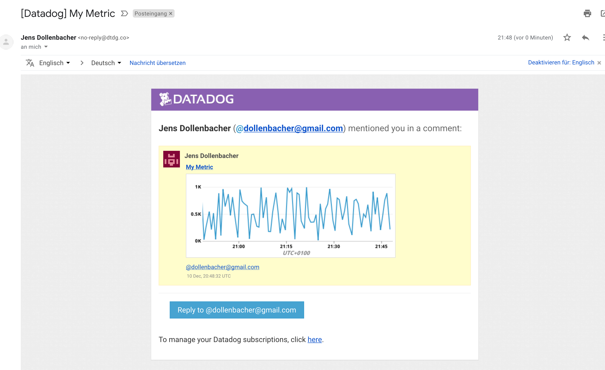

<h2>Bonus Question: What is the Anomaly graph displaying?</h2>

Anomalies show unexpected behavior compared to historical data

<h1>Monitoring Data</h1>
<h2>Create a new Metric Monitor that watches the average of your custom metric (my_metric) and will alert if it’s above the following values over the past 5 minutes:

Warning threshold of 500
Alerting threshold of 800
And also ensure that it will notify you if there is No Data for this query over the past 10m.</h2>

Created Monitor (Export file my_metric_monitor.json):

    {
	    "name": "Something is happening with My Metric!",
	    "type": "metric alert",
	    "query": "avg(last_5m):avg:my_metric{\*} > 800",
	    "message": "My Metric current value is {{value}} \n\n{{#is_alert}}My Metric is through the roof. Please act accordingly{{/is_alert}} \n\n{{#is_warning}}My Metric is high. You should have a look{{/is_warning}}\n\n{{#is_no_data}}My Metric is very quiet. Perhaps it's dead{{/is_no_data}}\n  \nNotify: @dollenbacher@gmail.com",
	    "tags": [
		    "service:the_dummy_app"
    	],
	    "options": {
		    "notify_audit": false,
		    "locked": false,
		    "timeout_h": 0,
		    "new_host_delay": 300,
		    "require_full_window": true,
		    "notify_no_data": true,
		    "renotify_interval": "0",
		    "escalation_message": "",
		    "no_data_timeframe": 10,
		    "include_tags": false,
		    "thresholds": {
			    "critical": 800,
			    "warning": 500
		    }
	    }
    }

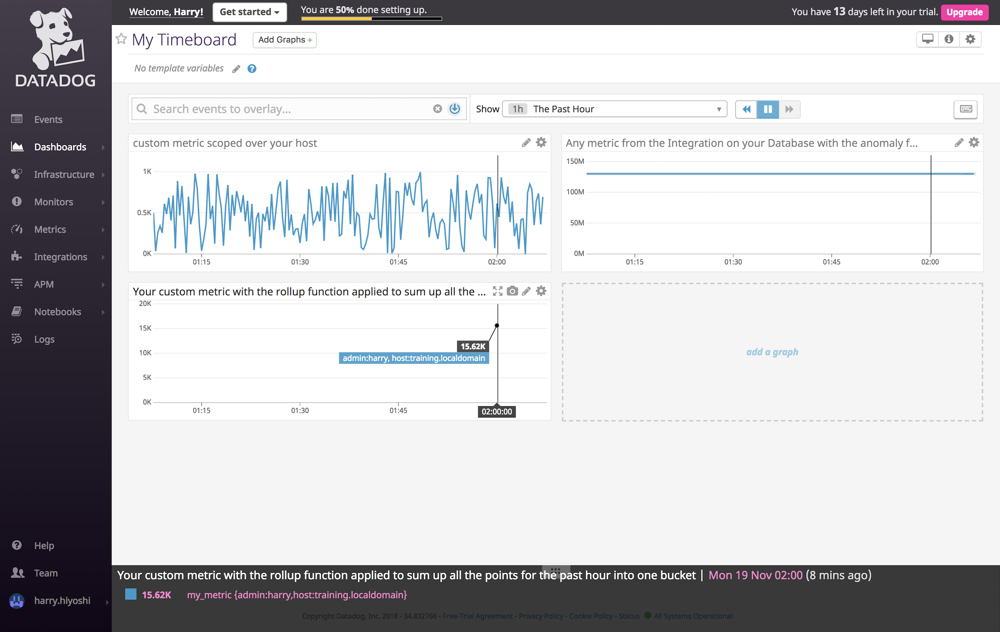

Alert mails received:
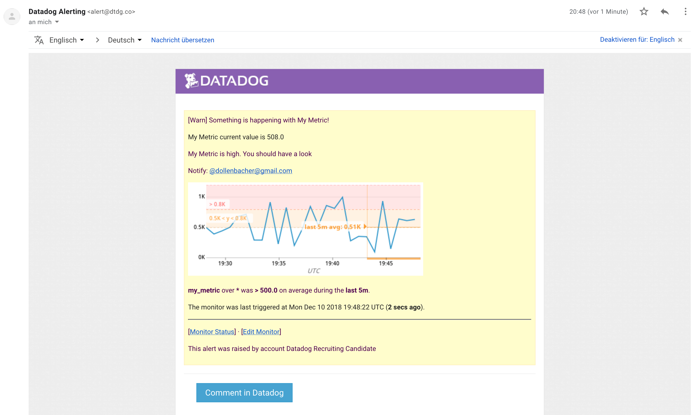

Downtime Definitions for night and weekend:
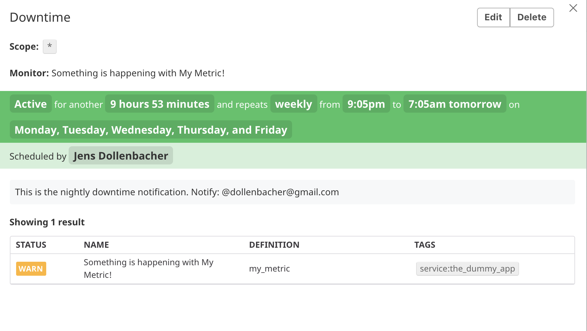
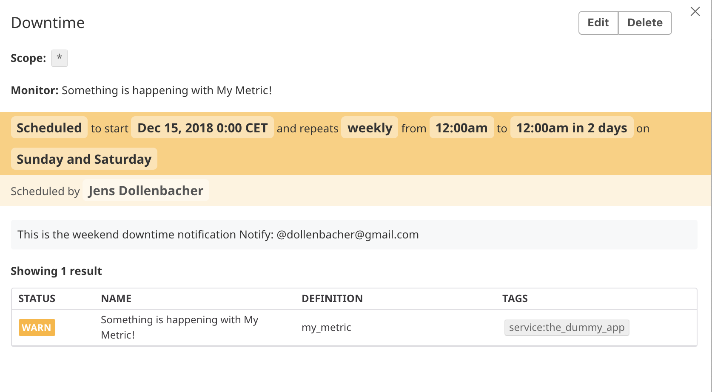

Downtime Notification received:
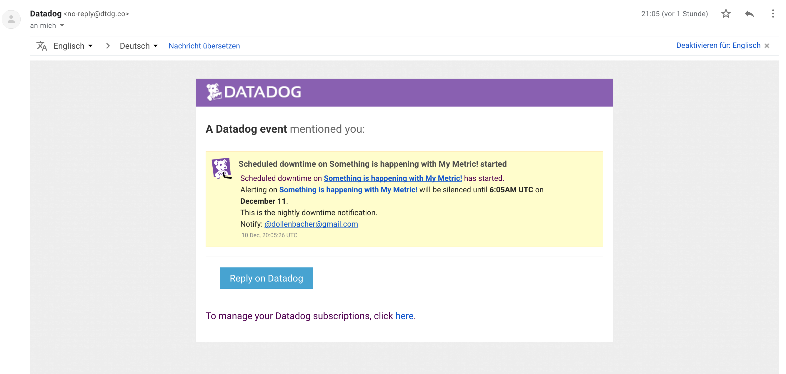

<h1>Collecting APM Data</h1>

I have used the sample app and included with ddtrace (I did some experiments also with statsd, but liked ddtrace better).
I also defined HTML 404 as an error to generate some alerts also.
Some load on the app was generated by a JMeter script: call_myApp.jmx
The source is in myApp.py

APM Data and traces have been received:

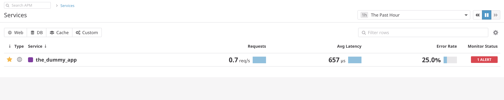
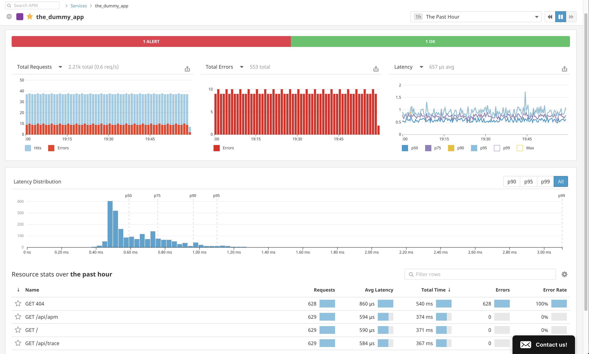
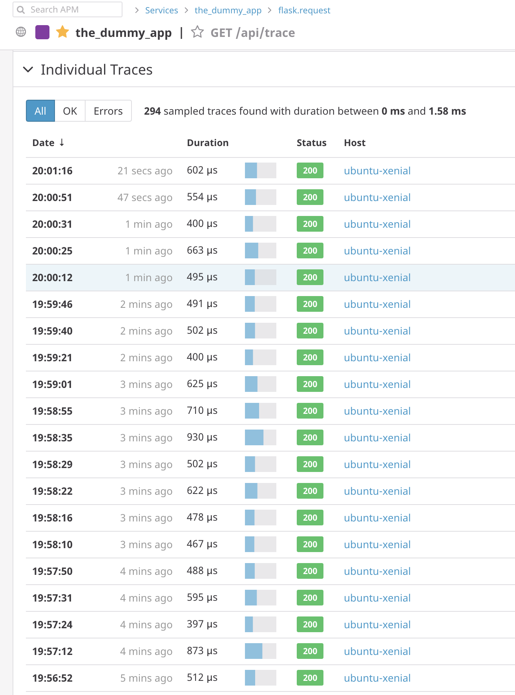
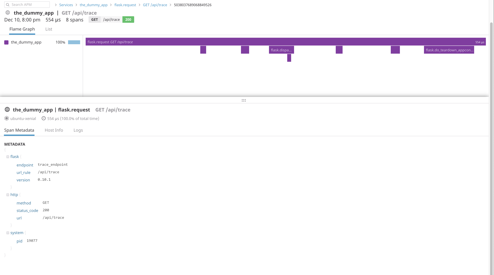
