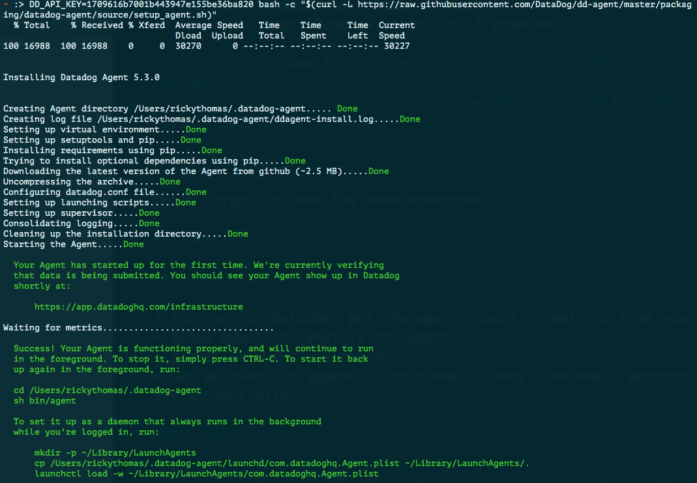

### Level One

**Install successful**

#####Bonus Question
- The datadog agent is a piece of software that runs on your hosts collecting events and metrics for you. This allows you to better understand your systems monitoring and performance data. There are three components to the datadog agent.
  1. **The Collector** runs checks on your current machine capturing system metrics like memory and cpu.
  2. **Dogstatsd** is a statsd backend server you can send custom metrics to from an application.
  3. **The Forwarder** retrieves data from both the collector and dogstatsd and then queues it up to be sent on to Datadog.

