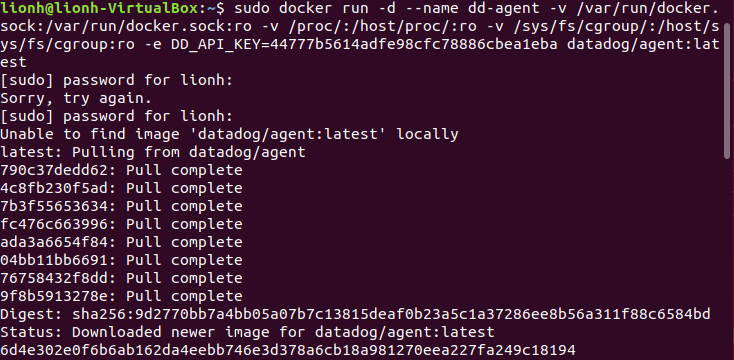

### Installation

Vagrant is a powerful vm orchestrator but I have already in my personal notebook an Ubuntu vm image with Docker. I'm using VirtualBox. I will then install the dockerized version of datadog agent:

```shell
docker run -d --name dd-agent \
-v /var/run/docker.sock:/var/run/docker.sock:ro \
-v /proc/:/host/proc/:ro \
-v /sys/fs/cgroup/:/host/sys/fs/cgroup:ro \
-e DD_API_KEY=44777b5614adfe98cfc78886cbea1eba \
datadog/agent:latest
```

