If you want to apply as a Solutions or Sales Engineer at [Datadog](http://datadog.com) you are in the right spot. Read on, it's fun, I promise.

<a href="https://www.datadoghq.com/careers/" title="Careers at Datadog">
</a>

## The Exercise

Don’t forget to read the [References](https://github.com/DataDog/hiring-engineers/blob/solutions-engineer/README.md#references)

## Questions

Please provide screenshots and code snippets for all steps.

## Prerequisites - Setup the environment

You can utilize any OS/host that you would like to complete this exercise. However, we recommend one of the following approaches:

* You can spin up a fresh linux VM via Vagrant or other tools so that you don’t run into any OS or dependency issues. [Here are instructions](https://github.com/DataDog/hiring-engineers/blob/solutions-engineer/README.md#vagrant) for setting up a Vagrant Ubuntu VM. We strongly recommend using minimum `v. 16.04` to avoid dependency issues.
* You can utilize a Containerized approach with Docker for Linux and our dockerized Datadog Agent image.

Then, sign up for Datadog (use “Datadog Recruiting Candidate” in the “Company” field), get the Agent reporting metrics from your local machine.


>## ***SOLUTION***

>Datadog offers over 400+ integrations for systems, apps, and services.  Whether your applications reside on-premises or in the cloud, they all can be monitered by Datadog's modern monitoring and security solution for any stack, any app, at any scale, anywhere.  A full list of integrations can be found here (https://www.datadoghq.com/product/platform/integrations/#all) and more intergrations are continously being added.

>For this part of we will install the dockerized Datadog Agent on Windows 10 Pro as well as a Windows Datadog Agent on Windows 10 Pro upon which we will perform PostgreSQL integration
>

>### ***Here are the steps to install the dockerzied Datadog Agent on Windows 10 Pro***

>### ***Step 1.  Install Docker Desktop on your Windows 10 Pro (if not allready installed)***

>*Instruction to install Docker can be found [here](https://docs.docker.com/docker-for-windows/install/)*

>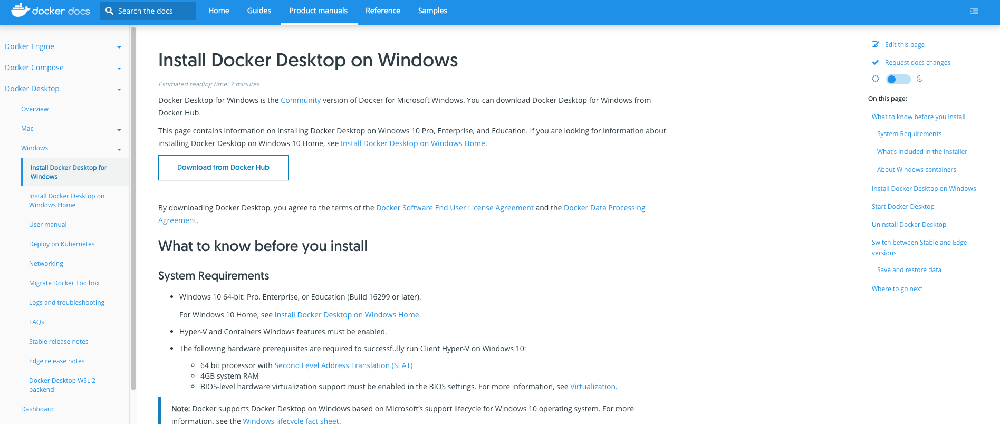

>### ***Step 2.  Sign up for Datadog by clicking on "GET STARTED FREE" and filling out the your info for a new account.***

>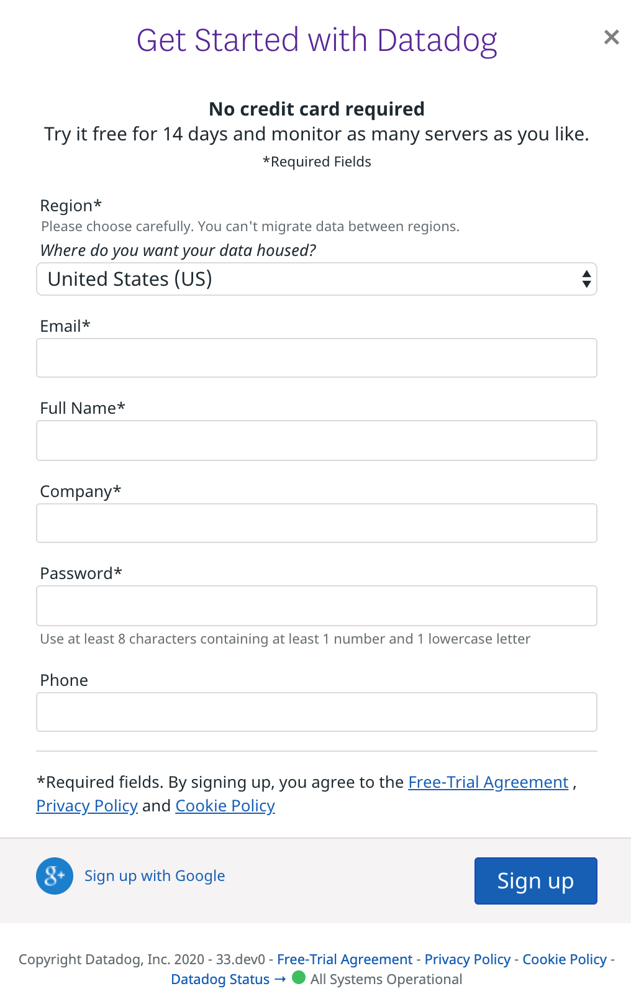

>### ***Step 3.  Install Dockerized Datadog agent***

>General instruction found [here](https://docs.datadoghq.com/agent/docker/?tab=windows) 

>*From a Windows command promt run the following command*

>```
>docker run -d --name <dd-agent> -v /var/run/docker.sock:/var/run/docker.sock:ro -v /proc/:/host/proc/:ro -v /sys/fs/cgroup/:/host/sys/fs/cgroup:ro -e DD_API_KEY=<API_KEY> -e DD_SITE="datadoghq.com" datadog/agent:latest
>```
> * since this is Docker the environmental variables need to be passed into the command as well such as the DD_SITE, also you have to provide a unique name for the agent in place of \<dd\_agent>

> * replace the \<API\_KEY> with your \<API\_KEY> which can be found in the by going selecting APIs from the Integrations option from the navagation menu on the Left side of the Datadog portal

>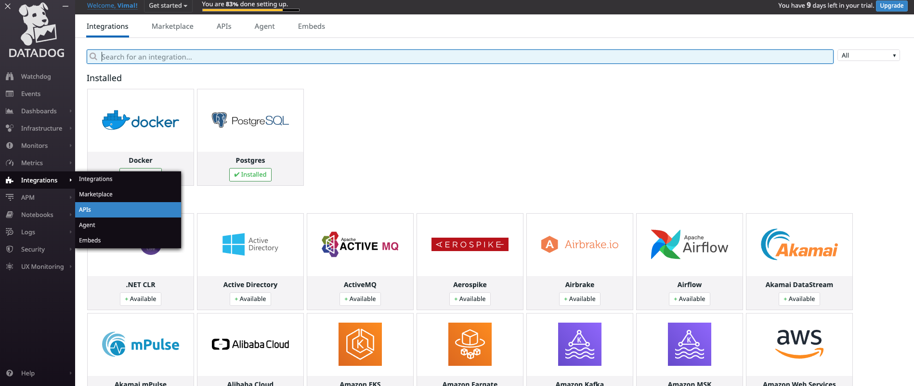

>### *Alternatively*

>*From the Datadog in-app installation portal you can also use the easy one-setup install which includes your \<API_KEY>*

>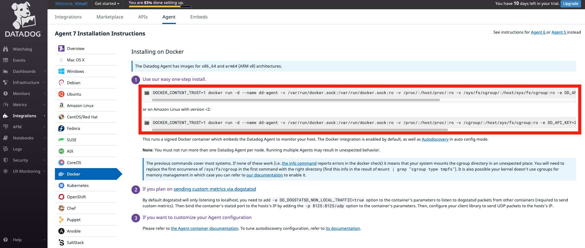
>

>
>### ***Here are the steps to install the Datadog Agent directly on Windows 10 Pro***
>
>### ***Step 1.  From your Datadog portal navigate to the Integrations Agent's screen***
>
>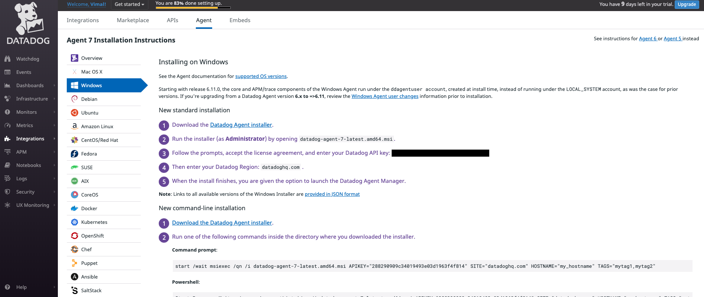

>### ***Step 2. Download .msi package for windows and follow installation instructions to enter API Key and Datadog Region***
>
>### ***Step 3. Start your the Datadog Agent Manager with Administrator privileges***
>
>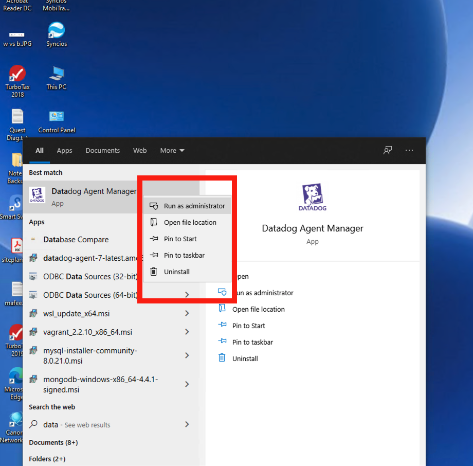
>
>### ***Step 4.  Open the configuration screen by right-clicking on the Datadog icon in the taskbar and selecting configure***
>
>In the configuration screen you should see "Connected to Agent" in the top right.  If you don't see that, you may need to right-cllick on the Datadog icon in the taskbar and start the agent by selecting "Start"
>
>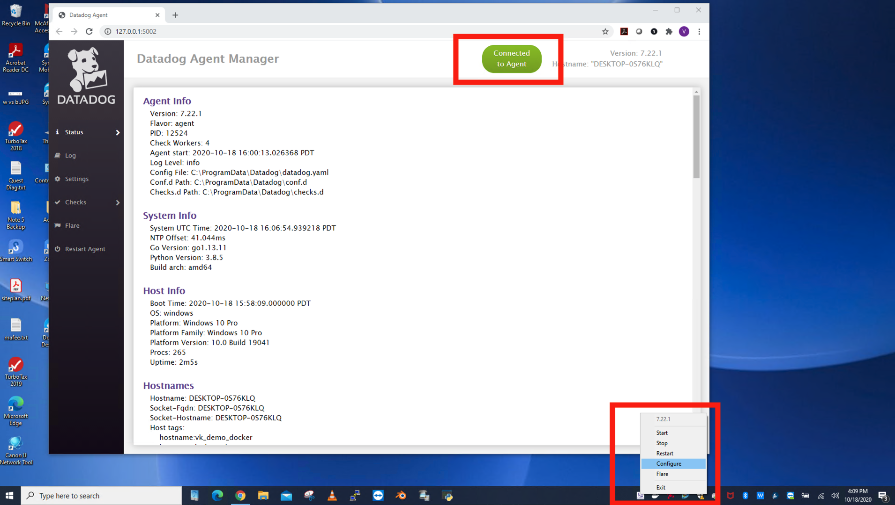
>
>
>
>## At this point you will have 2 integrations functional
>
>> *1.  Windows 10 Pro Datadog agent*
>>
>> *2.  Dockerized Datadog agent on top of Windows 10 Pro*
>
>## In your Datadog portal you will see 2 hosts in your Infrasturcture List
>
>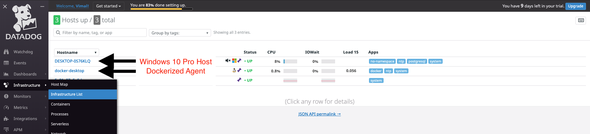
>
>
>

## Collecting Metrics:

* Add tags in the Agent config file and show us a screenshot of your host and its tags on the Host Map page in Datadog.

>## ***SOLUTION***
>
>### Custom Tags
>
>Tags allow you add dimension to Datadog telemetries so you can filter, aggregate, and/or compare the data in Datadog visualizations for meaningful analytics.  Many reserved tags are already imbeded in Datadog, some examples are: host, device, service, env, version, etc...  For this exercise we will create some custom tags for the 2 host integrations we did in the last section.


>### ***Adding tags to Windows 10 Pro host***
>
>2 ways you can add tags to the Windows 10 Pro agent
>
>* I. edit the C:\ProgramData\Datadog\datadog.yaml file directly
>
>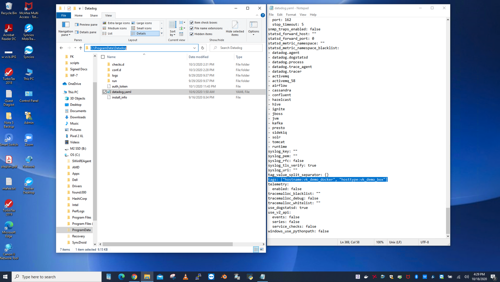
>
<br></br>

>* II. go the the configuration screen, click on settings from the left navigation menu, and edit the setting, then click "Save" on the top right.
>
>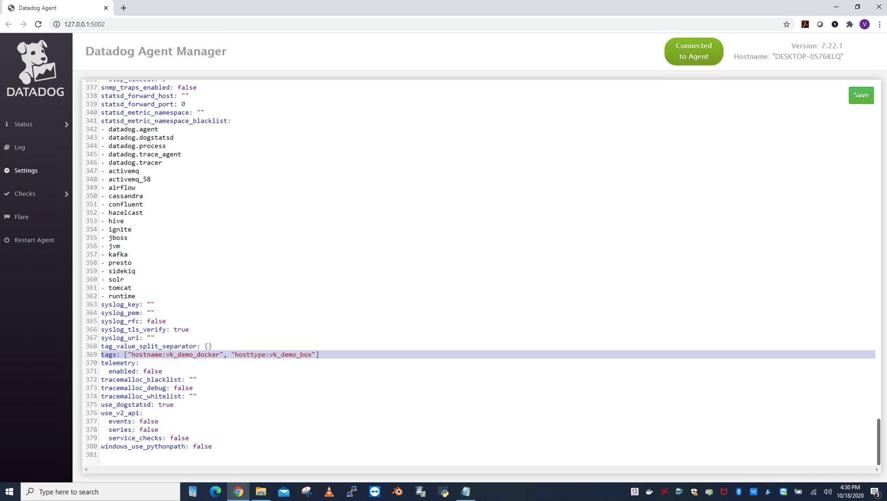
>
<br></br>
>Format for entering tags is as follows:  *tags: ["hostname:vk_demo_docker", "hosttype:vk_demo_box"]*
>
>Both ways will update the "datadog.yaml" file.  Then you will need to restart the agent for the new setting to take effect.

>Now you will can see the tags in the Host Maps screen
>


>### ***Adding tags to Dockerized Agent on Windows 10 Pro***
>
>In order to add tags to the Dockerized Agent we need to pass the tags in with environment variables and restart the container
>
>You can run the following command to start a fresh instance or you can update the instance variable via script and then restart the instance.
>
>```
>docker run -d --name <dd-agent> -v /var/run/docker.sock:/var/run/docker.sock:ro -v /proc/:/host/proc/:ro -v /sys/fs/cgroup/:/host/sys/fs/cgroup:ro -e DD_API_KEY=<API_KEY> -e DD_SITE="datadoghq.com" -e DD_TAGS="systemname:vk_docker_agent systemtype:vk_docker_demo" -e DD_ENV="vk-ddtrace-env" datadog/agent:latest
>```

> * *replace \<dd-agent> with your instance name and replace \<API\_KEY> with your specific API KEY*

> 
> Once the instance is restarted you will see the tags in the Host Maps screen

>

<br></br>

* Install a database on your machine (MongoDB, MySQL, or PostgreSQL) and then install the respective Datadog integration for that database.

> ## ***SOLUTION***
> 
> Datadog provides many Database monitoring solution including PostgreSQL.  For this step we will install PostgreSQL database on Windows 10 Pro.  A full list of database integration can be found [here](https://docs.datadoghq.com/integrations/#cat-data-store)
> 
> 
> PostgreSQL database can be downloaded from [here](https://www.enterprisedb.com/downloads/postgres-postgresql-downloads)
> 

>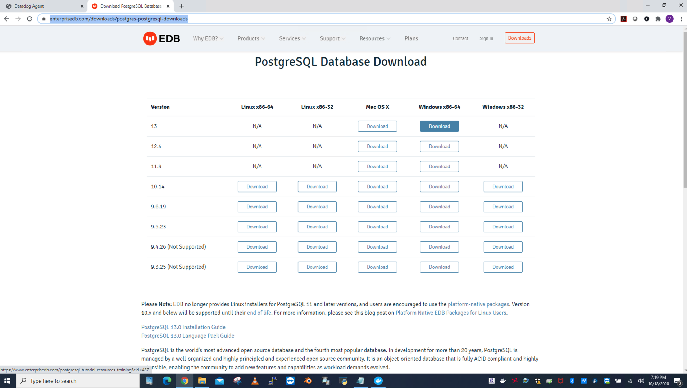

>
>
>

>Once downloaded install PostgreSQL on your Windows 10 Pro host.  You will be required to provide a username and password for database managment.  You should also create a sample database.
>
> *I choose to use a sample DVD rental database.  The database can be downloaded from [here](https://www.postgresqltutorial.com/load-postgresql-sample-database/) and the instruction to create a copy of the database are also provided there.*


>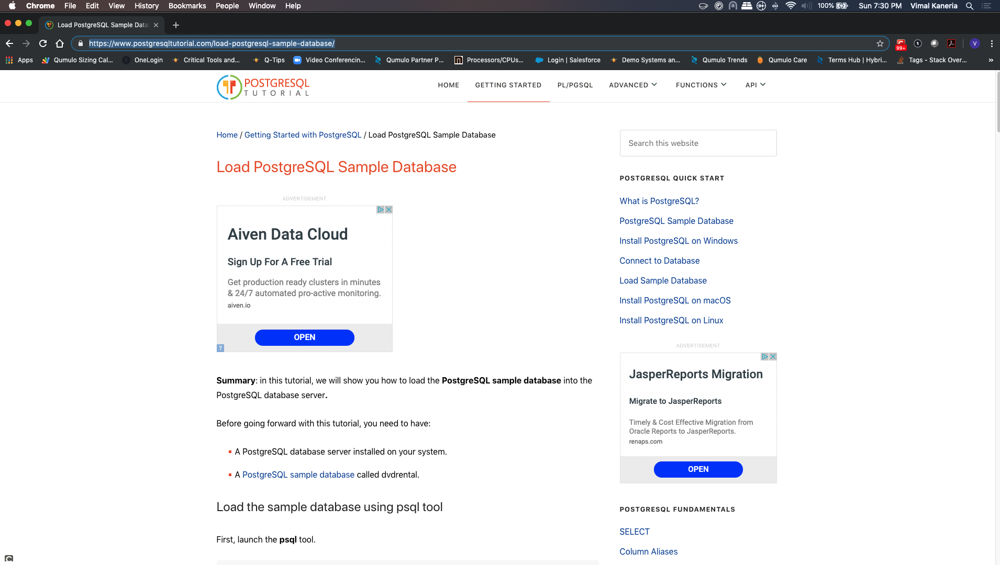

>***PostgreSQL integration configuration***
>
>In order to configure PostgreSQL integration go to the "Integrations" page on your Datadog portal and follow the instructions listed in the PostgreSQL Integration Configuration tab.
>

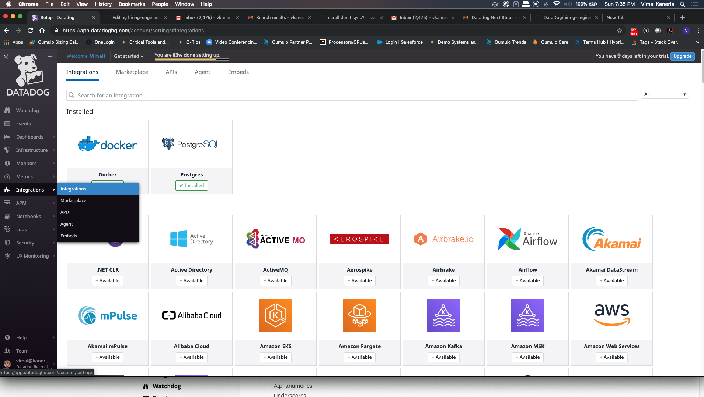

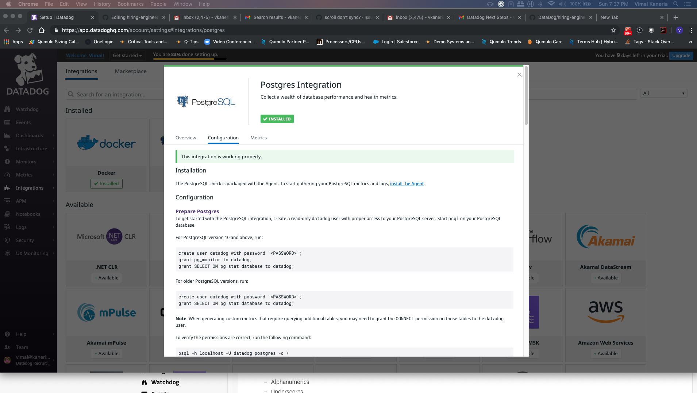

>We are using PostgreSQL 13, so per the instructions I created a read-only Datadog user with access to the PostgreSQL server.  
>
>I used the following commands to create the user.
>
>```
>create user datadog with password '<PASSWORD>';
>grant pg_monitor to datadog;
>grant SELECT ON pg_stat_database to datadog;
>```
>
>Next I updated the C:\ProgramData\Datadog\conf.d\postgres.d\conf.yaml file in order for the Agent to Connect to PostgreSQL database
>
>```
>	init_config:
>	instances:
>	  ## @param host - string - required
>	  ## The hostname to connect to.
>	  ## NOTE: Even if the server name is "localhost", the agent connects to
>	  ## PostgreSQL using TCP/IP, unless you also provide a value for the sock key.
>	  #
>	  - host: localhost
>	
>	    ## @param port - integer - required
>	    ## Port to use when connecting to PostgreSQL.
>	    #
>	    port: 5432
>	
>	    ## @param user - string - required
>	    ## Datadog Username created to connect to PostgreSQL.
>	    #
>	    username: datadog
>	
>	    ## @param pass - string - required
>	    ## Password associated with the Datadog user.
>	    #
>	    password: "<PASSWORD>"
>	
>	    ## @param dbname - string - optional - default: postgres
>	    ## Name of the PostgresSQL database to monitor.
>	    ## Note: If omitted, the default system postgres database is queried.
>	    #
>	    dbname: "<DB_NAME>"
>```	   
> 
>We have to provde the appropriate *username, password, and dbname* in the conf.yaml file.  This is the Datadog user we just created and the name of the database that we will be monitoring.
>
>Next we restart the host agent to start the collection of PostgreSQL metrics
>
>You will now notice postgresql app listed in the Host Map screen under the specific host where you integrated PostgreSQL
>

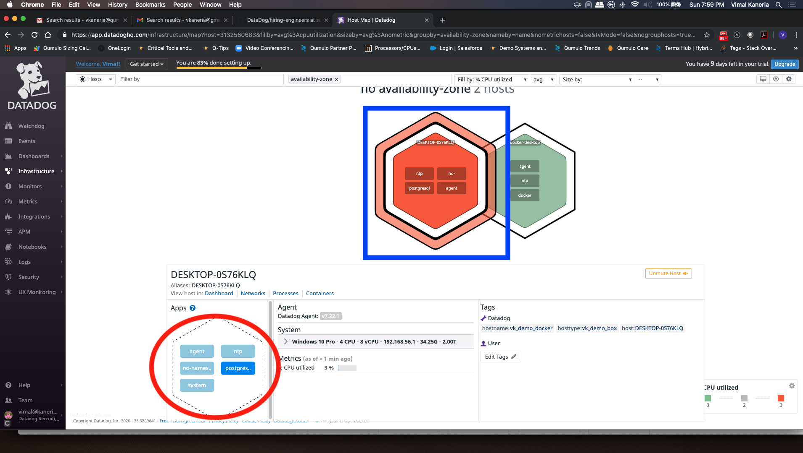

>
<br></br>

* Create a custom Agent check that submits a metric named my_metric with a random value between 0 and 1000.

>## ***SOLUTION***
>
>Datadog has Checks that allow you to monitor the health of an agent, service, integration, or app.
>
>You can even create custom checks in addition to the built-in checks available in Datadog monitoring solution.
>
>We will not go throught the steps to creating a custom Agent check named my_check
>
>In order to create this custom check we have to create a python script file with the same name as the check *my_check.py* in the c:\ProgramData\Datadog\checks.d\ directory as follows

>```
>	# the following try/except block will make the custom check compatible with any Agent version
>	try:
>    # first, try to import the base class from new versions of the Agent...
>    from datadog_checks.base import AgentCheck
>	except ImportError:
>    # ...if the above failed, the check is running in Agent version < 6.6.0
>    from checks import AgentCheck
>
>	# content of the special variable __version__ will be shown in the Agent status page
>	__version__ = "1.0.0"
>
>
>	import random
>
>	class my_check_metric(AgentCheck):
>    def check(self, instance):
>        self.gauge('my_check_metric_value', random.randint(0, 1000))
>``` 

>The   *self.gauge('my_check_metric_value', random.randint(0, 1000))*   is the syntax used to generate the random value between 0 and 1000.  I choose to use an integer value.
>
>We also need to create yaml configuration file with a matching name, in this case *my_check.yaml*. This file will reside in the c:\ProgramData\Datadog\conf.d\ directory.  This file has to contain on mapping which can be empty.
>
>```
>	instances: 
>```


* Change your check's collection interval so that it only submits the metric once every 45 seconds.

>## ***SOLUTION***
>
>The default collection interval for a custom Agent check is 15 seconds.  To change the interval modify the yaml file *my_check.yaml* and specific the interval in seconds as shown below.
>
>```
>instances:
>  - min_collection_interval: 45
>```
>
>Verify your check is working by running the following command
>
>```
>c:\Program Files\Datadog\Datadog Agent\bin\agent check my_check
>```
>
>Or check status in the Datadog monitoring portal selecting "Check Summary" from the "Monitors" navigation menu on the left of the screen, then clicking the "datadog.agent.check\_status" and going to the specific check, in this case "my\_check"
>
>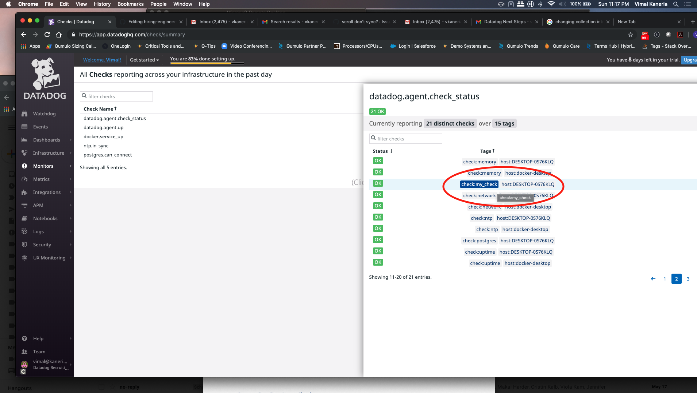
>
>

* **Bonus Question** Can you change the collection interval without modifying the Python check file you created?

>## ***SOLUTION***
>
>Yes, to modify the collection interval is to modify the yaml file *my_check.yaml* as shown above.  
>
>


## Visualizing Data:

Utilize the Datadog API to create a Timeboard that contains:

* Your custom metric scoped over your host.
* Any metric from the Integration on your Database with the anomaly function applied.
* Your custom metric with the rollup function applied to sum up all the points for the past hour into one bucket

Please be sure, when submitting your hiring challenge, to include the script that you've used to create this Timeboard.

>## ***SOLUTION***
>
>We will use the following python script to create the Visualization of the Data.  We will have 3 widgets which will all be of type "timeseries".
>
> * I.	For our Windows 10 Pro Host for the custom metric for the custom Agent check we just created
> * II.	For PostgreSQL buffer hit utilizing the anomaly function
> * III.	For the custom metric that rollups the total for all points for the past hour
> 
> Here is the script that was used to create the dashboard.
> 
>```
>from datadog import initialize, api
>import socket
>
>options = {
>    'api_key': '<API_KEY>',
>    'app_key': '<APP_KEY>'
>}
>
>initialize(options)
>
>title = 'VIMAL KANERIA - DatadogNew Hire Dashboard Solution'
>widgets = [
>
>{   'definition': {
>        'type': 'timeseries',
>        'requests': [
>            {'q': 'avg:my_check_metric_value{host:DESKTOP-0S76KLQ}'}
>        ],
>        'title': 'My Random Check Metric'
>}},
>
>{   'definition': {
>        'type': 'timeseries',
>        'requests': [
>            {"q": "anomalies(avg:postgresql.buffer_hit{host:DESKTOP-0S76KLQ}, 'basic', 1)"}
>        ],
>        'title': 'Postgres Anomaly Metric'
>}},
>
>{
>	'definition': {
>        'type': 'timeseries',
>        'requests': [
>            {"q": "my_check_metric_value{host:DESKTOP-0S76KLQ}.rollup(sum, 3600)"}
>        ],
>        'title': 'My Random Check Metric Rollup'
>}}
>
>]
>
>layout_type = 'ordered'
>description = 'A dashboard of my custom check metric value'
>is_read_only = True
>notify_list = ['vimal@kaneria.com']
>template_variables = [{
>    'name': 'scope',
>    'prefix': 'host',
>    'default': socket.gethostname()
>}]
>
>
>
>api.Dashboard.create(title=title,
>                     widgets=widgets,
>                     layout_type=layout_type,
>                     description=description,
>                     is_read_only=is_read_only,
>                     notify_list=notify_list,
>                     template_variables=template_variables)
>```
>
>
>
Once this is created, access the Dashboard from your Dashboard List in the UI:

* Set the Timeboard's timeframe to the past 5 minutes

>## ***SOLUTION***
>
>Go to the Datadog portal change the timeframe to "5 minutes" at the top right hand of the dashboard
>

>
>
>
* Take a snapshot of this graph and use the @ notation to send it to yourself.

>## ***SOLUTION***
>
>From the dashboard screen click on one of the widgets.  Then from the top right hand select the icon with the arrow point up and then select "Send snapshot..."
>
>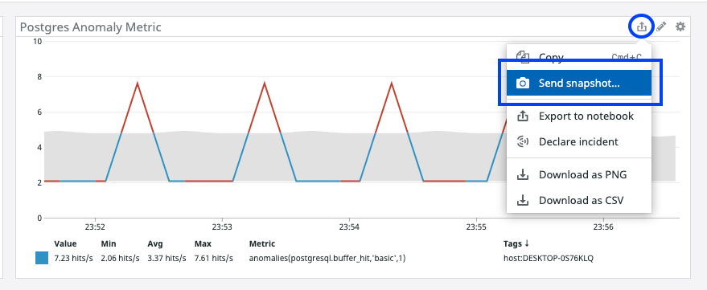
>
>
>Now type @ at the bottom of the graph in the light blue box and you will see a dropdown list, select your name from the list and hit enter.  
>
>
>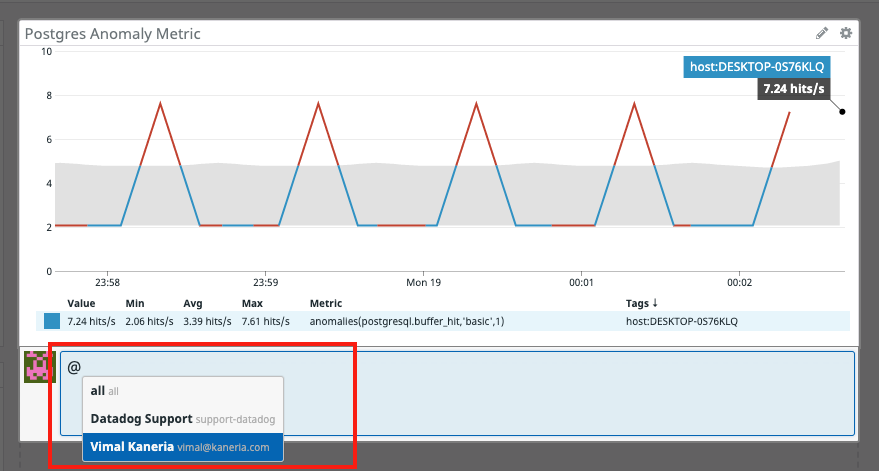
>
>
>You will get an email with a snapshot of the graph.  Repeat the process of the other 2 widgets.
>
>
>

>

>


* **Bonus Question**: What is the Anomaly graph displaying?

>## ***SOLUTION***
>
>The anomaly graph is displaying when data is out of normal ranges based on historical predictable patterns, without historical data the graph is not meaningful.

<br></br>

## Monitoring Data

Since you’ve already caught your test metric going above 800 once, you don’t want to have to continually watch this dashboard to be alerted when it goes above 800 again. So let’s make life easier by creating a monitor.

Create a new Metric Monitor that watches the average of your custom metric (my_metric) and will alert if it’s above the following values over the past 5 minutes:

* Warning threshold of 500
* Alerting threshold of 800
* And also ensure that it will notify you if there is No Data for this query over the past 10m.

Please configure the monitor’s message so that it will:

* Send you an email whenever the monitor triggers.
* Create different messages based on whether the monitor is in an Alert, Warning, or No Data state.
* Include the metric value that caused the monitor to trigger and host ip when the Monitor triggers an Alert state.

>## ***Solution***
>
>Monitors allow you to get notified based on the threshold values set to trigger the monitors.  These notifications can be very helpful in managing and monitoring production environments and allowing you to take appropriate corrective actions.
>
>We will create a new Metric Monitor by selecting "New Monitor" from the Monitors navigation menu in the left side in the Datadog portal
>
> Section 1.  Choose the detection method (modify the following value as shown below)
>
>				select "Threshold Alert"
>
> Section 2.  Define the metric (modify the following value as shown below)
>
>				metric = "<enter metric name created earlier>"
>	
>				*metric = "my_check_metric_value"* 
>
>				from = "host:<Windows 10 Pro Host>"
>
> Section 3.	Set alert conditions (modify the following value as shown below)
>
>				Trigger when metric is *above* the threshold *on average* during the last *5 minutes*
>
>				Alert Threshold > *800*
>
>				Warning Threshold > *500*
>
>				*Notify* if data is missing for more than *10* minutes
>	
> Section 4.	Say What's Happening
>
>				Metric Name = <enter a meaningful name for the metric>
>
>				*Metric Name = My_Metric_Check_Value for "{{host.name}}" is out of range*
>
>				next enter the custom message based on the type of alert
>
>				{{#is_alert}}
>  					My_Metric_Check_Value is over the "Alert" threshold
>  					Average over past 5 minutes  --- "{{value}}"
>  					Hostname is --- "{{host.name}}" 
>		  			Host IP is --- "{{host.ip}}" <@-NOTIFICATION>
>				{{/is_alert}} 
>
>				{{#is_warning}}
>  					My_Metric_Check_Value is over the "Warning" threshold
>		  			Average over past 5 minutes  --- "{{value}}" 
>  					Hostname is --- "{{host.name}}" 
>  					Host IP is --- "{{host.ip}}" <@-NOTIFICATION>
>				{{/is_warning}} 
>
>				{{#is_no_data}}
>  					My_Metric_Check_Value is "MISSING"
>  					Average over past 10 minutes  --- "{{value}}"
>  					Hostname is --- "{{host.name}}" 
>  					Host IP is --- "{{host.ip}}" <@-NOTIFICATION>
>				{{/is_no_data}}
>
	
>

* When this monitor sends you an email notification, take a screenshot of the email that it sends you.

>## ***SOLUTION***


>
>

* **Bonus Question**: Since this monitor is going to alert pretty often, you don’t want to be alerted when you are out of the office. Set up two scheduled downtimes for this monitor:

  * One that silences it from 7pm to 9am daily on M-F,
  * And one that silences it all day on Sat-Sun.
  * Make sure that your email is notified when you schedule the downtime and take a screenshot of that notification.
  
>## ***SOLUTION***
>
>In order to create downtime schedules, go to "Manage Downtime" tab by selecting "Manage Downtime" from the Monitors navigation menu on the left of the Datadog portal.
>
>Then click on "Schedule Downtime" on the top right of the window.
>
>
>
>Then select the Monitor we want to silence from the dropdown list of monitors.  Next we will fill in the schedule.  In this case it will be a recurring daily schedule Mon thru Fri starting 7pm and ending 9am
>
>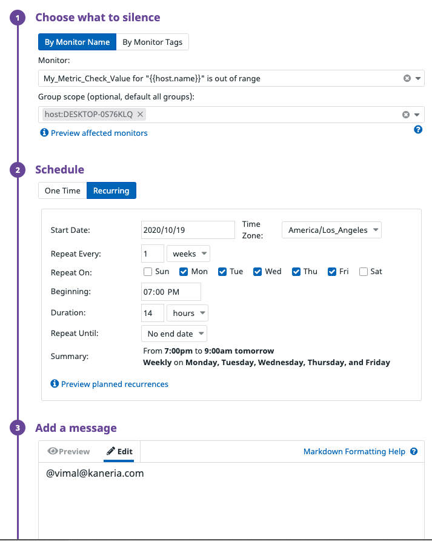
>
>Next we will create another schdule for Sat and Sun.  This schdule will start at 9am Saturday and end at 9am Monday.
>
>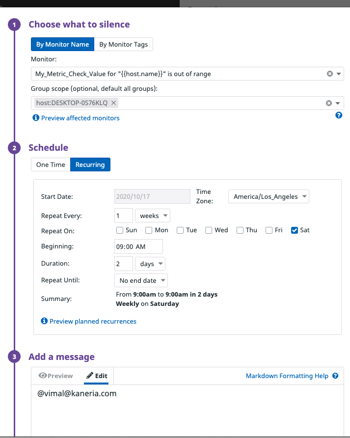  
>
>Here is the screenshot of the email we received from these scheduled downtimes.
>
>
>
<br></br>

## Collecting APM Data:

Given the following Flask app (or any Python/Ruby/Go app of your choice) instrument this using Datadog’s APM solution:

```python
from flask import Flask
import logging
import sys

# Have flask use stdout as the logger
main_logger = logging.getLogger()
main_logger.setLevel(logging.DEBUG)
c = logging.StreamHandler(sys.stdout)
formatter = logging.Formatter('%(asctime)s - %(name)s - %(levelname)s - %(message)s')
c.setFormatter(formatter)
main_logger.addHandler(c)

app = Flask(__name__)

@app.route('/')
def api_entry():
    return 'Entrypoint to the Application'

@app.route('/api/apm')
def apm_endpoint():
    return 'Getting APM Started'

@app.route('/api/trace')
def trace_endpoint():
    return 'Posting Traces'

if __name__ == '__main__':
    app.run(host='0.0.0.0', port='5050')
```

* **Note**: Using both ddtrace-run and manually inserting the Middleware has been known to cause issues. Please only use one or the other.

>## ***SOLUTION***
>
>Datadog is able to get trace and application analytics from services and apps being monitored by Datadog.  You just have to enable APM and tracing to get data from your apps and services.
>
>We will be using the Dockerized Datadog agent for this part
>
>### ***Step 1. First we have to setup the environment for docker image***
>
>We will start the Docker Datadog Image with the following parameters
>
>*DD_APM_ENABLED=true*  
>*DD_TRACE_ANALYTICS_ENABLED=true* 
>*DD_PROFILING_ENABLED=true* 
>*DD_TRACE_ANALYTICS_ENABLED=true*
>*DD_LOGS_INJECTION=true* optional
>
>```
>docker run -d --name dd-agent -v /var/run/docker.sock:/var/run/docker.sock:ro -v /proc/:/host/proc/:ro -v /sys/fs/cgroup/:/host/sys/fs/cgroup:ro -e DD_API_KEY=<API_KEY> -e DD_SITE="datadoghq.com" -e DD_TAGS="systemname:vk_docker systemtype:vk_docker_demo" -e DD_SERVICE="vk-ddtrace-service" -e DD_ENV="vk-ddtrace-env" -e DD_TRACE_ANALYTICS_ENABLED=true -e DD_APM_ENABLED=true -e DD_PROFILING_ENABLED=true -e DD_LOGS_INJECTION=true -p 8126:8126/tcp datadog/agent:latest
>``` 
>
>### ***Step 2. Install/Update Python Client and Related Packages***
>
>Open CLI window for the Docker Container and update apt-get
>
>> **apt-get update**
>
>install vim *to edit files*
>
>> **apt-get install vim**
>
>Upgrade pip
>
>> **python3 -m pip install --upgrade pip**
>
>Install ddtrace
>
>> **pip install ddtrace**
>
>Install flask
>
>> **pip install flask**
>
>
>
>### ***Step 3. Instrument the flask application***
>
>Copy the above code and create a file name "FLASKapp.py" *file can be any name except flask.py.  Modify code as need
>
>Run the following command to Instrument the application
>
>> **ddtrace-run python FLASKapp.py**
>
>

* **Bonus Question**: What is the difference between a Service and a Resource?

>### ***SOLUTION***
>
>### ***A service is a set of processes that do the same job \[i.e. database].  A resource is a particular action within a given service \[i.e query]***

Provide a link and a screenshot of a Dashboard with both APM and Infrastructure Metrics.

>[here is link to the Dashboard with both APM and Infrastructure Metrics](https://p.datadoghq.com/sb/jz1ihhw7w5m1qtc4-3d4ffce1148d890c733dacea56865e66)

>here is a screenshot of the Dashboard
>
>
>
>

Please include your fully instrumented app in your submission, as well.

>## ***SOLUTION***
>
>I instrumented 2 flask apps by running the following commands
>
>> **ddtrace-run python FLASKapp.py**
>
>and
>
>> **ddtrace-run python FLASKapp.py**
>
>
>### ***here is the code from FLASKapp.py***
>
>>```
>>from flask import Flask
>>import logging
>>import sys
>>import socket
>>
>>
>>  # Have flask use stdout as the logger
>>main_logger = logging.getLogger()
>>main_logger.setLevel(logging.DEBUG)
>>c = logging.StreamHandler(sys.stdout)
>>formatter = logging.Formatter('%(asctime)s - %(name)s - %(levelname)s - %(message)s')
>>c.setFormatter(formatter)
>>main_logger.addHandler(c)
>>
>>host_name = socket.gethostname()
>>host_ip = socket.gethostbyname(host_name)
>>
>>app = Flask(__name__)
>>
>>@app.route('/')
>>def api_entry():
>>    return 'Entrypoint to the Application'
>>
>>@app.route('/api/apm')
>>def apm_endpoint():
>>    return 'Getting APM Started'
>>
>>@app.route('/api/trace')
>>def trace_endpoint():
>>    return 'Posting Traces'
>>
>>if __name__ == '__main__':
>>    app.run(host=host_ip, port='5050')
>>```
>
>### ***here is the code from FLASKapp2.py***
>
>
>>```
>>from flask import Flask
>>import logging
>>import sys
>>import socket
>>
>>
>>  # Have flask use stdout as the logger
>>main_logger = logging.getLogger()
>>main_logger.setLevel(logging.DEBUG)
>>c = logging.StreamHandler(sys.stdout)
>>formatter = logging.Formatter('%(asctime)s - %(name)s - %(levelname)s - %(message)s')
>>c.setFormatter(formatter)
>>main_logger.addHandler(c)
>>
>>host_name = socket.gethostname()
>>host_ip = socket.gethostbyname(host_name)
>>
>>app = Flask(__name__)
>>
>>@app.route('/')
>>def api_entry():
>>    return 'Entrypoint to the Application'
>>
>>@app.route('/api/apm')
>>def apm_endpoint():
>>    return 'Getting APM Started'
>>
>>@app.route('/api/trace')
>>def trace_endpoint():
>>    return 'Posting Traces'
>>
>>if __name__ == '__main__':
>>    app.run(host='0.0.0.0', port='5555')
>>```
>>
>
>### ***The difference between the 2 apps is that they run on different IPs and different ports***
<br></br>
<br></br>

## Final Question:

Datadog has been used in a lot of creative ways in the past. We’ve written some blog posts about using Datadog to monitor the NYC Subway System, Pokemon Go, and even office restroom availability!

Is there anything creative you would use Datadog for?

>### ***SOLUTION***
>
>Datadog has already been used creatively for so so many applications.  What I feel would be some additional creative use cases (if someone has not already thought of these) are the following:
>
> ***1. Monitor solar panel production efficiency, enable anomaly detection to predict abnormal patterns***
>
> ***2. Monitor using IoT of things in combination with Big Data and ML to potentially predict next pandemic*** 
<br></br>
<br></br>

## Thank you for allowing me to participate in this exercise ##
