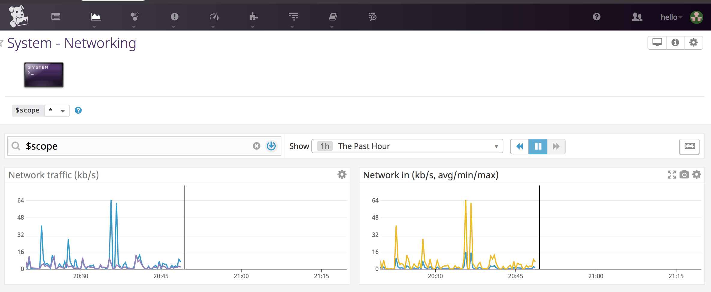

## Tiffany Monroe
Solutions Engineer Applicant

## The Exercise

Don’t forget to read the [References](https://github.com/DataDog/hiring-engineers/blob/solutions-engineer/README.md#references)

## Questions

Please provide screenshots and code snippets for all steps.

## Prerequisites - Setup the environment

You can utilize any OS/host that you would like to complete this exercise. However, we recommend one of the following approaches:

* You can spin up a fresh linux VM via Vagrant or other tools so that you don’t run into any OS or dependency issues. [Here are instructions](https://github.com/DataDog/hiring-engineers/blob/solutions-engineer/README.md#vagrant) for setting up a Vagrant Ubuntu VM. We strongly recommend using minimum `v. 16.04` to avoid dependency issues.

Then, sign up for Datadog (use “Datadog Recruiting Candidate” in the “Company” field), get the Agent reporting metrics from your local machine.

