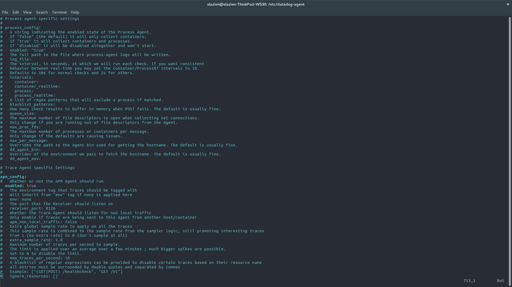

# Datadog Solutions Engineer Technical Exercise - answers

## Prerequisites - Setup the environment

My environment for completing the exercises consisted of a 64-bit Linux Ubuntu 16.04 since I use it on a daily basis. No OS or dependency issues were encountered while completing the exercises.


## Collecting Metrics

1. I have added 4 tags to my Agent: #awesome_tag, #env:test, #nice_tag, #host:slazien-ThinkPad-W530


2. Already having PostgreSQL installed on my OS, I have then installed the relevant Datadog integration using the instructions provided here: https://docs.datadoghq.com/integrations/postgres/.


3. I have then created a custom Agent check that submits a metric named *my_metric* with a random value between 0 and 1000 (inclusive):
```python
import random

try:
    from checks import AgentCheck
except ImportError:
    from datadog_checks.checks import AgentCheck

__version__ = "1.0.0"

class CustomCheck(AgentCheck):
    def check(self, instance):
        self.gauge("my_metric", random.randint(0, 1000))
```

4. **Bonus question:** Can you change the collection interval without modifying the Python check file you created?
Yes! This can be done by adding a *min_collection_interval* as instance parameter to the check's .yaml configuration file 


## Visualizing Data
1. Using the Datadog API I have created a Timeboard that contained:
- My custom metric (*my_metric* scoped over my host: *slazien-ThinkPad-W530*)
- *rows_fetched* metric from the PostgreSQL Datadog integration which measures the number of fetched rows per second. I have also applied the Anomaly function using the *basic* algorithm and set 1.2 for the number of standard deviations for the algorithm to detect anomalies
- I have also included a graph of *my_metric* and applied the rollup function to sum up all the points for the past hour:


2. Since the PostgreSQL graph was rather boring (oscillating between two values repeatedly), I ran an expensive query to create a spike in the *rows_fetched* graph and sent a 5-minute snapshot to my email:


3. **Bonus question:** What is the anomaly graph displaying?
- In the screenshot above, the timeseries graph is displaying that around 18:03 a spike in rows fetched occurred, which surpassed the set standard deviation of 1.2. Graphs like this one are very useful since they allow us to detect events which we would not normally expect to happen (based on historical data). In this particular scenario, a sudden increase in the number of rows fetched could indicate that someone has just run an read-intensive query such as *SELECT * FROM table_name;*, where the table contained a large number of rows.
- In general, an Anomaly graph allows to, quite simply, detect anomalous values of metrics, based on historical context.t Examples of very valuable, yet also very variable metrics include application throughput, web requests or user logins. Such metrics might exhibit seasonal patterns (e.g. increased login rate in the evenings) or show a trend (e.g. monotonically increasing number of web requests due to a rapidly growing user base of a high-growth startup)

## Monitoring Data
1. I have created a Metric Monitor which monitors the average of my_metric and has the following states:
- Alert threshold of 800
- Warning threshold of 500
- Notification when No Data over the past 10 minutes

2. The message has been configured as follows:
- Send an email upon a Monitor trigger
- Send a different message depending on monitor state (Alert, Warning, No Data)
- Report metric value and host IP when in Alert state

Here is a screenshot of my Monitor's configuration:


... of one of the emails I received from the Monitor after it was triggered:


... of daily 7pm-9am silencing:


.. and, finally, of weekend silencing:


## Collecting APM data
1. To make the APM work, I have used ddtrace and set the appropriate option in the *datadog.yaml* file:


2. I used the following Flask app to be instrumented using Datadog's APM:
```python
from flask import Flask
import logging
import sys

# Have flask use stdout as the logger
main_logger = logging.getLogger()
main_logger.setLevel(logging.DEBUG)
c = logging.StreamHandler(sys.stdout)
formatter = logging.Formatter('%(asctime)s - %(name)s - %(levelname)s - %(message)s')
c.setFormatter(formatter)
main_logger.addHandler(c)

app = Flask(__name__)

@app.route('/')
def api_entry():
    return 'Entrypoint to the Application'

@app.route('/api/apm')
def apm_endpoint():
    return 'Getting APM Started'

@app.route('/api/trace')
def trace_endpoint():
    return 'Posting Traces'

if __name__ == '__main__':
    app.run(host='0.0.0.0', port='5050')
```

3. Finally, I ran ```$ ddtrace-run python app.py``` to instrument the app above

4. After completing the above steps, the app was successfully running, as can be seen in the Service Map:


5. I then added a chart of number of requests for my Flask app to my existing Timeboard created earlier:


6. Additionally, I provide a screenshot of the summary of metrics reported for the Flask app:


7. **Bonus Question:** What is the difference between a Service and a Resource?
- A Service is a set of processes that do the same job. An example might be a web app, such as the Flask app I created.
- On the other hand, a Resource is a particular action for a Service. In the case of my Flask app, these are canonical URLs that can be seen at the bottom of this screenshot:


In general, the main difference is the level of *granularity* at which we can monitor a given app's performance, with a Service proving a lower granularity than a Resource. However, this is not to say that a Service is necessarily *worse* that a Resource due to lower granularity. Depending on a particular scenario, it might be more helpful to troubleshoot app's performance by first obtaining a high-level overview of the system, in which case examining Services first should be more productive.

## Final Question

1. Datadog has been used in a lot of creative ways in the past. We’ve written some blog posts about using Datadog to monitor the NYC Subway System, Pokemon Go, and even office restroom availability! Is there anything creative you would use Datadog for?
- Absolutely! I've been learning about and using Machine Learning for over 3 years now, and one of the scenarios I came across too often was monitoring the training of my Deep Learning models, which often took hours if not days. Sitting at the computer for so long would not be feasible. Datadog could easily be used to track and monitor the progress of training large Deep Learning models by monitoring metrics such as CPU usage per core, GPU memory usage or disk I/O. And the best part is - it could all be done remotely! This way, if something goes wrong with the training process, I could be alerted if, say, the CPU and usage falls below 5%, suggesting that my models might have stopped training. This is just one of the countless possible applications of Datadog for facilitating the process of developing Machine Learning models.


## Final Remarks
It was a lot of fun to go through all the challenges and see the big picture of just how much Datado'g platorm is capable of. I especially enjoyed digging into documentation to find details on things such as configuring the APM or changing the Agent Check's configuration file, which were not obvious at first sight. I feel great about completing all the exercises and actually seeing the monitoring platform working. In fact, I loved the combined simplicity and massive capability of Datadog that I have already started using it for monitoring of my laptop's performance, especially when training Deep Learning models for prolonged periods of time. Thank you for giving me the opportunity to complete this challenge!
