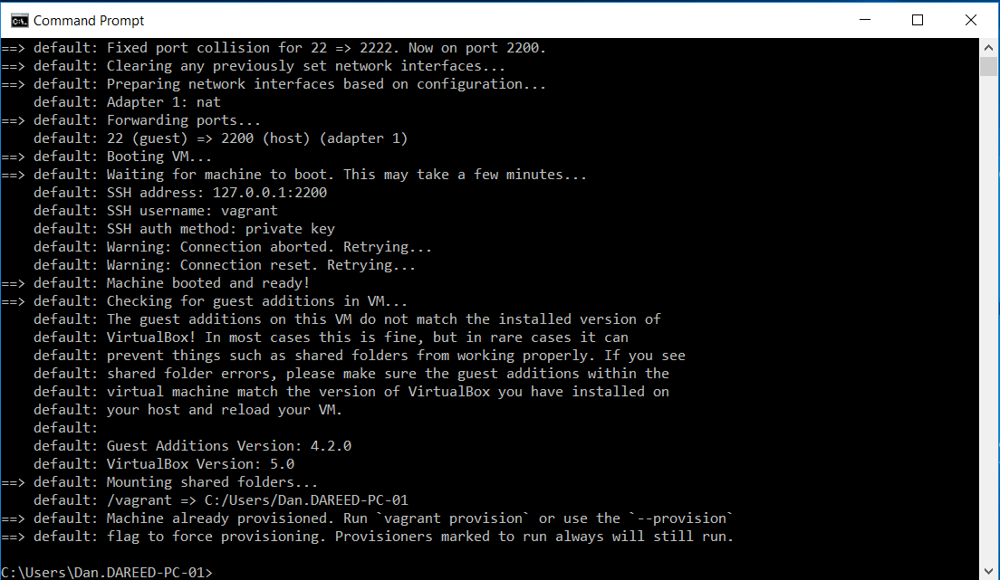

## Datadog Solution Engineer - Technical Excercise
The documented steps below are designed to provide an introduction to the Datadog monitoring service to a prospective solution engineer.   By executing on the below items an engineer can gain a basic understading of how the Datadog monitoring service can collect, report and notifiy based on metrics.  Installation of agents on multiple platforms, configuring of collectors for multiple products, and configuring items within the Datadog web based console are all documented in the items listed in the table of contents below.
## Table of Contents
- [Setup an Ubuntu VM](#setup-an-ubuntu-vm)
  - [Installing Oracle VirtualBox on Windows](#installing-oracle-virtualbox-on-windows)
  - [Installing Vagrant on Windows](#installing-vagrant-on-windows)
  - [Configuring Vagrantfile](#configuring-vagrantfile)
  - [Starting the Ubuntu VM](#starting-the-ubuntu-vm)
- [Collecting Your Data](#collecting-your-data)
  - [Installing the Datadog Agent on Ubuntu](#installing-the-datadog-agent-on-ubuntu)
  - [Adding Tags to the agentconfig file](#adding-tags-to-the-agentconfig-file)
  - [Restart the Datadog Agent](#restart-the-datadog-agent)
  - [Group the Infrastructure by Tag](#group-the-infrastructure-by-tag)
  - [Installing Postgresql on Ubuntu](#installing-postgresql-on-ubuntu)
  - [Adding User Account in Postgres for Datadog](#adding-user-account-in-postgres-for-datadog)
  - [Collect Postgresql Metrics in Datadog](#collect-postgresql-metrics-in-datadog)
  - [Verify Postgresql Metric Collection](#verify-postgresql-metric-collection)
  - [Configure the Agent to Sample Random Data](#configure-the-agent-to-sample-random-data)
 - [Visualizing Your Data](#visualizing-your-data)
  - [Adding the Postgresql and Random Metrics to a Dashboard](#adding-the-postgresql-and-random-metrics-to-a-dashboard)
  - [Snapshot and Notify Based on Threshold](#snapshot-and-notify-based-on-threshold)
 - [Alerting on Your Data](#alerting-on-your-data)
  - [Configure a Monitor Based on Threshold](#configure-a-monitor-based-on-threshold)
  - [Re-Configure the Monitor for Multi-Alert](#re-configure-the-monitor-for-multi-alert)  
  - [Configure Downtime for Monitor](#configure-downtime-for-monitor)
 - [Extended Use Cases](#extended-use-cases)
  - [Collecting Metrics from Docker](#collecting-metrics-from-docker)
    - [Installing the Datadog Agent on RHEL](#installing-the-datadog-agent-on-rhel)
    - [Collect Docker Metrics in Datadog](#collect-docker-metrics-in-datadog)
    - [Verify Docker Metric Collection](#verify-docker-metric-collection)
  - [Collecting Metrics from VMWare VSphere](#collecting-metrics-from-vmware-vsphere)
    - [Installing the Datadog Agent on Windows](#installing-the-datadog-agent-on-windows)
    - [Collect VSphere Metrics in Datadog](#collect-vsphere-metrics-in-datadog)
    - [Verify VSphere Metric Collection](#verify-vsphere-metric-collection)

## Setup an Ubuntu VM
### Installing Oracle VirtualBox on Windows
VirtualBox is a general-purpose full virtualizer for x86 hardware, targeted at server, desktop and embedded use. 

Version 5.1.26 for Windows can be downloaded [here](http://download.virtualbox.org/virtualbox/5.1.26/VirtualBox-5.1.26-117224-Win.exe)

Download, run the installer and referance the wiki [here](https://www.virtualbox.org/manual/ch02.html#installation_windows) for the specific installation directions for Windows

### Installing Vagrant on Windows
Vagrant is a tool for building and managing virtual machine environments in a single workflow. With an easy-to-use workflow and focus on automation, Vagrant lowers development environment setup time, increases production parity, and makes the "works on my machine" excuse a relic of the past.

The 64-bit download for Windows is available [here](https://releases.hashicorp.com/vagrant/1.9.7/vagrant_1.9.7_x86_64.msi)

The installation instruction for Vagrant is available from HashiCorp's wiki located [here](https://www.vagrantup.com/docs/installation/)

### Configuring Vagrantfile
There are several configuration steps neccessary to configure vagrant to startup an Ubuntu 12.5 virtual machine in VirtualBox.
  - Start a windows command prompt and change to the path you want the vagrant configuration to be stored
  - Execute vagrant with the initialization parameter from the command line: `vagrant init`
  - A configuration called `Vagrantfile` will be placed in the current directory, open it with a text editor
  - Update the parameter `config.vm.box = "base"` to be `config.vm.box = "hashicorp/precise64"`
  - Save and close the `Vagrantfile`
### Starting the Ubuntu VM
From the Windows command prompt issue the command: `vagrant start`

Output from the command should be something like below

## Collecting Your Data
### Installing the Datadog Agent on Ubuntu
### Adding Tags to the agentconfig file
### Restart the Datadog Agent
### Group the Infrastructure by Tag
### Installing Postgresql on Ubuntu
### Adding User Account in Postgres for Datadog
### Collect Postgresql Metrics in Datadog
### Verify Postgresql Metric Collection
### Configure the Agent to Sample Random Data
## Visualizing Your Data
### Adding the Postgresql and Random Metrics to a Dashboard
### Snapshot and Notify Based on Threshold
## Alerting on Your Data
### Configure a Monitor Based on Threshold
### Re-Configure the Monitor for Multi-Alert
### Configure Downtime for Monitor
## Extended Use Cases
### Collecting Metrics from Docker
#### Installing the Datadog Agent on RHEL
#### Collect Docker Metrics in Datadog
#### Verify Docker Metric Collection
### Collecting Metrics from VMWare VSphere
#### Installing the Datadog Agent on Windows
#### Collect VSphere Metrics in Datadog
#### Verify VSphere Metric Collection
