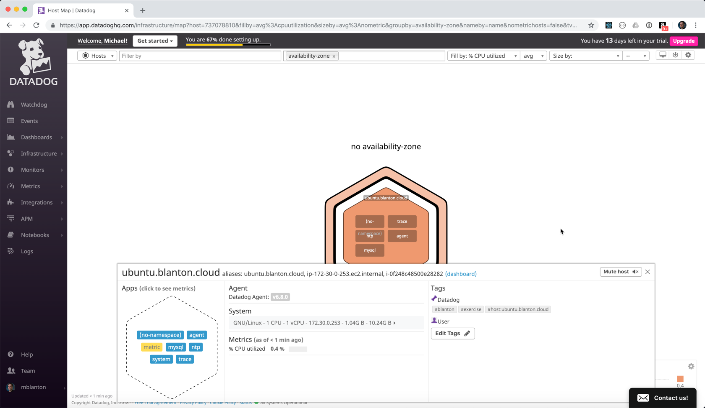
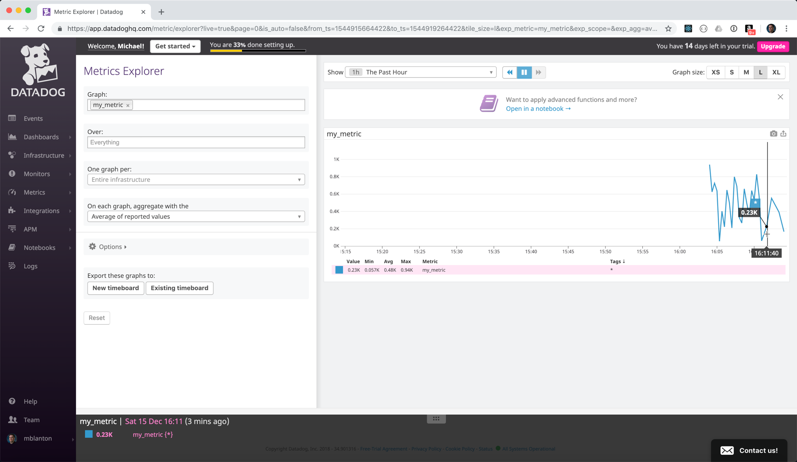
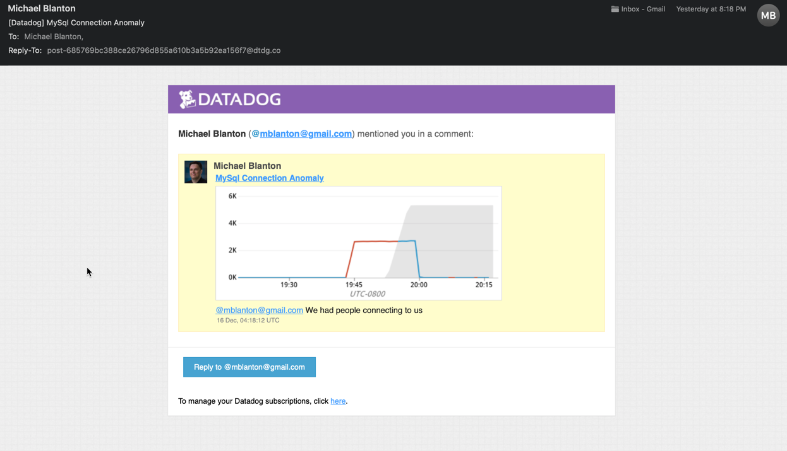
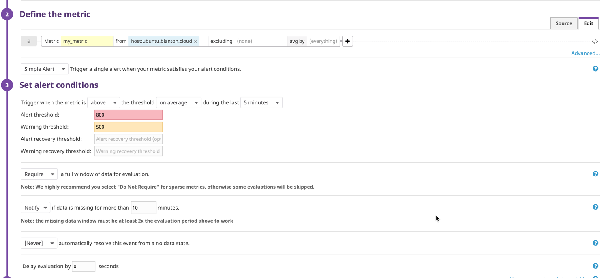
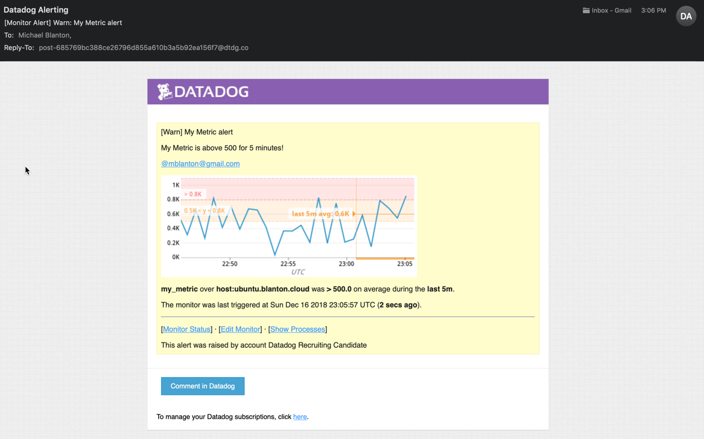
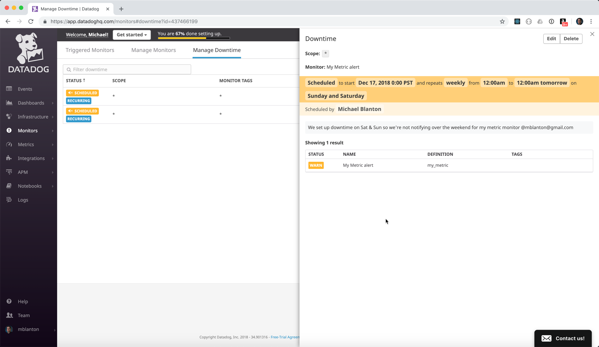
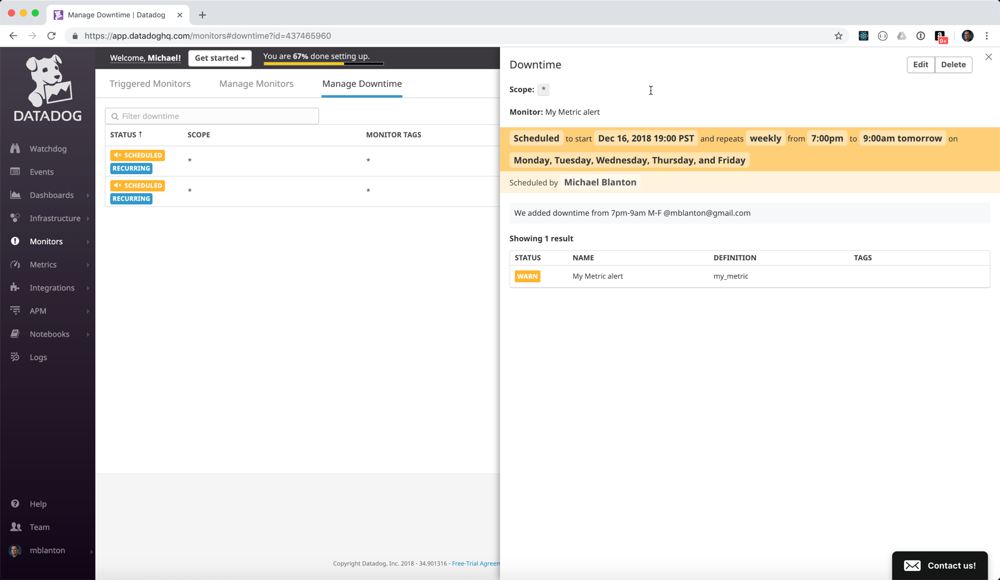
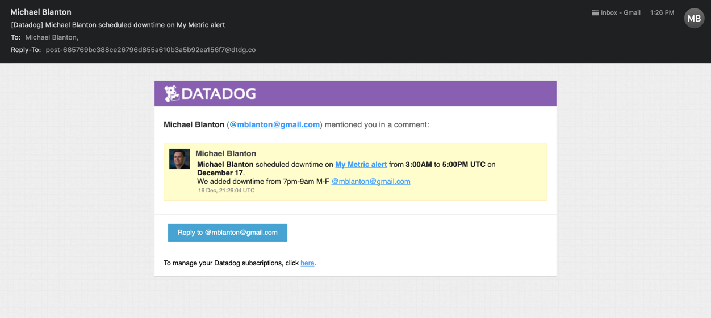
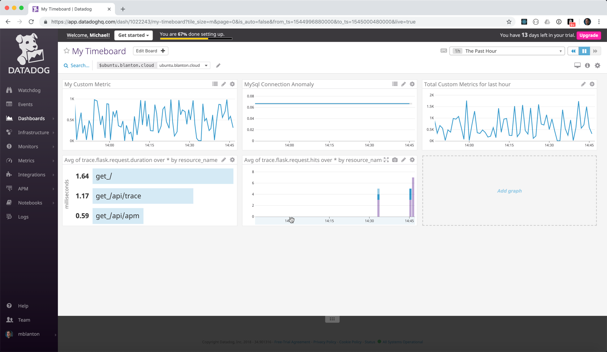

## Collecting Metrics

I have an Ubuntu 16.04 installation that I added a MySQL database to.



I created a custom metric collector, `my_metric`, and configured it to collect
every 45 seconds (instead of the default 15 seconds). This was done by changing
the value of `min_collection_interval` value in `/etc/datadog-agent/conf.d/metric.yaml`.
The custom Agent check code is located [here](./metric.py) and was installed in
`/etc/datadog-agent/checks.d/metric.py`.




## Visualizing Data

First, I created a graph tracking MySQL connections with an anomaly applied to it.
That provided the query to use in the API to create the Timeboard. I then created a
[Python script](./timeboard.py) to create a Timeboard via API. It includes 3 graphs:
1. My Custom Metric over time
2. MySQL Connections
3. Rollup of the My Custom Metric values over the past hour

You can see a screenshot of this Timeboard below.

I took a snapshot of the MySQL Connections chart and tagged myself. It sent me this email:



**Bonus Question** The Anomaly Graph is showing me my data along with a standard deviation
of the data. The more data I have, the better the standard deviation will be. There are also
3 different analysis algorithms in Datadog which can be used to change how the Anomaly
graph monitors or possible error conditions. In my case, as my connections opened, the number
of average connections remained high, and my alert eventually would trigger. As more
connections come in, a pattern may emerge, and Datadog would alert once we're outside
of expected norms.

## Monitoring Data

I then set up an alert to notify me any time my Custom Metric went above 500 (as a Warning)
or above 800 (as an Error), or if no data was passed over 10 minutes.

The Monitor configuration is pictured below. The message is
```
{{#is_alert}}
My Metric is above 800 for 5 minutes!
{{/is_alert}}
{{#is_warning}}
My Metric is above 500 for 5 minutes!
{{/is_warning}}
{{#is_no_data}}
My Metric has no data for 10 minutes!
{{/is_no_data}} @mblanton@gmail.com
```
This sends different messages for alert, warning, and no data.



The email that is sent out is pictured below.



Since I don't want to be monitored all the time (**bonus question**), I set up a Downtime configuration.
I set one up to not notify M-F between 7pm and 9am, and I sent a second up to not notify
on Saturday or Sunday. Those are pictured below.




I've included a screenshot of the notification email below.



## Collecting APM Data

I used the provided Flask app to demonstrate APM collection. One thing I found interesting
was that `ddtrace-run` didn't work when I started the app using the `flask` command, I had
to use `python` instead.

I added the APM metrics to the Timeboard I created earlier.



My Timeboard can be accessed [here](https://app.datadoghq.com/dash/1022243/my-timeboard?tile_size=m&page=0&is_auto=false&from_ts=1545000360000&to_ts=1545003960000&live=true)

**Bonus Question**: What is the difference between a Service and a Resource? A Resource is
a part of a system available to run Services (ie, CPU, Memory, Disk Space). A Service is something
running on a system that performs a function (ie, a Web Server).

## Final Question

As I'm looking at the different graph types, and thinking about the fact that we're in the holiday
season and there are a ton of shoppers out and about, it would be interesting to use DataDog to create
a retail analytics dashboard. We could track how fast items are being scanned at checkout, create
heatmaps of when people are coming in, track dollar volume over time, even compare performance
of individual cashiers, even alert in real time when a cashier might be performing less than
expected or more cash registers might need to be opened up.
