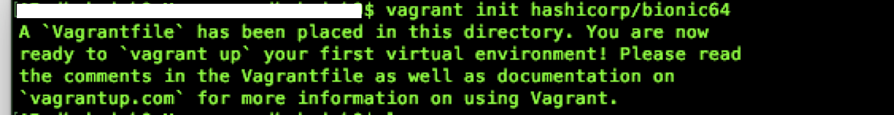
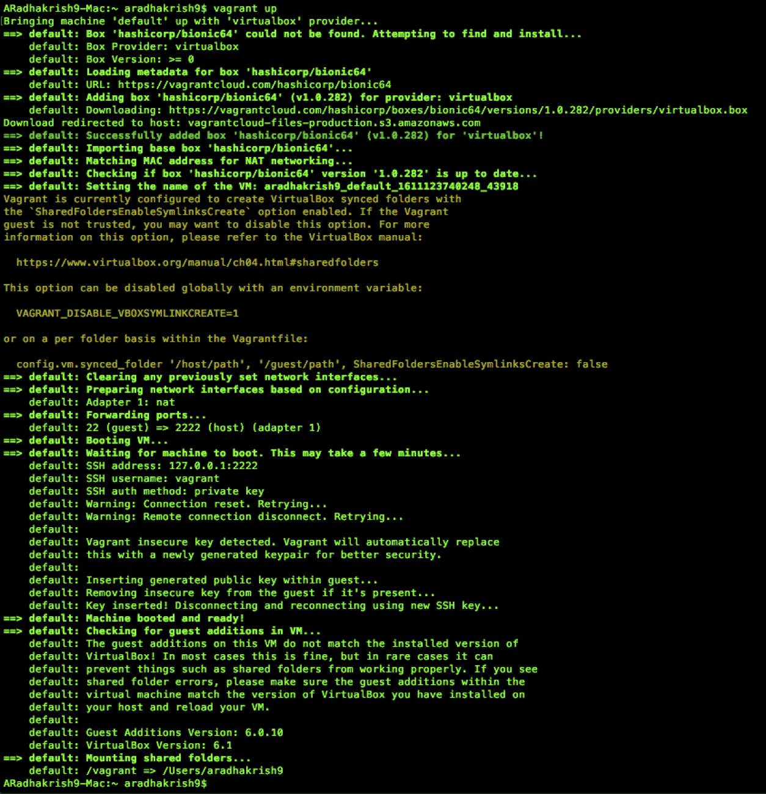
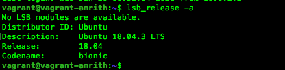
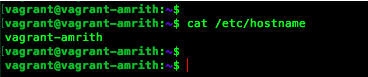

Your answers to the questions go here.

## Amrith's answers to the exercise

Please find below answers to the excercise

# Setting up the environment

## Installing Vagrant and VirtualBox on a local machine

### Install Vagrant:


Download the proper package for your operating system and architecture from [Vagrant Download page](https://www.vagrantup.com/downloads). Additional instructions on installation if needed are available [here](https://www.vagrantup.com/docs/installation)


### Install VirtualBox:

VirtualBox is a free and open source virtualisation software. We will use VirtualBox to run Ubuntu 18.04 The latest version is available in the [VirtualBox Download page](https://www.virtualbox.org/wiki/Downloads)


## Configuring Vagrant and verifying the OS

The following command initialises Vagrant on your local machine and downloads the image of Ubuntu 18.04 also known as Bionic Beaver.
````
vagrant init hashicorp/bionic64
````




### Launching the server

The following command would bring the server up. If this is the first time the command is run and if Vagrant cannot find the image it will attempt to find and install the OS on VirtualBox

````
vagrant up
````


### Connecting to the server

Once Vagrant has brought up the server you will need to connect to it by performing a Vagrant ssh. This simulates connecting to the server through Secure Socket Shell (SSH). The following command connects to the Ubuntu Bionic server that we just spun up:
````
vagrant ssh
````


### Verify the OS version by running the command
````
lsb_release -a
````


### Change the hostname for better identification

The below screenshot confirms that the hostname has changed.


