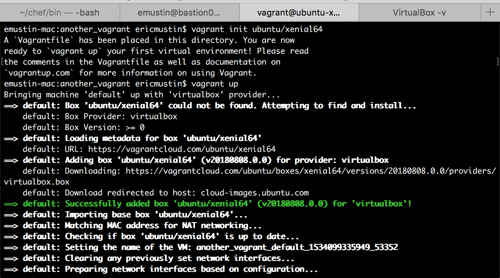
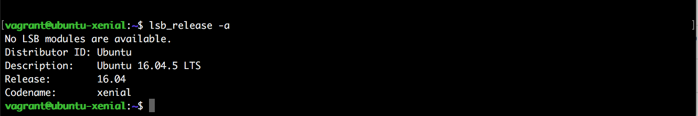
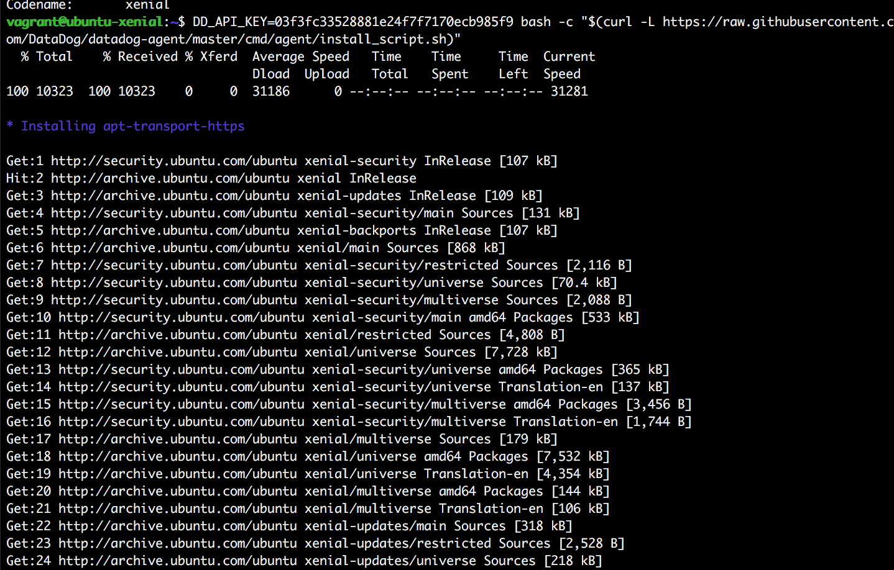
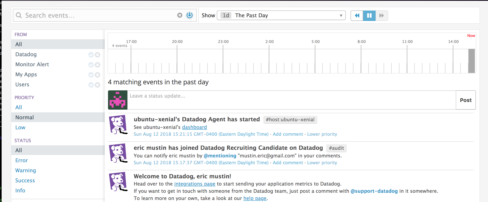

<!-- Your answers to the questions go here. -->

# Datadog Solutions Engineer Answers

## Introduction

Hey everybody (Hi Dr. Nick). Thanks for taking the time to go through my PR, please feel free to reach out if there's any information I can provide or any questions you may have.  I appreciate the opportunity to learn more about the Datadog team and thanks again for taking time out of your day to review my work.

### Prerequisites - Setup the environment

- 1a Vagrant + VirtualBox Setup: After installing Vagrant I spun up an Ubuntu 16 Linux VM ([here](https://app.vagrantup.com/ubuntu/boxes/xenial64))  

- 1b I ssh'd into VM `vagrant ssh` and confirmed `v. 16.04` 

- 1c I signed up for Datadog and installed the Datadog Agent  successfully  ` DD_API_KEY=YOUR_API_KEY bash -c "$(curl -L https://raw.githubusercontent.com/DataDog/datadog-agent/master/cmd/agent/install_script.sh)"` 

- 1d I navigated to the [eventstream](https://app.datadoghq.com/event/stream) `https://app.datadoghq.com/event/stream` and confirmed Agent reporting from my local machine 
