Hello! Thank you for considering me as a candidate.

This document contains my answers/screenshots to the technical evaluation.

## Prerequisites - Setup the environment

* I spun up a fresh linux VM via Vagrant. I used the recommended `v. 16.04`.
* I then signed up for Datadog and got the Agent reporting metrics from my local machine. [You can see this view here:](https://app.datadoghq.com/dash/host/497203256?live=true&from_ts=1528333343031&to_ts=1528336943031&page=0&is_auto=false&tile_size=m)

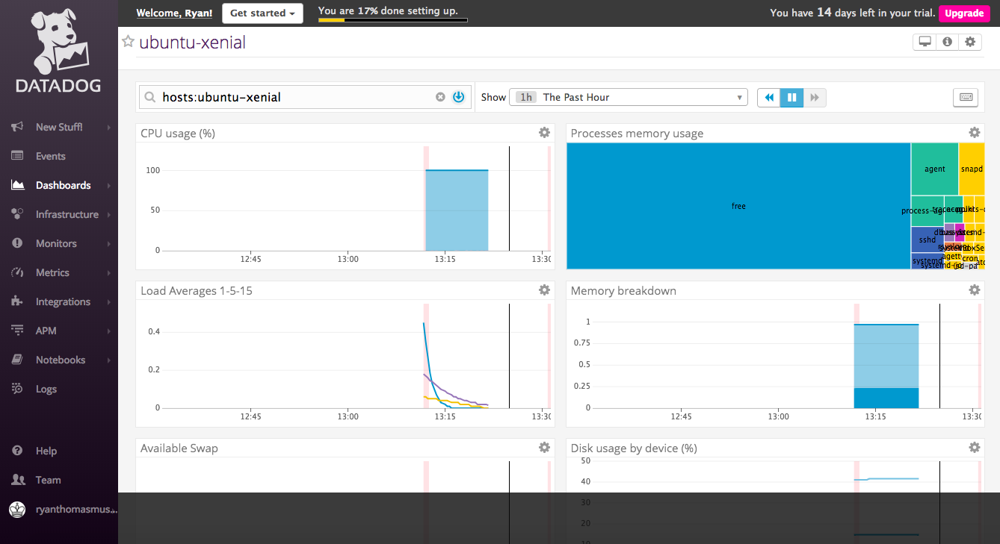

## Collecting Metrics:

* I added tags in the Agent config file; here's a screenshot of my host and its tags on the Host Map page in Datadog. [You can see this view here:](https://app.datadoghq.com/infrastructure/map?fillby=avg%3Acpuutilization&sizeby=avg%3Anometric&groupby=availability-zone&nameby=name&nometrichosts=false&tvMode=false&nogrouphosts=true&palette=green_to_orange&paletteflip=false&node_type=host&app=hello&host=497203256) 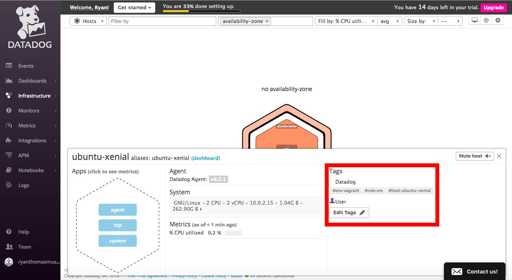
* I installed a database on my machine (MySQL) and then installed the Datadog integration for MySQL. [You can see this view here:](https://app.datadoghq.com/dash/integration/12/MySQL%20-%20Overview?live=true&tpl_var_scope=host%3Aubuntu-xenial&page=0&is_auto=false&from_ts=1528333560783&to_ts=1528337160783&tile_size=m) 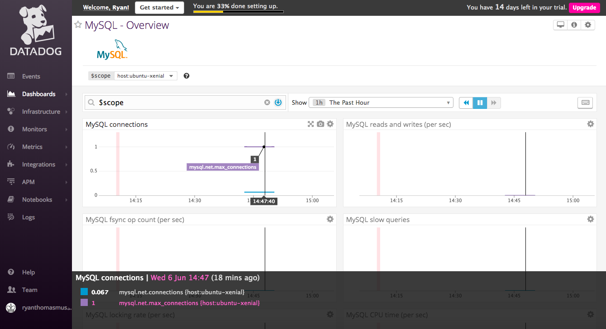
* I created a custom Agent check that submits a metric named my_metric with a random value between 0 and 1000. [You can see this view here:](https://app.datadoghq.com/metric/summary?filter=my_metr) 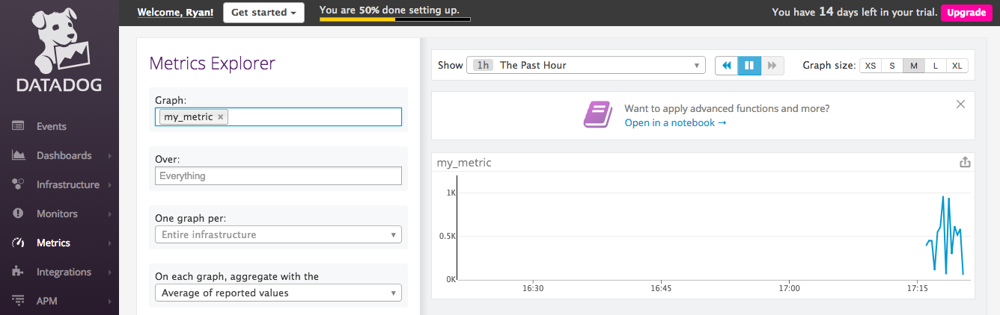
* I changed my check's collection interval so that it only submits the metric once every 45 seconds. In the yaml file for my check, I changed `min_collection_interval: 45`
* **Bonus Question**: Using the configuration change above, I changed the collection interval without modifying the Python check file I created.

## Visualizing Data:

I utilized the Datadog API to create a Timeboard that contains:
* My custom metric scoped over my host
* A metric from the MySQL integration with the anomaly function applied 
* A custom metric with the rollup function applied to sum up all the points for the past hour into one bucket. 

[You can see this view here:](https://app.datadoghq.com/dash/829501/ryans-tech-evaluation?live=true&page=0&is_auto=false&from_ts=1528337274288&to_ts=1528340874288&tile_size=m) 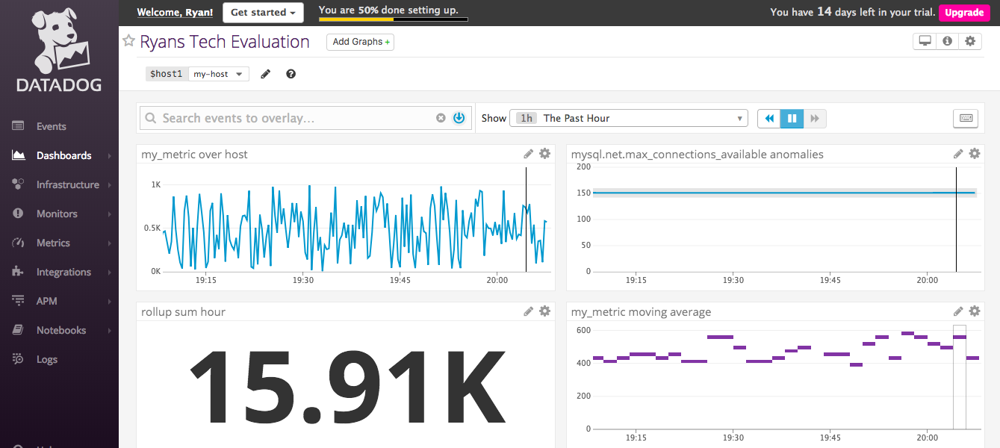

I've included the script that I used to create the Timeboard here:

```

curl  -X POST -H "Content-type: application/json" \
    -d '{
"graphs": [
{
    "title": "my_metric over host",
    "definition":
    {
        "requests": [
        {
            "q": "avg:my_metric{host:ubuntu-xenial}"
        }]
    },
    "viz": "timeseries"
},
{
    "title": "mysql.net.max_connections_available anomalies",
    "definition":
    {
        "requests": [
        {
            "q": "anomalies(avg:mysql.net.max_connections_available{host:ubuntu-xenial}, \"basic\", 6)",
            "type": "line",
            "style":
            {
                "palette": "dog_classic",
                "type": "solid",
                "width": "normal"
            },
            "conditional_formats": [],
            "aggregator": "avg"
        }],
        "viz": "timeseries",
        "autoscale": true
    },
    "viz": "timeseries"
},
{
    "title": "rollup sum hour",
    "definition":
    {
        "requests": [
        {
            "q": "avg:my_metric{host:ubuntu-xenial}.rollup(sum, 3600)",
            "type": "line",
            "style":
            {
                "palette": "dog_classic",
                "type": "solid",
                "width": "normal"
            },
            "conditional_formats": [],
            "aggregator": "avg"
        }]
    },
    "status": "done",
  "viz": "query_value",
  "autoscale": true
},
{
    "title": "my_metric moving average",
    "definition":
    {
        "requests": [
        {
            "q": "ewma_10(sum:my_metric{*} by {host})",
            "type": "area",
            "style":
            {
                "palette": "dog_classic",
                "type": "solid",
                "width": "normal"
            },
            "conditional_formats": [],
            "aggregator": "avg"
        }]
    },
    "viz": "heatmap",
    "autoscale": true,
    "status": "done"
}],
"title": "Ryans Tech Evaluation",
"description": "The timeboard I created!",
"template_variables": [
{
    "name": "host1",
    "prefix": "host",
    "default": "host:my-host"
}],
"read_only": "True"
}
' \
"https://api.datadoghq.com/api/v1/dash?api_key=<YOUR_API_KEY>&application_key=<YOUR_APP_KEY>"

```


Once this was created, I access the Dashboard from my Dashboard List in the UI. I then:

* Set the Timeboard's timeframe to the past 5 minutes: 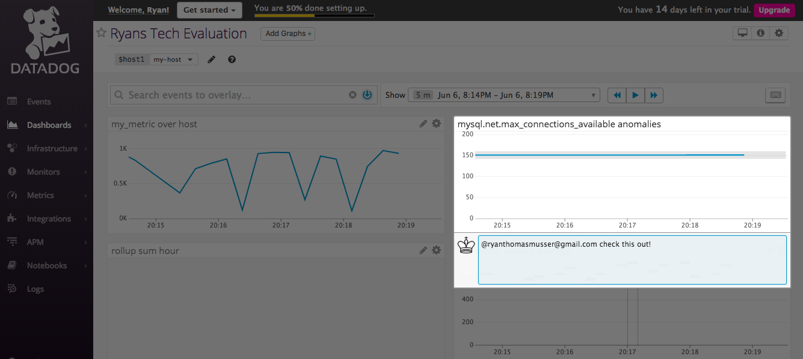
* Took a snapshot of this graph and use the @ notation to send it to myself: 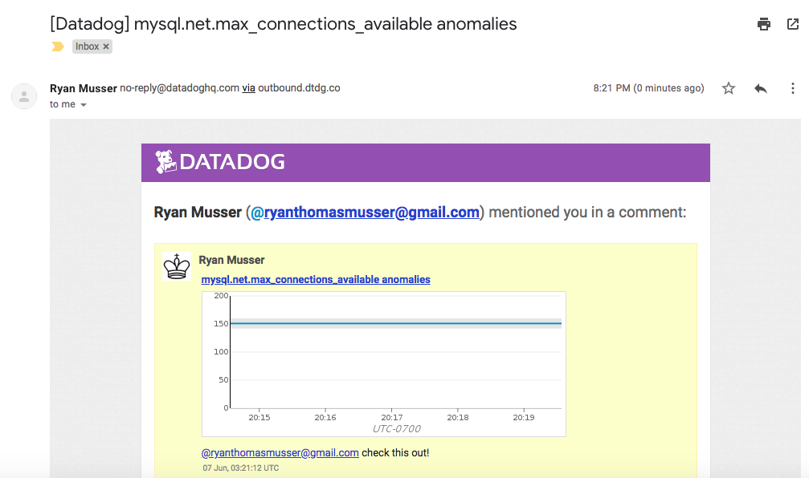
* **Bonus Question**: The anomaly graph is displaying my `mysql.net.max_connections_available` measured by Datadog's *Basic* algorithm. This algorithm uses a simple lagging rolling quantile computation to determine the range of expected values. It adjusts quickly to changing conditions but has no knowledge of seasonality or long-term trends. [You can read more about this here.](https://www.datadoghq.com/blog/introducing-anomaly-detection-datadog/#adding-anomaly-detection-to-graphs-and-alerts)

## Monitoring Data

I created a new Metric Monitor that watches the average of my custom metric (my_metric) that will alert if it’s above the following values over the past 5 minutes:

* Warning threshold of 500
* Alerting threshold of 800
* And also ensure that it will notify you if there is No Data for this query over the past 10m.

I configured the monitor’s message so that it will:

* Send me an email whenever the monitor triggers.
* Create different messages based on whether the monitor is in an Alert, Warning, or No Data state.
* Include the metric value that caused the monitor to trigger and host ip when the Monitor triggers an Alert state.

I've included screenshots of this process below, and [you can view this monitor here](https://app.datadoghq.com/monitors#5153850/edit):

* Setting the monitor up: 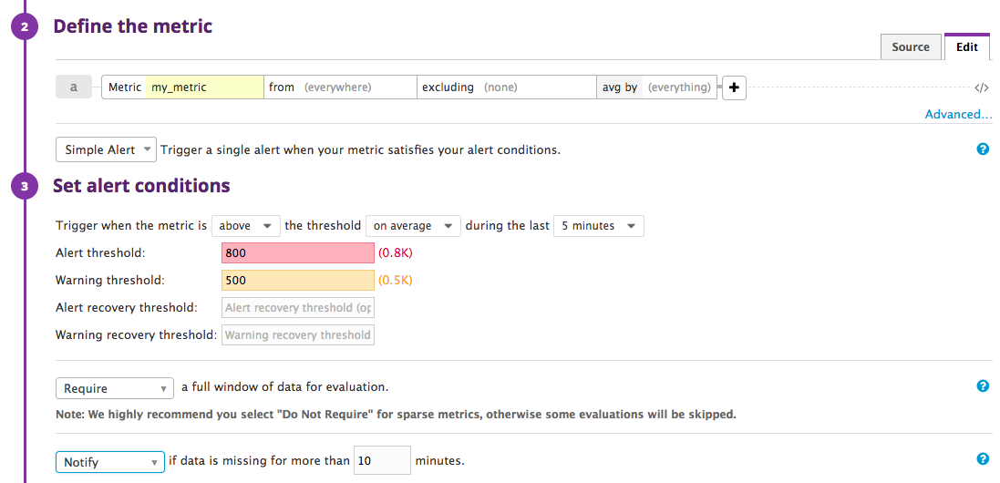
* The custom warning email: 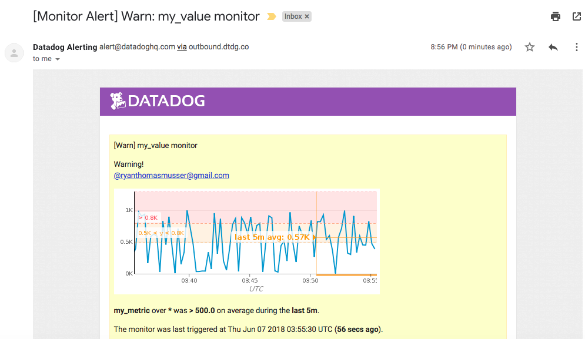

* **Bonus Question**: I set up two scheduled downtimes for this monitor:

  * One that silences it from 7pm to 9am daily on M-F: 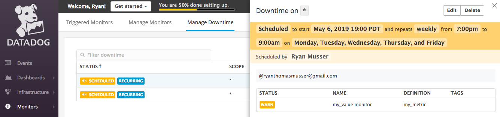
  * And one that silences it all day on Sat-Sun: 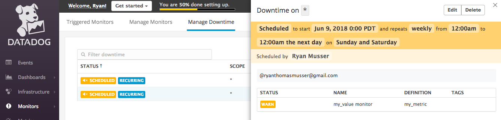
  * When I scheduled the downtime, I took a screenshot of that notification: 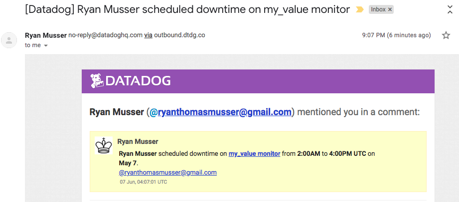

## Collecting APM Data:

I instrumented the provided Flask app using Datadog’s APM solution, and was able to view [a Dashboard with both APM and Infrastructure Metrics](https://app.datadoghq.com/dash/829501/ryans-tech-evaluation?live=true&page=0&is_auto=false&from_ts=1528379085330&to_ts=1528393485330&tile_size=m): 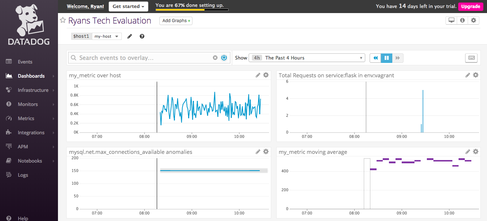

* **Bonus Question**: The difference between a Service and a Resource are as follows: A Service is the name of a set of processes that work together to provide a feature set, which consist of a resource(s). [Further information here.](https://help.datadoghq.com/hc/en-us/articles/115000702546-What-is-the-Difference-Between-Type-Service-Resource-and-Name-)

My fully instrumented app looked as follows:

```
from flask import Flask
import logging
import sys
import blinker as _
from ddtrace import tracer
from ddtrace.contrib.flask import TraceMiddleware

# Have flask use stdout as the logger
main_logger = logging.getLogger()
main_logger.setLevel(logging.DEBUG)
c = logging.StreamHandler(sys.stdout)
formatter = logging.Formatter('%(asctime)s - %(name)s - %(levelname)s - %(message)s')
c.setFormatter(formatter)
main_logger.addHandler(c)

app = Flask(__name__)

@app.route('/')
def api_entry():
    return 'Entrypoint to the Application'

@app.route('/api/apm')
def apm_endpoint():
    return 'Getting APM Started'

@app.route('/api/trace')
def trace_endpoint():
    return 'Posting Traces'

if __name__ == '__main__':
    app.run(host='127.0.0.1', port=8080)
```

## Final Question:

The final question asks that we describe a creative way to use Datadog; I have an interesting vision in this space. I can imagine using Datadog to standardize a monitoring methodology, and go to market strategy, for ensuring the deliverability and performance of IOT networks.

All the ingredients are here; Datadog's infrastructure monitoring capabilities, combined with distributed tracing and powerful charting capabilites, provide a powerful framework on which an IOT network monitoring recipe can be built.

I imagine architecting some sort of implementation, identifying/executing a customer use case and building the go to market stategy from there. This is particularly exciting to me given the snowball trend of consumer IOT use cases.

Technology continues to grow into the cracks of our everyday lives; I imagine app makers may someday yearn for a distributed trace spanning from apps on a consumer's smart home, to apps in their smart car, to apps in their smart office.
