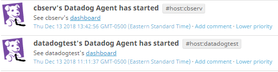
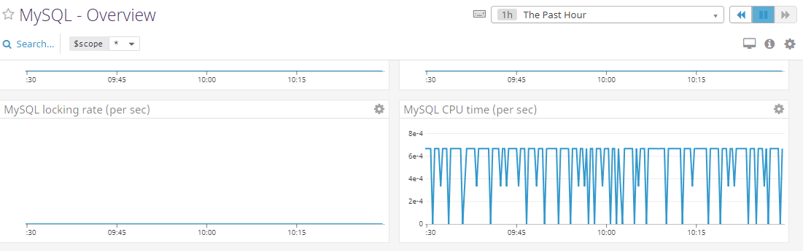
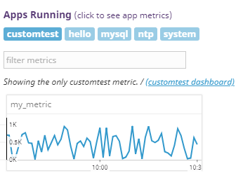
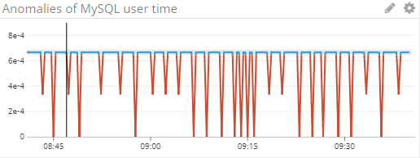
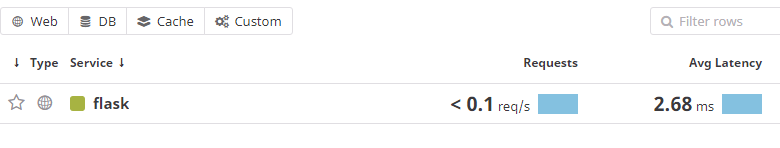
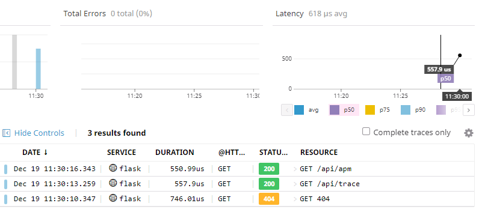
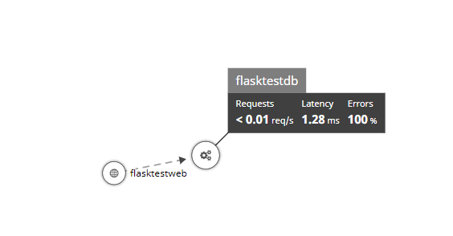
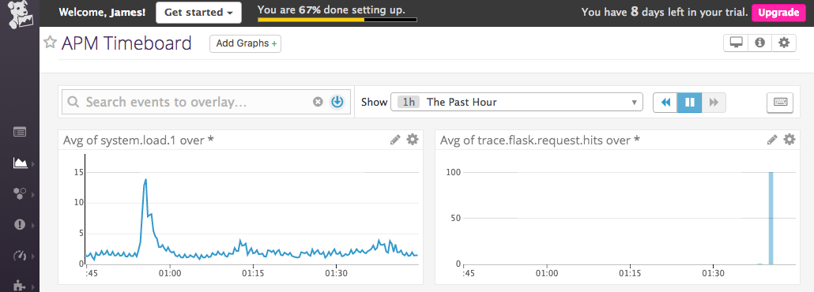
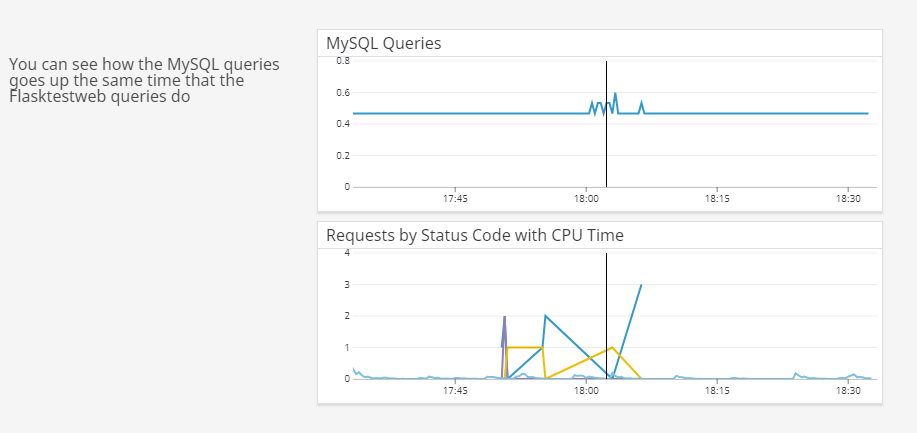
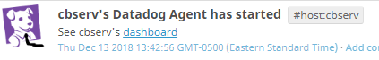

## About The Author 

Nerd, Zelda enthusiast (grumble, grumble!), older than she wishes she was... Kristen's been designing monitoring solutions for at least 12 years. 

After playing with Datadog in search of a better core for her previous employer's offerings and seeing potential, she's decided to talk to the crew at Datadog and see if she might be a fit to help make Datadog great.

## The Exercise

We will do this in two stages.  First, we will run through the exercise using the default "dummy" values in the instructions, then we will apply that knowledge to do something fun (and possibly creep out Kristen's hubby.  He's a good guy, we promise).

## Stage 1:  Using EC2 and Test Values

### The Environment

I chose Ubuntu as the OS since it is oft-cited in the documentation provided.  I opted to put it in EC2 to allow us to explore some interesting integrations later.  I've also decided NOT to run the agent in a dockerized container, since there's no other purpose to this box other than to use it as a test and I was actually somewhat curious as to what might happen if I bombarded the database when it was colocated in the same VM without any container to sandbox it.

Our Test Host: 
ec2-18-216-168-78.us-east-2.compute.amazonaws.com aka **"datadogtest"**

**Impressions**:  Installation is relatively straightforward and easy, but the author found it difficult to navigate the UI to sort out when the last time the agent reported.  Lags of 30-60 seconds seem fairly standard and well within range, but sometimes it was up to 10 minutes or more and it was difficult to troubleshoot whether the agent hadn't reported in yet or whether there was still a configuration issue.

### Collecting Metrics:

* **Tags** A few simple tags were added to the agent config to start.  Knowing we are going to set up a database, and that my other test host is a baremetal, I added role and location. Tags are relatively easy to use, though I doubt if there is actually any real hierarchy to metrics when separated by : as implied.  Instead it seems like a convention that works well to approximate it.

		tags:
   		- datadogtest
   		- env:test
   		- role:database
   		- location:cloud

* **Database Integration** I chose MySQL to install on my test host.  I saw mysqld in the process list fairly quickly in Datadog, and then followed the instructions to get the MySQL integration installed  At first I had a typo in my dd-agent key, and it took upwards of 5 minutes or so before my corrections showed in the UI.  Random musing... have you had problems with someone having a typo that was *exactly the same* as someone else's key and data getting collocated, or more realistically, a problem where someone at Datadog copied some work from a colleague and accidentally forgot to update the key?  

* **Custom Check** I created a simple check called customtest that submits the metric of a random int between 0 and 1000.  I would have preferred here to do something a bit more useful for the timeboard -- for example, do some kind of transform on the current time, or make the value go haywire every 30 minutes, or similar, so that my timeboard would be more interesting later.  We'll get to that later, but for now, it's just a simple python check. 

**_note_** I realized that having it say just "my\_metric" resulted in the "app" in the "Infrastructure List" to be listed as "no\_namespace".  So I changed it so that it submitted as customtest.my\_metric instead of just "my\_metric".  For now, I haven't added any additional tags.

* **Collection Interval**  It's easy to set the check interval by editing the conf.yaml file in conf.d/custom.d/ however... the value is min\_collection\_interval.  This would mean that every 45 seconds the agent will schedule the check to run.  There are a lot of reasons that might not work as advertised, but the chances of this being off on a box that is so lean is low.  

			init_config:
			instances:
			  - min_collection_interval: 45
			  
	Another way to modify the check interval... We could optionally set the entire agent to run checks every 45 seconds instead of 15 seconds (the default), but that would affect other checks as well - probably not the best idea.  We could also script up something that would run the check manually on the command line, or adding it to dd-agent's crontab:

		/usr/bin/datadog-agent check custom 

	This sounds more useful in the context of forcing a check and verifying output after maintenance.  I bet there's also a way through the Datadog API to do this.

### Visualizing Data:

First, we can use the API to make a timeboard, but I made a conscious decision not to overengineer the API call.  The use case here that immediately comes to mind is to spawn a timeboard when you detect something bad in monitoring, and since I didn't have the facility to know very well all the knobs and dials for color, size, etc. and what would look nice, I started out just making a default one and then played with it until it looked a little bit nicer. 

The timeboard contains:

* The "customtest" metric scoped over the host
* The MySQL CPU Time with the anomaly function applied
* The "customtest" metric summed up for an hour.

Once this is created, access the Dashboard from your Dashboard List in the UI:

* Set the Timeboard's timeframe to the past 5 minutes
* Take a snapshot of this graph and use the @ notation to send it to yourself.

* **Anomaly Graphs**  This highlights (by default, in gray), the area where the values are "expected to be" and in red the ones that look "anomalous"

By showing the CPU time, you can see that in reality, the anomaly really shouldn't be these spikes, and the anomaly function probably needs more time to "bake" to show a true anomaly.  (Incidentally, that's why - when faced with designing a similar function for a competing product, we didn't just have a few different algorithms, we had 9 of them working together and had the ability to change the weights to get something that worked better.  I wanted to add some machine learning in there on top of it all, but then I left the company... but I digress.)

### Monitoring Data

Since you’ve already caught your test metric going above 800 once, you don’t want to have to continually watch this dashboard to be alerted when it goes above 800 again. So let’s make life easier by creating a monitor.

Create a new Metric Monitor that watches the average of your custom metric (my_metric) and will alert if it’s above the following values over the past 5 minutes:

* Warning threshold of 500
* Alerting threshold of 800
* And also ensure that it will notify you if there is No Data for this query over the past 10m.

Please configure the monitor’s message so that it will:

* Send you an email whenever the monitor triggers.
* Create different messages based on whether the monitor is in an Alert, Warning, or No Data state.
* Include the metric value that caused the monitor to trigger and host ip when the Monitor triggers an Alert state.
* When this monitor sends you an email notification, take a screenshot of the email that it sends you.

* **Bonus Question**: Since this monitor is going to alert pretty often, you don’t want to be alerted when you are out of the office. Set up two scheduled downtimes for this monitor:

  * One that silences it from 7pm to 9am daily on M-F,
  * And one that silences it all day on Sat-Sun.
  * Make sure that your email is notified when you schedule the downtime and take a screenshot of that notification.

### Collecting APM Data:

I've never used Flask, so I used the default flask app provided to continue with the exercise.  However, I think it would be more colorful to add in some other dependencies, such as the lovely little MySQL server we installed earlier so that the traces could actually find something interesting.  For now, let's just get the basic flask app running.

Since I know that the service map for this is going to be fairly boring (no dependencies), I start with invoking ddtrace-run. I purposely curl some bad URLs so I have something interesting to look at in the traces besides 200OK... but honestly this is still pretty bleak looking.

Here's some logs showing me checking out this basic webapp and it sending traces, for reference:
		
		root@datadogtest:/opt/flasktest# curl localhost:5050/api/apm
		INFO:werkzeug:127.0.0.1 - - [18/Dec/2018 00:52:00] "GET /api/apm HTTP/1.1" 200 -
		2018-12-18 00:52:00,671 - werkzeug - INFO - 127.0.0.1 - - [18/Dec/2018 00:52:00] "GET /api/apm HTTP/1.1" 200 -
		Getting APM Startedroot@datadogtest:/opt/flasktest# DEBUG:ddtrace.api:reported 1 traces in 0.00080s
		2018-12-18 00:52:01,077 - ddtrace.api - DEBUG - reported 1 traces in 0.00080s
		
		root@datadogtest:/opt/flasktest# curl localhost:5050/api/apmfubar
		INFO:werkzeug:127.0.0.1 - - [18/Dec/2018 00:52:06] "GET /api/apmfubar HTTP/1.1" 404 -
		2018-12-18 00:52:06,163 - werkzeug - INFO - 127.0.0.1 - - [18/Dec/2018 00:52:06] "GET /api/apmfubar HTTP/1.1" 404 -
		<!DOCTYPE HTML PUBLIC "-//W3C//DTD HTML 3.2 Final//EN">
		<title>404 Not Found</title>
		<h1>Not Found</h1>
		
The requested URL was not found on the server.  If you entered the URL manually please check your spelling and try again.

		root@datadogtest:/opt/flasktest# DEBUG:ddtrace.api:reported 1 traces in 0.00084s
		2018-12-18 00:52:07,084 - ddtrace.api - DEBUG - reported 1 traces in 0.00084s

..as you can see, the traces showed up in the UI:

So... to make this better, I redid all this by putting some dependencies in there:

* I added a random /api/testdb to do a simple select on mysql
* I neglected to grant the mysql the ability to select on the database to start so I'd get a nasty 500

I then re-instrumented the app, curled a few of the URLs to force some traces... hoping I'd get a more interesting service map when it came online.

And voila... the service map shows the db dependency.

We also made a quick timeboard showing the health of the box as the site was getting used.  Again, it's pretty simplistic, we can certainly go nuts here and do a lot of fancy things with the dashboard, but the main idea here - to use the board to show a snapshot of how multiple things are doing at one time - stays the same.  What you CAN see here is that the 500's line up to where the MySQL is getting a few extra queries, but that there's no CPU latency to blame:

* note:  this is a timeboard - I'm assuming you can get into my profile to see this, otherwise your link will likely be dead.

 
If you clicked on that and can't see, I also made a quick Screenboard and made it public:

### Service vs. Resource
(PS: I *really tried* not to just repeat the documentation <a href=https://docs.datadoghq.com/tracing/visualization> here </a>) A resource is something consumed/utilized by a service, while a service is a set of things that provide a particular activity for an application.  In other words, in order to provide the webapp of of "mysite" I need to use the service of "database_server" (to print out some stuff from the db) and  "mywebapp".   The database server will use several resources to grab data (select and insert statements), and the webapp has resources like "homepage" and "orderstatus_page".  A service could require several resources, some internal to the host, some external. 

### So, Now What???
The default exercise was a nice guided tour, but this is just a small taste of what Datadog can do.  

For a more fun application, I decided to play around with my home automation box and see if I could play some tricks on my family (and debug a small issue) with Datadog.

## Stage 2:  Using Baremetal Linux
I was asked:  _Is there anything creative you would use Datadog for?_

It so happened that right at this time, I'd been playing around with HomeAssistant to automate some things in my home.  If you haven't played with HASS, I highly recommend.  It runs great on a Raspberry Pi - or even an 11 year old desktop.

### The Environment:

"cbserv" has been my trusty little box since 2007.   It's an old Dell Optiplex 755, and it's survived 5 apartments and 3 jobs.

I recently installed HomeAssistant on it in the hopes of using it to automate my lights and smart plugs.  The problem is... sometimes it just goes bonkers.  I've poured through the logs and found nothing, and I never lose connection to the app itself.  So I'm hoping that by using datadog and investigating some of the metrics in a timeseries view, I can figure out what the issue really is...

### Collecting Metrics

I installed the agent on cbserv.  I didn't worry too much about tags for the moment, because I only have the 1 server that is hosting everything, but in a larger environment I'd be much more careful here.

### Visualizing Data

I used the regular Datadog GUI to add a Timeboard after exploring some of the metrics once I gave it a few days for collection... and I noticed something fishy...

### Monitoring Data

It looks like I might have an iffy drive sda that causes some IO spikes.  I thought it would be a good idea to add a monitor there.

### Collecting APM Data

I injected the HomeAssistant events into Datadog, and I found that the IO spikes didn't correlate with times I had problems turning on the lights.  But for kicks, I did add a fun monitor to ship me a note every time my kid turns on the lights after midnight.

### So, Now What???

Using Datadog, I was able to:

* see that /dev/sda might be having IO latency which contributes to timeouts on my zigbee mesh
* get notified in the morning when my daughter turns on Christmas lights in the middle of the night.  Seriously, what world do we live in when a 3 year-old is talking to AI to calm her fears from bad dreams????

## Conclusions

I've always approached monitoring from a "Critical Business Process" perspective that I learned from being the lead for a contract managing all the systems for one of the world's largest online clothing retailers.  I'll never forget what the CIO said to me the moment I got onsite:

"We sell pants."

He said this was his mantra because it kept things in perspective.  Things really weren't a P1 unless they couldn't sell pants.  The processing system was slow?  Not a P1. Because you can still buy pants. And even when you did have a P1, and yes, millions of dollars in revenue were on the line... well, *they sell pants*, so don't take it too seriously.  No one's going to die from a lack of moderately priced khakis.

I would probably approach a live customer in a similar way when thinking about their dashboards and monitoring needs.  I'd start with that coalesced idea:  **what is the critical use of this application, and who is consuming this data**.  I'd design monitoring on an application level that can monitor whether or not that is occurring.  And then, I'd work on ensuring that you could drill down in an outage scenario to be sure that you could figure out why you weren't reaching that goal. 

I can certainly see a lot more I could do with this software in the automation space.  Have Datadog make sure you don't forget to lock your doors.  Force a record on a webcam if any of the lights are triggered.  Trigger a timeboard the next time someone calls into a service center with a P1 outage.  The possibilities are myriad.  

I'd be really interested in pairing some of the anomaly detection, past history of incidents and tickets to create some kind of machine learning algorithm.  "This issue has a 76% chance of being a leading indicator of an outage" or similar type of alarm.   Monitoring, in an ideal world, would ultimately alert on leading indicators of an issue (heck, trigger some puppet/ansible scripts to fix it while you're at it).  In other words:  **make the news, don't just report on it**.

I had a decent amount of fun playing around with Datadog, but I will admit that some of the learning curve seemed steep for some avoidable reasons.  Example:  the custom checks documentation tells you to buck the presumed standard of directory named checkname.d/conf.yaml and name the file checkname.yaml.

Net-net it seems like there is a ton of potential with Datadog, and given how flexible and open ended the system is, I see how solutions engineers and similar teammates at Datadog are extremely important to helping companies realize the full potential of their investment. 

CHEERS, and happy holidays.

-Kristen Gandhi
