Use the Pyramid Process to Write

# Setup the environment

<!-- 0-vagrant image -->
<!-- 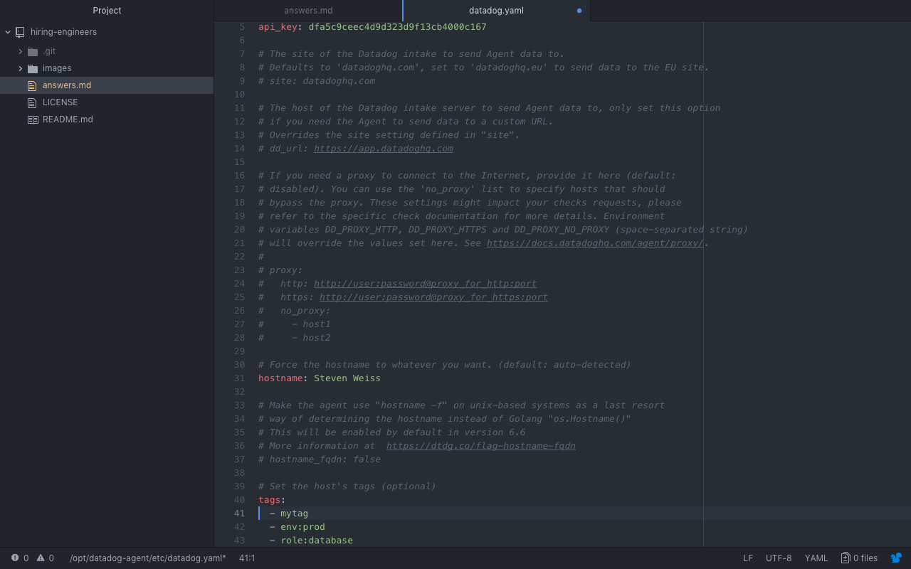 -->

## Step 1: Installing the virtual machine software  
DataDog recommends the use of virtual machine's as to avoid dependency issues.  
Follow the instructions to build a Linux VM via Vagrant.

VirtualBox is your virtualization software.  Vagrant is environment workflow software that will interface with VirtualBox.  

1. Download VirtualBox [Here](https://www.virtualbox.org/wiki/Downloads)  
i.e. If you have Mac OSX Mojave, download OS X Host Intel Mac.  Proceed with a normal install.  

2. Download Vagrant [Here](https://www.vagrantup.com/downloads.html)

3. Confirm the installation from your command line:  
```
MAIN TERMINAL
$ vagrant --version
> Vagrant 2.2.1
```

## Step 2: Building the project environment  
The documentation is clean and concise.  Check it out <a href="https://www.vagrantup.com/intro/getting-started/project_setup.html">here</a>

1. Create a directory/folder to store the VM and the related files.  I created a folder on my desktop.
```
$ cd ~/Desktop
$ mkdir DataDog2
```
2. Enter the new directory
```
$ cd DataDog2
```
3. Initialize the VM.  This will create the Vagrant file. <a href="https://www.vagrantup.com/docs/vagrantfile/"> See what the Vagrantfile does.</a>
```
$ vagrant init
```
4. Check out your work so far. You should see a ‘vagrantfile’ in the directory.
```
$ ls
```

## Step 3: Creating a clone of a virtual machine
Building a VM from scratch is laborious.  Instead, Vagrant creates a clone of a VM through the use of 'boxes' - base images of VM's.  Nothing to worry about, when you installed VirtualBox, you installed a 'box'.

1. Create the clone of a VM using a 'box'.  Choose a <a href="https://app.vagrantup.com/boxes/search">BOX</a>
i.e. The documentation uses hashicorp/precise64 but I ran ubuntu/xenial64
```
$ vagrant box add ubuntu/xenial64>
```

2. Change the contents of 'vagrantfile' to include the Ubuntu/Xenial box (or whatever box) you added in Step 8. Open the vagrantfile in a code editor.  Replace code as follows:
```
$ atom vagrantfile
```

In the vagrantfile:
```
Vagrant.configure("2") do |config|
  config.vm.box = “ubuntu/xenial64”
end
```
4. Boot up the Vagrant environment.  
```
$ vagrant up
```
5. To interact with the VM environment / Check if it is working.
```
$ vagrant ssh

MAINTERMINAL $ becomes: vagrant@ubuntu-xenial:~$
```
6. To exit the VM.
```
press 'CTRL' + 'D'
```
**Your virtual machine environment is ready.**

## Step 4: Setup DataDog Account
**If**, you installed the Agent to the desktop and want to remove it from the host, go [Here](https://docs.datadoghq.com/agent/faq/how-do-i-uninstall-the-agent/?tab=agentv6)

**Else**,
1. Sign up for an [Account](https://app.datadoghq.com/signup)  

2. Double check you command prompt is inside the VM environment.  If not, get inside your VM directory (Step 2.2 in 'Setup the Environment') and enter the VM environment with **$ vagrant ssh** (Step 3.5 in 'Setup the Environment')

```
**This will be the command line prompt going forward:**
vagrant@ubuntu-xenial:~$
```

3. Install Agent.  Copy and paste the "one-step install" command in  your Vagrant SSH.
```
$ DD_API_KEY=d123456789901234567890 bash -c "$(curl -L https://raw.githubusercontent.com/DataDog/datadog-agent/master/cmd/agent/install_script.sh)"

```
The agent should be running in the background.  

```
To halt the program:
$ sudo systemctl stop datadog-agent

To start it again:
$ sudo systemctl start datadog-agent

To check status // Very useful command.  This will tell you where there you have errors.  For example, I had the wrong spaces into my datadog.yaml configuration.  
$ sudo datadog-agent status
```

# Collecting Metrics:

## Step 1: Add tags in the Agent config file
Tagging is used throughout Datadog to query the machines and metrics you monitor. Without the ability to assign and filter based on tags, finding problems in your environment and narrowing them down enough to discover the true causes could be difficult.  In other words, the tags help you accurately keep track of things .  

<!-- image here -->
<!--  -->

1. Go to Host Map.  You should see a hexagon representing your VM.  

2. Configure the host tags submitted by the Agent inside datadog.yaml. The [docs](https://docs.datadoghq.com/agent/basic_agent_usage/ubuntu/?tab=agentv6)
```
$ cd /etc/datadog-agent
$ ls
$ sudo vim datadog.yaml
```
The above commands opens up the Linux virtual editor.  [Using VIM](https://www.linux.com/learn/vim-101-beginners-guide-vim)

3. Scroll down to the line that reads **Set the host's tags**, **type 'i'** to enter Insert mode, and **delete** the hash next to tags.
<!-- image here -->
<!-- 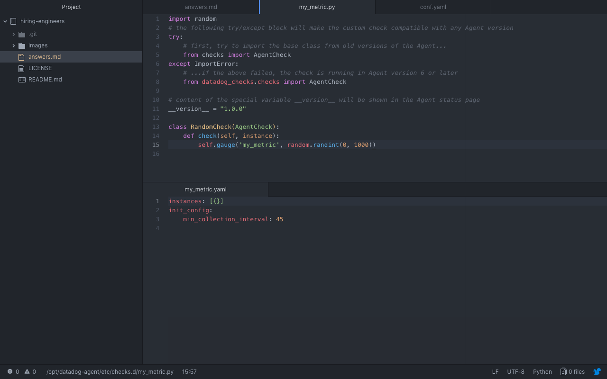 -->

4. Hit 'ESC' to leave 'Insert' mode.  To save changes and exit, type :wq

5. Restart the agent
```
$ sudo service datadog-agent restart
```

6. Check if it worked. Go to Host Map on the dashboard. After a few minutes, my tags should read 'mytesttag'

## Step 2: Install a database & respective Datadog integration
The goal here is to install a database on the VM and integrate your database with the Datadog agent so they can being monitoring your metrics or the health of your systems.  [The Docs](https://docs.datadoghq.com/integrations/postgres/#prepare-postgres)

1. Go to the VM's root directory
```
$ cd
```
2. Install your database.  I used Postgresql.  
```
$ sudo apt-get update
$ sudo apt-get install postgresql postgresql-contrib
```
3. Enter your database to see if it works.
```
$ sudo su - postgres
$ psql
```
If you wish to exit, this is how
```
postgres=# \q (or Ctrl + D)
```
4. Click 'Integrations' (puzzle piece) on the Dashboard.  Install and Configure.  A window should appear:
<!-- Configure Image  -->

Press 'generate password'. Then head over to your terminal.  

```
$ sudo su - postgres
postgres@ubuntu-xenial:~$ psql
```

Copy and paste the code next to the Terminal icon.  Check the [docs](https://docs.datadoghq.com/integrations/postgres/) to reconcile your database version versus their code.  
```
postgres=# create user datadog with password 'the password they provide';
postgres=# grant SELECT ON pg_stat_database to datadog;
postgres=# \q

postgres@ubuntu-xenial:~$ psql -h localhost -U datadog postgres -c "select * from pg_stat_database LIMIT(1);" && \
echo -e "\e[0;32mPostgres connection - OK\e[0m" || \
echo -e "\e[0;31mCannot connect to Postgres\e[0m"

Hit Enter.

Password for user: Copy and paste the password here.  

Postgres Connection: Ok
```

5. Edit the conf.d/postgres.yaml file
```
postgres@ubuntu-xenial:~$ Press Ctrl + D
$ cd /etc/datadog-agent/conf.d/postgres.d
$ ls
```
You should notice there is no postgres.yaml so we create one.
```
/etc/datadog-agent/conf.d/postgres.d$ sudo touch conf.yaml
/etc/datadog-agent/conf.d/postgres.d$ sudo vim conf.yaml

```
Hit 'i' and copy/paste the code from the configuration
```
Press 'i'

init_config:

instances:
   -   host: localhost
       port: 5432
       username: datadog
       password: eub3PYCtMjeCPHhKbClyWO8p
       tags:
            - optional_tag1
            - optional_tag2
```
It is also possible to add custom metrics and logs to the conf.yaml file.  

Hit 'esc' then ':wq' to save

6. Restart the Agent & Check the Agent's status
```
$ sudo service datadog-agent restart
$ sudo datadog-agent status
```
7. Press "Install Integration".  Check back in a few minutes to see if the integration is working properly.  
<!-- Successful Integration  -->


## Step 3: Create a custom Agent check that submits a metric named my_metric with a random value between (0, 1000)
We can create a custom check to submit metrics to the Agent.  [Relevant Docs](https://docs.datadoghq.com/developers/write_agent_check/?tab=agentv6)

1. Head down to the **checks.d** directory & create a Python file called 'my_metric'.
```
$ cd /etc/datadog-agent/checks.d
/etc/datadog-agent/checks.d$ sudo touch my_metric.py
```
2. Open up my_metric using **sudo touch my_metric.py**.  Copy and paste the following:

```
import random
# the following try/except block will make the custom check compatible with any Agent version
try:
    # first, try to import the base class from old versions of the Agent...
    from checks import AgentCheck
except ImportError:
    # ...if the above failed, the check is running in Agent version 6 or later
    from datadog_checks.checks import AgentCheck

# content of the special variable __version__ will be shown in the Agent status page
__version__ = "1.0.0"

class RandomCheck(AgentCheck):
    def check(self, instance):
        self.gauge('my_metric', random.randint(0, 1000))
```
<!-- image here -->

When done, hit 'ESC' and save, ':wq'

At this point, a random number will be sent with our check.  The check, by default, will try and run the check every 15 seconds.  

# Step 4: Change your check's collection interval so that it only submits the metric once every 45 seconds.

1. Match the file structure of postgresql.  Navigate to etc/.../conf.d$ create a directory called "my_metric.d", navigate into the directory and create a file called 'my_metric.yaml'  
```
$ sudo mkdir my_metric.d
$ cd my_metric.d
$ sudo touch my_metric.yaml
```
2. Open up the file and paste the following code to set the interval time to 45 seconds.
```
$ sudo vim my_metric.yaml

init_config:

 instances:
    - min_collection_interval: 45
```
<!-- image here --> Hit 'esc', save :wq

3. Check to see if the check is running
```
sudo -u dd-agent -- datadog-agent check my_metric.py
```

# Step 5: **Bonus Question** Can you change the collection interval without modifying the Python check file you created?

1. One can use the -d flag after this command: sudo -u dd-agent -- datadog-agent check my_metric.py


## Visualizing Data:
Utilize the Datadog API to create a Timeboard that contains:  
9. Your custom metric scoped over your host.  
10. Any metric from the Integration on your Database with the anomaly function applied.  
11. Your custom metric with the rollup function applied to sum up all the points for the past hour into one bucket

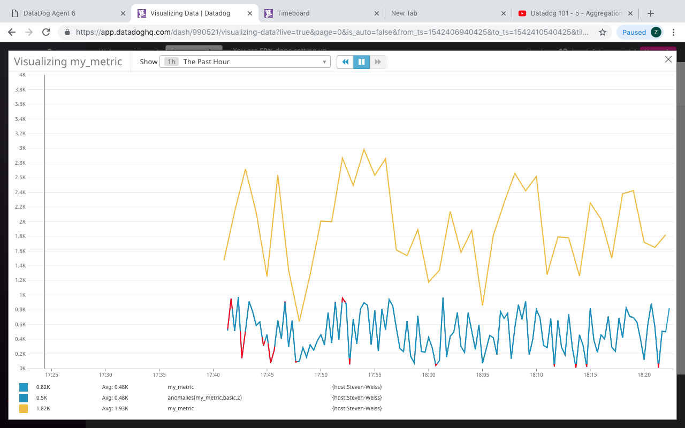

12. Please be sure, when submitting your hiring challenge, to include the script that you've used to create this Timeboard.

```
{
  "requests": [
    {
      "q": "avg:my_metric{host:Steven-Weiss}",
      "type": "line",
      "style": {
        "palette": "dog_classic",
        "type": "solid",
        "width": "normal"
      },
      "conditional_formats": []
    },
    {
      "q": "anomalies(avg:my_metric{host:Steven-Weiss}, 'basic', 2)",
      "type": "line",
      "style": {
        "palette": "cool",
        "type": "solid",
        "width": "normal"
      }
    },
    {
      "q": "avg:my_metric{host:Steven-Weiss}.rollup(sum, 60)",
      "type": "line",
      "style": {
        "palette": "dog_classic",
        "type": "solid",
        "width": "normal"
      }
    }
  ],
  "viz": "timeseries",
  "autoscale": true
}
```


Once this is created, access the Dashboard from your Dashboard List in the UI:

13. Set the Timeboard's timeframe to the past 5 minutes
14. Take a snapshot of this graph and use the @ notation to send it to yourself.

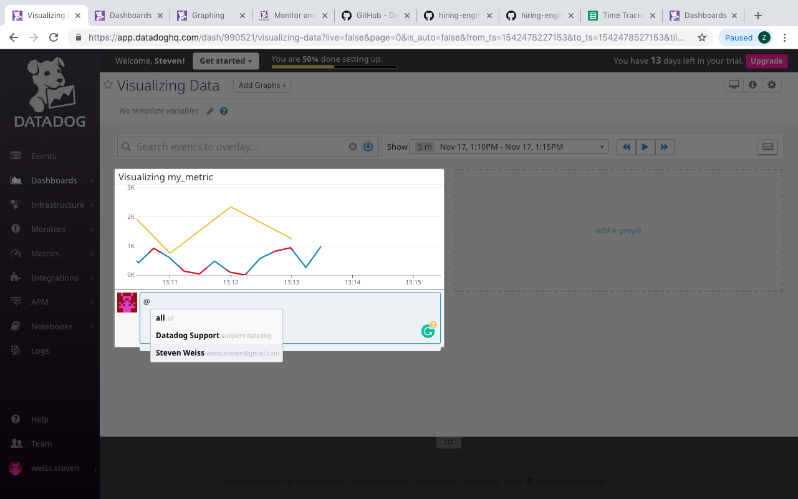

15. **Bonus Question**: What is the Anomaly graph displaying?
- It graphs a metrics' normal context.  Often, our metrics can have a few peaks and valleys.  The anomaly function considers this, then graphs a chart to show the trend of the graph without the peaks and valleys.  

- For example, if a zoologist wanted to set an alarm clock for the coming month based on the prior month's wake times.  First, she would input all her waking times over thirty days.  Then, sort through the average days.  Finally, she would disregard all the long nights out at the bar till 4am.  Then, with the 'normalized' data, she would set the alarm.  The anomaly function is the zoologist's alarm analysis.  

## Monitoring Data
Since you’ve already caught your test metric going above 800 once, you don’t want to have to continually watch this dashboard to be alerted when it goes above 800 again. So let’s make life easier by creating a monitor.

Create a new Metric Monitor that watches the average of your custom metric (my_metric) and will alert if it’s above the following values over the past 5 minutes:

- My Steps:
- Step 1: Find 'my_metric' dashboard,
- Step 2: Click 'widget' button -> Create Monitor
- Step 3: Check if metric is defined, in this case I want 'my_metric' and 'Steven-Weiss' as host
- Step 3a: Check threshold: in this case, 'average'
- Step 4: Create thresholds and notifications

16. Warning threshold of 500
17. Alerting threshold of 800
18. And also ensure that it will notify you if there is No Data for this query over the past 10m.

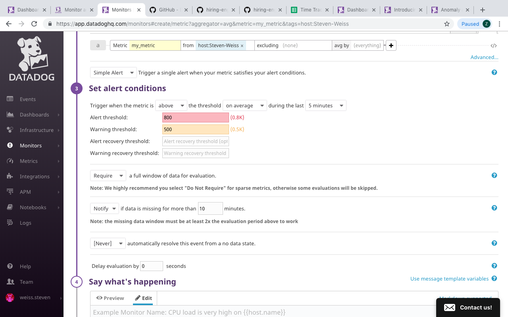

Please configure the monitor’s message so that it will:

19. Send you an email whenever the monitor triggers.
20. Create different messages based on whether the monitor is in an Alert, Warning, or No Data state.
21. Include the metric value that caused the monitor to trigger and host ip when the Monitor triggers an Alert state.

```{{#is_alert}} <br/>
Alert: Value has exceeded an average of 800 over the past 5 minutes. <br/>
Value: {{value}}  <br/>
Host: {{host.name}} <br/>
{{/is_alert}} <br/>
<br/>
{{#is_warning}} <br/>
Warning: Value has exceeded an average of 500 over the past 5 minutes.  <br/>
Value: {{value}} <br/>
Host: {{host.ip}} <br/>
{{/is_warning}} <br/>
<br/>
{{#is_no_data}} <br/>
Alert: No data over the past 10 minutes.<br/>
Value: Unknown <br/>
Host: {{host.name}} <br/>
{{/is_no_data}} <br/>
<br/>
Contact @weiss.steven@gmail.com
```

22. When this monitor sends you an email notification, take a screenshot of the email that it sends you.
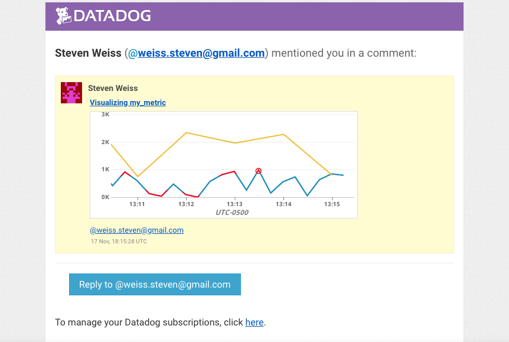

* **Bonus Question**: Since this monitor is going to alert pretty often, you don’t want to be alerted when you are out of the office. Set up two scheduled downtimes for this monitor:

23. One that silences it from 7pm to 9am daily on M-F,
24. And one that silences it all day on Sat-Sun.
25. Make sure that your email is notified when you schedule the downtime and take a screenshot of that notification.

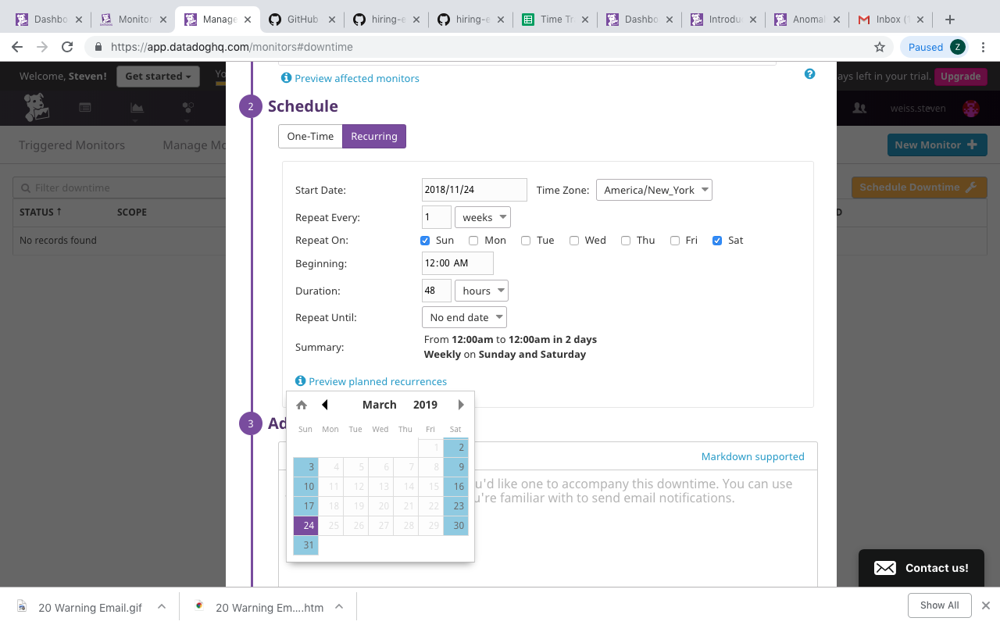
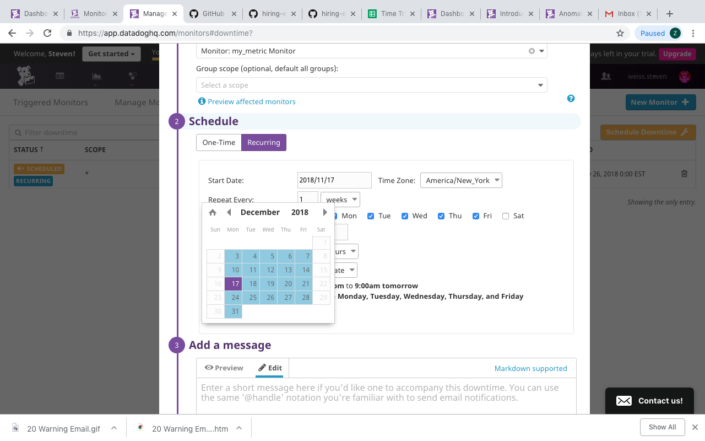
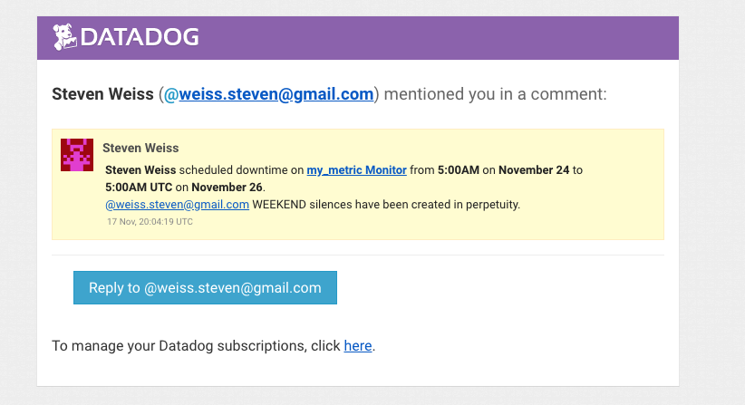
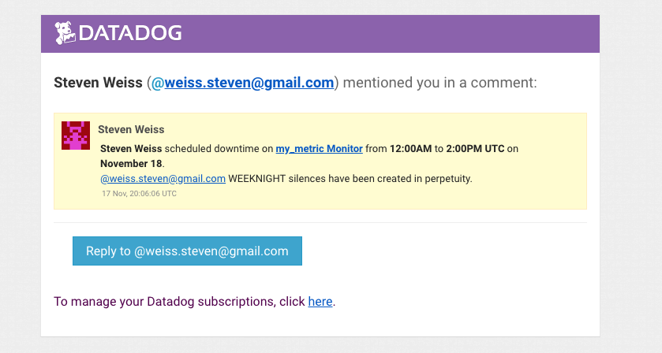


## Collecting APM Data:
Given the following Flask app (or any Python/Ruby/Go app of your choice) instrument this using Datadog’s APM solution:

```python
from flask import Flask
import logging
import sys

# Have flask use stdout as the logger
main_logger = logging.getLogger()
main_logger.setLevel(logging.DEBUG)
c = logging.StreamHandler(sys.stdout)
formatter = logging.Formatter('%(asctime)s - %(name)s - %(levelname)s - %(message)s')
c.setFormatter(formatter)
main_logger.addHandler(c)

app = Flask(__name__)

@app.route('/')
def api_entry():
    return 'Entrypoint to the Application'

@app.route('/api/apm')
def apm_endpoint():
    return 'Getting APM Started'

@app.route('/api/trace')
def trace_endpoint():
    return 'Posting Traces'

if __name__ == '__main__':
    app.run(host='0.0.0.0', port='5050')
```

* **Note**: Using both ddtrace-run and manually inserting the Middleware has been known to cause issues. Please only use one or the other.

```
My Steps:
$ sudo -H pip install ddtrace
$ sudo pip install flask
$ ./trace-agent-darwin-amd64-6.6.0 -config /opt/datadog-agent/etc/datadog.yaml
$ ddtrace-run python app.py

Then, followed ddtrace / 27 (next line)
```

27. Follow Instruction here for ddtrace:
- https://docs.datadoghq.com/tracing/setup/?tab=agent630

28. * **Bonus Question**: What is the difference between a Service and a Resource?

- First, let's define a service and a resource.

- From the Datadog FAQ, a "Service" is the name of a set of processes that work together to provide a feature set.  In my working solution, the Flask app is an example of a service.  In general, a service would be any front-end built with functions or any backend algorithms.  

- A "Resource" is the query to a service.  In apps, we see resources as 'routes'; in databases, we see resources in the form of database queries.  An example, a frontend user making a POST request to an app's backend to create a login account.  

- Since most programs can be distilled down to procedures, the differences are akin to the separation of concerns in the design of any procedure - we create the body of a procedure that describes the behavior and we call the procedure with a set of desired input.  In a procedure we 'blackbox' an action and and provide a thing.  

- In terms of service and resource, a service is akin to a function/procedure that describes and embodies the desired behaviors of the program.  The resources are the calls and arguments that feed the functions.  While services and resources are not dependent on each other, that is, we can still have services designed without resources and resources designed without services, they are designed to know of each others existence.   

29. Provide a link and a screenshot of a Dashboard with both APM and Infrastructure Metrics.

<a href="https://p.datadoghq.com/sb/6ac05d7a5-c503ddbadde3c3ddbff88f0ce76d3e8e">APM / Infrastructure</a>

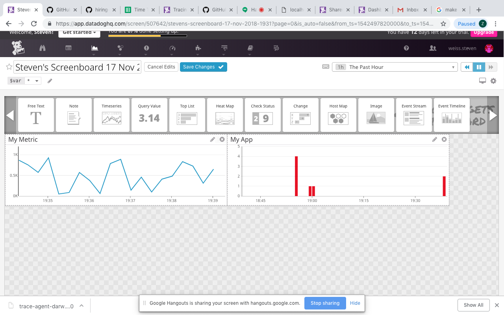

30. Please include your fully instrumented app in your submission, as well.
<a href="app.py">APP</a>

## Final Question:
Datadog has been used in a lot of creative ways in the past. We’ve written some blog posts about using Datadog to monitor the NYC Subway System, Pokemon Go, and even office restroom availability!

31. Is there anything creative you would use Datadog for?

- Companies, by and large, want great teams, but still recruit disparate individuals.  I think it would be possible to create a system, using several Datadog integrations (Slack, Github, Hipchat), that monitor a group of engineers that are friends, track their collaboration, and create a score to see how they work together and collaborate.  This owuld allow a company to recruit groups with less opaqueness.  

## Instructions
If you have a question, create an issue in this repository.

To submit your answers:

* Fork this repo.
* Answer the questions in answers.md
* Commit as much code as you need to support your answers.
* Submit a pull request.
* Don't forget to include links to your dashboard(s), even better links and screenshots. We recommend that you include your screenshots inline with your answers.

## References

### How to get started with Datadog

* [Datadog overview](https://docs.datadoghq.com/)
* [Guide to graphing in Datadog](https://docs.datadoghq.com/graphing/)
* [Guide to monitoring in Datadog](https://docs.datadoghq.com/monitors/)

### The Datadog Agent and Metrics

* [Guide to the Agent](https://docs.datadoghq.com/agent/)
* [Datadog Docker-image repo](https://hub.docker.com/r/datadog/docker-dd-agent/)
* [Writing an Agent check](https://docs.datadoghq.com/developers/write_agent_check/)
* [Datadog API](https://docs.datadoghq.com/api/)

### APM

* [Datadog Tracing Docs](https://docs.datadoghq.com/tracing)
* [Flask Introduction](http://flask.pocoo.org/docs/0.12/quickstart/)

### Vagrant

* [Setting Up Vagrant](https://www.vagrantup.com/intro/getting-started/)

### Other questions:

* [Datadog Help Center](https://help.datadoghq.com/hc/en-us)
