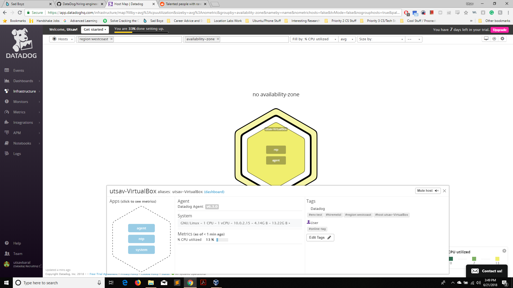

Your answers to the questions go here.
## Collecting Metrics:
* Using a VM Ubuntu 16.04 as host machine.

* Added tags in the Agent config file, located on the host machine at: "/etc/datadog-agent/datadog.yaml" Here is a screen shot of the machine in the Host Map page in Datadog: (insert screenshot here)

* Installed MySQL on the host and then installed the respective Datadog integration. (insert screenshot here)

* Submits my_metric using the gauge() function

* To change the check's collection interval to every 45sec (in v6), I added the **min_collection_interval** instance paramater in the check config file (**/config.d/hello.yaml**), and set it to 45. It will skip 2 checks and gauge the metric once every 3rd check.

* **Bonus Question** Can you change the collection interval without modifying the Python check file you created?
	* The above method does not modify the python file.
