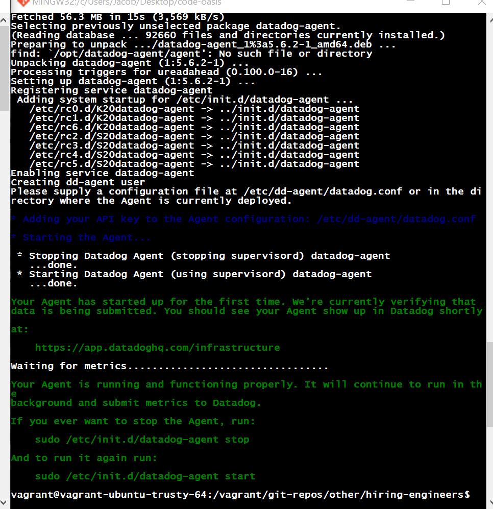
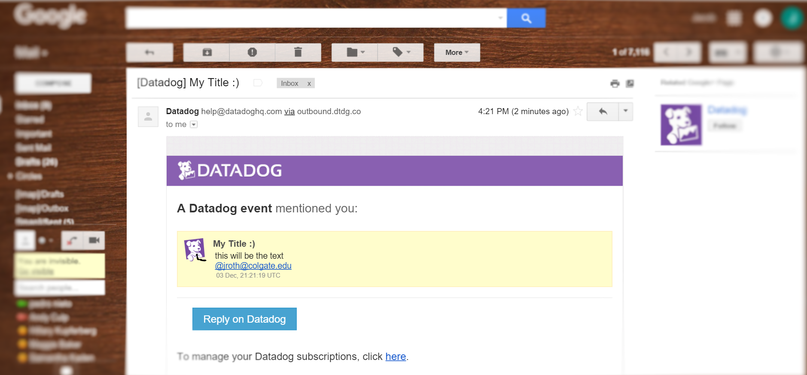

#question 1
##agent setup 


##Sending an event
* following is the code I used to emit an event and then send it as an email.  
```ruby
require 'rubygems'
require 'dogapi'

api_key='822c15b7b2f9fb8c49e8827404903e58'
app_key='f1dab6bb368ffa58b5d5af3358d77e42f48a1a21'

dog = Dogapi::Client.new(api_key, app_key)
host_name = 'vagrant-ubuntu-trusty-64'

test_event = dog.emit_event(Dogapi::Event.new("this will be the text\n@jroth@colgate.edu", 
                                              :msg_title => 'My Title :)'))
```

####Email Comfirmation  

