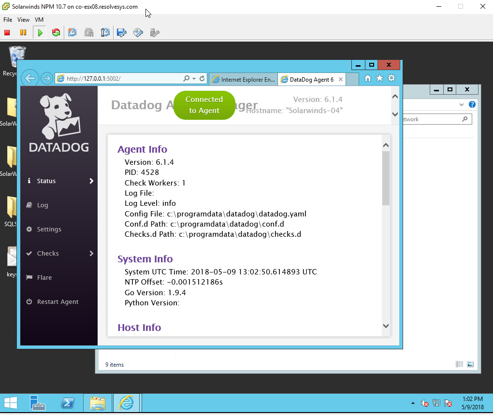
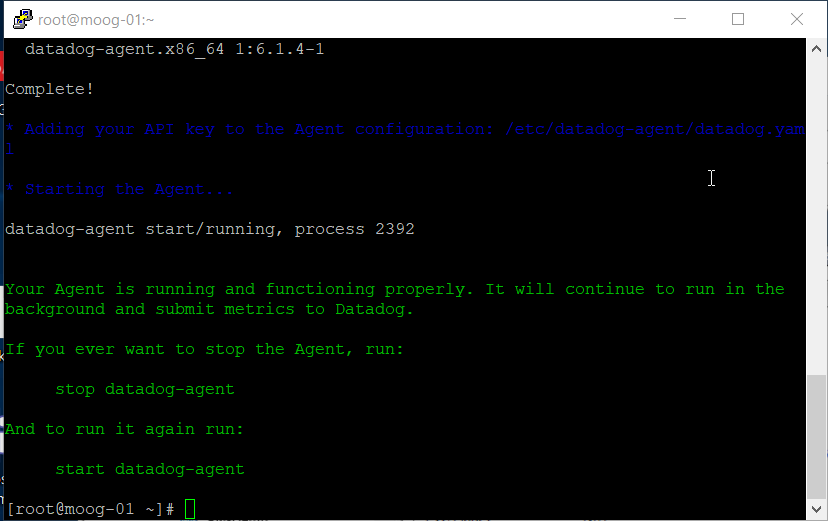
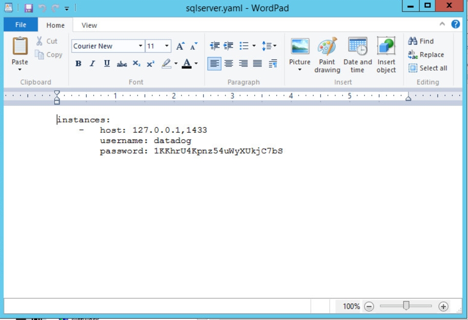
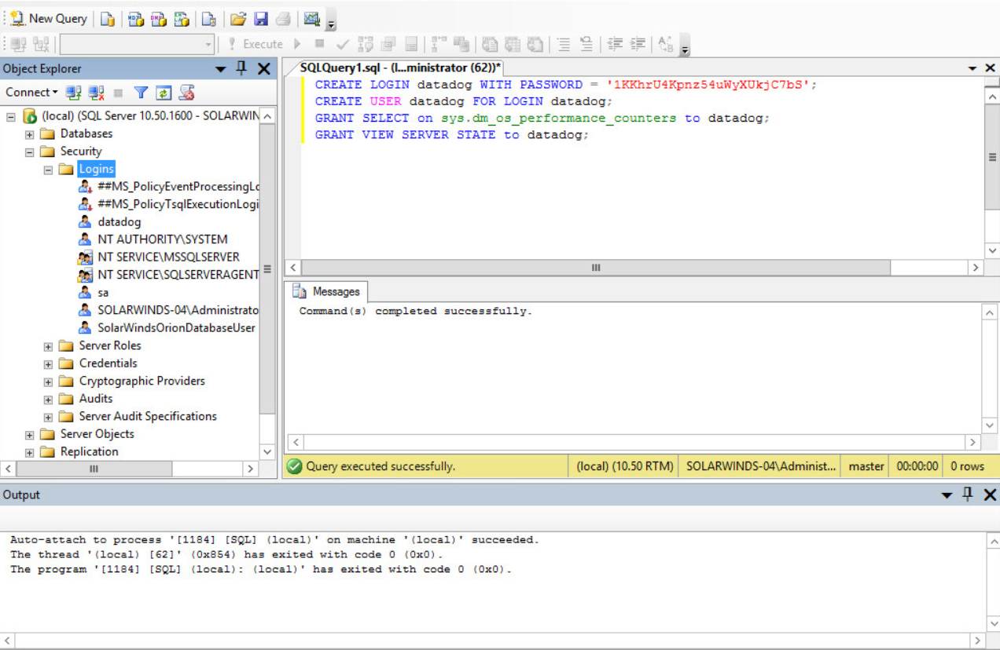
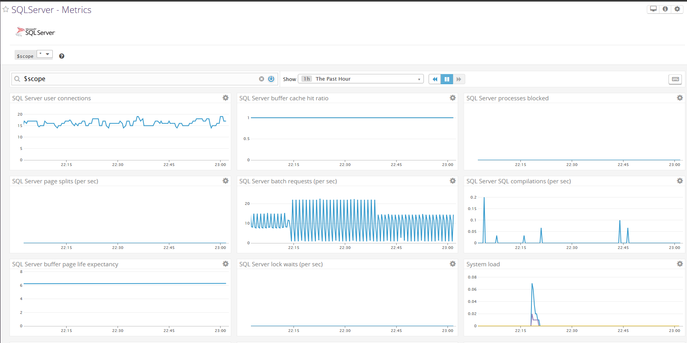
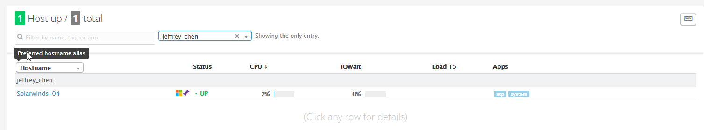
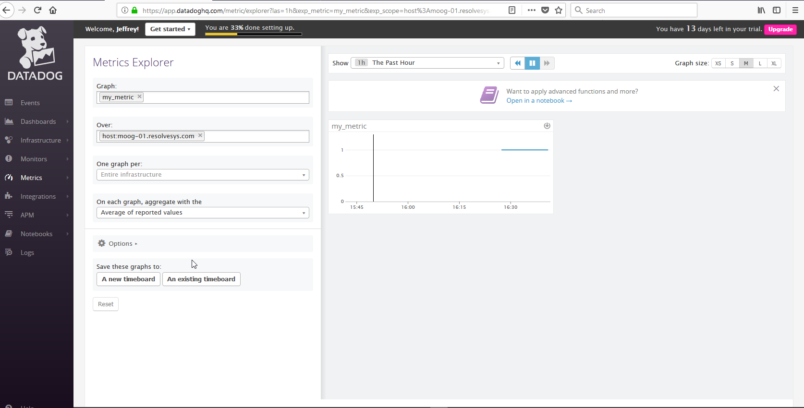

Collecting Metrics:

DataDog is a complete monitoring solution that is easy to install and configure. It provides value to customers in minutes by offering a robust collection of agents to monitor your infrastructure.  DataDog also offers a deep collection of integrations from Databases, APM, and Logs to help IT teams see across systems, services, and applications.

From the agent dashboard, download the agent files for your operating system or target host (Windows, Linux, Containers, etc). After the files are downloaded  input the API key for system-to-system communication and proceed through the rest of the guided setup.  For additional Integrations such as Databases, look under the integrations dashboards to find the Database type.  A  Database agent like SQL Server requires creating a user account with privileges to access the tables. As soon as the agent configuration files are added and the agent is configured, data will begin to populate in the MS SQL Server Dashboard. Rinse and repeat for additional hosts  

Once DataDog agents are collecting data, tags can be applied to provide context to hosts in the infrastructure. Tagging provides a simple way of organizing systems, applications, or services for visualization.  

On top of providing out of the box metrics, DataDog provides the ability to add your own custom metrics.  This feature provides organizations the flexibility to add metrics and KPI’s that are important to their environment.  As an example, we create a custom metric called my_metric that reports in every 45 seconds.  The collection interval is configurable in the instance level and requires editing the init_config section.

Visualization Data:

DataDog includes prebuilt dashboards that are out of the box and flexible for users to interpret the data.  Additional options include time series graphs which add additional logic like anomalies to help in detecting normal versus abnormal behaviors.  DataDog also offers additional visualization capabilities such as heatmaps, stacked graphs, toplists as well as others. These dashboards can be created quickly and leveraged without days of development time. 

Monitoring Data:

Once the agents are configured and collecting data, operators of DataDog are able to create custom monitors to set alerts for metrics and hosts that trigger off of a warning or critical severity. There are numerous ways to setup the logic behind the alerting and to notify the responsible parties for remediation. 

Downtime Schedules can be created to suppress alerts during known change windows.  The UI offers flexibility to setup one time or recurring blackout windows.

Collecting APM

Collecting APM data is extremely useful for businesses to track the overall performance of their mission critical applications.  DataDog offers a unique and simple Trace agent which provides  instrumentation to trace web requests from various sources such as Python, Java, Ruby, and Go languages.  For a simple demonstration we can leverage a Flask Webapp for monitoring and investigate the performance of the requests, avg latency and error rates. Additional languages will be supported at a future date. 

Final Question:

Datadog can be used to monitor limitless amounts of data sources. One of the areas that piques my interest the most is using the health metrics from Apple’s Health Kit Framework. DataDog can be sent metrics based on individual’s activity like the number of steps walked, heart rate, how many calories are burned, what fitness activity were achieved. These all can be visually graphed by DataDog Timeboards to keep track of one’s progress.   
