## Environment Setup

For the purpose of this exercise, I am using an AWS EC2 (machine is Ubuntu 18.04.4 LTS)
Server is installed with latest packages


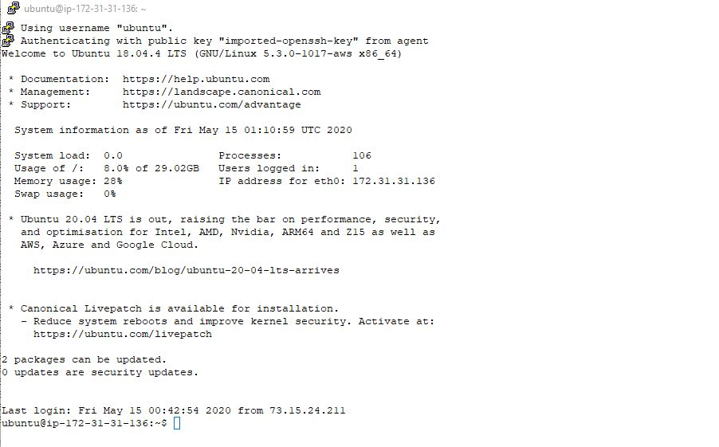


I have signed up for Datadog with email jgdesanti@yahoo.com, copied my API key and installed the latest agent


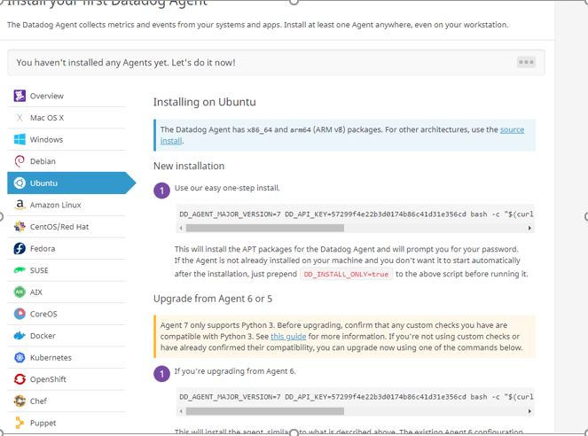


Agent is installed


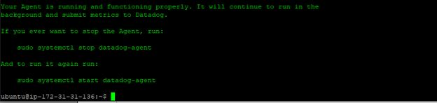

Now lets check the Datadog UI to verify that the agent is reporting correctly and data is being collected


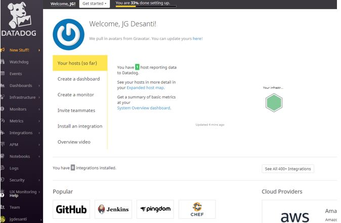

First step is complete


## Collecting Metrics
* Add tags in the Agent config file and show us a screenshot of your host and its tags on the Host Map page in Datadog.


I am adding tags to the agent configuration file and restarting the agent

` sudo vi /etc/datadog-agent/datadog.yaml`
` sudo service datadog-agent restart`

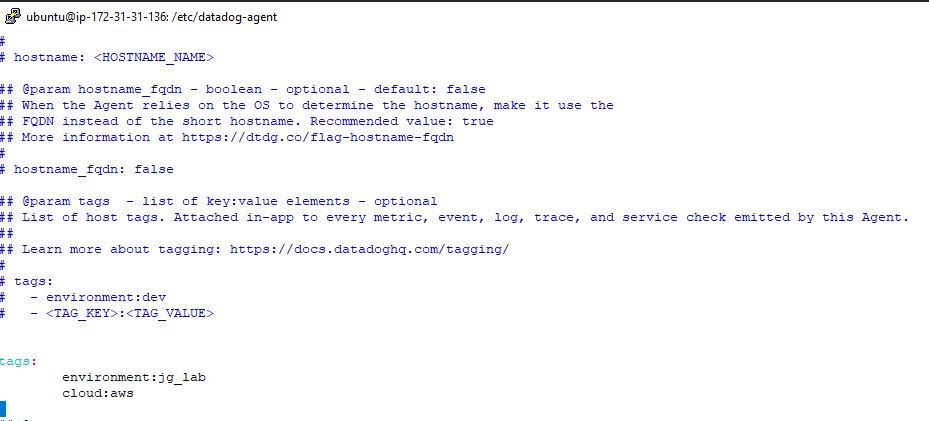

Then checking in the UI that my new tags are displayed

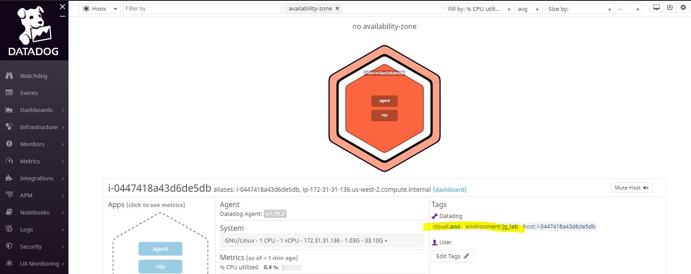


* Install a database on your machine (MongoDB, MySQL, or PostgreSQL) and then install the respective Datadog integration for that database.

I am installing MongoDB 4.2.6 on my machine

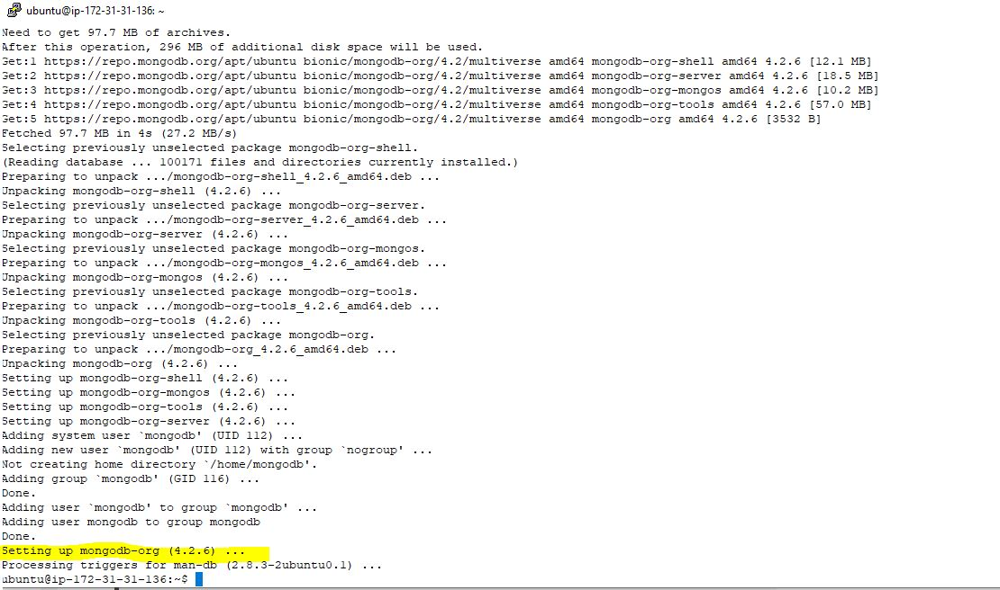

Check the Mongo logs

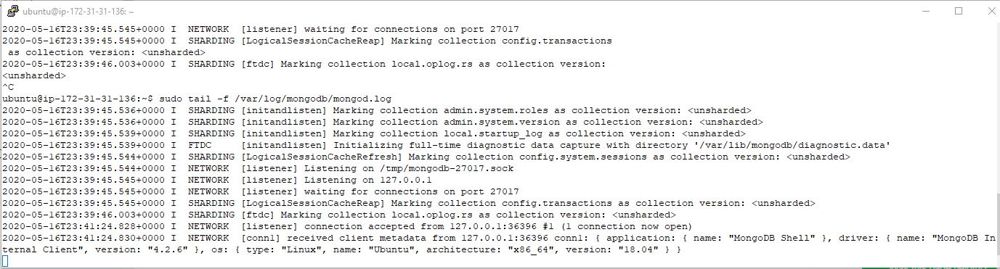

Configure the MongoDB integration in /etc/datadog-agent/conf.d/mongo.d

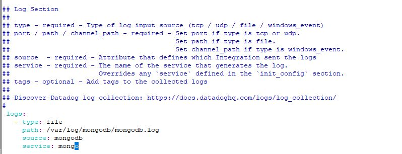

Check Datadog Log File
`cat /var/log/datadog/agent.log`

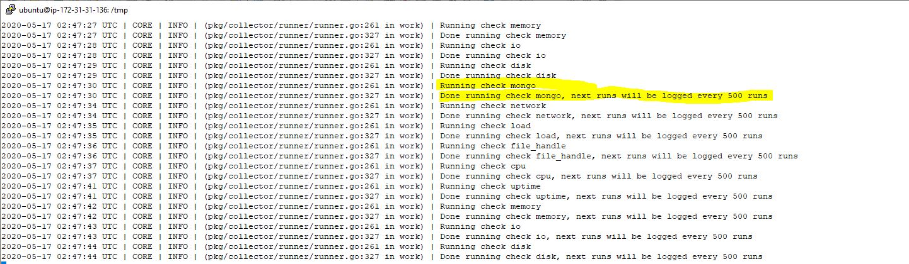

Finally Check that integration is working properly and MongoDB is detected

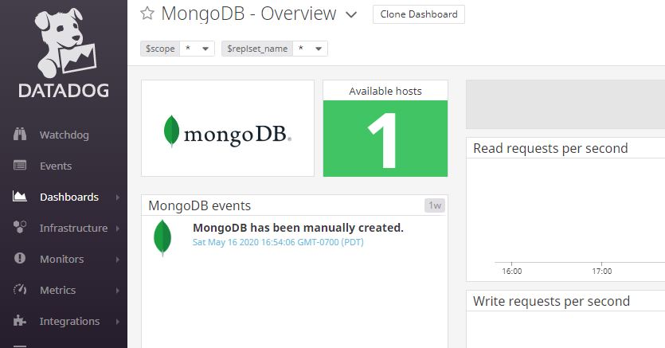

* Create a custom Agent check that submits a metric named my_metric with a random value between 0 and 1000.

Create a new yaml file in /etc/datadog-agent/conf.d for my_metric config :
`init_config:

instances:
  [{}]
`
create my_metric.py
```python
import random

from checks import AgentCheck
class HelloCheck(AgentCheck):
  def check(self, instance):
    self.gauge('my_metric', random.randint(0,1000))
```
restart agent

`sudo systemctl restart datadog-agent`

Now lets check if the new metric is being received in the metrics explorer
https://app.datadoghq.com/metric/explorer

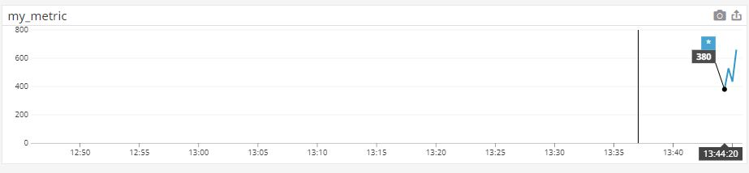

* Change your check's collection interval so that it only submits the metric once every 45 seconds.

By default, metric interval is 15 sec, to change this i am editing the check configuration file
`sudo vi my_metric.yaml`

`init_config:

instances:
  - min_collection_interval: 45`
restart the agent
` sudo systemctl restart datadog-agent`

Check the logs for updated time interval

`2020-05-17 21:14:32 UTC | CORE | INFO | (pkg/collector/scheduler/scheduler.go:83 in Enter) | Scheduling check my_metric with an interval of 45s`

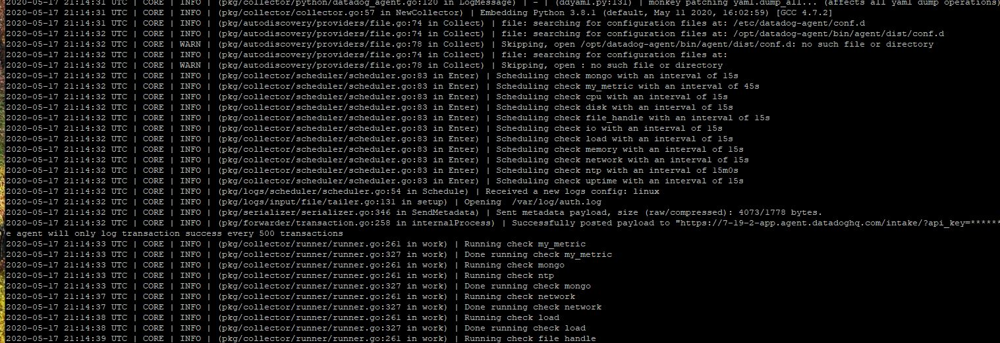

* **Bonus Question** Can you change the collection interval without modifying the Python check file you created?
My understanding is that only modifying the config yaml file is needed, not the python check file, variable min_collection_interval and the value is seconds


## Visualizing Data:
Utilize the Datadog API to create a Timeboard that contains:

First lets create and API and Application key with name API

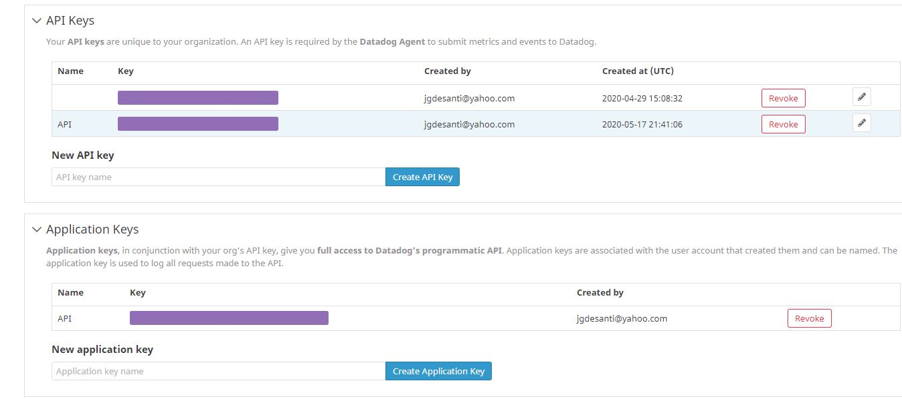

Now, I created a curl script to check my credentials

` ./dd_api_validate.sh`
{"valid":true}ubuntu@ip-172-31-31-136:~$

`curl "https://api.datadoghq.com/api/v1/validate" \
    -H "DD-API-KEY: xxx" \
    -H "DD-APPLICATION-KEY: xxx"`
    
  As suggested in the referecnes I am using this link https://docs.datadoghq.com/api/
  And building my queries with Postman
  
  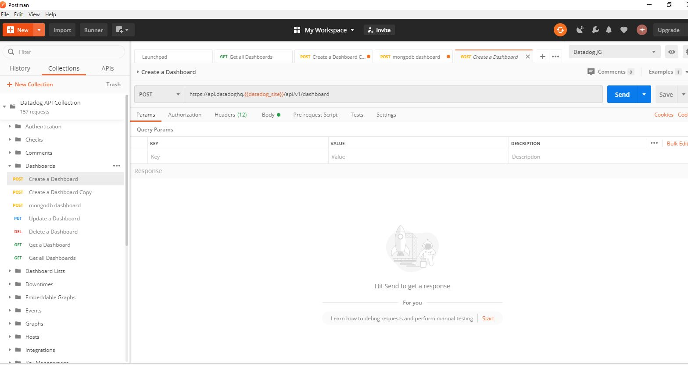
  
Timeboards :

* Your custom metric scoped over your host.
* Any metric from the Integration on your Database with the anomaly function applied.
Using this as a reference : https://docs.datadoghq.com/dashboards/functions/algorithms/#anomalies
* Your custom metric with the rollup function applied to sum up all the points for the past hour into one bucket


Code :
```
curl --location --request POST 'https://api.datadoghq.com/api/v1/dashboard' \
--header 'Content-Type: application/json' \
--header 'DD-API-KEY: 80411968469bd7a7b902ccdddc935bf6' \
--header 'DD-APPLICATION-KEY: d0c1e0c4f0d2c05d2b3d187fff288bebbc9b8f5e' \
--header 'Content-Type: text/plain' \
--header 'Cookie: DD-PSHARD=198' \
--data-raw '{
    "title": "JG Dashboard",
    "widgets": [
        {
            "definition": {
                "type": "timeseries",
                "requests": [
                    {
                        "q": "my_metric{*}"
                    }
                ],
                "title": "Custom Metric"
            }
        },
        {
            "definition": {
                "type": "timeseries",
                "requests": [
                    {
                        "q": "anomalies(mongodb.stats.objects{*}, '\''basic'\'', 2)"
                    }
                ],
                "title": "Mongo objects anomalies"
            }
        },
         {
            "definition": {
                "type": "timeseries",
                "requests": [
                    {
                        "q": "avg:my_metric{*}.rollup(sum, 3600)"
                    }
                ],
                "title": "Custom metric rollup"
            }
        }
    ],
    "layout_type": "ordered",
    "description": "My dashboard",
    "is_read_only": true,
    "notify_list": [
        "jgdesanti@yahoo.com"
    ],
    "template_variables": [
        {
            "name": "host",
            "prefix": "host",
            "default": "i-0447418a43d6de5db"
        }
    ],
    "template_variable_presets": [
        {
            "name": "Saved views for hostname 2",
            "template_variables": [
                {
                    "name": "host",
                    "value": "<HOSTNAME_2>"
                }
            ]
        }
    ]
}'
```

Sending the API POST
