# Prerequisites

I decided to use an Ubuntu 16.04 virtual machine using VirtualBox, as that was the first suggestion in the readme and is an environment I am familiar with. Installation of the agent was very simple using the single-line command provided upon signing up for DataDog. I am using Agent V6, so many of the techniques I am using will not apply to Agent V5.

# Collecting Metrics

After getting the agent installed and running, the next step was to start collecting metrics on the VM running the agent. The first part of this was to add host tags to the file in `/etc/datadog-agent/datadog.yaml`. Inside this file around line 42, you should find a section that looks like this:

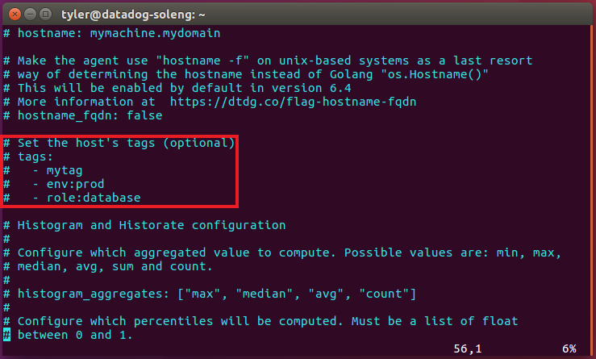

I uncommented the line containing "tags:" (make sure there isn't a space at the beginning of the line, or you'll get an error when you try to start the agent service) and created my own tags using the syntax provided in the file:

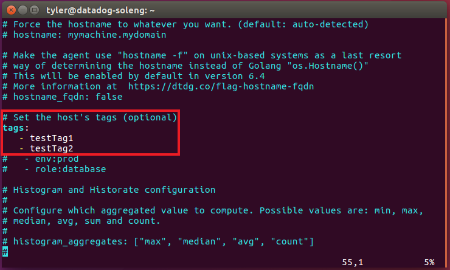

I then restarted the agent using the command `sudo service datadog-agent restart` and immediatelly saw the new tags show up on my DataDog event stream, and then saw them a few minutes later on the host map:

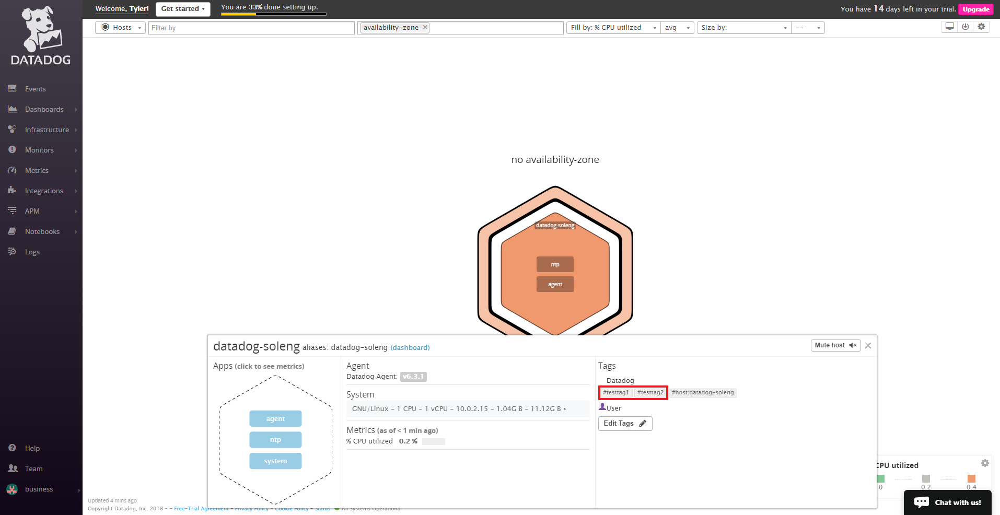

I then installed MySQL onto my virtual machine, and followed the instructions in Integrations->MySQL in the DataDog application to install the MySQL integration in the agent.

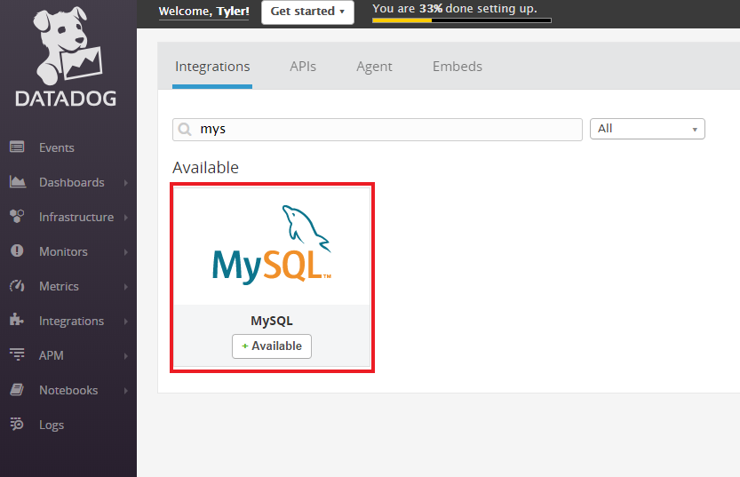

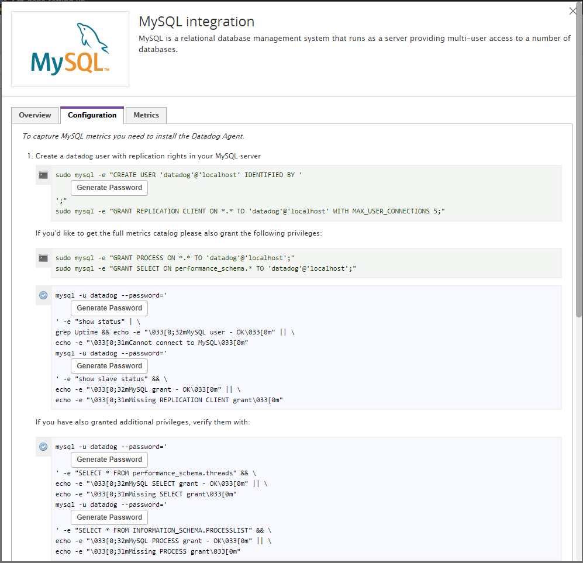

(Note: If your database's root user has a password set, it will probably be easier to enter the commands given here inside the quotation marks in the MySQL command line instead of in the terminal.)

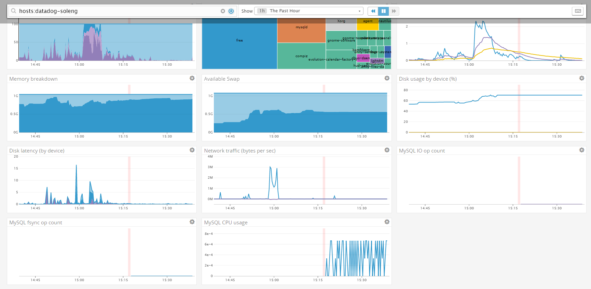

The next task was to create a custom agent that reported a random number between 0 and 1000. I created a new file in the `check.d` folder in the DataDog agent root called `my_metric.py`:

```python
from checks import AgentCheck
from random import randint

class MyCheck(AgentCheck):
	def check(self, instance):
		self.gauge('my_metric', randint(0, 1000))

```
I then made a file called `my_metric.yaml` in the `conf.d` directory that stores the configuration for the metric I made:

```yaml
init_config:


instances: 
    - min_collection_interval: 45

```

This file is also pretty bare-bones, but it made it easy to complete the next step, which was to change the collection interval so the metric is only submitted once every 45 seconds (This also fulfilled the bonus requirement). Reading through the [docs](https://docs.datadoghq.com/developers/agent_checks/#configuration) revealed that `min_collection_interval` is actually a little bit misleading:

> The collector runs every 15-20 seconds depending on how many integrations are enabled. If the interval on this Agent happens to be every 20 seconds, then the Agent collects and includes the Agent check. The next time it collects 20 seconds later, it sees that 20 is less than 30 and doesn’t collect the custom Agent check. The next time it sees that the time since last run was 40 which is greater than 30 and therefore the Agent check is collected.

This explains why, later in the challenge, I observed that the actual collection interval varied between 40 seconds and 60 seconds.

# Visualizing Data

For this part of the challenge, I was tasked with using the API to create a Timeboard that displayed data about my custom agent and the MySQL integration. To start, I used the Curl shell script given in the [docs](https://docs.datadoghq.com/api/?lang=bash#timeboards) as a framework, and inserted the graphs I needed in the JSON. When I was poking around in the application, I noticed that when you make a graph in a timeboard, it provides you with JSON that is useful as a starting point to working with the API, so I used that for each of my 3 graphs. I took the URL (inserting each key in its respective place) and the JSON body I had crafted from the docs and the application, and used Postman (my preferred tool for interacting with and testing APIs) to send the POST request to the API.

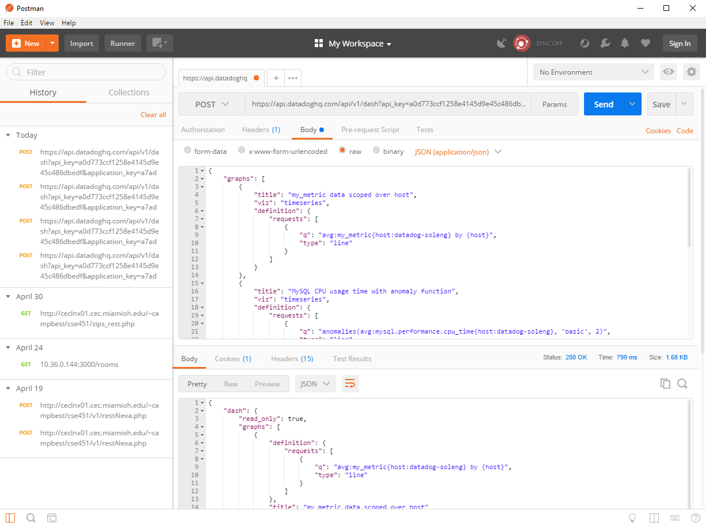


I really wanted the "Sum of my_metric values over past hour" to be a query value, but after much trial and error, I was unable to succeed in that. I was also unable to figure out how to set the timeframe to the past 5 minutes, so I set it to 1 hour.

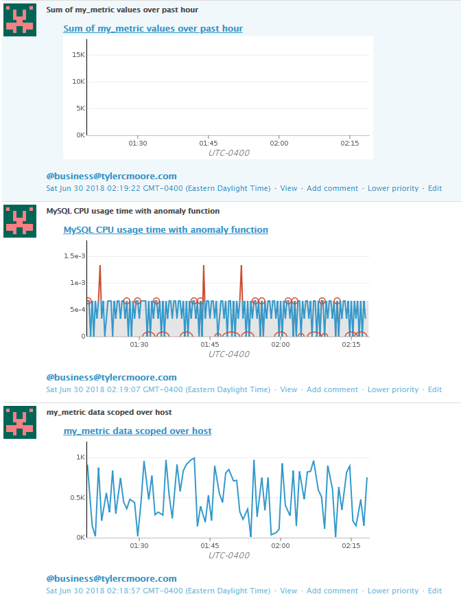

The anomaly graph is showing what the algoritm the graph is using expects for the data to be like with the shaded grey area, and what the actual data is like with the line. In the snapshot, every time a part of the graph is red or circled is a time that the actual value was outside the bounds of the expected value.

# Monitoring Data

Now that I had created the metric and visualized it, my next task was to sutomatically generate alerts based on the average value of my_metric over the past 5 minutes, sending an "Alert" message if it's above 800 and a "Warning" message if it's above 500. I also needed to send an alert if there has been no data reported from the metric in the past 10 minutes, and have the monitor send an email to me whenever it triggers. To me, this seemed like a lot at first, but DataDog's tools and documentation ended up making it the part that gave me the fewest headaches. My configuration for the alerts is as follows:

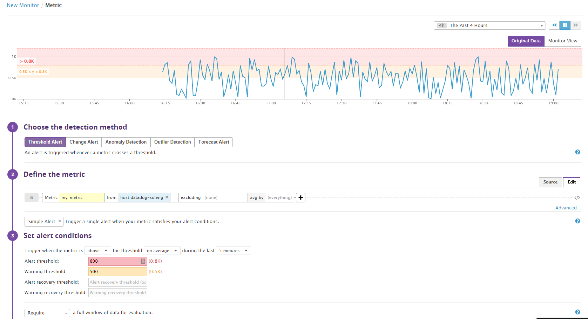

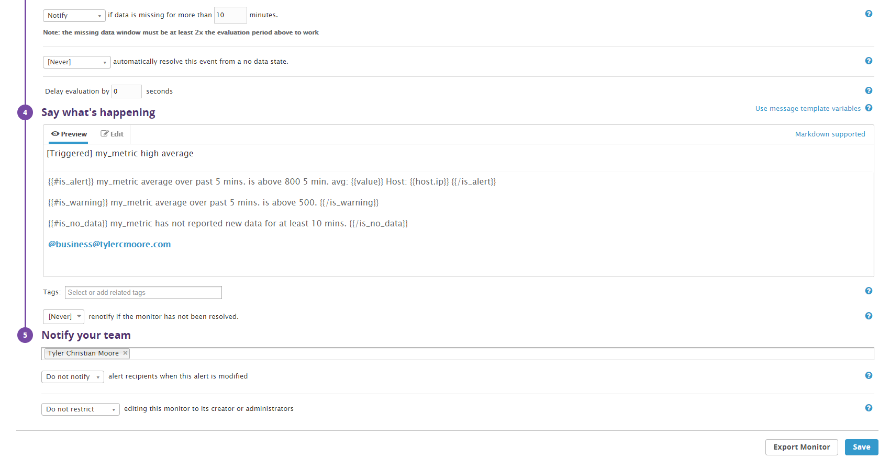

For the bonus on this section, I was to schedule downtime on the monitor from 7pm-9am Monday-Friday and all day Saturday and Sunday. This would mute notifications from the monitor when I would be out of the office during a work week. To do this, I clicked the "Manage Downtime" button in the "Monitors" submenu, and created 2 new recurring scheduled downtimes with configuration as follows:

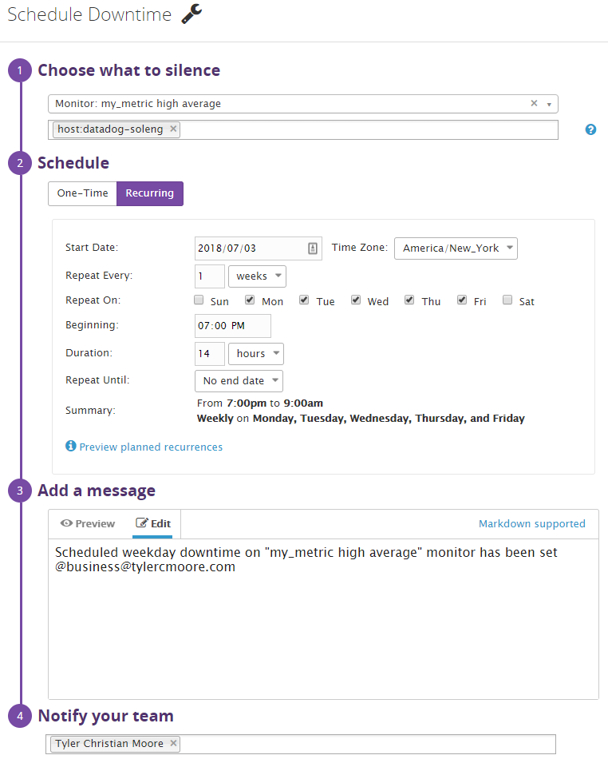

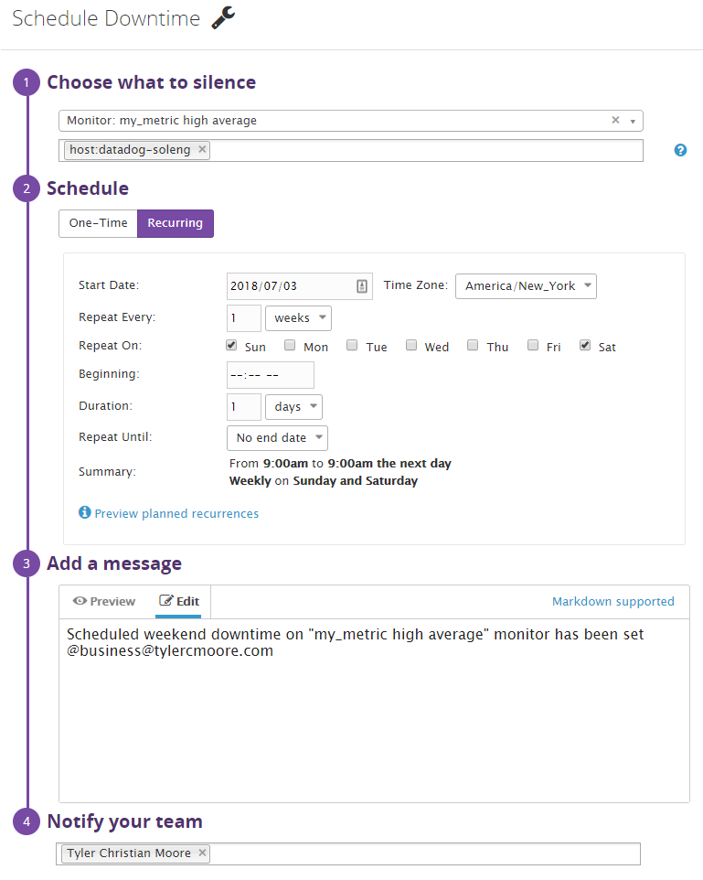

I also had these scheduled downtimes send me an email after I configured and saved them:

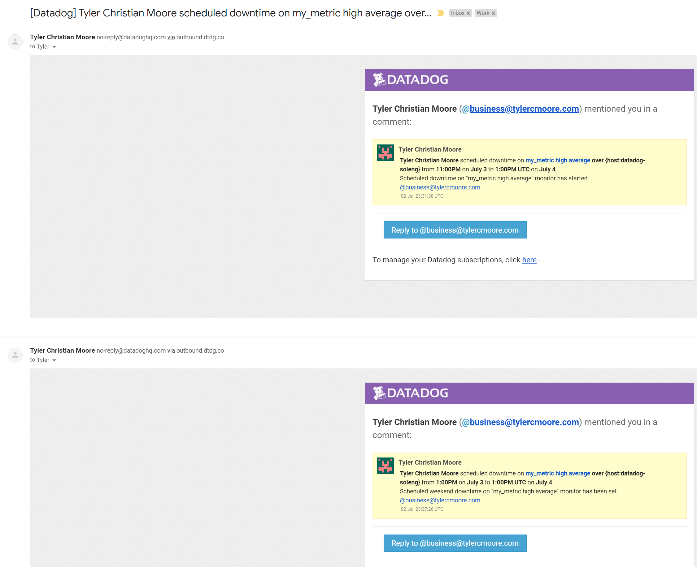

# Collecting APM Data

My final task was to take a simple Python Flask API, change it to use DataDog's program tracing solution, and collect data from the program through said framework. The [docs](http://pypi.datadoghq.com/trace/docs/#module-ddtrace.contrib.flask) contained everything I needed to use the Flask middleware approach. After modifying the program and starting it with the command `python apm-test.py` [(file)](code/apm-test.py), I decided to use a program I have used to load test APIs in the past called [Artillery](https://artillery.io/) to quickly get some data into the application. I had it send requests to the program with a roughly even split between 4 different URLs: `/`, `/api/trace`, `/api/apm`, and `/api` (which does not exist). This gave me the opportunity to play with some different visualizations and actually come to some meaningful realizations, namely that the invalid requests ran significantly slower than valid requests as you can see on this dashboard (along with other APM and infrastructure metrics):

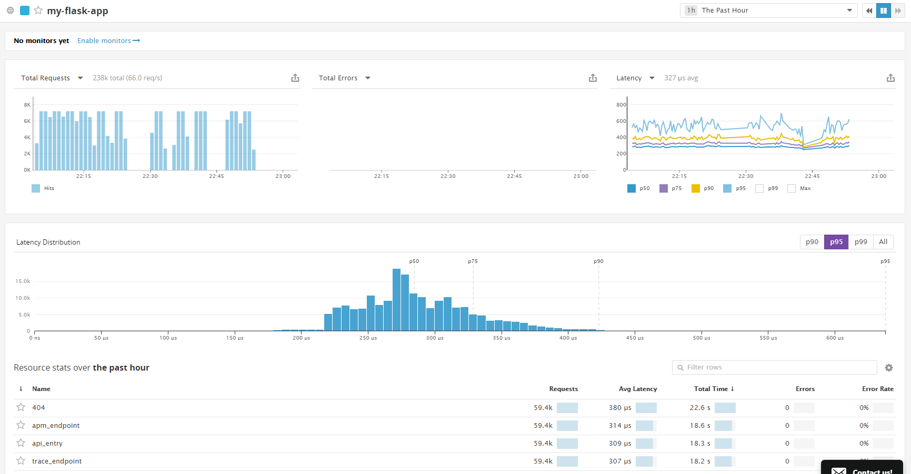

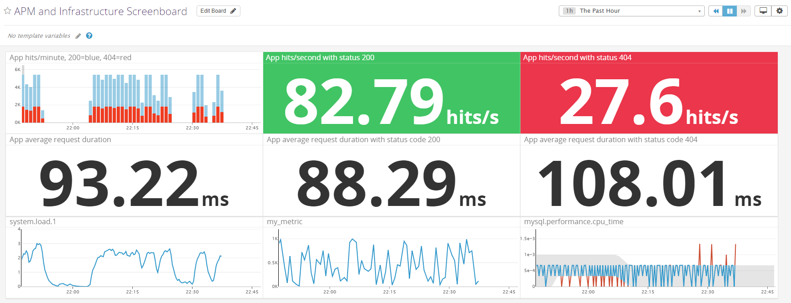
[Dashboard containing APM and infrastructure metrics](https://p.datadoghq.com/sb/50be9916d-833c1d27ab68c4ce68a5b9e5bef7cda0)

For the bonus, a service is a program, like an API, while a resource is a function within a service, like an endpoint for an API. In this instance, "my-flask-app" is the service, and "apm_endpoint", "api_entry", "trace_endpoint", and "404" are resources within that service.

# Final Question and Conclusion

I really enjoyed getting to know this product. Even just spending a small amount of time with it, I could see how powerful it could be as systems scale up. I wish I had been able to use this to monitor some of the systems I built in college. The documentation was generally very well-written and easy to follow, and almost everything worked like it was supposed to. I can tell that getting to work with such a flexible and powerful application every day would really be a treat.

So to what creative applications would I apply DataDog? Well, even though it's on the mundane side, I would love to use it to gather metrics on the efficiency of different frameworks, and even compare different functions/features within specific frameworks. Using it in conjunction with Artillery (which I later found out has an integration with DataDog - just keeps getting better and better) was really neat, and I'd love to dig into why 404s take longer to process than successful requests. Doing deep-dive investigation into small efficiency improvements that scale out to massive improvements in large systems was one of my favorite tasks in college, and I'd love to bring that into the real world.
