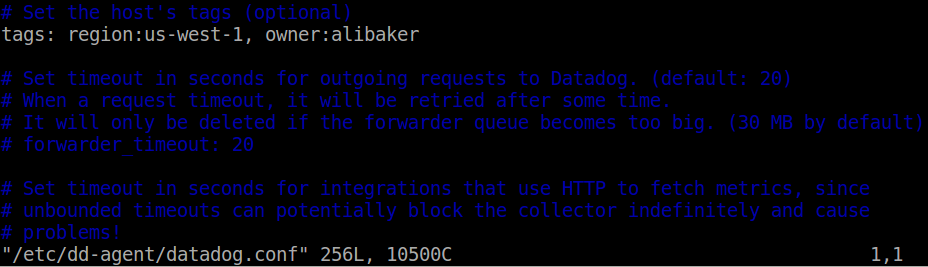
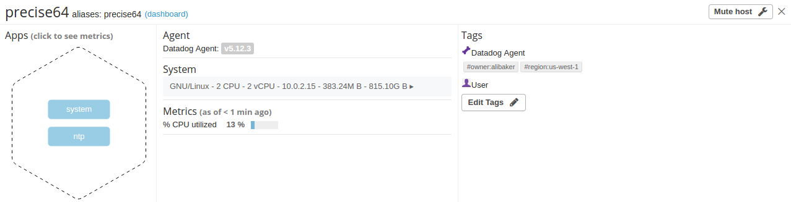
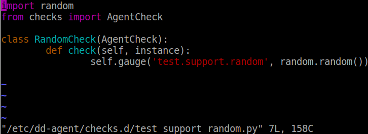
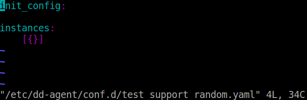

### Level 0 (optional) - Setup an Ubuntu VM

I used [Vagrant](https://www.vagrantup.com/intro/index.html) with the recommended [hashicorp precise64](https://atlas.hashicorp.com/hashicorp/boxes/precise64) box with Virtualbox which is a standard Ubuntu 12.04 LTS 64-bit box.

### Level 1 - Collecting your Data

*Bonus question: In your own words, what is the Agent?**

The Agent is software that runs on hosts, collecting valuable data and performance metrics about systems, applications, and select integrations to be sent to the Datadog dashboard. 

**Add tags in the Agent config file and show us a screenshot of your host and its tags on the Host Map page in Datadog.**

Added two tags `region:us-west-1` and `owner:alibaker` to Agent config file.

Modified agent config file - `/etc/dd-agent/datadog.conf`:

Screenshot of tags on the Host Map page:

**Install a database on your machine (MongoDB, MySQL, or PostgreSQL) and then install the respective Datadog integration for that database.**

Installation of PostgreSQL on VM:

Installation of PostgreSQL integration:

**Write a custom Agent check that samples a random value. Call this new metric: `test.support.random`**

Custom agent check file - `/etc/dd-agent/checks.d/test_support_random.py`:

Custom agent check config - `/etc/dd-agent/conf.d/test_support_random.yaml`
