## Start your monitoring with DataDog

The Porpuse of this document is to give the reader an introductory guide of DataDog and the different features.

Requirements:
* Ubuntu 16.04 (Minimum)
* Any Database Management System (We are going to use MySQL)
* When signing up for Datadog, use “Datadog Recruiting Candidate” in the “Company” field


## Collecting Metrics:

The first task will be collect metrics, for this we need to intall the Agent in your Ubuntu machine.
Log into your https://www.datadoghq.com/ with your information and navigate to the little puzzle piece title "Integrations" and Select "Agents", then click over Ubuntu and copy and paste the easy one-step install similar to the example below.

```
DD_API_KEY=b2a249da9744daa8e0eceaXXXXXXXX bash -c "$(curl -L https://raw.githubusercontent.com/DataDog/datadog-agent/master/cmd/agent/install_script.sh)"
```

* Add tags in the Agent config file and show us a screenshot of your host and its tags on the Host Map page in Datadog.
For this we could use different methods, however in this exercise we will use the configuration file to add tags.

Navigate to the directory where datadog-agent was installed and modify the file datadog.yaml as show in the pictures below.

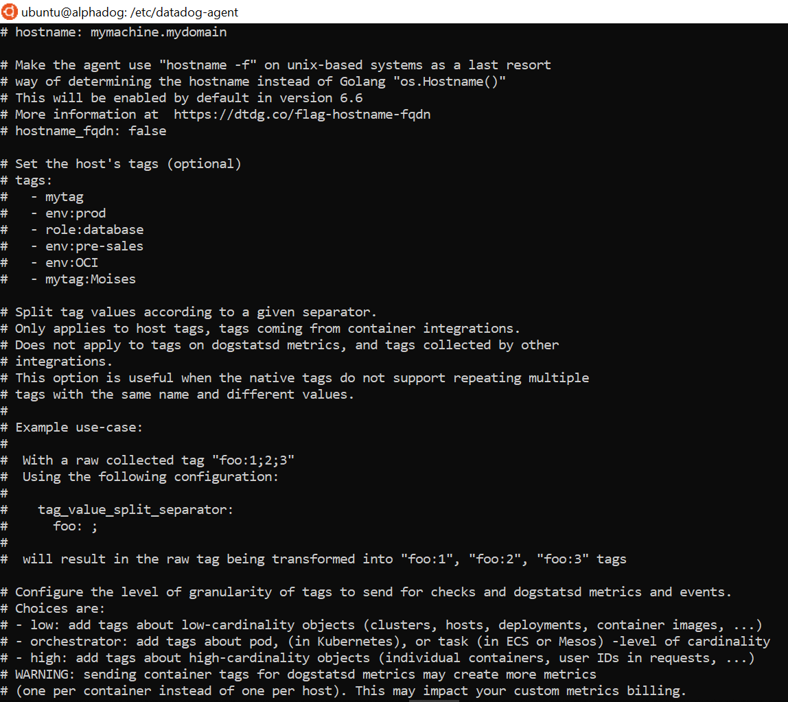

Check the Tags have been applied as configured.

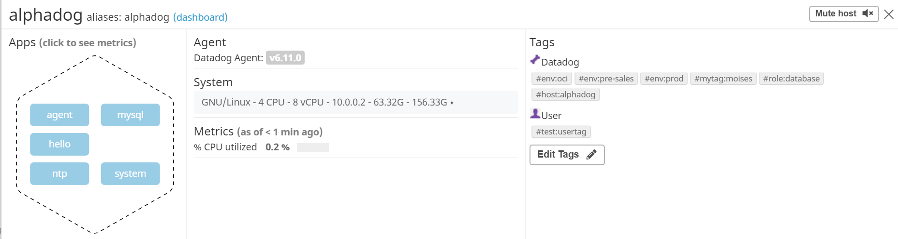

For more methods to assign tags, please follow the documentation linked here https://docs.datadoghq.com/tagging/#assigning-tags

* Install a database on your machine (MongoDB, MySQL, or PostgreSQL) and then install the respective Datadog integration for that database.

Intall any Database Management System, for example MySQL following this guideline https://support.rackspace.com/how-to/installing-mysql-server-on-ubuntu/

* Create a custom Agent check that submits a metric named my_metric with a random value between 0 and 1000.

To create a custom agente check we first need to navigate to your checks.d folder, the path should look something like this
"/etc/datadog-agent/checks.d$" within that folder create a new file and name it as you prefer, make sure the extension of this file is .py and inside copy and paste the following script.

For example my_metric.py

```
from checks import AgentCheck
import random
class HelloCheck(AgentCheck):
  def check(self, instance):
    self.gauge('my_metric', random.uniform(0, 1000))
```


* Change your check's collection interval so that it only submits the metric once every 45 seconds.
To determine the behaviour of the previously created custom check we are going to navigate to the folder "/etc/datadog-agent/conf.d$" and create a file with the same name as the custom agent with the extension .yaml

For example my_metric.yaml

Within that file, write the code as the example below, as you can see you can fraction the time, 1 being 1 minute I used 0.75 to achieve 45 seconds.  You can either modify the collection interval in either the py or the yaml fiels.

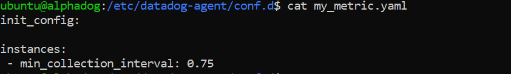


## Visualizing Data:

In the follownig exercise we will utilize the Datadog API to create a Timeboard that contains:

* Your custom metric scoped over your host.
* Any metric from the Integration on your Database with the anomaly function applied.
* Your custom metric with the rollup function applied to sum up all the points for the past hour into one bucket

At your bash console, type the api_key and the app_key, to get this values, please go again to your dashboard and click on the puzzle icon and this time click on API's. 

api_key=b2a249da9744daa8e0eceXXXXXXXXXXX
app_key=c6a0500783dc98a1f24bde2d1e411fXXXXXXXXXX

After defying your api and app key, proceed to copy and paste the following script, please be mindful to change the name of the custom metric to the apropiate name. 

```
curl  -X POST -H "Content-type: application/json" \
-d '{
      "title" : "My Custom Metric",
      "widgets" : [{
          "definition": {
              "type": "timeseries",
              "requests": [
                  {"q": "my_metric{*}"}
              ],
              "title": "Hello World?"
          }
      }],
      "layout_type": "ordered",
      "description" : "A dashboard with memory info.",
      "is_read_only": true,
      "notify_list": ["user@domain.com"],
      "template_variables": [{
          "name": "alphadog",
          "prefix": "host",
          "default": "my-host"
      }]
}' \
"https://api.datadoghq.com/api/v1/dashboard?api_key=${api_key}&application_key=${app_key}"
```

To update and modify the previous dashboard the procedure will be very similar, however at the begining og the operation we will have to define the dashboard_id. You may still have it on the output of the last command you ran, if not run the first script below.

```
curl "https://api.datadoghq.com/api/v1/dashboard?api_key=${api_key}&application_key=${app_key}"
```

After getting the dashboard_id, declare it on your bash and continue with the next script to update your dashboard with a MySQL metric.
If you wish to add another type of metric, please change it as required.

```
curl  -X PUT -H "Content-type: application/json" \
-d '{
      "title" : "My Custom Metricv2",
      "widgets" : [{
          "definition": {
              "type": "timeseries",
              "requests": [
                  {"q": "my_metric{*}"}
              ],
              "title": "Hello World?"
          }
      },
      	{
          "definition": {
              "type": "timeseries",
              "requests": [
                  {"q": "sum:mysql.performance.queries{*}"}
              ],
              "title": "Mysql"
          }
      }],
      "layout_type": "ordered",
      "description" : "An updated dashboard with more info.",
      "is_read_only": true,
      "notify_list": ["moises.zannoni@gmail.com"],
      "template_variables": [{
          "name": "alphadog",
          "prefix": "host",
          "default": "my-host"
      }]
}' \
"https://api.datadoghq.com/api/v1/dashboard/${dashboard_id}?api_key=${api_key}&application_key=${app_key}"
```

Once this is created, access the Dashboard from your Dashboard List in the UI:

* You can click on the UI and expand the different metric you are monitoring, for example I expanded and narrowed the view to the past 5 minutes in the metric "my_metric" 

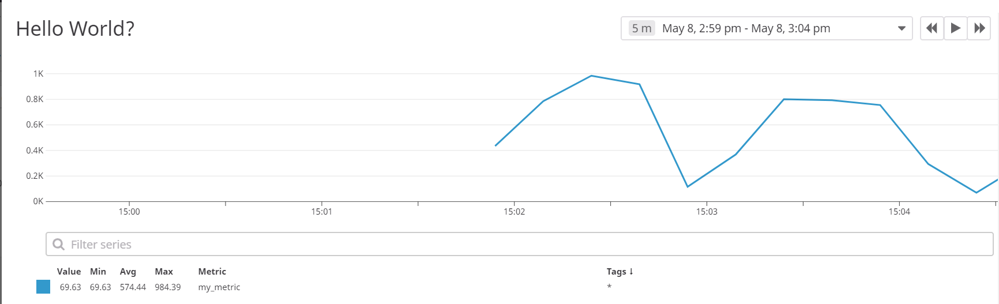

Simply click into a point in the metric and select the option "annotate this graph" drag and drop the area and use the comment with the @ to send an email to yourself or other members of the team.

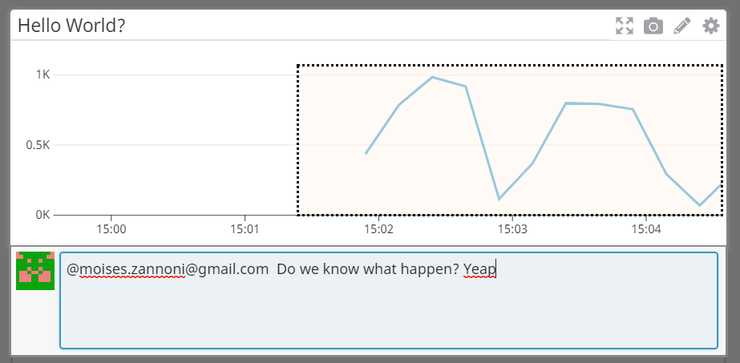


## Monitoring Data

Since you’ve already caught your test metric going above 800 once, you don’t want to have to continually watch this dashboard to be alerted when it goes above 800 again. So let’s make life easier by creating a monitor.

Let's create a new Metric Monitor that watches the average of your custom metric (my_metric) and will alert if it’s above the following values over the past 5 minutes:

* Alerting threshold of 800
* Warning threshold of 500
* And also ensure that it will notify you if there is No Data for this query over the past 10m.

We will also configure the monitor’s message so that it will:

* Send you an email whenever the monitor triggers.
* Create different messages based on whether the monitor is in an Alert, Warning, or No Data state.
* Include the metric value that caused the monitor to trigger and host ip when the Monitor triggers an Alert state.

To include more information in your messages, please check the varibles availables
https://docs.datadoghq.com/monitors/notifications/?tab=is_alertis_warning#conditional-variables

## The result should look similar to:

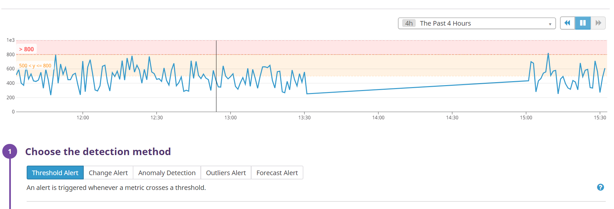
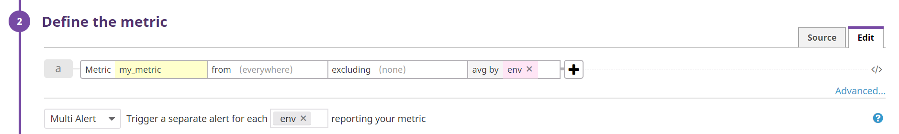
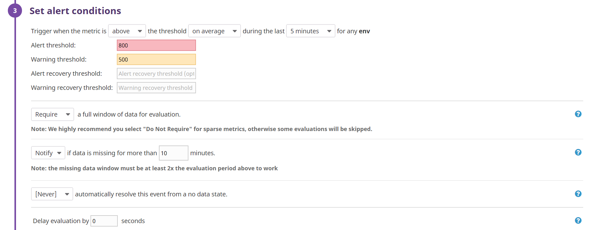
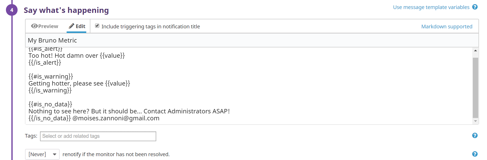


## The different notifications should look similar to:

**No Data**
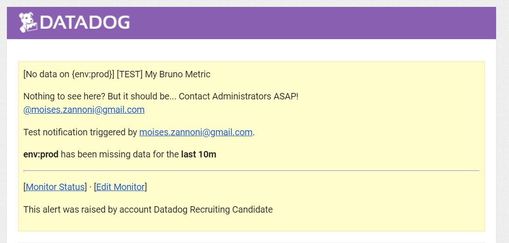

**Warning**
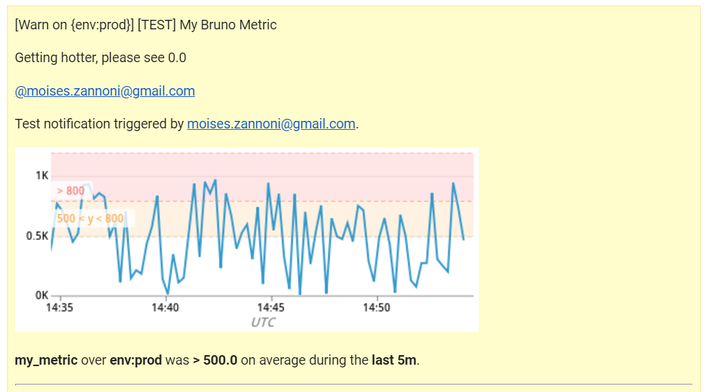

**Alert**
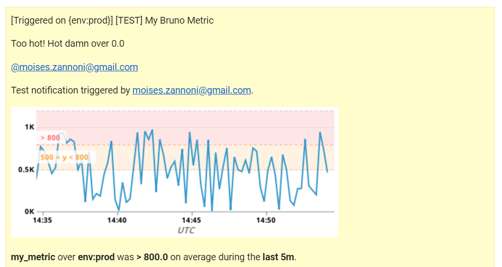


* **Bonus Exercise**: Since this monitor is going to alert pretty often, you don’t want to be alerted when you are out of the office. Let's set up two scheduled downtimes for this monitor:

To create them go to the UI and click on the Exclamation Icon, then click on Manage Downtime.

Fill out the information as required.

**The Results should look similar to:**

  * This one will silences it from 7pm to 9am daily on M-F,
  
  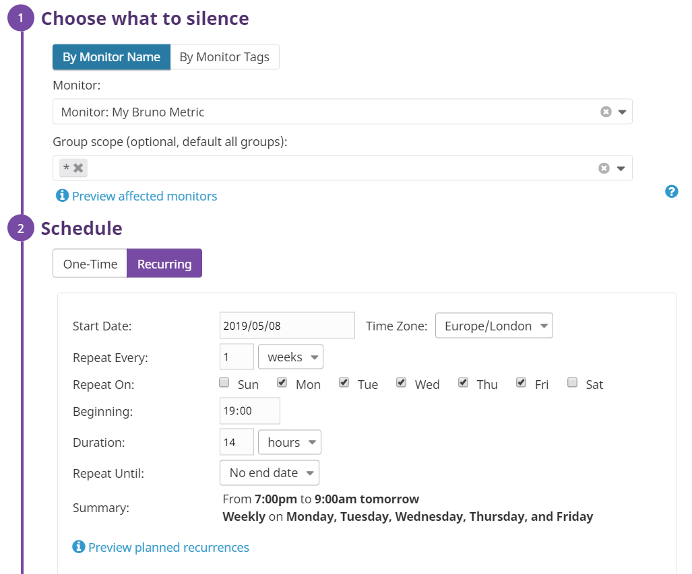
  
  * This one will silences it all day on Sat-Sun.
  
   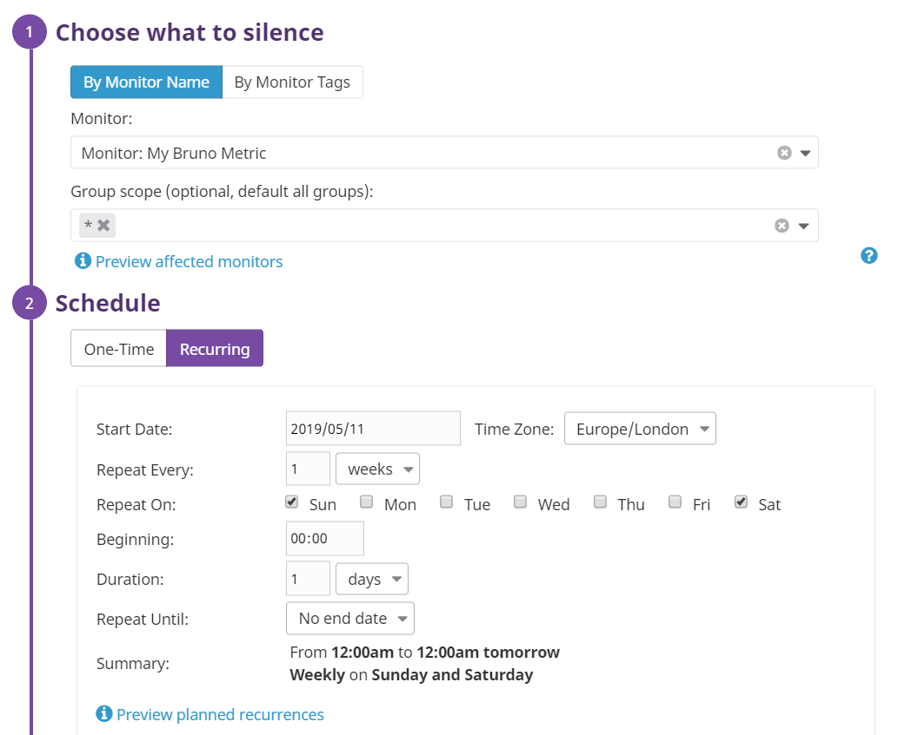
  
  * Make sure that your email is notified when you schedule the downtime.
  
   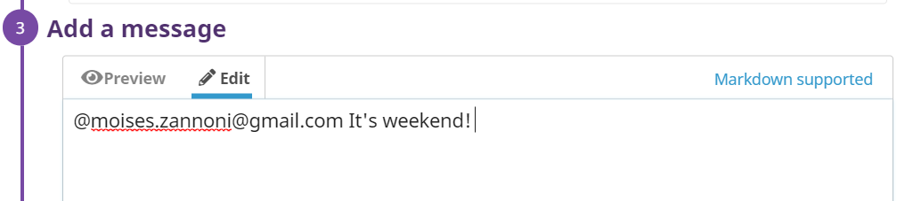

## Collecting APM Data:

Given the following Flask app (or any Python/Ruby/Go app of your choice) instrument this using Datadog’s APM solution:

**No Changes**

```python
from flask import Flask
import logging
import sys

# Have flask use stdout as the logger
main_logger = logging.getLogger()
main_logger.setLevel(logging.DEBUG)
c = logging.StreamHandler(sys.stdout)
formatter = logging.Formatter('%(asctime)s - %(name)s - %(levelname)s - %(message)s')
c.setFormatter(formatter)
main_logger.addHandler(c)

app = Flask(__name__)

@app.route('/')
def api_entry():
    return 'Entrypoint to the Application'

@app.route('/api/apm')
def apm_endpoint():
    return 'Getting APM Started'

@app.route('/api/trace')
def trace_endpoint():
    return 'Posting Traces'

if __name__ == '__main__':
    app.run(host='0.0.0.0', port='5050')
```

To active APM on your Datadog-Agent, navigate to the instalation folder "/etc/datadog-agent$" and modify the file datadog.yaml
Find the apm_config file and comment it out, same for the line that says "enable"

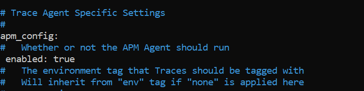

Run ddtrace-run with the following command so the process is execute in the background and doesn't expire with the session.
```
ddtrace-run python3 ./dogapp.py > nohup.out 2> nohup.err < /dev/null &
```

* **Note**: Using both ddtrace-run and manually inserting the Middleware has been known to cause issues. Please only use one or the other.

## Datadog is useful for everyone:

You can use Datadog for anything really, thinking on a very small scale I could setup an small IOT in my Door with a contact, setup 0 as a value when the circuit is close and 1 when the circuit is open, so I can monitor when someone goes into my room.

You could setup software with a cognotive services such as Microsoft Vision to identify Weapons in Public Places, if possitive send alerts to the respectives police enforcements.

IoT devices could monitor residential metrics, such as water, electricity, high impacts near areas that are promtept to people falling and monitor elderly houses to alert different departments such as firefighters, ambulences and such.

This are just a few ideas on how we could use Datadog, how would you use it?

## Conclusion:

We just had a taste of Datadog as a solution, but this is just the beginning on your Journey, what you can achieve with DataDog is only bound by your imagination.

Don't hesitate on reaching out, I want to learn what are you trying to achieve and how can I help you to achieve it, sugin DataDog.
