# [Datadog](http://datadog.com) sales-engineer exercise report

#### Useful links

##### How to get started with Datadog

* [Datadog overview](https://docs.datadoghq.com/)
* [Guide to graphing in Datadog](https://docs.datadoghq.com/graphing/)
* [Guide to monitoring in Datadog](https://docs.datadoghq.com/monitors/)

##### The Datadog Agent and Metrics

* [Guide to the Agent](https://docs.datadoghq.com/agent/)
* [Datadog Docker-image repo](https://hub.docker.com/r/datadog/docker-dd-agent/)
* [Writing an Agent check](https://docs.datadoghq.com/developers/agent_checks/)
* [Datadog API](https://docs.datadoghq.com/api/)

##### APM

* [Datadog Tracing Docs](https://docs.datadoghq.com/tracing)
* [Flask Introduction](http://flask.pocoo.org/docs/0.12/quickstart/)

##### Vagrant

* [Setting Up Vagrant](https://www.vagrantup.com/intro/getting-started/)

##### Other questions:

* [Datadog Help Center](https://help.datadoghq.com/hc/en-us)

#### Instructions on how to submit an exercise

To submit your answers:

* Fork this repo.
* Answer the questions in answers.md
* Commit as much code as you need to support your answers.
* Submit a pull request.
* Don't forget to include links to your dashboard(s), even better links and screenshots. We recommend that you include your screenshots inline with your answers.

## Task 0: Setting up an environment

**Environment used:**
* Hardware: Mac computer (RAM 16GB, Intel Core i7 3.1 GHz)
* OS: macOS High Sierra (Version 10.13.5)

**Vagrant Installation**
* Get an appropriate package from https://www.vagrantup.com/downloads.html
* [For Mac] Get **.dmg** file and install **vagrant.pkg**

**Note:** I used VMwarte Fusion 10.1.2 as a virtualisation tool. Therefore I needed a VMware plugin to be also installed.

```
vagrant plugin install vagrant-vmware-desktop
vagrant plugin license vagrant-vmware-desktop ~/Downloads/license.lic
```
To spin up a fresh environment I used **geerlingguy/ubuntu1604** (Ubuntu `v. 16.04`) Vagrant box.

##### Configuration of the environment

```
vargrant init geerlingguy/ubuntu1604
```

**Note:** you can find a <a href="vagrant/Vagrantfile">Vagrantfile</a> and <a href="vagrant/bootstrap.sh">bootstrap.sh</a> files attached to see the environment config and provisioning.

Next, SSH to a brought up VM and change user to **root**: 

```
vagrant up
vargrant ssh
sudo su
```

Next, I signed up for DataDog account and installed agent using one-line install command (which I also put in my <a href="vagrant/bootstrap.sh">bootstrap.sh</a>):

```
DD_API_KEY=8981e5f870f9dec4f52bd04bb81d4f90 bash -c "$(curl -L https://raw.githubusercontent.com/DataDog/datadog-agent/master/cmd/agent/install_script.sh)"
```

## Task 1: Collecting Metrics:

**1) Add tags in the Agent config file and show us a screenshot of your host and its tags on the Host Map page in Datadog.**

Edited a config file:
```
/etc/datadog-agent/datadog.yaml
```
and changed this part:

```
# Set the host's tags (optional)
tags:
   - type:vm
   - os:ubuntu:16_04
   - env:test
   - role:database:postgresql
```

Then restarted the agent: ``service datadog-agent restart``

**[Screenshot of the Host Map]** 

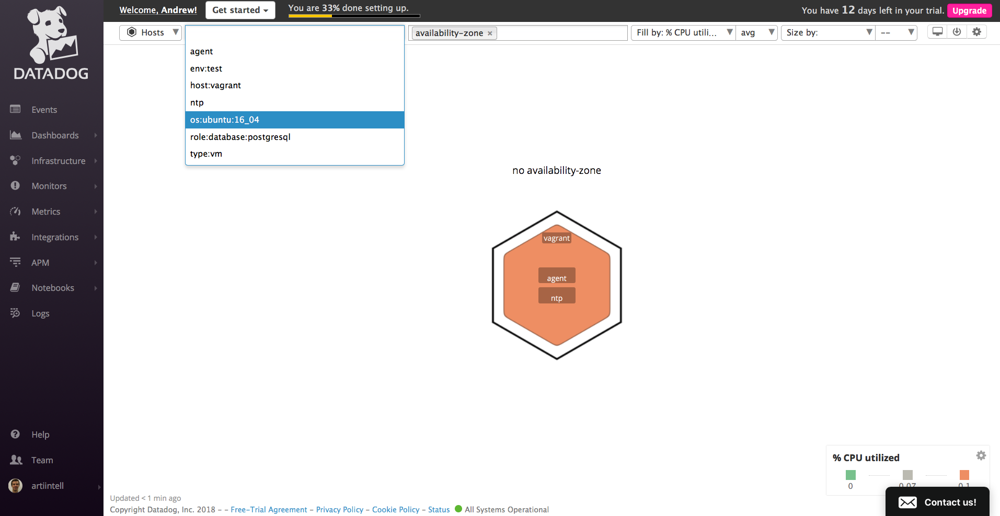<br/><br/>


**2) Install a database on your machine (MongoDB, MySQL, or PostgreSQL) and then install the respective Datadog integration for that database.**

Installed PostgreSQL

```
vagrant ssh
sudo su
echo 'deb http://apt.postgresql.org/pub/repos/apt/ YOUR_UBUNTU_VERSION_HERE-pgdg main' > /etc/apt/sources.list.d/pgdg.list
apt-get install postgresql postgresql-contrib postgresql-client
sudo su postgres
psql
```

Created a DataDog user

```
create user datadog with password 'f1v8Eug0fd35uzJXLtmZNZAI';
grant SELECT ON pg_stat_database to datadog;
```

And then run the following check:

```
psql -h localhost -U datadog postgres -c "select * from pg_stat_database LIMIT(1);" && \
echo -e "\e[0;32mPostgres connection - OK\e[0m" || \
echo -e "\e[0;31mCannot connect to Postgres\e[0m"
```

When prompted for a password, entered: ```f1v8Eug0fd35uzJXLtmZNZAI```

Configured the Agent to connect to the PostgreSQL server by editing ```conf.d/postgres.yaml``` as follows:

```
init_config:

instances:
  - host: localhost
    port: 5432
    username: datadog
    password: f1v8Eug0fd35uzJXLtmZNZAI
#    dbname: db_name
#    ssl: False
#    use_psycopg2: False # Force using psycogp2 instead of pg8000 to connect. WARNING: psycopg2 doesn't support ssl mode.
    tags:
      - db:posgresql:9_5
#      - optional_tag2
```

Then restarted the agent: ``service datadog-agent restart``

<details><summary>Expand for configuration status report:</summary><p>

```
root@vagrant:/etc/datadog-agent/conf.d/postgres.d# datadog-agent status
Getting the status from the agent.

==============
Agent (v6.3.0)
==============

  Status date: 2018-06-25 12:42:42.712232 UTC
  Pid: 31746
  Python Version: 2.7.11&#43;
  Logs: 
  Check Runners: 1
  Log Level: info

  Paths
  =====
    Config File: /etc/datadog-agent/datadog.yaml
    conf.d: /etc/datadog-agent/conf.d
    checks.d: /etc/datadog-agent/checks.d

  Clocks
  ======
    NTP offset: -0.109318236 s
    System UTC time: 2018-06-25 12:42:42.712232 UTC

  Host Info
  =========
    bootTime: 2018-06-24 13:33:45.000000 UTC
    kernelVersion: 4.4.0-21-generic
    os: linux
    platform: ubuntu
    platformFamily: debian
    platformVersion: 16.04
    procs: 207
    uptime: 82993

  Hostnames
  =========
    hostname: vagrant
    socket-fqdn: vagrant.vm.
    socket-hostname: vagrant

=========
Collector
=========

  Running Checks
  ==============
    cpu
    ---
      Total Runs: 23
      Metric Samples: 6, Total: 132
      Events: 0, Total: 0
      Service Checks: 0, Total: 0
      Average Execution Time : 0ms
      
  
    disk
    ----
      Total Runs: 23
      Metric Samples: 120, Total: 2760
      Events: 0, Total: 0
      Service Checks: 0, Total: 0
      Average Execution Time : 24ms
      
  
    file_handle
    -----------
      Total Runs: 23
      Metric Samples: 1, Total: 23
      Events: 0, Total: 0
      Service Checks: 0, Total: 0
      Average Execution Time : 0ms
      
  
    io
    --
      Total Runs: 23
      Metric Samples: 78, Total: 1740
      Events: 0, Total: 0
      Service Checks: 0, Total: 0
      Average Execution Time : 7ms
      
  
    load
    ----
      Total Runs: 23
      Metric Samples: 6, Total: 138
      Events: 0, Total: 0
      Service Checks: 0, Total: 0
      Average Execution Time : 0ms
      
  
    memory
    ------
      Total Runs: 23
      Metric Samples: 16, Total: 368
      Events: 0, Total: 0
      Service Checks: 0, Total: 0
      Average Execution Time : 0ms
      
  
    network
    -------
      Total Runs: 23
      Metric Samples: 26, Total: 598
      Events: 0, Total: 0
      Service Checks: 0, Total: 0
      Average Execution Time : 0ms
      
  
    ntp
    ---
      Total Runs: 23
      Metric Samples: 1, Total: 13
      Events: 0, Total: 0
      Service Checks: 1, Total: 23
      Average Execution Time : 2194ms
      
  
    postgres
    --------
      Total Runs: 23
      Metric Samples: 14, Total: 322
      Events: 0, Total: 0
      Service Checks: 1, Total: 23
      Average Execution Time : 16ms
      
  
    uptime
    ------
      Total Runs: 23
      Metric Samples: 1, Total: 23
      Events: 0, Total: 0
      Service Checks: 0, Total: 0
      Average Execution Time : 0ms
      
  
========
JMXFetch
========

  Initialized checks
  ==================
    no checks
    
  Failed checks
  =============
    no checks
    
=========
Forwarder
=========

  CheckRunsV1: 23
  DroppedOnInput: 0
  IntakeV1: 3
  RetryQueueSize: 0
  Success: 49
  TimeseriesV1: 23

  API Keys status
  ===============
    https://6-3-0-app.agent.datadoghq.com,*************************d4f90: API Key valid

==========
Logs Agent
==========

  Logs Agent is not running

=========
DogStatsD
=========

  Checks Metric Sample: 6576
  Event: 1
  Events Flushed: 1
  Number Of Flushes: 23
  Series Flushed: 5061
  Service Check: 276
  Service Checks Flushed: 287

root@vagrant:/etc/datadog-agent/conf.d/postgres.d#
```
</p></details><br/>

As one can probably realise the above will only enable an agent to receive metrics from the database. In order for user to see anything on a dashboard we need a mockup of some activity on database side so we can capture this in the tool. 

Before we get to it let's configure our database running the following commands:

```
vagrant ssh

sudo su

sudo postgres

createuser dummy
createdb dummy

psql

alter user dummy with encrypted password 'dummy';
grant all privileges on database dummy to dummy;
alter user dummy with superuser;
\c dummy

set role dummy;
CREATE TABLE dummy (
    code        char(5),
    title       varchar(40),
    did         integer,
    date_prod   date,
    kind        varchar(10),
    len         interval hour to minute,
    CONSTRAINT code_title PRIMARY KEY(code,title)
);
```

We will use a dummy script <a href="data/connect_to_db.py">[see code here]</a> that should allow us to have such a mockup. 

Install additional packages first

```
pip install psycopg2
pip install psycopg2-binary
```

Once run by issuing ``python connect_to_db.py`` we should be able to the the following on the PostgreSQL Metrics dashboard:

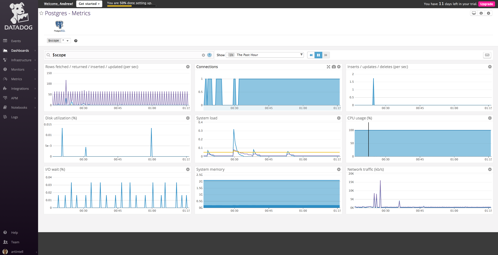<br/><br/>

**3) Create a custom Agent check that submits a metric named my_metric with a random value between 0 and 1000**

Created ``my_metric.yaml`` under ``/etc/datadog-agent/conf.d`` with the following content: 

```
init_config:
    key1: val1

instances:
    - name: my_metric
```

Then, using Python I created an actual check ``my_metric.py`` under ``/etc/datadog-agent/checks.d`` with the following content:

```
from datadog_checks.checks import AgentCheck
from random import randint

class MyMetric(AgentCheck):
        def check(self, instance):
                name = instance['name']
                self.gauge(name, randint(1,1000))
```

Then restarted the agent: ``service datadog-agent restart``

**Note:** When running custom agent check call had the following warning message:

```
root@vagrant:/etc/datadog-agent# sudo -u dd-agent datadog-agent check my_metric
/opt/datadog-agent/embedded/lib/python2.7/site-packages/psycopg2/__init__.py:144: UserWarning: The psycopg2 wheel package will be renamed from release 2.8; in order to keep installing from binary please use "pip install psycopg2-binary" instead. For details see: <http://initd.org/psycopg/docs/install.html#binary-install-from-pypi>.
```

To fix this I simply added the package to the **embeded** Python installation by running the following: ```/opt/datadog-agent/embedded/bin/pip install psycopg2-binary``` 

**[Screenshot of the Metrics Explorer]** 

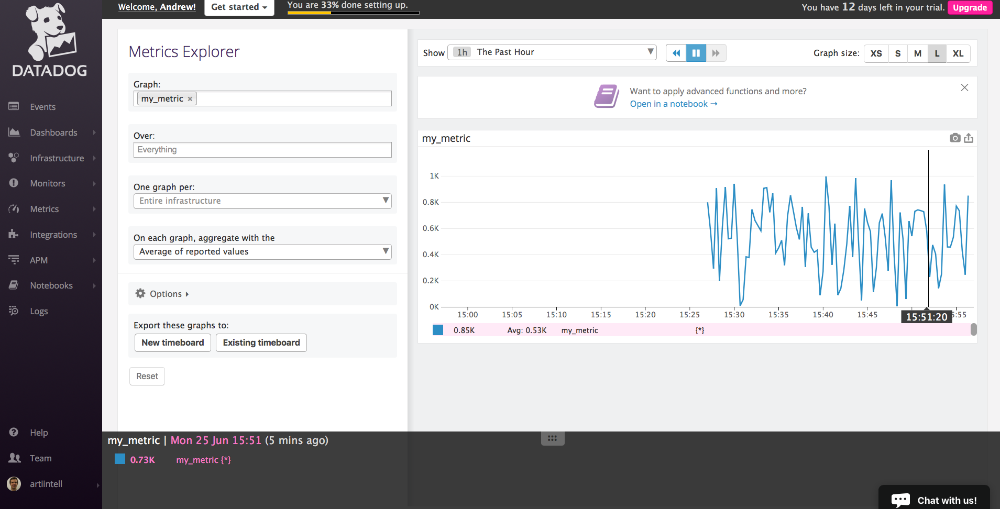<br/><br/>


**4) Change your check's collection interval so that it only submits the metric once every 45 seconds.**

**Note:** Run ```root@vagrant:/etc/datadog-agent# datadog-agent status``` to confirm the current version of the agent:

```
==============
Agent (v6.3.0)
==============
```

For Agent 6, ``min_collection_interval`` can be added to the ``instances`` part of the YAML file for each defined instance to help define how often the check should be run.

According to documentation if it is greater than the interval time for the Agent collector, a line is added to the log stating that collection for this script was skipped. The default is 0 which means it’s collected at the same interval as the rest of the integrations on that Agent. If the value is set to 30, it does not mean that the metric is collected every 30 seconds, but rather that it could be collected as often as every 30 seconds.

The collector runs every 15-20 seconds depending on how many integrations are enabled. If the interval on this Agent happens to be every 20 seconds, then the Agent collects and includes the Agent check. The next time it collects 20 seconds later, it sees that 20 is less than 30 and doesn’t collect the custom Agent check. The next time it sees that the time since last run was 40 which is greater than 30 and therefore the Agent check is collected.

Changed ``my_metric.yaml`` under ``/etc/datadog-agent/conf.d`` as follows: 

```
init_config:
    key1: val1

instances:
    - name: my_metric
      min_collection_interval: 45
```

Then restarted the agent: ``service datadog-agent restart``

**[Screenshots of the Metrics Explorer]** 

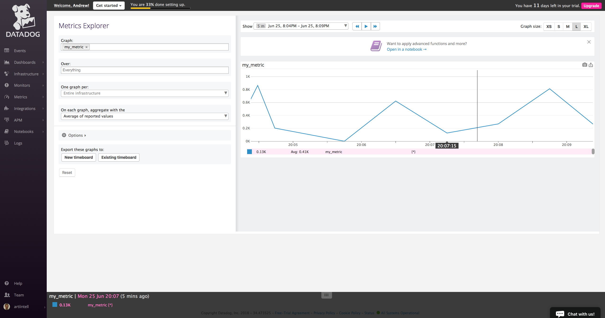<br/><br/>
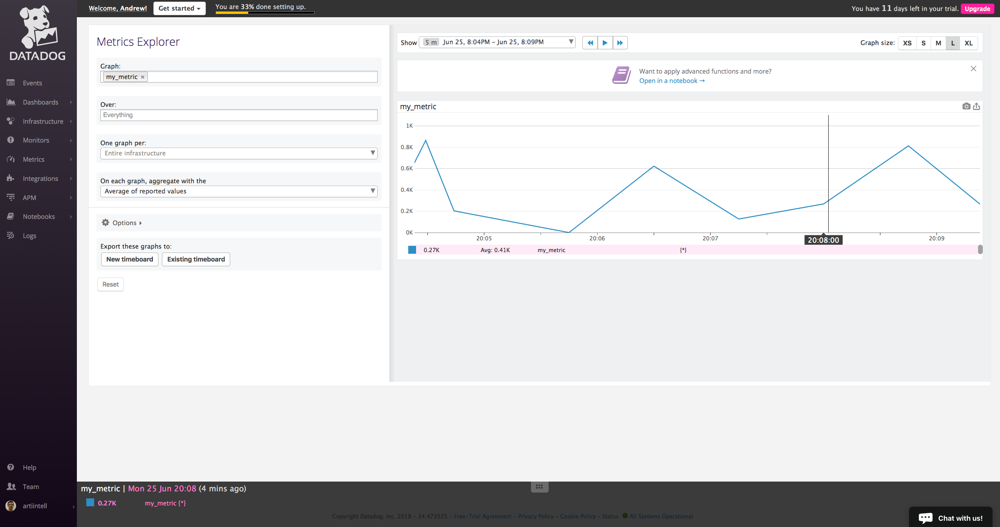<br/><br/>

**5) [Bonus Question] Can you change the collection interval without modifying the Python check file you created?**

The previous step did not actually involve user to change a **.py** script to meet the requirement. Though there is another theoretical possibility to achieve what's required. Looking at the Agent architecture which is shown below,

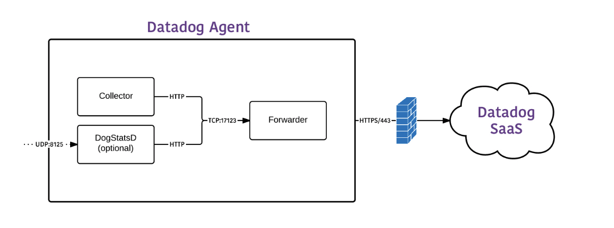<br/><br/>

we can see that agent is comprised of 4 major elements:

* Collector;
* Dogstatsd;
* Forwarder;
* SupervisorD,

where **Collector** is where all standard metrics are gathered, every 15-20 seconds. It also supports the execution of python-based, user-provided checks, stored in ``/etc/datadog-agent/checks.d``. So theoretically **Collector** element somehow can be otherwise instructed to change the interval to what's required, though I failed to find exact place or method that can be used to achieve this. There is some mentioning about running agent in development mode which allows for greater granularity and configurability.

## Visualizing Data:

**1) Utilize the Datadog API to create a Timeboard that contains:**

* Your custom metric scoped over your host.
* Any metric from the Integration on your Database with the anomaly function applied.
* Your custom metric with the rollup function applied to sum up all the points for the past hour into one bucket

In order to achieve what's required we will use **Datadogpy** which is a collection of tools suitable for inclusion in existing Python projects or for development of standalone scripts. It provides an abstraction on top of Datadog's raw HTTP interface and the Agent's StatsD metrics aggregation server, to interact with Datadog and efficiently report events and metrics.

* Library Documentation: http://datadogpy.readthedocs.org/en/latest/
* HTTP API Documentation: http://docs.datadoghq.com/api/

First we would need to install the client:

```
pip install datadog
```

Next we will require an API key and an Application key. 
In Datadog go to **Integrations >> APIs** as demonstrated on the screenshot below

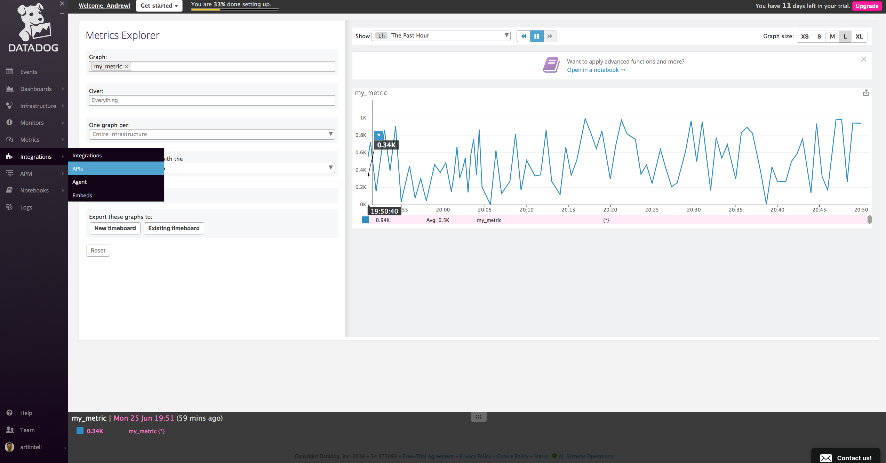<br/><br/>

Name your Application key and hit **“Create Application Key”**. As a result you should see something similar to this

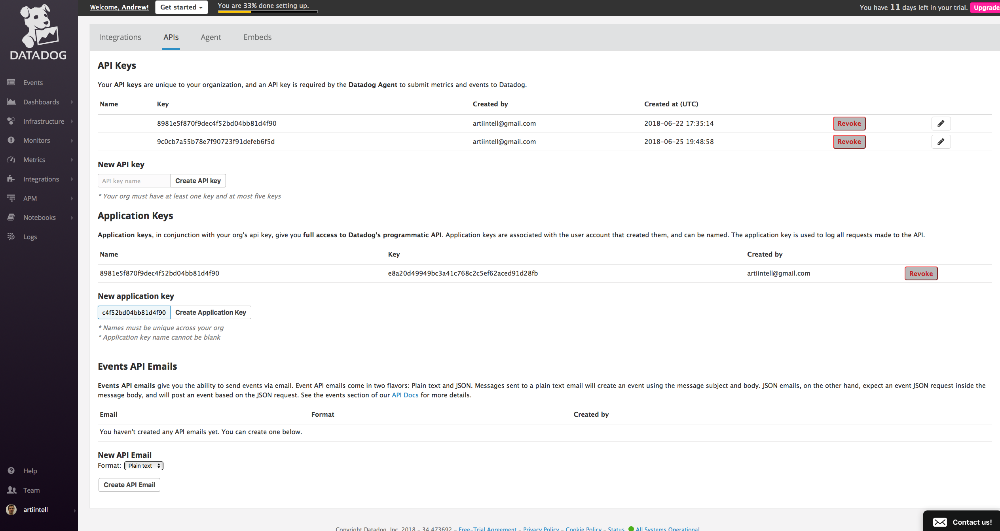<br/><br/>

Use https://docs.datadoghq.com/api/?lang=python#timeboards as a reference to build a script to create a time board.

*Please be sure, when submitting your hiring challenge, to include the script that you've used to create this Timeboard.*

You can find the script that creates a time board <a href="data/create_time_board.py">here</a>.

In order to create the board simple run ``python create_time_board.py`` after which you should see **"Data Visualisation"** dashboard among your dashboards which should look as follows:

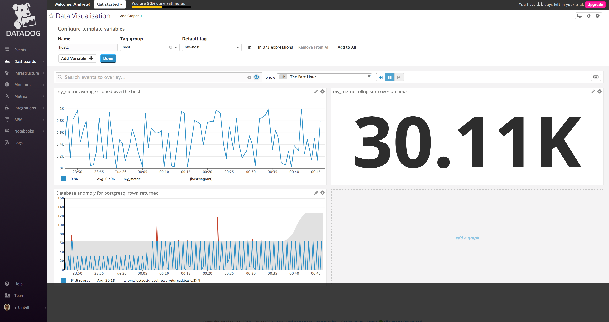<br/><br/>

**2) Once this is created, access the Dashboard from your Dashboard List in the UI:**

* Set the Timeboard's timeframe to the past 5 minutes

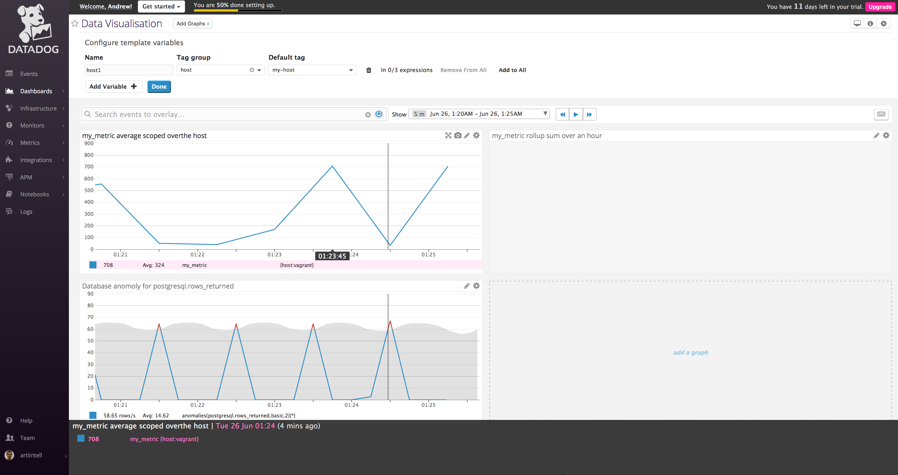<br/><br/>

* Take a snapshot of this graph and use the @ notation to send it to yourself.

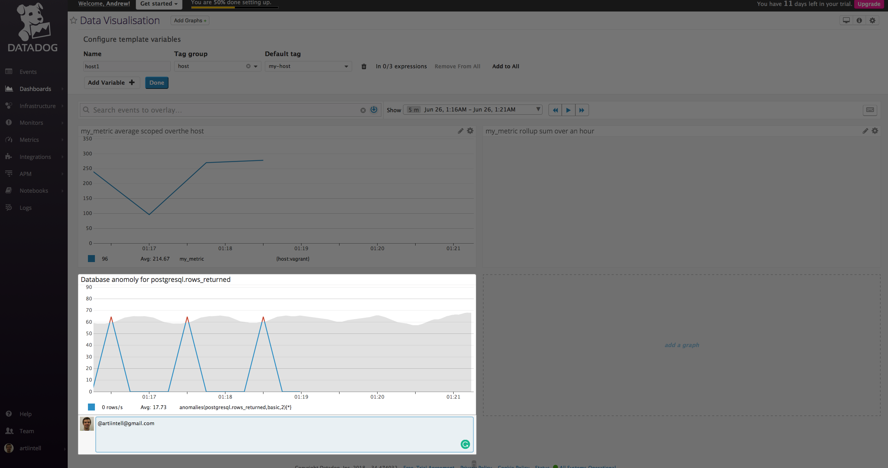<br/><br/>
<br/><br/>

* **[Bonus Question]**: What is the Anomaly graph displaying?

A good article on anomaly detection in Datadog: https://www.datadoghq.com/blog/introducing-anomaly-detection-datadog/

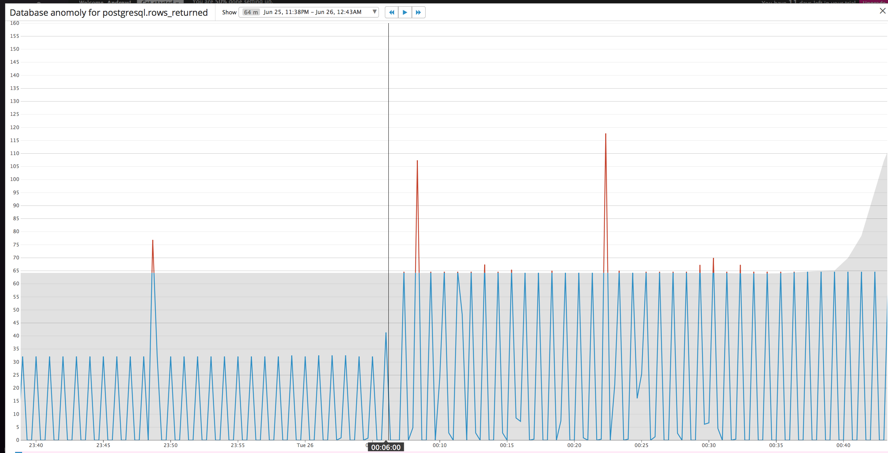<br/><br/>

As can be seen form the script that creates a time board we used a **basic** algorithm for anomaly detection. A **basic** algorithm uses a simple lagging rolling quantile computation to determine the range of expected values.  

We have been monitoring anomalies for number of rows returned from PostgreSQL database by SQL queries so in this case anomaly we can see on a graph above **[red peaks on a white background]** represent unusual (based on the calculation for an expected range) number of rows returned by a query according to the rolling period. As one can see this algorithms adjusts quickly to changing conditions but has no knowledge of seasonality or long-term trends.

## Monitoring Data

Since you’ve already caught your test metric going above 800 once, you don’t want to have to continually watch this dashboard to be alerted when it goes above 800 again. So let’s make life easier by creating a monitor.

Create a new Metric Monitor that watches the average of your custom metric (my_metric) and will alert if it’s above the following values over the past 5 minutes:

* Warning threshold of 500
* Alerting threshold of 800
* And also ensure that it will notify you if there is No Data for this query over the past 10m.

To create a new **Metric Monitor** go to **Monitors >> New monitor** as shown below

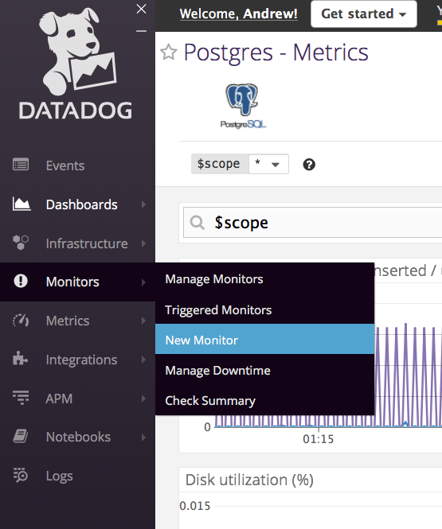<br/><br/>

As you can see you will be presented with a few options for different monitors

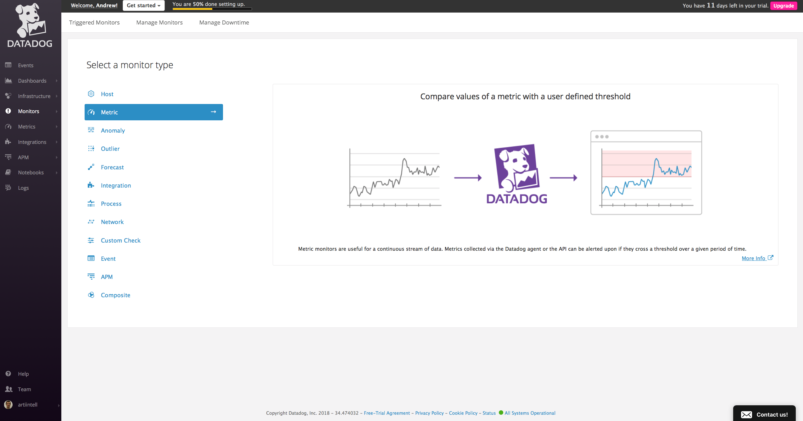<br/><br/>

Since we want to create a monitor for **my_metric** metric we will choose **Metric** as a monitor type.
Next we need to choose a detection method. According to the exercise requirement we will choose a **Threshold Alert** detection method. We will choose **my_metric** for metric and **Simple Alert** option. Then we will specify alert conditions as required and choose to **Notify** if data is missing for more than **10 minutes**. So far you should have configuration for your monitor as shown below

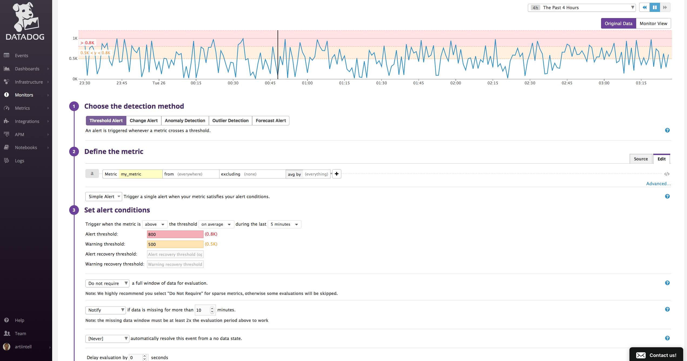<br/><br/>

Please configure the monitor’s message so that it will:

* Send you an email whenever the monitor triggers.
* Create different messages based on whether the monitor is in an Alert, Warning, or No Data state.
* Include the metric value that caused the monitor to trigger and host ip when the Monitor triggers an Alert state.

This is done in **Say what's happening** section of the Monitor configuration. To achieve what's been requested one can build a message templeate as follows for different types of situations

```
{{#is_alert}} ALERT!!!{{/is_alert}}
{{#is_warning}}WARNING! {{/is_warning}}
{{#is_no_data}}NOTIFICATION{{/is_no_data}}

{{#is_alert}} 
my_metric reached critical level! Please take appropriate actions immediately!
my_metric current value is: {{value}} 
host IP address is: {{host.ip}}
{{/is_alert}}
{{#is_warning}} 
my_metric value reached warning level ({{warn_threshold}}) and has a current value of {{value}}.
Please be alert as this may escalate to a critical situation.
{{/is_warning}}
{{#is_no_data}}
An inte​rruption in data provisioning for my_metric was identified
{{/is_no_data}}

Please check with @artiintell@gmail.com for further actions.

Kind Regards,
DataDog Support Team
```
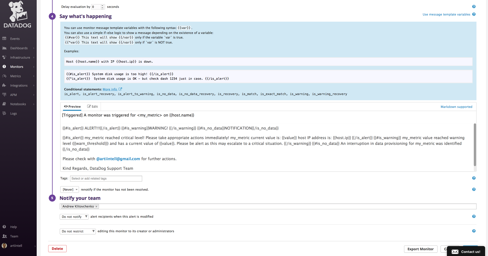<br/><br/>

* When this monitor sends you an email notification, take a screenshot of the email that it sends you.

####AN ALERT

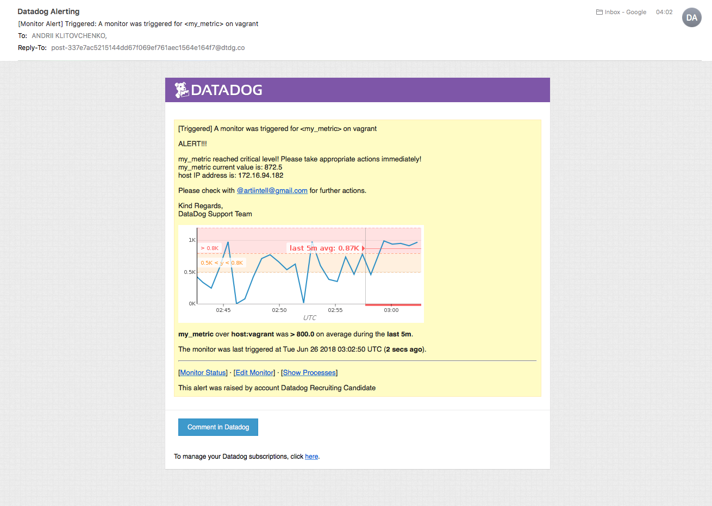<br/><br/>

####A WARNING:

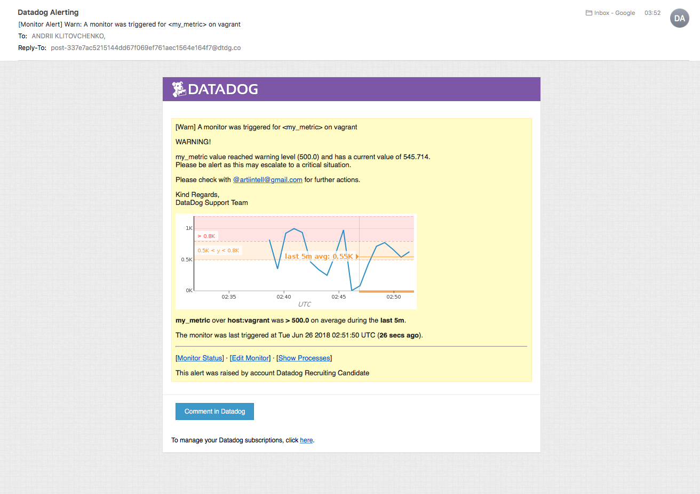<br/><br/>

####MISSING DATA

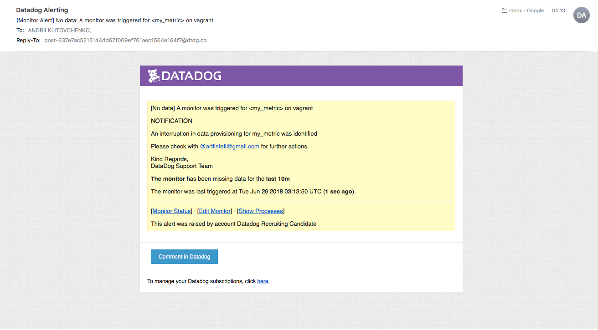<br/><br/>

* **[Bonus Question]**: Since this monitor is going to alert pretty often, you don’t want to be alerted when you are out of the office. Set up two scheduled downtimes for this monitor:

  * One that silences it from 7pm to 9am daily on M-F,
  * And one that silences it all day on Sat-Sun.
  * Make sure that your email is notified when you schedule the downtime and take a screenshot of that notification.

To schedule downtime go to **Monitors >> Manage Downtime** as shown below

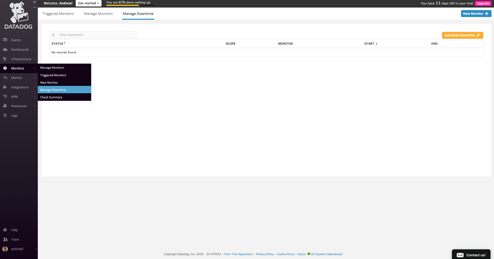<br/><br/>

Then click on **Schedule Downtime** and fill the form as follows to schedule downtime for ``weekdays``

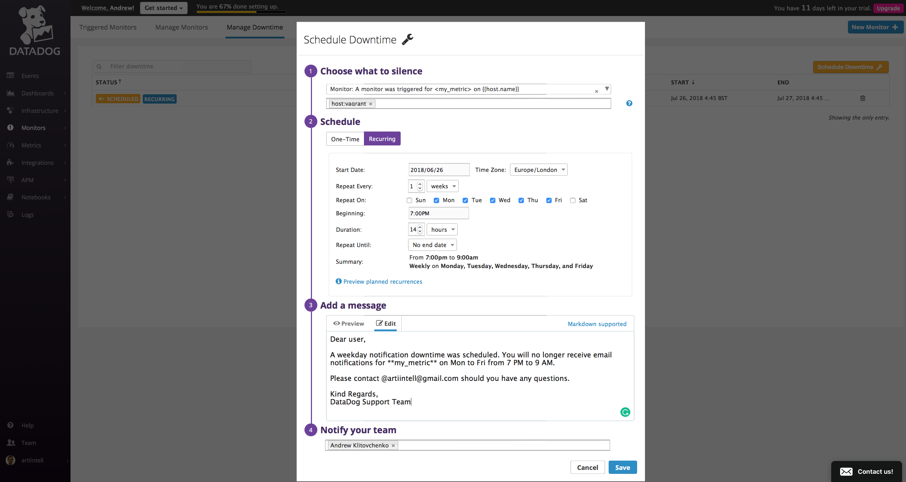<br/><br/>

After scheduling downtime you should receive an email notification as follows

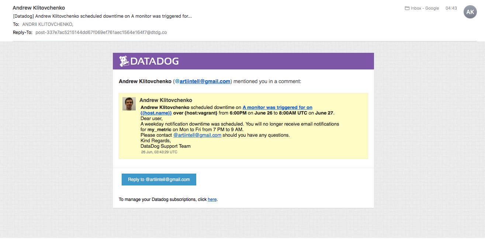<br/><br/>

You should be able to do the same for the ``weekends``

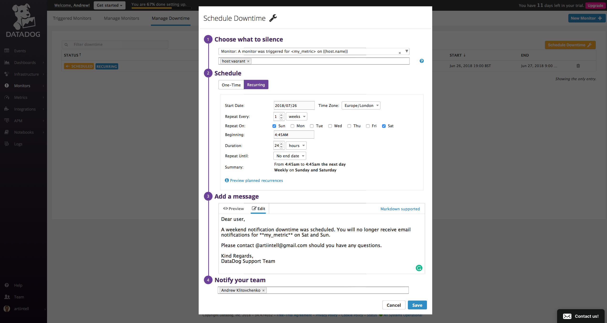<br/><br/>

After scheduling downtime you should receive an email notification as follows

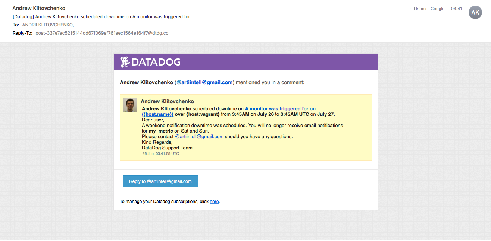<br/><br/>

**Note:** As one can see the message indicates -1 hour difference. This is due to a host system time I presume given the following: 
```
root@vagrant:/etc/datadog-agent# date
Tue Jun 26 03:51:05 UTC 2018
``` 

## Collecting APM Data:

Given the following Flask app (or any Python/Ruby/Go app of your choice) instrument this using Datadog’s APM solution:

```python
from flask import Flask
import logging
import sys

# Have flask use stdout as the logger
main_logger = logging.getLogger()
main_logger.setLevel(logging.DEBUG)
c = logging.StreamHandler(sys.stdout)
formatter = logging.Formatter('%(asctime)s - %(name)s - %(levelname)s - %(message)s')
c.setFormatter(formatter)
main_logger.addHandler(c)

app = Flask(__name__)

@app.route('/')
def api_entry():
    return 'Entrypoint to the Application'

@app.route('/api/apm')
def apm_endpoint():
    return 'Getting APM Started'

@app.route('/api/trace')
def trace_endpoint():
    return 'Posting Traces'

if __name__ == '__main__':
    app.run(host='0.0.0.0', port='5050')
```

* **Note**: Using both ddtrace-run and manually inserting the Middleware has been known to cause issues. Please only use one or the other.
* Please include your fully instrumented app in your submission, as well.

In order to achieve what's required first install required packages

```
pip install flask
pip install ddtrace
```

Then put provided content (Flask app) to a Python file. In my case it is <a href="data/traced_app.py">traced_app.py</a>
Since I have forwarded a port 8080 already I changed

``app.run(host='0.0.0.0', port='5050')``

to 

``app.run(host='0.0.0.0', port='8080')``

which was useful for initial testing.

Then we need to instrument the application
```
ddtrace-run python traced_app.py
```

Where content of the ``traced_app.py`` is as follows

```
from flask import Flask
import logging
import sys

# Have flask use stdout as the logger
main_logger = logging.getLogger()
main_logger.setLevel(logging.DEBUG)
c = logging.StreamHandler(sys.stdout)
formatter = logging.Formatter('%(asctime)s - %(name)s - %(levelname)s - %(message)s')
c.setFormatter(formatter)
main_logger.addHandler(c)

app = Flask(__name__)

@app.route('/')
def api_entry():
    return 'Entrypoint to the Application'

@app.route('/api/apm')
def apm_endpoint():
    return 'Getting APM Started'

@app.route('/api/trace')
def trace_endpoint():
    return 'Posting Traces'

if __name__ == '__main__':
    app.run(host='0.0.0.0', port='8080')
```

Once **ddtrace-run** is run, metrics will start getting to Datadog

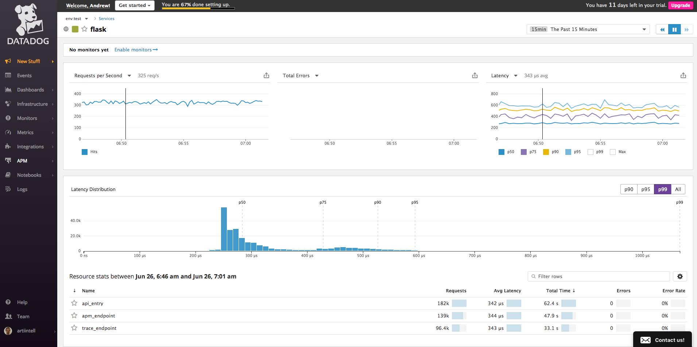<br/><br/>

In order to mimic load, a simple generator <a href="data/connect_to_app.py">connect_to_app.py</a> was created which can be run by issuing ``python connect_to_app.py``

Provide a link and a screenshot of a Dashboard with both APM and Infrastructure Metrics.

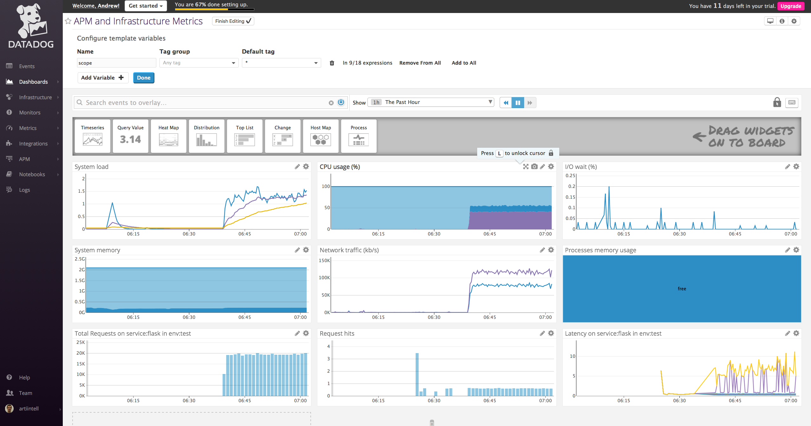<br/><br/>

* **Bonus Question**: What is the difference between a Service and a Resource? - A good article that describes this can be found <a href="https://help.datadoghq.com/hc/en-us/articles/115000702546-What-is-the-Difference-Between-Type-Service-Resource-and-Name-">here</a>, but to summarise: 
    * A **service** is a set of processes that do the same job - for example a web framework or database.
    * A **resource** is a particular action for a given service (typically an individual endpoint or query).


## Final Question:

Datadog has been used in a lot of creative ways in the past. We’ve written some blog posts about using Datadog to monitor the NYC Subway System, Pokemon Go, and even office restroom availability!

Is there anything creative you would use Datadog for?

There are incalculable opportunities for technology like Datadog. Advancements in IoT, although opening doors to new horizons with regards to data and sensing the world, create a lot of challenges related to a great number of devices out there that need to be managed.

I believe though that technology like Datadog will be instrumental in 2 areas:

- **approachable unified performance intelligence** - meaning that performance should not be only of IT and operations concern but equally the business.  I think a concept of performance metrics is a key here. We should be able to abstract the metric enough to be able to cover a great range of things and processes from CPU to sales to physiological performance. All this should be accessible and should be easy to consume no matter what the background of the user is. It should be unified - multi-dimensional to have all the flavours to be the most objective entity for helping with comprehensive decisions;

- **system self-recovery and self-fixing** - observation allows us not only to observe the system to find what's broken but also to observe us fixing the system. This should enable us to build a system that learns from how we fixed things to take care of similar situations in future. This will lead to the self-sustainable environment we will live in.