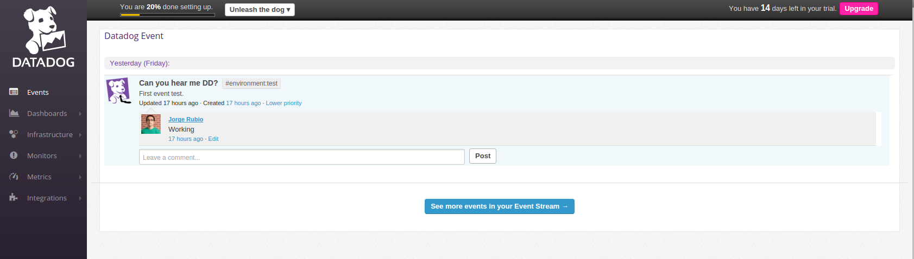
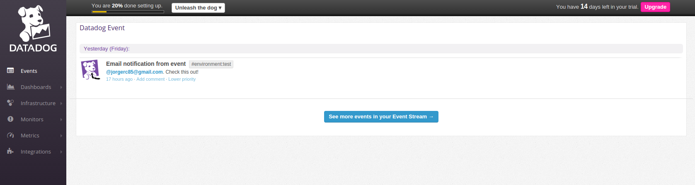
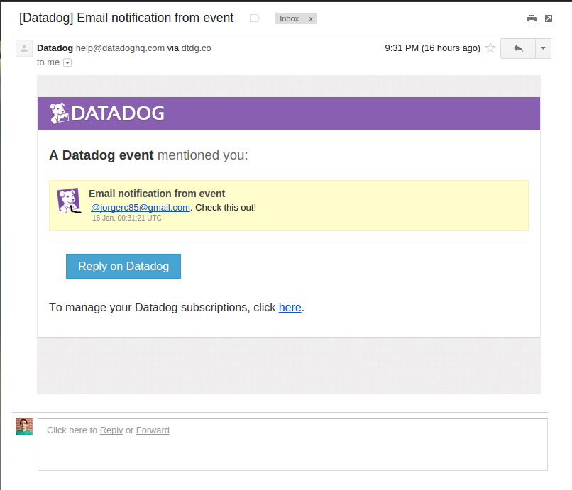

## Answers

### Level 1

* Sign up for Datadog (use "Datadog Recruiting Candidate" in the "Company" field), get the agent reporting metrics from your local machine.


[Metrics](https://app.datadoghq.com/dash/host/45359250?live=true&page=0&is_auto=false&from_ts=1452962740892&to_ts=1452966340892&tile_size=m)

* Bonus question: what is the agent?

The agent is the service that runs in the host and collects events and metrics to send to Data Dog for monitoring. It is comprised of three main parts:
* Collector: Checks for integrations and monitors system metrics.
* Dogstatsd: Back-end server that receives custom metrics from an application.
* Forwarder: Captures the data from the collector and dogstatsd and sets it to be sent to Data Dog.

There is also a supervisor process that controls and ties everything together.

* Submit an event via the API.

```
#!/bin/sh

curl  -X POST -H "Content-type: application/json" \
-d '{
      "title": "Can you hear me DD?",
      "text": "First event test.",
      "priority": "normal",
      "tags": ["environment:test"],
      "alert_type": "info"
  }' \
'https://app.datadoghq.com/api/v1/events?api_key=f22de6751add6c71161b8582cac9e488'
```


[First event](https://app.datadoghq.com/event/event?id=365550117954820773)

* Get an event to appear in your email inbox (the email address you signed up for the account with)

```
#!/bin/sh

curl  -X POST -H "Content-type: application/json" \
-d '{
      "title": "Email notification from event",
      "text": "@jorgerc85@gmail.com. Check this out!",
      "priority": "normal",
      "tags": ["environment:test"],
      "alert_type": "info"
  }' \
'https://app.datadoghq.com/api/v1/events?api_key=f22de6751add6c71161b8582cac9e488'
```



[Email event](https://app.datadoghq.com/event/event?id=365560316136793562)
