## Solution Engineer Answers
##### By Alejandro

---

### Setting Up the Environment

For this exercise I spun up a new linux virtual machine using Vagrant. The box I used was Ubuntu 16.04, downloading the box from ubuntu/xenial. I created a new directory to house this project and I switched into there. I kept vagrant as the name and initialized it with `vagrant init` and started the box with `vagrant up`. This process will take a short while and after it is complete I ssh into the box using `vagrant ssh`.

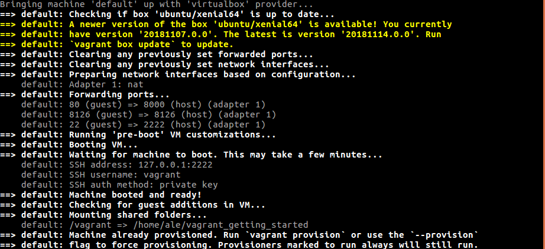 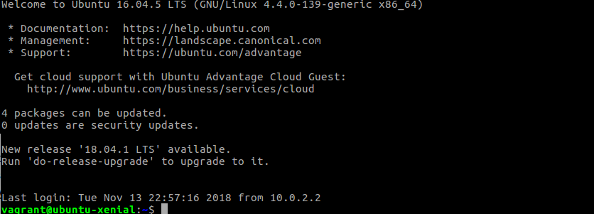

*Side Note: Being new to Vagrant, I spent some time learning about its various features and functionality not only for fun, but also to see how I can best leverage what I learned to aid with this exercise. Having spun many different boxes, I ended up updating my vagrantfile to use provisions to automate some of the steps I was repeating. Below you can see the final version of Vagrantfile I used. The bootstraps script updated and upgraded all packages and then installed: DataDog agent, MySQL, Python, pip, Flask. This allowed me to have a scalable method of locally recreating the testing environment with minimal manual input. Even though this saved me a couple of steps that would be performed later on, the rest of this document will walk through these steps as they appear in real time.*

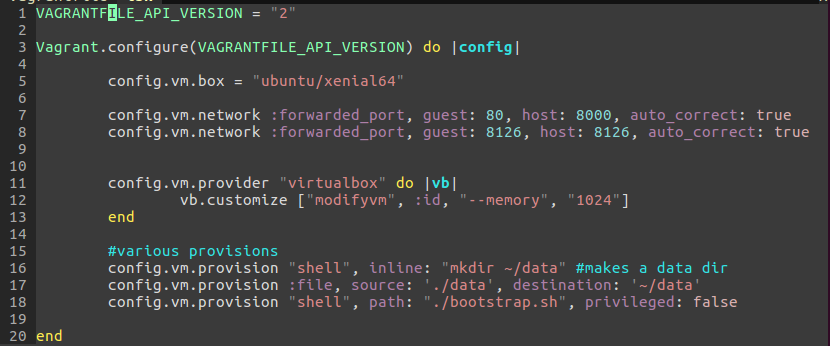

### Collecting Metrics

To begin collecting metrics, the DataDog agent must be installed on the system. Following the steps on the DataDog website was quick and easy and after I registered, they provided a command that installs the Agent in one step through the Ubuntu command line. Once the agent is installed, metrics start flowing and you can begin customization. 

1.1 I added tags to the datadog.yaml Agent configuration file located at /etc/datadog-agent. After restarting the agent, the tags appeared on the Host Map page on the Datadog UI (Infrastructure -> Host Map). 
[hostmap](images/hostmap.png) 

1.2 To install the MySQL database onto the Ubuntu vm, I ran `sudo apt-get -y install mysql-server`. The server should start automatically at the end of installing. To check run `service mysql status` Next to integrate the MySQL server to the DataDog agent, you have to add datadog as a user to the database and grant privileges. The following code shows how I did this. 
'''
sudo mysql -e "CREATE USER 'datadog'@'localhost' IDENTIFIED BY '<YOUR_PASSWORD>';"
sudo mysql -e "GRANT REPLICATION CLIENT ON *.* TO 'datadog'@'localhost' WITH MAX_USER_CONNECTIONS 5;"
sudo mysql -e "GRANT PROCESS ON *.* TO 'datadog'@'localhost';"
sudo mysql -e "GRANT SELECT ON performance_schema.* TO 'datadog'@'localhost';"
'''

The last step is to configure the database in the mysql configuration file located  at conf.d/mysql.d/mysql.yaml. [mySQL config file](images/mysql-config.png) 

1.3 Creating a custom Agent check happens in two parts: writing the check and writing the check’s configuration file. It is important to note that these two files must share the same name. For example, the check I created I used the name `my_check.py and my_check.yaml`. The following custom Agent check sends a random value between 0 and 1000, inclusive, for the metric my_check.

1.3.1 The check, located in /etc/datadog-agent/checks.d , as seen below uses the random library to produce the metric that is sent to datadog using the guage method. 9
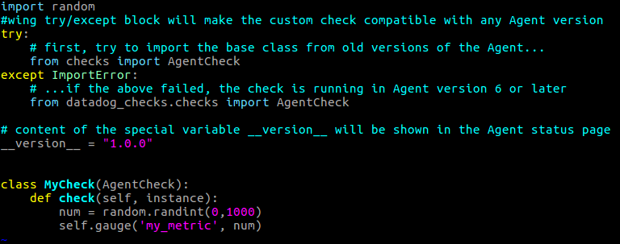

1.3.2 The configuration file, located in /etc/datadog-agent/checks.d, as seen below does not contain much but needs a sequence called instances that contains at least one mapping.

To change the check’s collection interval you can write in the python file for the submission to wait, however, if you had the question...
Bonus Question: Can you change the collection interval without modifying the Python check file you created?
The answer is, yes. Within the check's configuration file, you can use 'min_collection_interval' to modify the collection interval of the check. In DataDog version 6+, this has to be done within each instance of the check. This is the route I chose as seen by the code below which submits the metric once every 45 seconds: [screenshot of my_check.yaml](images/mycheck-config)

### Visualizing Data

Timeboards can be generated via the DataDog UI or the API. In this exercise I will use the API to generate a timeboard that contains three different graphs. I named the script timeboard.py. Graphs are handled as JSON objects so the script will write the graphs as described by the API. My [timeboard.py](scripts/timeboard.py) script included the following.

- The first graph displays my_metric scoped over my host.
- The second graph displays the metric ‘mysql.performance.kernel_time’ from my integration with the anomaly function applied to it.
- The third graph displays my_metric with the rollup function applied to sum up all the points for the past hour into one bucket

Here is the [link to the timeboard](https://app.datadoghq.com/dash/989118/technical-exercise-timeboard?live=false&page=0&is_auto=false&from_ts=1542315830451&to_ts=1542319430451&tile_size=m) as well as a screenshot of what it looks like:
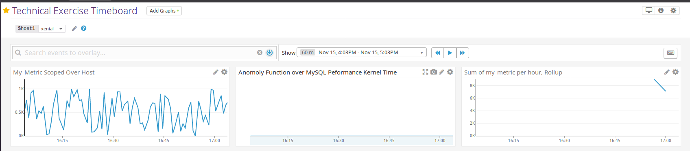

Within the UI, I accessed the timeboard via the  Dashboard and I changed the timeframe to the past 5 minutes. Here is a snapshot of one of the graphs that I sent to myself using the @ notation.
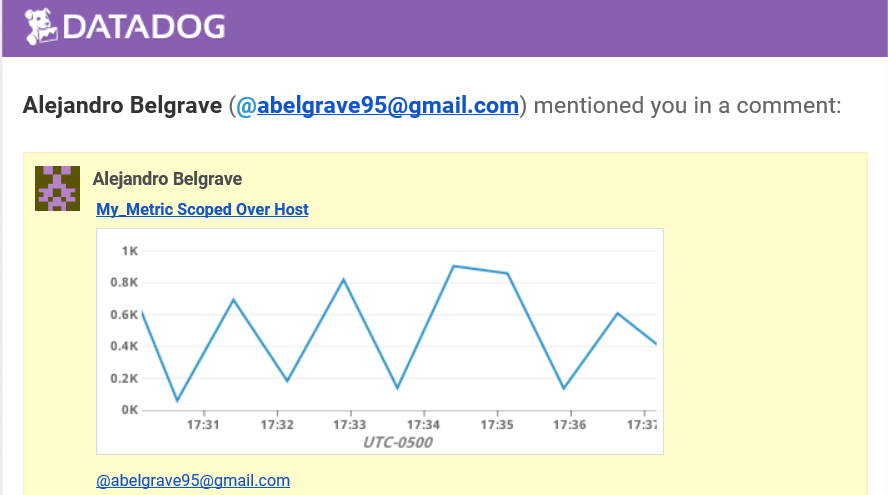

Bonus Question: What is the Anomaly graph displaying?

A: To understand the graph’s result we first have to understand what the anomaly function does. The Anomaly graphs has the option of using 4 different algorithms, using established statistical models, to compute predictions based on the previous trends of the metric(s) chosen. The grey bands of the graph show what is expected based on historical trends. If data appears that is outside of the expected margins, then DataDog has detected an anomaly and will signify it.
During the time of the snapshot, the database was not running actively, so baseline and expectations are both at zero. Once more calls are made, the graph will be able to have more accurate data.

### Monitoring Data

DataDog allows you to monitor your infrastructure in many different ways, allowing you to know when critical changes are happening. This can be done either through the UI or the API. Using the UI, I create a new Metric Monitor to watch over the metric my_check. I configure this monitor to send me an alert when the following conditions are met: A Warning with a  threshold of 500, and an Alert with a threshold of 800. Lastly, the monitor will notify me if there is No Data for this query over the past 10m. 

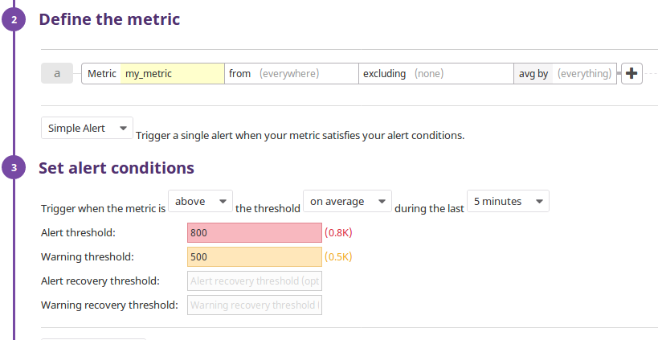

The monitor also allows for customizable messages based on different event triggers. My monitor: sends you an email whenever the monitor triggers, creates different messages based on whether the monitor is in an Alert, Warning, or No Data state, and includes the metric value that caused the monitor to trigger and host ip when the Monitor triggers an Alert state.

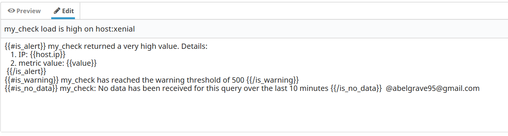

The message will look as follows: 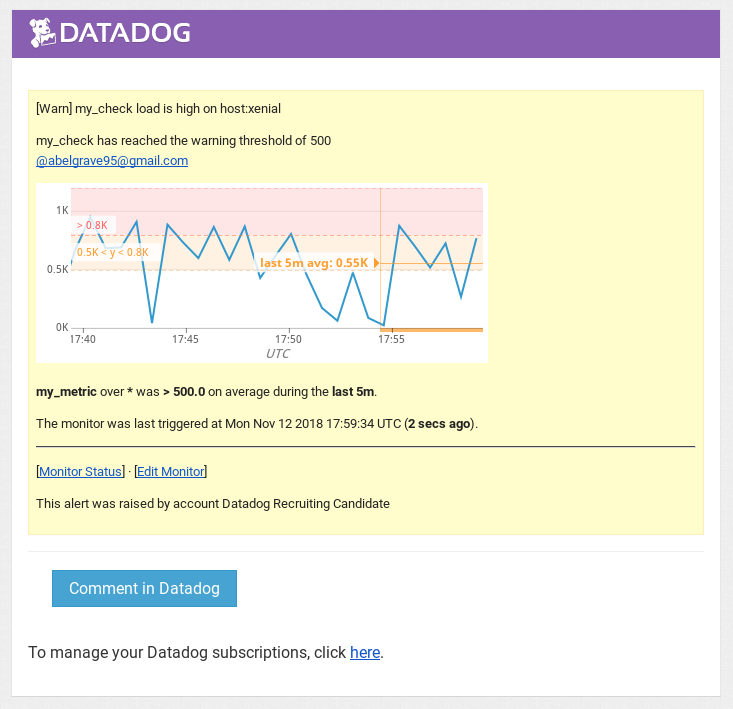

Bonus Question: Since this monitor is going to alert pretty often, you don’t want to be alerted when you are out of the office.

You can account for this by scheduling downtimes with the Monitor Downtime manager via DataDog UI navigation. I have configured the monitor to schedule 2 downtimes, the first from 7pm-9am Monday through Friday, and the second all day on Saturday and Sunday. The configurations and email update is below:

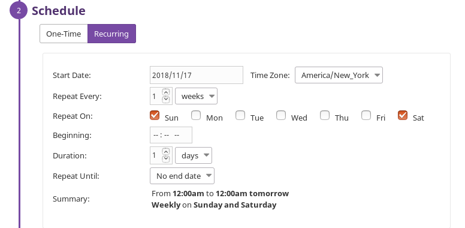 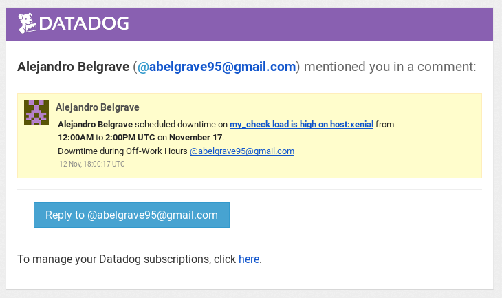 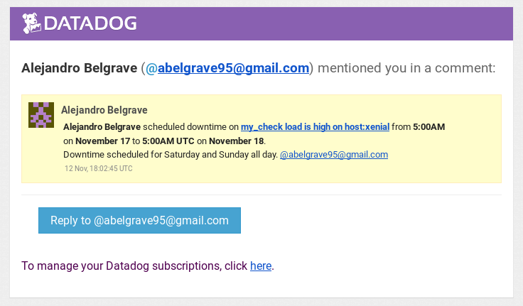

### Collecting APM Data

To use DataDog’s APM solution, an application is required. For this exercise, I will use the app, [flask-app.py](scripts/flask-app.py) given below. 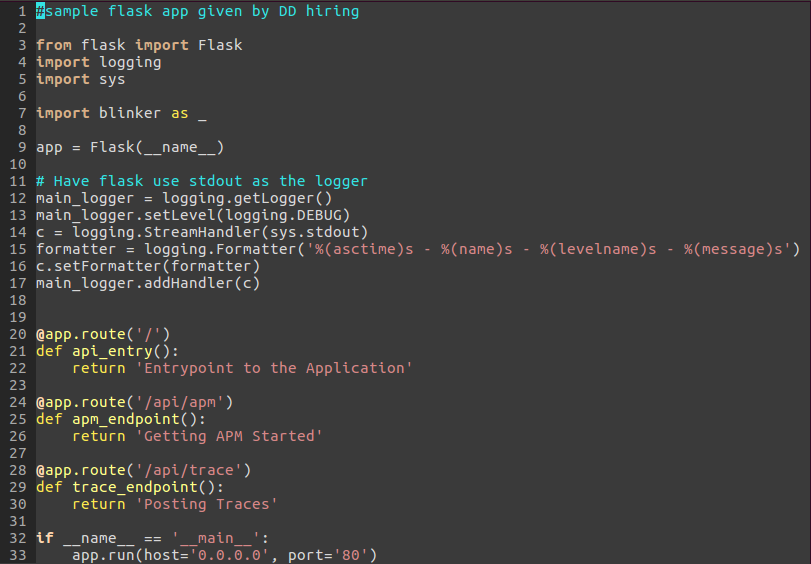
Since I am using Flask, I have to download Flask's microframework for Python. I do this using Python’s pip `pip install Flask`. Now that the app can run, we can use DataDog's Tracing library for Python to enable trace collection for the Agent. This is done by running `pip install ddtrace` as well as modifying the datadog Agent configuration file to allow for APM. See below sceenshot for an updated configuration file. 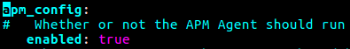

Once the setup is complete, the Flask app can be instrumented. This is done by running the app through the tracing library with the command `ddtrace-run python flask-app.py`. By doing this the app has started and the tracer can begin collecting data.  To do this I also had to open some ports so the vagrant box could communicate with the web app. After triggering the events to pick up the traces, I got the following results from the terminal and the traces as seen in the DataDog UI:

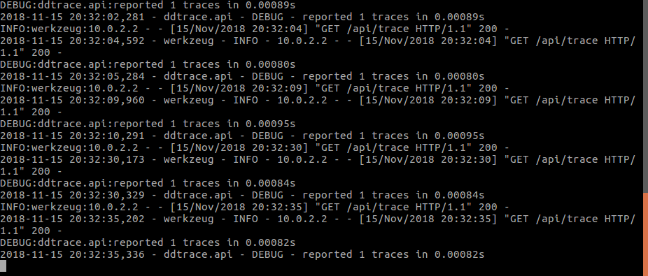 

Here is the [link to the timeboard](https://app.datadoghq.com/dash/985352/apm--infrastructure-metrics?live=true&page=0&is_auto=false&from_ts=1542313853571&to_ts=1542317453571&tile_size=m) as well as a screenshot of what it looks like:
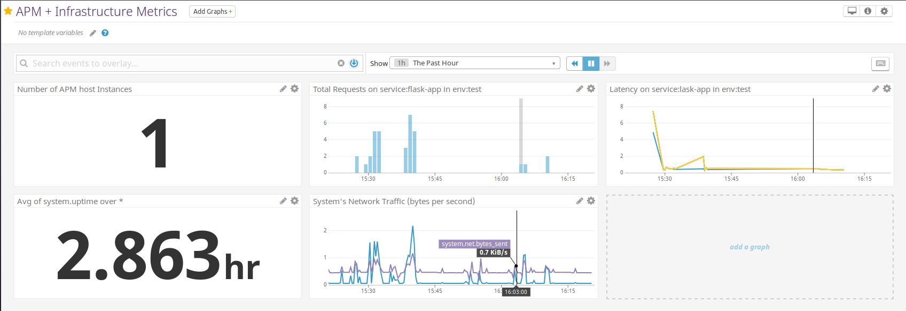

Bonus Question: What is the difference between a Service and a Resource?

A service is a set of processes that do the same job. For example, a library exist to house and share knowledge, containing books and other media and personnel to complete that goal.

A resource is a particular action for the service. Using the library example, a resource would be action of choosing a book, asking to find certain book(s). 

### Final Question

You can use the API to display radio metrics for the stations that exists in the rate of peop
Using music streaming data, you can monitor the popularity of various artists. With enough data and time you can be able to trace the trajectory of individual tracks and albums. You can correlate alerts in the anomaly functions with other metrics like social media and general digital footprints to achieve holistic understanding of the numbers.

