# Anthony Lam -- Solutions Engineer Answers

# Prerequisites - Setup the environment

A Linux Ubuntu VM was created using Vagrant and VirtualBox to complete this exercise.

Download links:
1. [Vagrant](https://www.vagrantup.com/downloads.html)
2. [VirtualBox](https://www.virtualbox.org/wiki/Downloads)

After installing these two programs, run the following commands:

1. `vagrant init ubuntu/xenial64` to create a Ubuntu 16.04 VM
2. `vagrant up` to start the VM
3. `vagrant ssh` to use the VM

After these steps, sign up for a Datadog account [here](https://www.datadoghq.com/#)

The Datadog Agent is software that runs on your hosts and collects their events & metrics for you to utilize. More info can be found [here](https://docs.datadoghq.com/agent/).

Navigate to the Agent Tab under the Integrations Tab and install the Datadog Agent for Ubuntu.

Install the Datadog Agent in the terminal by running the command in the one-step install. This may take some time.

`DD_API_KEY={YOUR_API_KEY} bash -c "$(curl -L https://raw.githubusercontent.com/DataDog/datadog-agent/master/cmd/agent/install_script.sh)"`

Installation Complete!  
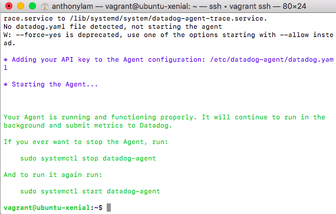

The browser looks like this now. Click Finish to proceed to use Datadog's features.
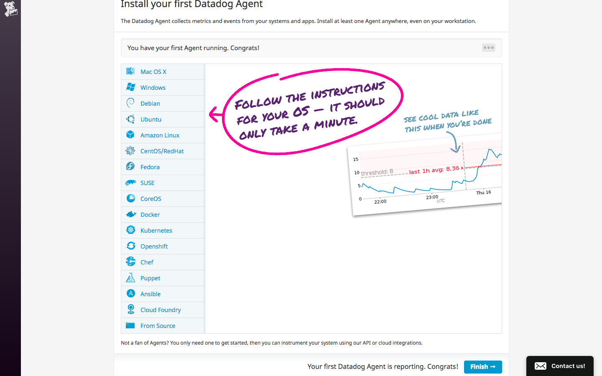

# Collecting Metrics

## Add tags in the Agent config file and show us a screenshot of your host and its tags on the Host Map page in Datadog.

Tags are assigned to hosts and integrations and are very important when it comes to presenting data on dashboards. Tags can represent sizes, roles, and locations. This will be useful for showing more granular metrics on dashboards. More info can be found [here](https://docs.datadoghq.com/tagging/).

1. Using the terminal, navigate to the main directory(`:/`) of the VM.
2. Navigate to `/etc/datadog-agent/datadog.yaml`. This is where a host's tags can be configured.
3. Open the file using an editor. Vi and nano are built in if you do not wish to install one. It can be opened using `sudo nano datadog.yaml`.

Here are the tags I created. Remember to remove the `#`.  
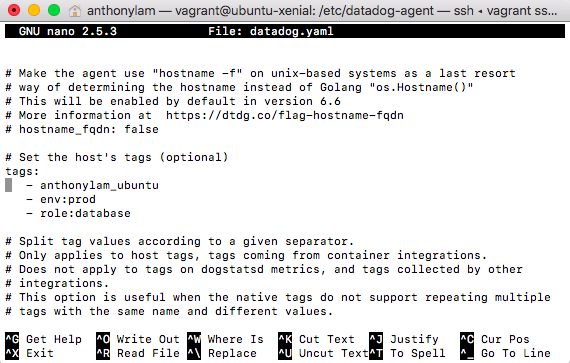

After saving the configurations and restarting the Datadog Agent using `sudo service datadog-agent restart`, I navigated to Host Map tab under Infrastructure in the Datadog Application in my browser.

The host and tags should be visible and look similar to the image below:
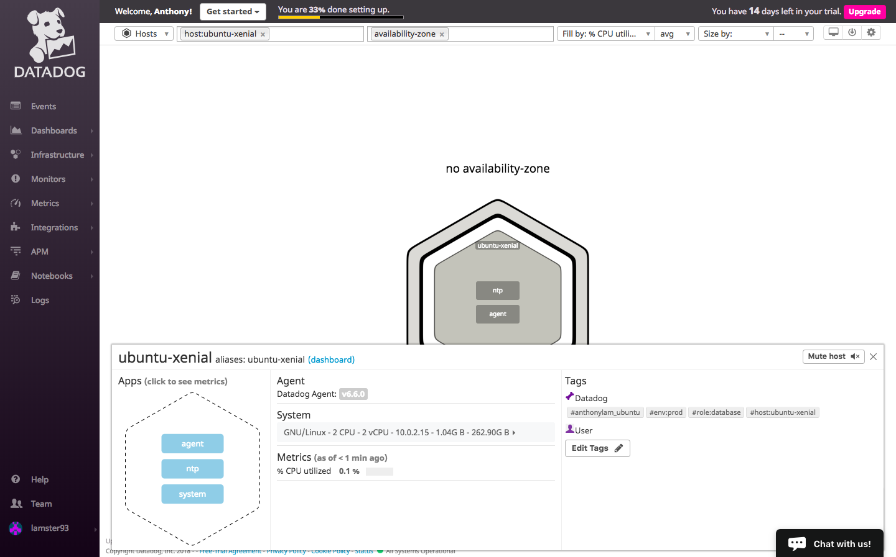

## Install a database on your machine (MongoDB, MySQL, or PostgreSQL) and then install the respective Datadog integration for that database.

Let's install a database integration to test out.

I chose PostgreSQL for my database and downloaded it using the following commands:
1. `sudo apt-get update`
2. `sudo apt-get install postgresql postgresql-contrib`

More in-depth use past the installation step can be found [here](https://www.digitalocean.com/community/tutorials/how-to-install-and-use-postgresql-on-ubuntu-16-04).

I navigated to the Integrations Tab, found the PostgreSQL integration, and followed the configuration steps displayed.

1. Creating a user can only be done if you're in the postgres database. To do this, run the command: `sudo -u postgres psql`
2. Use the command: `createuser --interactive  -P` to create a datadog user with the password generated in the installation overview. Exit out using `\q`.
3. Navigate to `/etc/datadog-agent/conf.d/postgres.d`. Open the `conf.yaml.example` file using an editor. Edit the information, add tags, and save as `conf.yaml`!

Here's my conf.d/postgres.yaml file.

I restarted the Datadog Agent and ran a status check by running `sudo datadog-agent status`, and the PostgreSQL integration check was successful.

After the configuration, I proceeded to install the integration onto the Datadog platform.

  

## Create a custom Agent check that submits a metric named my_metric with a random value between 0 and 1000.
Writing an Agent check requires the creation of two files:
1. A Check file
2. A YAML configuration file

Using the terminal and the `touch` command, I created and edited a [my_metric.py](./files/my_metric.py) and [my_metric.yaml](./files/my_metric.yaml) file using `nano` and placed them in the `checks.d` and `conf.d` folders respectively.

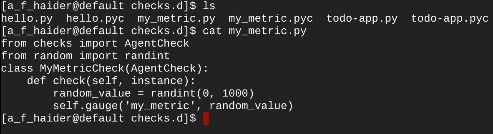
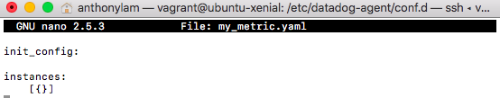

I restarted the Datadog Agent using using `sudo service datadog-agent restart`. my_metric check is successfully being submitted after checking with `sudo datadog-agent status`.

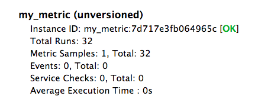

## Change your check's collection interval so that it only submits the metric once every 45 seconds.

The minimal collection interval can be defined in the my_metric.yaml file at the instance level because of Agent 6.

Using a stopwatch, I started the timer when the total run count incremented by 1 and checked the Agent status constantly until the count incremented again. The metric was indeed submitting every 45 seconds.

## Bonus Question Can you change the collection interval without modifying the Python check file you created?

As shown in the previous step, the collection interval was changed in the my_metric.yaml file which didn't touch the Python check file (my_metric.py).

# Visualizing Data

## Utilize the Datadog API to create a Timeboard that contains:
1. Your custom metric scoped over your host.
2. Any metric from the Integration on your Database with the anomaly function applied.
3. Your custom metric with the rollup function applied to sum up all the points for the past hour into one bucket

Timeboards are one of two types of dashboards that can be created to display metrics over a certain period of time. Read more about them [here](https://docs.datadoghq.com/graphing/dashboards/).

In order to create a Timeboard while utilizing the Datadog API with Python, the Datadog package for Python has to be installed using Python's package management system called pip.

Pip can be installed using the command:

`sudo apt-get install python-pip`

With pip installed, the datadog package can be installed as well using:

`pip install datadog`

These steps may take a while.

Generate an application key to use before creating the timeboard:
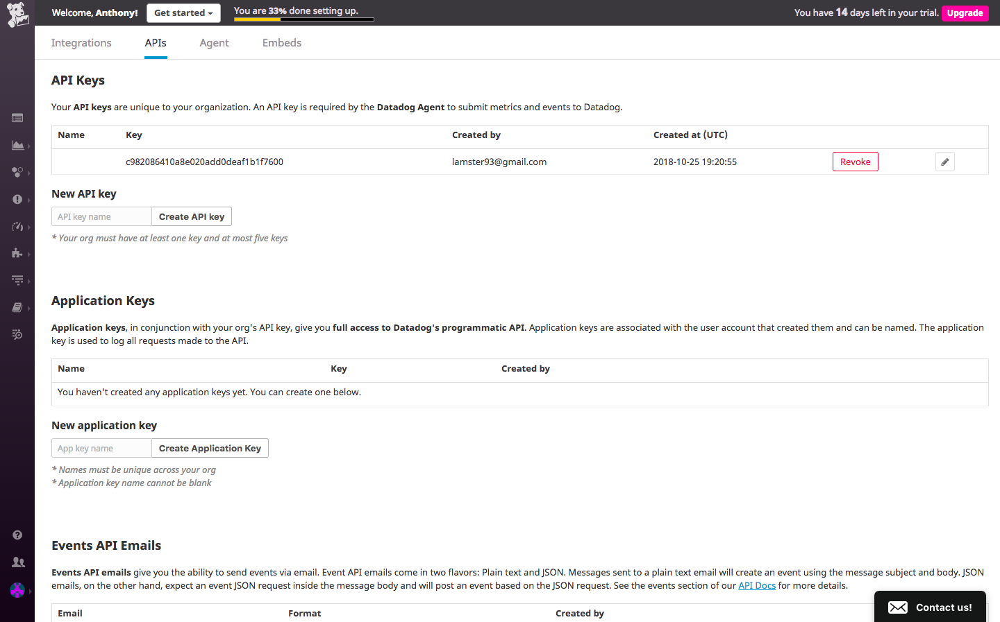

Utilizing Datadog's [API documentation](https://docs.datadoghq.com/api/?lang=python#timeboards) on Timeboards, Datadog Docs for [anomalies](https://docs.datadoghq.com/monitors/monitor_types/anomaly/) and [graphing](https://docs.datadoghq.com/graphing/), and [PostgreSQL](https://docs.datadoghq.com/integrations/postgres/) the timeboard script was created and written using Python. It can be found [here](./files/timeboard.py):

The document was executed using python in the terminal by running:
`python timeboard.py`

It was successfully created as shown in the Dashboard List.

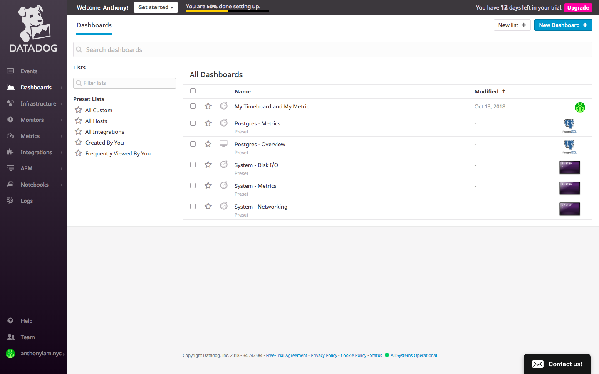

When the timeboard is clicked, the platform displays the 3 graphs that are needed.

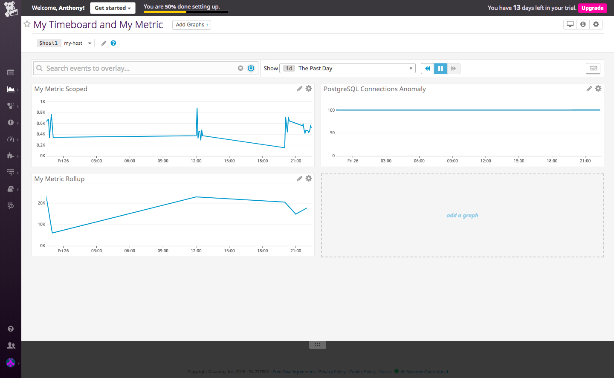

## Once this is created, access the Dashboard from your Dashboard List in the UI:

## Set the Timeboard's timeframe to the past 5 minutes

Although 5 minutes isn't a dropdown option for the Show section, it can be manually selected by selecting a start point on the graph, holding the click, and dragging it until there's approximately 5 minutes worth of selected data. The end result is displayed:

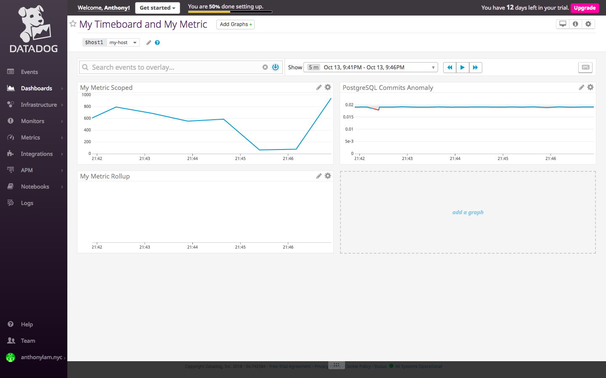

## Take a snapshot of this graph and use the @ notation to send it to yourself.

When I hover my cursor on a graph, I can click on the camera icon to snapshot the graph and send it to my email.

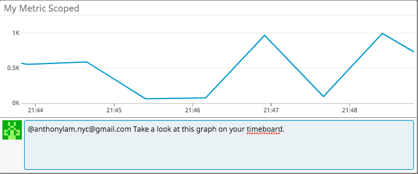
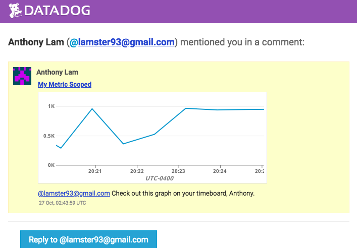

## Bonus Question: What is the Anomaly graph displaying?

The Amonaly graph is displaying the maximum number of client connections allowed to the PostgreSQL database while indicating whether there is any abnormal behavior. Red points indicate abnormal behavior and values outside the expected range of values. The range of values is represented by a grey background behind the data points. In my graph, there aren't any red points only blue ones, indicating that there aren't any anomalies present.

# Monitoring Data

## Create a new Metric Monitor that watches the average of your custom metric (my_metric) and will alert if it’s above the following values over the past 5 minutes:

1. Warning threshold of 500
2. Alerting threshold of 800
3. And also ensure that it will notify you if there is No Data for this query over the past 10m.

Monitors are important in checking metrics constantly, notifying us on unexpected or undesired behavior, and to check endpoints and integrations. More information on setting up monitors can be found [here](https://docs.datadoghq.com/monitors/).

A monitor can be created through two ways:
1. Navigating to the Monitors --> New Monitor --> Metric Tab on the left.
2. Hover over the graph you want to monitor, click the settings (cog icon) and click create new monitor

Once completed, I filled out the necessary information to meet the desired requirements
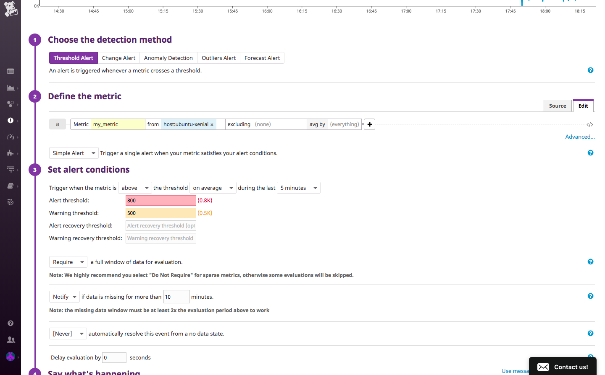

## Please configure the monitor’s message so that it will:

1. Send you an email whenever the monitor triggers.
2. Create different messages based on whether the monitor is in an Alert, Warning, or No Data state.
3. Include the metric value that caused the monitor to trigger and host ip when the Monitor triggers an Alert state.

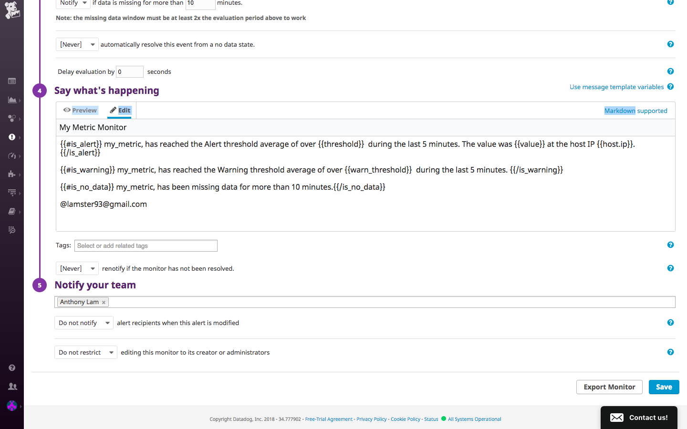

## When this monitor sends you an email notification, take a screenshot of the email that it sends you.

Warn Email

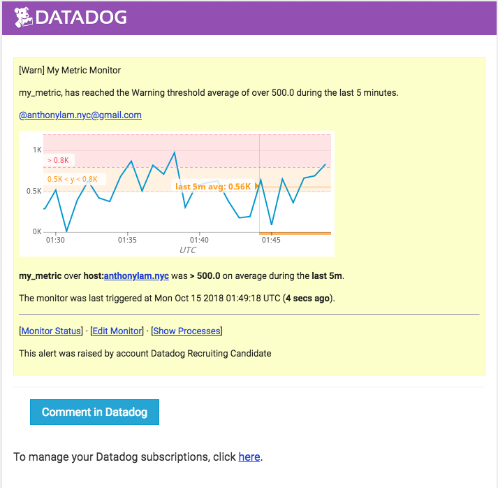

No Data Email

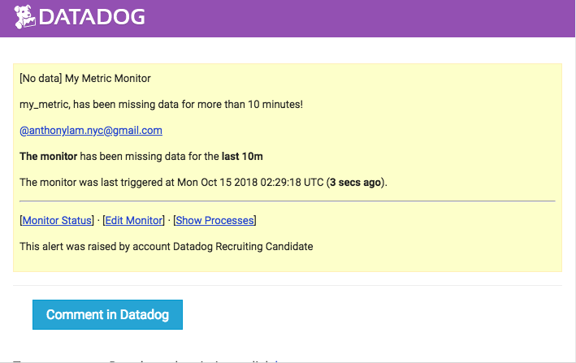

## Bonus Question: Since this monitor is going to alert pretty often, you don’t want to be alerted when you are out of the office. Set up two scheduled downtimes for this monitor:

1. One that silences it from 7pm to 9am daily on M-F,
2. And one that silences it all day on Sat-Sun.

Monitors can be scheduled to have downtime by navigating to Monitors --> Manage Downtime.

This was done twice, one for weekdays and one for weekends. The images below illustrate the conditions used in the forms.

Weekdays
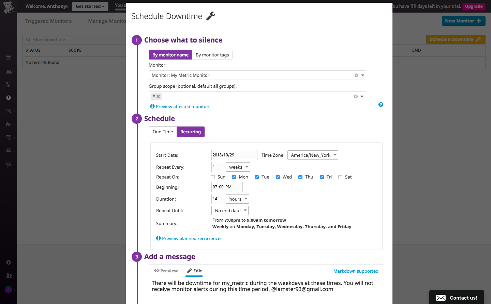

Weekends
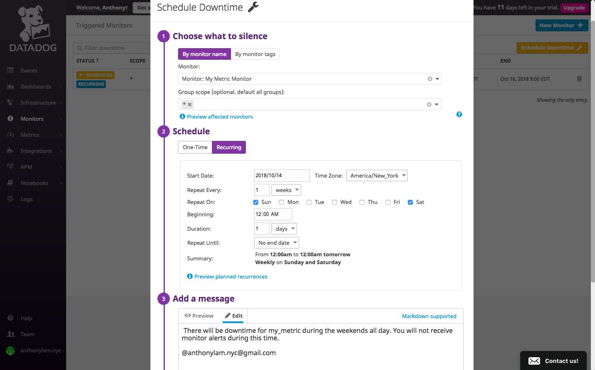

## Make sure that your email is notified when you schedule the downtime and take a screenshot of that notification.

Weekdays
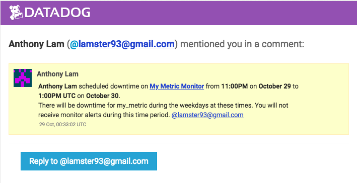

Weekends
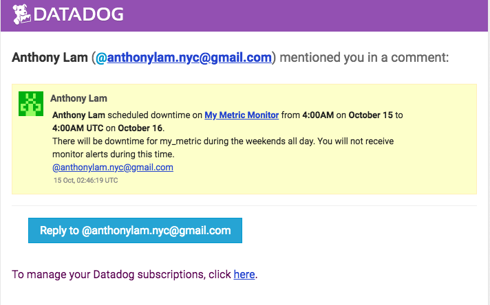

# Collecting APM Data:

Monitoring application performance is crucial as a company expands and grows.

Setting up Datadog's APM can be found in the documentation [here](https://docs.datadoghq.com/tracing/setup/#agent-configuration).

1. Install the Datadog Agent -- Already done!

2. Enable trace collection for the Trace Agent and configure the environment by editing the apm config key in the `datadog.yaml` file. It is located near the bottom of the file.

My configurations:

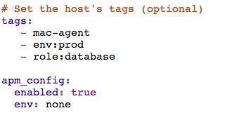

3. Instrumenting the application involves a few steps:
    1. Store the given Flask app inside a file --> I called it [app.py](./files/app.py)
    2. `pip install flask`
    3. `pip install ddtrace`
    4. run `ddtrace-run python app.py` in the terminal

    The terminal should look similar to this:

    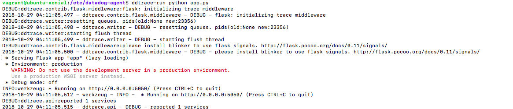

4. Make several calls to the API to test the performance of the flask application by going through each of the routes on http://localhost:5050/.

For my app, the calls were performed on another terminal tab and the VM was accessed with `vagrant ssh`. The calls used were:
1. `curl localhost:5050/`
2. `curl localhost:5050/api/apm`
3. `curl localhost:5050/api/trace`

The terminal tab running the server should be responding to the calls and look something like this:
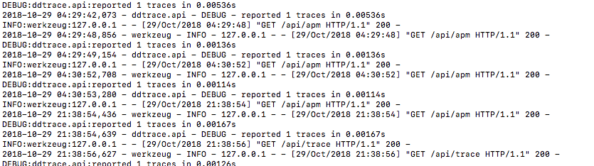

## Provide a link and a screenshot of a Dashboard with both APM and Infrastructure Metrics.

To share our APM and Infrastructure Metrics with an external URL link, we have to create a Screenboard. Timeboards will not work in this scenario.

Timeseries were created for:
- system.cpu.user (The percent of time the CPU spent running user space processes)
- system.net.bytes_sent (The number of bytes sent from a device per second)
- trace.flask.request.hits (The number of flask requests made)

Once the Screenboard is created, click the cog icon on the right side and "Generate public URL". Once the link has been generated, start sharing it!  

[Here is the link to my Screenboard](https://p.datadoghq.com/sb/fb6649bf7-cbf578fe43d7e6f48e95f9564bd62f07)

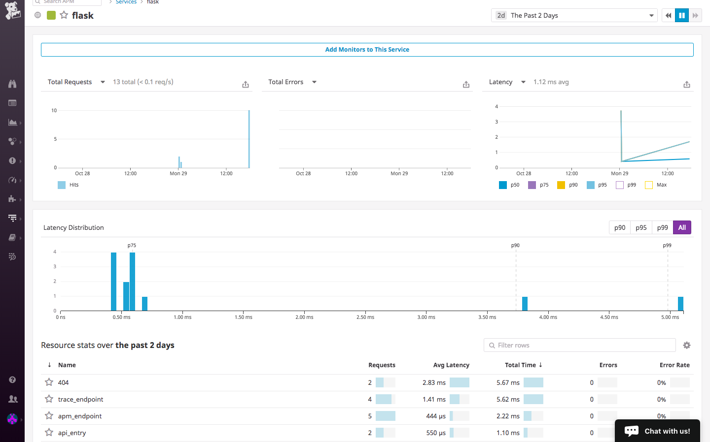

## Please include your fully instrumented app in your submission, as well.
[Flask App](./files/app.py)

## Bonus Question: What is the difference between a Service and a Resource?

A Service is comprised of a set of processes that work together to provide a feature set or perform a certain task. A web application is a good example that can be broken down into many services such as webapp services, admin services, database services, and query services. These services provide resources to help the user obtain information.

A Resource is a request or query to a service. An example would be a SQL query or a request to access a specific route or piece of data/information of an application.

# Final Question:

## Datadog has been used in a lot of creative ways in the past. We’ve written some blog posts about using Datadog to monitor the NYC Subway System, Pokemon Go, and even office restroom availability! Is there anything creative you would use Datadog for?

Anyone who has lived in NYC has experienced a rodent problem. Over the last decade, these furry creatures have become smarter and harder to get rid of. Although it'll take extensive work and preparation with sensors and detectors, Datadog can be used to analyze their behavior when you're not home or you're sleeping. You might find that they like to be in a certain area at a specific time or even discover entry points you weren't aware of. After an initial sampling of the situation, solutions or protocols can be implemented for a set period of time to analyze how effective they work and how the behavior of the rodents change.

A more doable example would be monitoring the weather. I love the weather and check it quite often but I have plenty of friends who don't and end up getting caught in the rain. With Datadog, we can monitor whether or not it's going to rain and update it constantly. Alerts can be utilized in two ways. They can be sent out in the mornings and remind people to bring an umbrella if the chance of precipitation reaches a certain threshold. They can also be sent out during the day in the case of unexpected rain occurring later in the day.
